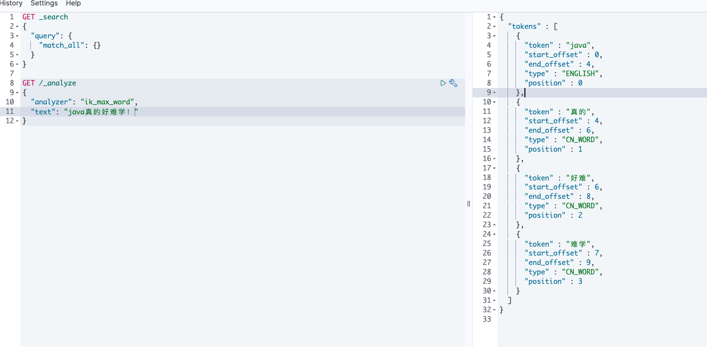

# 【Java开发笔记】分布式搜索引擎

## 1 Elasticsearch基本介绍

想象下假设 JD 上有上千万商品，现在要求搜索出包含 “手机” 的商品有哪些（并搜索出商品ID，商品图片地址，商品价格，商品的名称）也就是说实现 JD 的搜索的功能，如何处理？

```properties
SSM的缺点：
	+ 搜索精度不高
	+ 搜索的速度太慢，主要是正向搜索的方式
可以使用 elasticsearch 解决上面的问题：
	+ 分词器 精度提高
	+ 倒排索引 方式极大提高搜索速度	
```

Elasticsearch 是一款非常强大的开源搜索引擎，具备非常多强大功能，可以帮助我们从海量数据中快速找到需要的内容。

官方地址：https://www.elastic.co/guide/cn/elasticsearch/guide/2.x/intro.html

### 1.1 ELK技术栈

Elasticsearch 结合 kibana、Logstash、Beats，也就是 **Elastic stack（ELK）**。

被广泛应用在 **日志数据分析、实时监控** 等领域：

 

而 Elasticsearch 是 Elastic stack 的核心，负责 **存储、搜索、分析数据**。


### 1.2 正向索引与倒排索引

先对比一下正向索引和倒排索引。

#### 1.2.1 正向索引

那么什么是正向索引呢？例如给下表（tb_goods）中的 id 创建索引：


**如果是根据 id 查询，那么直接走索引，查询速度非常快。**

**但如果是基于 title 做模糊查询，只能是逐行扫描数据**，流程如下：

1）用户搜索数据，条件是 title 符合`"%手机%"`

2）逐行获取数据，比如 id 为 1 的数据

3）判断数据中的 title 是否符合用户搜索条件

4）如果符合则放入结果集，不符合则丢弃。回到步骤1

因为上述是使用了模糊查询，因此 **索引会失效**，只能逐行扫描，也就是 **全表扫描（全表查询）**，随着数据量增加，其查询效率也会越来越低。当数据量达到数百万时，就是一场灾难。

#### 1.2.2 倒排索引

倒排索引中有两个非常重要的概念：

- 文档（`Document`）：用来搜索的数据，其中的每一条数据就是一个文档。例如一个网页、一个商品信息
- 词条（`Term`）：对文档数据或用户搜索数据，利用某种算法分词，得到的具备含义的词语就是词条。例如：我是中国人，就可以分为：我、是、中国人、中国、国人这样的几个词条

**创建倒排索引** 是对正向索引的一种特殊处理，流程如下：

- 将每一个文档的数据利用 **算法分词**，得到一个个词条
- 创建表，每行数据包括词条、词条所在文档 id、位置等信息
- 因为词条唯一性，可以给词条创建索引，例如 hash 表结构索引

如图：


倒排索引的 **搜索流程** 如下（以搜索"华为手机"为例）：

1）用户输入条件 `"华为手机"` 进行搜索。

2）对用户输入内容 **分词**，得到词条：`华为`、`手机`。

3）拿着词条在倒排索引中查找，可以得到包含词条的文档id：1、2、3。

4）拿着文档 id 到 **正向索引** 中查找具体文档。

如图：


**虽然要先查询倒排索引，再查询正向索引，但是无论是 词条、还是文档 id 都建立了索引，查询速度非常快！无需全表扫描。**

倒排索引中包含两部分内容：

- **词条字典（Term Dictionary）**：记录所有词条，以及词条与倒排列表之间的关系，会给词条建立索引，提高查询和插入效率。
- **倒排列表（Posting List）**：记录词条所在的文档 id、词条出现频率、词条在文档中的位置等信息。
  - 文档 id：用于快速获取文档
  - 词条频率（TF）：文档在词条出现的次数，用于评分


> 【总结】什么是文档？什么是词条？
>
> - 文档：mysql中的一条数据就是一个文档
> - 词条：对文档中的内容进行分词得到的词条
>
> 【总结】什么是正向索引？
>
> - 基于文档 id 创建索引，查询词条时，必须根据先找到文档，再对文档内容进行判断
>
> 【总结】什么是倒排索引？
>
> - 先根据文档内容进行分词，对词条创建索引，并记录词条所在的文档 id。
> - 查询时，先根据词条查询文档 id，再根据文档 id 获取到文档。

### 1.3 ES的基本概念

#### 1.3.1.文档和字段

elasticsearch 是面向 **文档（Document）（就是说 ES 存储的都是 JSON 数据）存储的**，可以是数据库中的一条商品数据，一个订单信息。文档数据会被 **序列化** 为 `json` 格式后存储在 elasticsearch 中：


而 Json 文档中往往包含很多的 **字段（Field）** ，类似于数据库中的列。

#### 1.3.2 索引和映射

**索引（Index）**，就是 **相同类型的文档的集合** 。

例如：

- 所有用户文档，就可以组织在一起，称为用户的索引；
- 所有商品的文档，可以组织在一起，称为商品的索引；
- 所有订单的文档，可以组织在一起，称为订单的索引；


因此，我们 **可以把 索引 当做是数据库中的 表** 。

数据库的表会有约束信息，用来定义表的结构、字段的名称、类型等信息。因此，索引库中就有 **映射（mapping）** 这样的概念，是索引中 **文档的字段约束信息，类似表的结构约束** 。

#### 1.3.3 与mysql对比

我们统一的把 mysql 与 elasticsearch 的概念做一下对比：

|   **MySQL**   | **Elasticsearch** | **说明**                                                     |
| :-----------: | :---------------: | ------------------------------------------------------------ |
|     Table     |       Index       | 索引(index)，就是文档的集合，类似数据库的表(table)           |
|      Row      |     Document      | 文档（Document），就是一条条的数据，类似数据库中的行（Row），文档都是 JSON 格式 |
|    Column     |       Field       | 字段（Field），就是 JSON 文档中的字段，类似数据库中的列（Column） |
| Schema（DDL） |      Mapping      | Mapping（映射）是索引中文档的约束，例如字段类型约束。类似数据库的表结构（Schema） |
|      SQL      |        DSL        | DSL (Domain Specific Language)是 elasticsearch 提供的 JSON 风格的请求语句，用来操作 elasticsearch，实现 CRUD |

> 是不是说，我们学习了 elasticsearch 就不再需要 mysql 了呢？
>
> 并不是如此，两者各自有自己的擅长：
>
> - Mysql：擅长 **事务类型** 操作，可以确保数据的 **安全和一致性**
>
> - Elasticsearch：擅长 **海量数据的搜索、分析、计算**

因此在企业中，往往是两者结合使用：

- 对安全性要求较高的写操作，使用 mysql 实现
- 对 **查询性能要求较高的搜索需求** ，使用 elasticsearch 实现
- 两者再基于某种方式，实现数据的同步，保证一致性


### 1.4 安装ES、Kibana、IK插件

1. **卸载**

```shell
docker rm -f `docker  ps -a -q`

docker volume rm es-data

docker volume rm es-plugins
```

2. **创建网络**

因为我们还需要部署 kibana 容器，因此需要让 **es 和 kibana 容器互联** 。这里先创建一个网络：

> 注意：**容器与容器之间进行通信，必须创建网络！**

```sh
docker network create es-net
```

3. **下载镜像**

这里我们采用 elasticsearch 的 7.12.1 版本的镜像。

```sh
docker pull elasticsearch:7.12.1
```

4. **运行容器**

```
docker run -d \
    --name es \
    -e "ES_JAVA_OPTS=-Xms512m -Xmx512m" \
    -e "discovery.type=single-node" \
    -v es-data:/usr/share/elasticsearch/data \
    -v es-plugins:/usr/share/elasticsearch/plugins \
    --privileged \
    --network es-net \
    -p 9200:9200 \
    -p 9300:9300 \
elasticsearch:7.12.1
```

命令解释：

- `-e "cluster.name=es-docker-cluster"`：设置集群名称
- `-e "http.host=0.0.0.0"`：监听的地址，可以外网访问
- `-e "ES_JAVA_OPTS=-Xms512m -Xmx512m"`：内存大小
- `-e "discovery.type=single-node"`：非集群模式
- `-v es-data:/usr/share/elasticsearch/data`：挂载逻辑卷，绑定es的数据目录
- `-v es-logs:/usr/share/elasticsearch/logs`：挂载逻辑卷，绑定es的日志目录
- `-v es-plugins:/usr/share/elasticsearch/plugins`：挂载逻辑卷，绑定es的插件目录
- `--privileged`：授予逻辑卷访问权
- `--network es-net` ：加入一个名为es-net的网络中
- `-p 9200:9200`：端口映射配置

在浏览器中输入：http://192.168.223.130:9200 即可看到 elasticsearch 的响应结果：


5. **下载、运行 kibana**

```sh
docker run -d \
--name kibana \
-e ELASTICSEARCH_HOSTS=http://es:9200 \
--network=es-net \
-p 5601:5601  \
kibana:7.12.1
```


6. **开发工具**


kibana 中提供了一个 DevTools 界面：


这个界面中可以编写 DSL 来操作 elasticsearch。并且对 DSL 语句有自动补全功能。

7. **在线安装ik插件（很慢！！！）**

IK分词器包含两种模式：

* `ik_smart`：最少切分

* `ik_max_word`：最细切分

```sh
# 进入容器内部
docker exec -it es /bin/bash

# 在线下载并安装
./bin/elasticsearch-plugin  install https://github.com/medcl/elasticsearch-analysis-ik/releases/download/v7.12.1/elasticsearch-analysis-ik-7.12.1.zip

#退出
exit
#重启容器
docker restart es
```


加载成功，尝试使用下：



8. **扩展词词典**

随着互联网的发展，“造词运动”也越发的频繁。出现了很多新的词语，在原有的词汇列表中并不存在。比如：“奥力给”等。所以我们的词汇也需要不断的更新，IK分词器提供了扩展词汇的功能。

1）打开 IK 分词器 config 目录：

2）在IKAnalyzer.cfg.xml配置文件内容添加：

```xml
<?xml version="1.0" encoding="UTF-8"?>
<!DOCTYPE properties SYSTEM "http://java.sun.com/dtd/properties.dtd">
<properties>
        <comment>IK Analyzer 扩展配置</comment>
        <!--用户可以在这里配置自己的扩展字典 *** 添加扩展词典-->
        <entry key="ext_dict">ext.dic</entry>
</properties>
```


3）新建一个 `ext_tmp.dic`，可以参考config目录下复制一个配置文件进行修改

```properties
奥力给
德玛西亚
诺克萨斯
```

4）重启elasticsearch 

```sh
docker restart es

# 查看 日志
docker logs -f es
```


9. **停用词典**

在互联网项目中，在网络间传输的速度很快，所以很多语言是不允许在网络上传递的，如：关于宗教、政治等敏感词语，那么我们在搜索时也应该忽略当前词汇。

IK 分词器也提供了强大的停用词功能，让我们在索引时就直接忽略当前的停用词汇表中的内容。

1）IKAnalyzer.cfg.xml 配置文件内容添加：

```xml
<?xml version="1.0" encoding="UTF-8"?>
<!DOCTYPE properties SYSTEM "http://java.sun.com/dtd/properties.dtd">
<properties>
        <comment>IK Analyzer 扩展配置</comment>
        <!--用户可以在这里配置自己的扩展字典-->
        <entry key="ext_dict">ext.dic</entry>
         <!--用户可以在这里配置自己的扩展停止词字典  *** 添加停用词词典-->
        <entry key="ext_stopwords">stopword.dic</entry>
</properties>
```

3）在 stopword.dic 添加停用词

```properties
习大大
```

4）重启elasticsearch 

```sh
# 重启服务
docker restart es
docker restart kibana

# 查看 日志
docker logs -f es
```

日志中已经成功加载 stopword.dic 配置文件

10. **部署ES集群**

部署 es 集群可以直接使用 docker-compose 来完成，不过要求你的 Linux 虚拟机至少有 **4G **的内存空间

首先编写一个 docker-compose 文件，内容如下：

```sh
version: '2.2'
services:
  es01:
    image: docker.elastic.co/elasticsearch/elasticsearch:7.12.1
    container_name: es01
    environment:
      - node.name=es01
      - cluster.name=es-docker-cluster
      - discovery.seed_hosts=es02,es03
      - cluster.initial_master_nodes=es01,es02,es03
      - bootstrap.memory_lock=true
      - "ES_JAVA_OPTS=-Xms512m -Xmx512m"
    ulimits:
      memlock:
        soft: -1
        hard: -1
    volumes:
      - data01:/usr/share/elasticsearch/data
    ports:
      - 9200:9200
    networks:
      - elastic
  es02:
    image: docker.elastic.co/elasticsearch/elasticsearch:7.12.1
    container_name: es02
    environment:
      - node.name=es02
      - cluster.name=es-docker-cluster
      - discovery.seed_hosts=es01,es03
      - cluster.initial_master_nodes=es01,es02,es03
      - bootstrap.memory_lock=true
      - "ES_JAVA_OPTS=-Xms512m -Xmx512m"
    ulimits:
      memlock:
        soft: -1
        hard: -1
    volumes:
      - data02:/usr/share/elasticsearch/data
    networks:
      - elastic
  es03:
    image: docker.elastic.co/elasticsearch/elasticsearch:7.12.1
    container_name: es03
    environment:
      - node.name=es03
      - cluster.name=es-docker-cluster
      - discovery.seed_hosts=es01,es02
      - cluster.initial_master_nodes=es01,es02,es03
      - bootstrap.memory_lock=true
      - "ES_JAVA_OPTS=-Xms512m -Xmx512m"
    ulimits:
      memlock:
        soft: -1
        hard: -1
    volumes:
      - data03:/usr/share/elasticsearch/data
    networks:
      - elastic

volumes:
  data01:
    driver: local
  data02:
    driver: local
  data03:
    driver: local

networks:
  elastic:
    driver: bridge
```

Run `docker-compose` to bring up the cluster:

```sh
docker-compose up
```

>【总结】分词器的作用是什么？
>
>- 对文档内容进行分词，构建倒排索引库
>- 用户搜索时，对输入的内容进行分词
>
>【总结】IK 分词器有几种模式？
>
>- `ik_smart`：智能切分，粗粒度
>- `ik_max_word`：最细切分，细粒度

## 2 索引库操作和文档操作

索引库就类似数据库表，**mapping 映射就类似表的结构**。我们要向 es 中存储数据，必须先创建“库”和“表”。就需要编写 DDL 语句实现创建库和表。之前我们对比理解过 mapping 等同于数据库中 DDL。 

### 2.1 mapping映射属性

mapping 是对索引库中 **文档的约束**，具体的映射针对的是字段。常见的 mapping 属性包括：

- `type`：字段数据类型，常见的简单类型有：
  - **字符串**：`text`（ **可分词的文本** ）、`keyword`（ **精确值，不进行分词**，例如：品牌、国家、ip地址）
  - 数值：`long、integer、short、byte、double、float`
  - 布尔：`boolean`
  - 日期：`date`
  - 对象：`object`
  - geo_point gps 坐标
- `index`：是否创建索引，默认为true
- `analyzer`：使用哪种分词器（前提是：要分词 才需要指定分词器） 
- `properties`：该字段的子字段

```
https://www.elastic.co/guide/en/elasticsearch/reference/7.12/mapping-types.html
```

### 2.2 索引库的CRUD

#### （1）创建索引库和映射

ES 中通过 Restful 请求使用 DSL 语句来操作索引库、文档。

创建索引库和 mapping 的 DSL 语法如下：

- 请求方式：`PUT`
- 请求路径：`/索引库名`，可以自定义
- 请求参数：mapping 映射

格式：

```json
PUT /索引库名称
{
  "mappings": {
    "properties": {
      "字段名":{
        "type": "text",
        "analyzer": "ik_smart"
      },
      "字段名2":{
        "type": "keyword",
        "index": "false"
      },
      "字段名3":{
        "properties": {
          "子字段": {
            "type": "keyword"
          }
        }
      },
      // ...略
    }
  }
}
```


#### （2）查询索引库

**基本语法**：

- 请求方式：GET

- 请求路径：/索引库名

- 请求参数：无

**格式**：

```
GET /索引库名
```


#### （3）删除索引库

**语法：**

- 请求方式：DELETE

- 请求路径：/索引库名

- 请求参数：无

**格式：**

```
DELETE /索引库名
```

#### （4）修改索引库

倒排索引结构虽然不复杂，但是一旦数据结构改变（比如改变了分词器），就需要重新创建倒排索引，这简直是灾难。

因此索引库 **一旦创建，无法修改 mapping**。

虽然无法修改 mapping 中已有的字段，但是却 **允许添加新的字段到 mapping 中，因为不会对倒排索引产生影响。**

**语法说明**：

```json
PUT /索引库名/_mapping
{
  "properties": {
    "新字段名":{
      "type": "integer"
    }
  }
}
```


### 2.3 文档操作

#### （1）新增文档

**语法：**

```json
POST /索引库名/_doc/文档id
{
    "字段1": "值1",
    "字段2": "值2",
    "字段3": {
        "子属性1": "值3",
        "子属性2": "值4"
    },
    // ...
}
```

**示例：**

```json
POST /ceshi/_doc/10
{
  "info": "今天你吃饭了吗",
  "email": "122@qq.com",
  "name": {
    "firstName": "见",
    "lastName": "多"
  },
  "age": 10
}
```

**响应：**


> 注意，文档都会有一个 **唯一标识**，叫做 `_id`  (文档ID) 类似于数据库的一行都会有一个主键来作为唯一标识一样。

#### （2）根据id查询文档

根据 rest 风格，新增是 post，查询应该是 get，不过查询一般都需要条件，这里我们把文档 id 带上。

**语法：**

```json
GET /{索引库名称}/_doc/{id}
```

**通过 kibana 查看数据：** 

```js
GET /ceshi/_doc/10
```

**查看结果：**


#### （3）根据id删除文档

> 注意：ES中的删除是逻辑删除，因为真删会破坏索引！

删除使用 DELETE 请求，同样，需要根据id进行删除：

**语法：**

```js
DELETE /{索引库名}/_doc/id值
```

**示例：**

```json
# 根据id删除数据
DELETE /ceshi/_doc/10
```

**结果：**


#### （4）根据id修改文档

修改有两种方式：

- 修改全部：直接覆盖原来的文档，实际上当有存在的 ID 的时候，修改便是（先删除再添加，版本号进行叠加）
- 修改部分：修改文档中的部分字段

**【修改全部】**（一般不用）

全量修改是覆盖原来的文档，其本质是：

- 根据指定的 id 删除文档
- 新增一个相同 id 的文档

> **注意**：如果根据 id 删除时，id 不存在，第二步的新增也会执行，也就从修改变成了新增操作了。

**语法：**

```json
PUT /{索引库名}/_doc/文档id
{
    "字段1": "值1",
    "字段2": "值2",
    // ... 略
}
```

**示例：**


**【修改部分】**

增量修改是只修改指定 id 匹配的文档中的部分字段。

**语法：**

```json
POST /{索引库名}/_update/文档id
{
    "doc": {
         "字段名": "新的值",
    }
}
```

**示例：**

```json
POST /ceshi/_update/10
{
  "doc": {
    
    "info": "今天晚上睡不着咯～"
  }
}
```


#### （5）补充：动态映射

> 如果新增文档的结构与 mapping 结构不一致，会报什么错误？


查询一下索引：


当我们向 ES 中插入文档时，**如果文档中字段没有对应的 mapping，ES 会帮助我们字段设置 mapping**，规则如下


