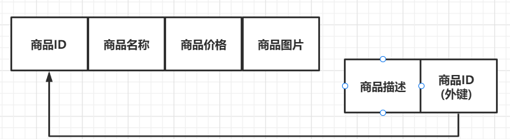
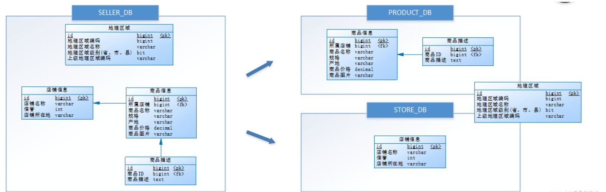
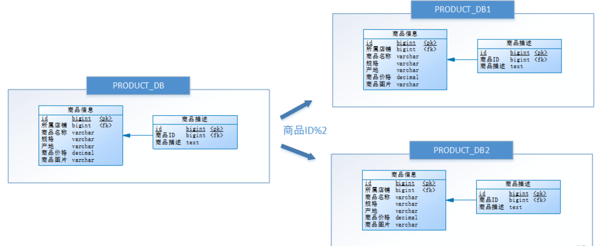
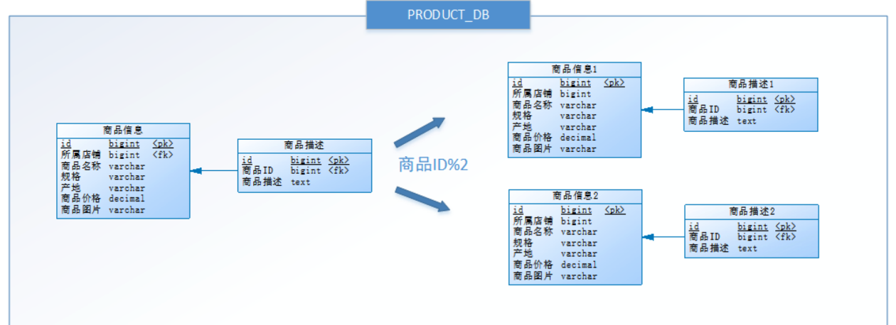

# 【Java开发笔记】分库分表

## 1 分库分表基本概述

> 为什么要分库分表？

【性能角度】分库分表就是为了解决由于数据量多大而导致数据库性能下降的问题：

- 原来独立的数据库拆分成若干数据库组成
- 将原来的大表（存储近千万数据）拆分为若干小表

目的：**使得单一数据库、单一数据表的数据量变小，从而提升数据库性能。**

【可用性角度】**防止单机故障**

## 2 分库分表的方式

分库分表包含了分库、分表两部分。在生产中通常包括：**垂直分库、水平分库、垂直分表、水平分表**。

### 2.1 垂直分表

> 定义：**将一个表按照字段分成多个表，每个表存储其中一部分字段**。
>
> 场景：**表的记录并不多，但是字段却很长**，表占用空间很大，**检索表的时候需要执行大量的IO，严重降低了性能**。

如下图，是一个记录商品信息的表，共包含五个字段（`商品ID`、`商品名称`、`商品价格`、`商品图片`、`商品描述`）

在实际的项目当中，展现给用户次数最频繁的字段应该是 **商品名称、图片以及价格** 等；而对于 **商品描述** 的信息，只有在用户对商品感到有兴趣并进行点击详情的操作时，用户才会看到该字段的信息。因此在这种情境下，**我们可以将 `商品描述` 这种占用空间较多，但访问不频繁的字段单独拆开来**：

像上图所示，将 **商品描述** 字段，拆开成为另一个表作为辅助表，并且在拆分出来的表中，增加一个记录主表主键ID的字段，当用户对该商品感兴趣并点击查看详情时，就可以主表的主键与该字段匹配，找到对应的 **商品描述**，并呈现给用户。

#### 优点

1. **充分发挥了热门数据的操作效率**，商品信息的高效率操作的效率不会被商品描述等低效率所拖累（**数据冷热分离**）
2. **避免了IO过度争抢并减少锁表的几率**，查看详情的用户与商品信息浏览互不影响

#### 原则

1. **冷热数据分离**：将不常用的字段单独放在一张表
2. **大字段拆分**：把 text（大文本存储），blob（图片、视频类存储）等大字段拆分出来放在附表中
3. **避免多表联查**：经常组合查询的列放在一张表中，提高效率

### 2.2 垂直分库

通过 **垂直分表** 性能确实能够得到一定的提升，但是因为 **存储的数据始终限制在一台服务器上，服务器的物理硬件存在性能瓶颈**（如：IO、磁盘、CPU等），而通过库内垂直分表只解决了单一表数据量过大的问题，但没有将表分布到不同服务器上，因此每个表还是竞争同一个物理机的 CPU、内存、IO等。

> 定义：垂直分库是指 **按照业务将表进行分类，分布到不同的数据库上面，每个库可以放在不同的服务器上**
>
> 核心思想：**专库专用**

例如，在一个库中，存在四张表：`地理区域`、`店铺信息`、`商品信息`、`商品描述`。

基于垂直分库的思想，我们把关于商品类的表（`商品信息`、`商品描述`）单独放在一个库中（部署到服务器1），把 `店铺信息` 表放入另一个库中（部署到服务器2），而 `地理区域` 表属于公共表。

#### 优点

1. **便于维护**：通过不同的表的业务聚合（聚合为库），使得数据库的维护更加清晰
2. **便于管理**：能够对不同业务的数据进行分级管理、维护、监控、扩展等
3. **分摊访问压力**：高并发的场景下，垂直分库一定程度上提高了磁盘 IO 和数据库连接数，并改善了单机硬件资源的瓶颈问题

但是，**垂直分库并没有解决但表数据量过大的问题！**

### 2.3 水平分库

> 功能：解决了 **单库** 数据量过大问题
>
> 定义：**把同一个表的数据按照一定规则拆分到不同的数据库中，每个库可以放在不同服务器上**

经过垂直分库后，数据库性能问题得到一定程度的解决，但是随着业务量的增长，`PRODUCT_DB(商品库)` **单库存储数据已经超出预估**。粗略估计，目前有 8w 店铺，每个店铺平均 150 个不同规格的商品，再算上增长，那商品数量得往 1500w+ 上预估，并且 `PRODUCT_DB(商品库)` 属于访问 **非常频繁** 的资源，单台服务器已经无法支撑。此时该如何优化？
**可尝试水平分库，将店铺 ID 为单数的和店铺 ID 为双数的商品信息分别放在两个库中。**

通过水平分库后，**各个库保存的表结构是一样的，但表中的内容是不一样的**。

#### 优点

1. 解决了单库大数据、高并发的性能瓶颈问题
2. 提高了系统的稳定性和可用性

但是，**由于同一个表被分配在不同的数据库，需要额外进行数据操作的路由工作**，因此大大提升了系统的复杂度。

### 2.4 水平分表

> 解决 **单表** 数据量大的问题
>
> 定义：在同一个数据库内，把同一个表的数据按照一定规则拆分到多个表中

按照水平分库的思路对他把 `PRODUCT_DB_X(商品库)` 内的 **表也可以进行水平拆分**，**其目的也是为解决单表数据量大的问题**。

#### 优点

1. 优化单一表数据量过大而产生的性能问题
2. 避免IO争抢并减少锁表几率

## 3 分库分表带来引发的问题

### 3.1 事务一致性问题

分库 **可能** 导致执行一次事务所需的数据分布在 **不同服务器上**，数据库层面无法实现事务性操作，**需要更上层业务引入分布式事务操作**，难免会给业务带来一定复杂性，那么要想解决事务一致性问题一般有两种手段：

- 方案一：在进行分库分表方案设计过程中，从业务角度出发，**尽可能保证一个事务所操作的表分布在一个库中**，从而实现数据库层面的事务保证。
- 方案二：方式一无法实现的情况下，**业务层引入分布式事务组件保证事务性**，如事务性消息、TCC、Seata等 **分布式事务** 方式实现数据最终一致性。

### 3.2 跨库聚合查询问题

分库分表会导致常规聚合查询操作，如 `group by`，`order by` 等变的异常复杂。需要复杂的业务代码才能实现上述业务逻辑，其常见操作方式有：

- 方案一：赛道赛马机制，每次从 N 个库表中查询出 TOP N 数据，然后在 **业务层代码中进行聚合合并操作**。
- 方案二：可以将经常使用到 `groupby`，`orderby` 字段存储到一个单一库表（可以是REDIS、ES、MYSQL）中，业务代码中先到单一表中根据查询条件查询出相应数据，然后根据查询到的主键 ID，到分库分表中查询详情进行返回。2次查询操作难点会带来接口耗时的增加，以及极端情况下的数据不一致问题。

### 3.3 主键(自增ID)唯一性问题

在数据库表设计时，经常会使用自增 ID 作为数据主键，这就导致后续在迁库迁表、或者分库分表操作时，会 **因为主键的变化或者主键不唯一产生冲突，要解决主键不唯一问题**。有如下方案：

- 自增ID做主键时，设置 **自增步长，采用等差数列递增，避免各个库表的主键冲突**。但是这个方案仍然无法解决迁库迁表、以及分库分表扩容导致主键 ID 变化问题
- 主键采用 **全局统一 ID 生成机制**：如 UUID、雪花算法、数据库号段等方式。

## 参考

1. MySQL垂直分表原理讲解：https://blog.csdn.net/weixin_47600880/article/details/120643028
2. 分库分表：垂直分库、垂直分表、水平分库、水平分表四个概念：https://blog.csdn.net/dgfdhgghd/article/details/128426013
3. 一文读懂数据库分库分表：https://blog.csdn.net/u013291818/article/details/124191907