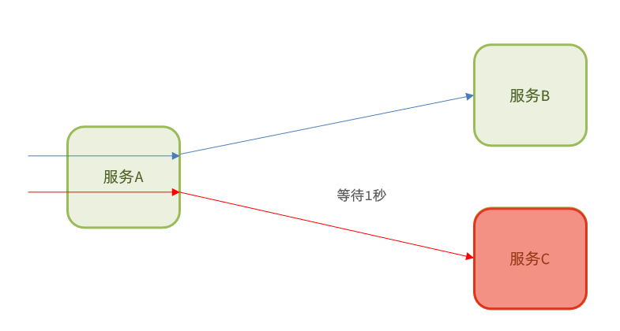
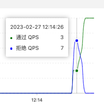
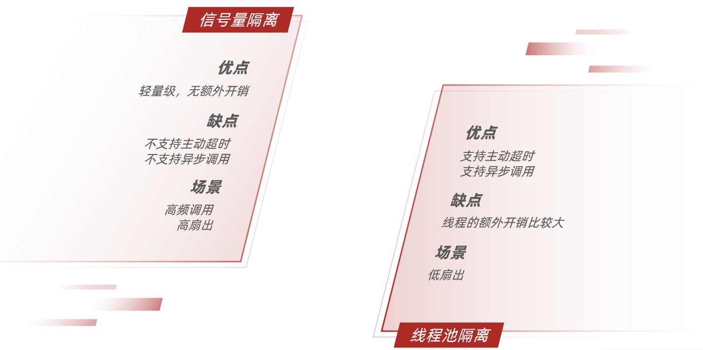
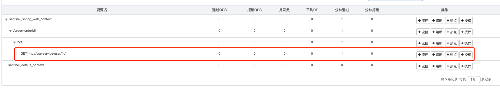
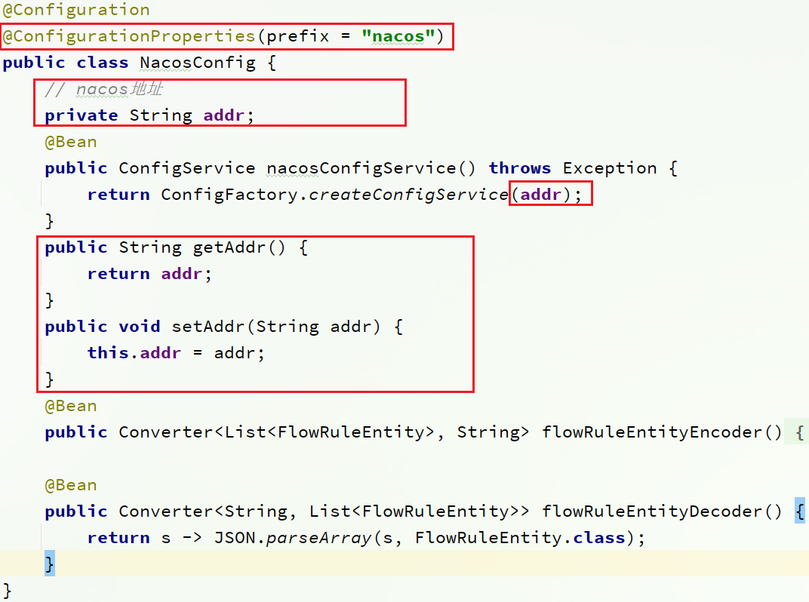
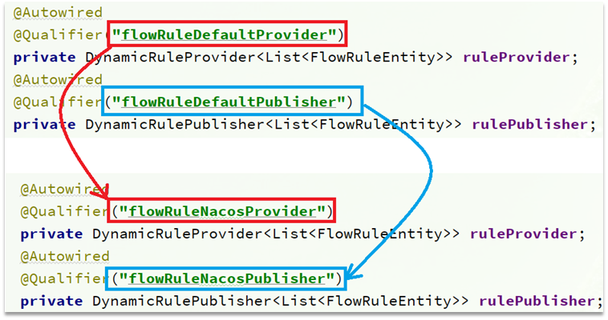

# 【Java开发笔记】微服务保护-Sentinel

## 1 Sentinel基本介绍

### 1.1 雪崩问题

微服务中，服务间调用关系错综复杂，一个微服务往往依赖于多个其它微服务。 


如图，如果服务提供者 I 发生了故障，当前的应用的部分业务因为依赖于服务 I，因此也会被阻塞。此时，其它不依赖于服务 I 的业务似乎不受影响。


但是，依赖服务 I 的业务请求被阻塞，用户不会得到响应，则 **tomcat 的这个线程不会释放**，于是越来越多的用户请求到来，越来越多的线程会阻塞：


服务器支持的线程和并发数有限，请求一直阻塞，会导致服务器资源耗尽，从而导致所有其它服务都不可用，那么当前服务也就不可用了。那么，**依赖于当前服务的其它服务随着时间的推移，最终也都会变的不可用，形成级联失败，雪崩就发生了** ：


解决雪崩问题的常见方式主要有四种：

- 超时处理
- 仓壁模式（线程隔离）
- 熔断降级
- 流量控制

#### 超时处理

超时处理：**设定超时时间，请求超过一定时间没有响应就返回错误信息，不会无休止等待** 。




#### 仓壁模式（线程隔离）

仓壁模式来源于船舱的设计：


船舱都会被隔板分离为多个独立空间，当船体破损时，只会导致部分空间进入，**将故障控制在一定范围内，避免整个船体都被淹没**。

于此类似，我们可以 **限定每个业务能使用的线程数，避免耗尽整个 tomcat 的资源，因此也叫 线程隔离** 。


#### 熔断降级

**熔断降级** ：由 **断路器** 统计业务执行的 **异常比例**，如果超出阈值则会 **熔断** 该业务，**拦截访问该业务的一切请求** 。

断路器会统计访问某个服务的请求数量，异常比例：


当发现访问服务 D 的请求异常比例过高时，认为服务 D 有导致雪崩的风险，会拦截访问服务 D 的一切请求，形成熔断：


#### 流量控制

**流量控制**：限制业务访问的 QPS，**避免服务因流量的突增而故障** 。


> **限流** 是对服务的保护，避免因瞬间高并发流量而导致服务故障，进而避免雪崩。是一种 **预防** 措施。
>
> **超时处理、线程隔离、降级熔断 **是在部分服务故障时，将故障控制在一定范围，避免雪崩。是一种 **补救** 措施。

### 1.2 微服务保护技术对比

在 SpringCloud 当中支持多种服务保护技术：

- [Netfix Hystrix](https://github.com/Netflix/Hystrix)
- [Sentinel](https://github.com/alibaba/Sentinel)
- [Resilience4J](https://github.com/resilience4j/resilience4j)

早期比较流行的是 Hystrix 框架，但目前国内实用最广泛的还是阿里巴巴的 Sentinel 框架，这里我们做下对比：

|                |                  **Sentinel**                  |            **Hystrix**            |
| :------------: | :--------------------------------------------: | :-------------------------------: |
|    隔离策略    |                **信号量** 隔离                 | **线程池** 隔离 / **信号量** 隔离 |
|  熔断降级策略  |      基于 **慢调用比例** 或 **异常比例**       |         基于 **失败比率**         |
|  实时指标实现  |                    滑动窗口                    |      滑动窗口（基于 RxJava）      |
|    规则配置    |                 支持多种数据源                 |          支持多种数据源           |
|     扩展性     |                   多个扩展点                   |            插件的形式             |
| 基于注解的支持 |                      支持                      |               支持                |
|      限流      |        基于 QPS，支持基于调用关系的限流        |            有限的支持             |
|    流量整形    |            支持慢启动、匀速排队模式            |              不支持               |
| 系统自适应保护 |                      支持                      |              不支持               |
|     控制台     | 开箱即用，可配置规则、查看秒级监控、机器发现等 |              不完善               |
| 常见框架的适配 |     Servlet、Spring Cloud、Dubbo、gRPC 等      |   Servlet、Spring Cloud Netflix   |

### 1.3 安装下载Sentinel

Sentinel 是阿里巴巴开源的一款微服务流量控制组件。官网地址：https://sentinelguard.io/zh-cn/index.html

Sentinel 具有以下特征:

- **丰富的应用场景**：Sentinel 承接了阿里巴巴近 10 年的双十一大促流量的核心场景，例如秒杀（即突发流量控制在系统容量可以承受的范围）、消息削峰填谷、集群流量控制、实时熔断下游不可用应用等。
- **完备的实时监控**：Sentinel 同时提供实时的监控功能。您可以在控制台中看到接入应用的单台机器秒级数据，甚至 500 台以下规模的集群的汇总运行情况。
- **广泛的开源生态**：Sentinel 提供开箱即用的与其它开源框架/库的整合模块，例如与 Spring Cloud、Dubbo、gRPC 的整合。您只需要引入相应的依赖并进行简单的配置即可快速地接入 Sentinel。
- **完善的** **SPI** **扩展点**：Sentinel 提供简单易用、完善的 SPI 扩展接口。您可以通过实现扩展接口来快速地定制逻辑。例如定制规则管理、适配动态数据源等。

Sentinel 官方提供了 UI 控制台，方便我们对系统做限流设置，可以在 [GitHub](https://github.com/alibaba/Sentinel/releases)下载。

下载后直接

```sh
java -jar sentinel-dashboard-1.8.4.jar
```


如果要修改Sentinel的默认端口、账户、密码，可以通过下列配置：

| **配置项**                       | **默认值** | **说明**   |
| -------------------------------- | ---------- | ---------- |
| server.port                      | 8080       | 服务端口   |
| sentinel.dashboard.auth.username | sentinel   | 默认用户名 |
| sentinel.dashboard.auth.password | sentinel   | 默认密码   |

例如，修改端口：

```sh
java -Dserver.port=8090 -jar sentinel-dashboard-1.8.4.jar
```

### 1.4 微服务整合Sentinel

我们在 order-service 中整合 sentinel，并连接 sentinel 的控制台，步骤如下：

**1）引入sentinel依赖**

```xml
<!--sentinel-->
<dependency>
    <groupId>com.alibaba.cloud</groupId> 
    <artifactId>spring-cloud-starter-alibaba-sentinel</artifactId>
</dependency>
```

**2）配置控制台**

修改application.yaml文件，添加下面内容：

```yaml
server:
  port: 8088
spring:
  cloud: 
    sentinel:
      transport:
        dashboard: localhost:8080
```

**3）访问order-service的任意端点**

打开浏览器，访问 http://localhost:8088/order/101 ，这样才能触发 sentinel 的监控。

然后再访问 sentinel 的控制台，查看效果：


## 2 流量限制

雪崩问题虽然有四种方案，但是限流是避免服务因突发的流量而发生故障，是对 **微服务雪崩问题的预防** 。

### 2.1 簇点链路

当请求进入微服务时，首先会访问 `DispatcherServlet` ，然后进入 `Controller、Service、Mapper` ，这样的一个调用链就叫做 **簇点链路** 。簇点链路中被监控的每一个接口就是一个 **资源** 。

> 簇点链路：项目内的 **调用链路，链路中被监控的每个接口就是一个资源** 。默认情况下 sentinel 会监控 SpringMVC 的每一个端点（Endpoint），因此 SpringMVC 的每一个端点（Endpoint）就是调用链路中的一个资源。

例如，我们刚才访问的 order-service 中的 OrderController 中的端点：`/order/{orderId}`

流控、熔断等都是针对簇点链路中的资源来设置的，因此我们可以点击对应资源后面的按钮来设置规则：

- 流控：流量控制
- 降级：降级熔断
- 热点：热点参数限流，是限流的一种
- 授权：请求的权限控制


#### 案例-直接模式

> 需求：给 `/order/{orderId}` 这个资源设置流控规则，QPS 不能超过 5，然后测试。

**1）首先在 sentinel 控制台添加限流规则**


**2）利用 jmeter 测试**


QPS 设置为10:


可以发现我们的流控生效了，每秒只能处理五个请求：


### 2.2 流控模式

在添加限流规则时，点击高级选项，可以选择三种 **流控模式**：

- **直接** ：统计当前资源的请求，触发阈值时对当前资源直接限流，也是默认的模式
- **关联** ：统计与当前资源相关的另一个资源，触发阈值时，对当前资源限流
- **链路** ：统计从指定链路访问到本资源的请求，触发阈值时，对指定链路限流


#### 案例-关联模式

**关联模式**：统计与当前资源相关的另一个资源，触发阈值时，对当前资源限流

**使用场景**：比如用户支付时需要修改订单状态，同时有用户要查询订单。查询和修改操作会争抢数据库锁，产生竞争。业务需求是优先支付和更新订单的业务， **因此当修改订单业务触发阈值时，需要对查询订单业务限流。**

**配置规则**：


**语法说明**：当 /write 资源访问量触发阈值时，就会对 /read 资源限流，避免影响 /write 资源。

> **需求说明**：
>
> - 在 OrderController 新建两个端点：`/order/query` 和 `/order/update` ，无需实现业务
>
> - 配置流控规则，当 `/order/ update` 资源被访问的QPS超过 5 时，对 `/order/query` 请求限流

**1）定义/order/query 端点，模拟订单查询**

```java
@GetMapping("/query")
public String queryOrder() {
    return "查询订单成功";
}
```

**2）定义 /order/update 端点，模拟订单更新**

```java
@GetMapping("/update")
public String updateOrder() {
    return "更新订单成功";
}
```

重启服务，并访问对应服务，查看 sentinel 控制台的簇点链路：

**3）配置流控规则**

对哪个端点限流，就点击哪个端点后面的按钮。我们是对订单查询 `/order/query` 限流，因此点击它后面的按钮：


**4）Jmeter设置**


访问：


可以发现，query 被限流了：


#### 案例-链路模式

**链路模式**：只针对从「指定链路」访问到本资源的请求做统计，判断是否超过阈值。

**配置示例**：

例如有两条请求链路：

- /test1 --> /common

- /test2 --> /common

如果只希望统计从 /test2 进入到 /common 的请求，则可以这样配置：


> **需求**：有查询订单和创建订单业务，两者都需要查询商品。针对从查询订单进入到查询商品的请求统计，并设置限流。
>
> 步骤：
>
> 1. 在 OrderService 中添加一个 queryGoods 方法，不用实现业务
>
> 2. 在 OrderController 中，改造 /order/query 端点，调用 OrderService 中的 queryGoods 方法
>
> 3. 在 OrderController 中添加一个 /order/save 的端点，调用 OrderService 的 queryGoods 方法
>
> 4. 给 queryGoods 设置限流规则，从 /order/query 进入 queryGoods 的方法限制 QPS 必须小于2

**1）添加查询商品方法**

在 order-service 服务中，给 OrderService 类添加一个 queryGoods 方法：

```java
public void queryGoods(){
    System.err.println("查询商品");
}
```

**2）查询订单时，查询商品**

在 order-service 的 OrderController 中，修改 /order/query 端点的业务逻辑：

```java
@GetMapping("/query")
public String queryOrder() {
    // 查询商品
    orderService.queryGoods();
    // 查询订单
    System.out.println("查询订单");
    return "查询订单成功";
}
```

**3）新增订单，查询商品**

在 order-service 的 OrderController 中，修改 /order/save 端点，模拟新增订单：

```java
@GetMapping("/save")
public String saveOrder() {
    // 查询商品
    orderService.queryGoods();
    // 查询订单
    System.err.println("新增订单");
    return "新增订单成功";
}
```

**4）给查询商品添加资源标记**

**默认情况下，OrderService 中的方法是不被 Sentinel 监控的**，需要我们自己通过注解来标记要监控的方法。

给 OrderService 的 queryGoods 方法添加 `@SentinelResource` 注解：

```java
@SentinelResource("goods")
public void queryGoods(){
    System.err.println("查询商品");
}
```

链路模式中，是对不同来源的两个链路做监控。但是 sentinel **默认会给进入 SpringMVC 的所有请求设置为同一个 root 资源（即设置为同源了），会导致链路模式失效。**

我们需要关闭这种对 SpringMVC 的资源聚合，修改 order-service 服务的 application.yml 文件：

```yaml
spring:
  cloud:
    sentinel:
      web-context-unify: false # 关闭context整合
```

重启服务，访问 /order/query 和 /order/save，可以查看到 sentinel 的簇点链路规则中，出现了新的资源：


**5）添加流控规则**

点击 goods 资源后面的流控按钮，在弹出的表单中填写下面信息：


**6）Jmeter设置**


**7）测试**

/order/query ：


/order/save：


### 2.3 流控效果

在流控的高级选项中，还有一个流控效果选项：


流控效果是指请求 **达到流控阈值时应该采取的措施** ，包括三种：

- **快速失败**：达到阈值后，新的请求会被立即拒绝并抛出 FlowException 异常。是默认的处理方式。

- **warm up**：预热模式，对超出阈值的请求同样是拒绝并抛出异常。但这种模式阈值会动态变化，从一个较小值逐渐增加到最大阈值。

- **排队等待**：让所有的请求按照先后次序排队执行，两个请求的间隔不能小于指定时长

#### 案例-WarmUp

**场景**：阈值一般是一个微服务能承担的最大 QPS，但是 **一个服务刚刚启动时，一切资源尚未初始化（冷启动），如果直接将 QPS 跑到最大值，可能导致服务瞬间宕机。**

Warm Up也叫 **预热模式** ，是应对服务冷启动的一种方案。请求阈值初始值是 `maxThreshold / coldFactor`，持续指定时长后，逐渐提高到 maxThreshold 值。而 **coldFactor** 的默认值是 3。

例如，我设置 QPS 的 maxThreshold 为 10，预热时间为 5 秒，那么初始阈值就是 `10 / 3` ，也就是 3，然后在 5 秒后逐渐增长到 10.


> **需求**：给 /order/{orderId} 这个资源设置限流，最大 QPS 为 10，利用 warm up 效果，预热时长为 5 秒

**1）配置流控规则**


**2）Jmeter测试**


可以看到，一开始QPS阈值为3，在五秒钟内逐步上升至10:




#### 案例-排队等待

当请求超过 QPS 阈值时，**快速失败** 和 **warm up** 会 **拒绝新的请求并抛出异常** 。

而 **排队等待** 则是让所有请求进入一个 **队列** 中，然后按照阈值允许的时间间隔依次执行。后来的请求必须等待前面执行完成，**如果请求预期的等待时间超出最大时长，则会被拒绝**。

> 也就是，并发量高的时候，不会放弃所有！

【工作原理】例如：QPS = 5，意味着每 200ms 处理一个队列中的请求；假设 timeout = 2000，意味着 **预期等待时长** 超过 2000ms 的请求会被拒绝并抛出异常。

那什么叫做 **预期等待时长** 呢？

比如现在一下子来了 12 个请求，因为每200ms执行一个请求，那么：

- 第 6 个请求的 **预期等待时长** =  200 * （6 - 1） = 1000ms
- 第 12 个请求的预期等待时长 = 200 * （12-1） = 2200ms


> **需求**：给 /order/{orderId} 这个资源设置限流，最大 QPS 为 10，利用排队的流控效果，超时时长设置为 5s

**1）添加流控规则**


**2）Jmeter测试**


中间被拒绝掉的是因为队列满了，才被拒绝。

### 2.4 参数限流

之前的限流是统计访问某个资源的所有请求，判断是否超过 QPS 阈值。而热点参数限流是 **分别统计参数值相同的请求**，判断是否超过 QPS 阈值。

#### 全局参数限流

例如，一个根据 id 查询商品的接口：


访问 /goods/{id} 的请求中，id 参数值会有变化，热点参数限流会根据参数值分别统计 QPS，统计结果：


当 id=1 的请求触发阈值被限流时，id 值不为 1 的请求不受影响。

配置示例：


代表的含义是：对 hot 这个资源的 0 号参数（第一个参数）做统计，每 1 秒 **相同参数值** 的请求数不能超过 5

#### 热点参数限流

刚才的配置中，对查询商品这个接口的所有商品一视同仁，QPS 都限定为 5。

而在实际开发中，可能部分商品是热点商品，例如秒杀商品，我们希望这部分商品的 QPS 限制与其它商品不一样，高一些。那就需要配置热点参数限流的高级选项了：


结合上一个配置，这里的含义是对 0 号的 long 类型参数限流，每 1 秒相同参数的 QPS 不能超过 5，有两个例外：

- 如果参数值是 100，则每 1 秒允许的 QPS 为 10

- 如果参数值是 101，则每 1 秒允许的 QPS 为 15

#### 案例

> **案例需求**：给 /order/{orderId} 这个资源添加热点参数限流，规则如下：
>
> - 默认的热点参数规则是每 1 秒请求量不超过 2
> - 给 102 这个参数设置例外：每1秒请求量不超过 4
> - 给 103 这个参数设置例外：每1秒请求量不超过 10

**注意事项**：热点参数限流对默认的 SpringMVC 资源无效，需要利用 `@SentinelResource` 注解标记资源

**1）标记资源**

```java
@SentinelResource("hot")
@GetMapping("{orderId}")
public Order queryOrderByUserId(@PathVariable("orderId") Long orderId) {
    // 根据id查询订单并返回
    return orderService.queryOrderById(orderId);
}
```

**2）热点参数限流配置**


点击左侧菜单中 **热点规则** 菜单：


点击新增，填写表单：


**3）Jmeter测试**


## 3 隔离和降级

限流是一种预防措施，虽然限流可以 **尽量避免因高并发而引起的服务故障** ，但服务还会因为其它原因而故障。

而要将这些故障控制在一定范围，避免雪崩，就要靠 **线程隔离** （舱壁模式）和 **熔断降级** 手段了。

不管是 **线程隔离** 还是 **熔断降级**，都是对 **客户端（调用方）** 的保护！

而我们的微服务远程调用都是基于 Feign 来完成的，因此我们需要将 Feign 与 Sentinel 整合，**在 Feign 里面实现线程隔离和服务熔断。**

### 3.1 FeignClient整合Sentinel

SpringCloud 中，微服务调用都是通过 Feign 来实现的，因此做客户端保护必须整合 Feign 和 Sentinel。

**1）修改Feign配置，开启Sentinel**

修改 OrderService 的 application.yml 文件，开启 Feign 的 Sentinel 功能：

```yaml
feign:
  sentinel:
    enabled: true # 开启feign对sentinel的支持
```

**2）编写失败降级逻辑**

业务失败后，不能直接报错，而 **应该返回用户一个友好提示或者默认结果**，这个就是失败降级逻辑。

给 FeignClient 编写失败后的降级逻辑

① 方式一：`FallbackClass`，无法对远程调用的异常做处理

② 方式二：`FallbackFactory`，可以对远程调用的异常做处理

这里演示方式二的失败降级处理。

**步骤一**：在 feing-api 项目中定义类，实现 FallbackFactory：

```java
@Slf4j
public class UserClientFallbackFactory implements FallbackFactory<UserClient> {

    @Override
    public UserClient create(Throwable throwable) {
        return new UserClient() {
            @Override
            public User findById(Long id) {
                log.error("查询用户异常", throwable);
                return new User();
            }
        };
    }
}
```

**步骤二**：在 feing-api 项目中的 DefaultFeignConfiguration 类中将 UserClientFallbackFactory 注册为一个 Bean：

```java
@Bean
public UserClientFallbackFactory userClientFallbackFactory() {
    return new UserClientFallbackFactory();
}
```

**步骤三**：在 feing-api 项目中的 UserClient 接口中使用 UserClientFallbackFactory：

```java
@FeignClient(value = "userservice", fallbackFactory = UserClientFallbackFactory.class)
public interface UserClient {

    @GetMapping("/user/{id}")
    User findById(@PathVariable("id") Long id);
}
```

重启后，访问一次订单查询业务，然后查看 sentinel 控制台，可以看到新的簇点链路：


测试：关闭 userService 微服务 之后访问 http://localhost:8088/order/101 不再显示报错，而是显示返回数据中的user为null


### 3.2 线程隔离

线程隔离有两种方式实现：

- 线程池隔离

- **信号量隔离（Sentinel默认采用）**

如图：


**线程池隔离** ：给每个服务调用业务分配一个线程池，利用线程池本身实现隔离效果

**信号量隔离** ：不创建线程池，而是计数器模式，记录业务使用的线程数量，达到信号量上限时，禁止新的请求

两者的优缺点：



**用法说明**：

在添加限流规则时，可以选择两种阈值类型：


- 线程数：是该资源能使用的 tomcat 线程数的最大值。也就是通过限制线程数量，实现 **线程隔离**（舱壁模式）。

> **案例需求**：给 order-service 服务中的 UserClient 的查询用户接口设置流控规则，线程数不能超过 2。然后利用 jmeter测试。

**1）配置隔离规则**




**2）Jmeter测试**


### 3.3 熔断降级

熔断降级是解决雪崩问题的重要手段。其思路是由 **断路器** 统计服务调用的 **异常比例、慢请求比例**，如果超出阈值则会 **熔断** 该服务。即拦截访问该服务的一切请求；而当服务恢复时，断路器会放行访问该服务的请求。

断路器控制熔断和放行是通过状态机来完成的：


状态机包括三个状态：

- `closed` ：关闭状态，断路器放行所有请求，并开始统计异常比例、慢请求比例。超过阈值则切换到open状态
- `open` ：打开状态，服务调用被 **熔断** ，访问被熔断服务的请求会被拒绝，快速失败，**直接走降级逻辑** 。Open 状态 5 秒后会进入 half-open 状态
- `half-open` ：半开状态，放行一次请求，根据执行结果来判断接下来的操作。
  - 请求成功：则切换到 closed 状态
  - 请求失败：则切换到 open 状态

#### 3.3.1 慢调用

**慢调用**：业务的响应时长（RT）大于指定时长的请求认定为慢调用请求。在指定时间内，如果请求数量超过设定的最小数量，慢调用比例大于设定的阈值，则触发熔断。

例如：


解读：RT 超过 500ms 的调用是慢调用，统计最近 10000ms 内的请求，如果请求量超过 10 次，并且慢调用比例不低于 0.5，则触发熔断，熔断时长为 5 秒。然后进入 half-open 状态，放行一次请求做测试。

> **需求**：给 UserClient 的查询用户接口设置降级规则，慢调用的 RT 阈值为 50ms，统计时间为 1 秒，最小请求数量为 5，失败阈值比例为 0.4，熔断时长为 5。

**1）设置满调用**

修改 user-service 中的 /user/{id} 这个接口的业务。通过休眠模拟一个延迟时间：


此时，orderId=101 的订单，关联的是 id 为 1 的用户，调用时长为 60ms：


orderId=102 的订单，关联的是 id 为 2 的用户，调用时长为非常短；


**2）设置熔断规则**

下面，给 feign 接口设置降级规则：


**3）测试**


#### 3.3.2 异常比例、异常数

**异常比例或异常数**：统计指定时间内的调用，如果调用次数超过指定请求数，并且出现异常的比例达到设定的比例阈值（或超过指定异常数），则触发熔断。

例如，一个异常比例设置：


解读：统计最近 1000ms 内的请求，如果请求量超过 10 次，并且异常比例不低于 0.4，则触发熔断。

一个异常数设置：


解读：统计最近 1000ms 内的请求，如果请求量超过 10 次，并且异常比例不低于 2 次，则触发熔断。

> 需求：给 UserClient 的查询用户接口设置降级规则，统计时间为1秒，最小请求数量为5，失败阈值比例为0.4，熔断时长为5s

**1）设置异常请求**

首先，修改 user-service 中的 /user/{id} 这个接口的业务。手动抛出异常，以触发异常比例的熔断：


也就是说，id 为 2 时，就会触发异常

**2）设置熔断规则**

下面，给feign接口设置降级规则：


规则：


在 5 次请求中，只要异常比例超过 0.4，也就是有 2 次以上的异常，就会触发熔断。

**3）测试**

在浏览器快速访问：http://localhost:8088/order/102，快速刷新5次，触发熔断：访问 101 都出现 null：


## 4 授权规则

### 4.1 基本规则

授权规则可以对调用方的来源做控制，有白名单和黑名单两种方式。

- 白名单：来源（origin）在白名单内的调用者允许访问

- 黑名单：来源（origin）在黑名单内的调用者不允许访问

点击左侧菜单的授权，可以看到授权规则：


- 资源名：就是受保护的资源，例如 /order/{orderId} 

- 流控应用：是来源者的名单，
  - 如果是勾选白名单，则名单中的来源被许可访问。
  - 如果是勾选黑名单，则名单中的来源被禁止访问。

### 4.2 案例

比如：


我们允许请求从 gateway 到 order-service，不允许浏览器访问 order-service ，那么白名单中就要填写 **网关的来源名称（origin）** 。

#### 4.2.1 如何获取origin？

Sentinel 是通过 `RequestOriginParser` 这个接口的 parseOrigin 来获取请求的来源的。

```java
public interface RequestOriginParser {
    /**
     *  从请求request对象中获取origin，获取方式自定义
     */
    String parseOrigin(HttpServletRequest request);
}
```

这个方法的作用就是从 request 对象中，获取请求者的 origin 值并返回。

默认情况下，sentinel 不管请求者从哪里来，返回值永远是 default，也就是说一切请求的来源都被认为是一样的值 default。

因此，我们需要自定义这个接口的实现，让**不同的请求，返回不同的origin**。

例如 order-service 服务中，我们定义一个 `HeaderOriginParser` 的实现类：

```java
@Component
public class HeaderOriginParser implements RequestOriginParser {
    @Override
    public String parseOrigin(HttpServletRequest request) {
        // 获取origin请求头属性值
        String origin = request.getHeader("origin");
        if (StringUtils.isEmpty(origin)) {
            origin = "blank";
        }
        return origin;
    }
}
```

我们会尝试从 request-header 中获取 `origin` 值。

#### 4.2.2 给网关添加请求头

既然获取请求 origin 的方式是从 reques-header 中获取 origin 值，我们必须让 **所有从 gateway 路由到微服务的请求都带上origin头** 。

这个需要利用之前学习的一个 `GatewayFilter` 来实现，`AddRequestHeaderGatewayFilter` 。

修改 gateway 服务中的 application.yml，添加一个 defaultFilter：

```yaml
spring:
  cloud:
    gateway:
      default-filters:
        - AddRequestHeader=origin,gateway
      routes:
       # ...略
```

这样，从 gateway 路由的所有请求都会带上 origin 头，值为 gateway。而从其它地方到达微服务的请求则没有这个头。

#### 4.2.3 添加授权规则

接下来，我们添加一个授权规则，放行 origin 值为 gateway 的请求。


配置如下：


现在，我们直接跳过网关，访问 order-service 服务：


通过网关访问：


### 4.3 自定义异常结果

默认情况下，发生限流、降级、授权拦截时，都会抛出异常到调用方。异常结果都是 `flow limmiting（限流）`。这样不够友好，无法得知是限流还是降级还是授权拦截。

#### 4.3.1 异常类型

如果要自定义异常时的返回结果，需要实现 `BlockExceptionHandler` 接口：

```java
public interface BlockExceptionHandler {
    /**
     * 处理请求被限流、降级、授权拦截时抛出的异常：BlockException
     */
    void handle(HttpServletRequest request, HttpServletResponse response, BlockException e) throws Exception;
}
```

这个方法有三个参数：

- HttpServletRequest request：request对象
- HttpServletResponse response：response对象
- BlockException e：被sentinel拦截时抛出的异常

这里的BlockException包含多个不同的子类：

| **异常**             | **说明**           |
| -------------------- | ------------------ |
| FlowException        | 限流异常           |
| ParamFlowException   | 热点参数限流的异常 |
| DegradeException     | 降级异常           |
| AuthorityException   | 授权规则异常       |
| SystemBlockException | 系统规则异常       |

#### 4.3.2 自定义异常处理

在 order-service 定义一个自定义异常处理类，针对 Feign 远程调用过程中，产生的异常返回信息的处理：

```java
@Component
public class SentinelExceptionHandler implements BlockExceptionHandler {
    @Override
    public void handle(HttpServletRequest request, HttpServletResponse response, BlockException e) throws Exception {
        String msg = "未知异常";
        int status = 429;// 请求过多

        if (e instanceof FlowException) {
            msg = "请求被限流了";
        } else if (e instanceof ParamFlowException) {
            msg = "请求被热点参数限流";
        } else if (e instanceof DegradeException) {
            msg = "请求被降级了";
        } else if (e instanceof AuthorityException) {
            msg = "没有权限访问";
            status = 401;
        }

        response.setContentType("application/json;charset=utf-8");
        response.setStatus(status);
        response.getWriter().println("{\"msg\":\""+msg+"\", \"status\":" + status + "}");
    }
}
```

重启测试，在不同场景下，会返回不同的异常消息.

限流：


授权拦截时：


## 5 规则持久化

目前，**sentinel 的所有规则都是内存存储，重启后所有规则都会丢失** 。在生产环境下，我们 **必须确保这些规则的持久化** ，避免丢失。

### 5.1 规则管理模式

规则是否能持久化，取决于 **规则管理模式** ，sentinel 支持三种规则管理模式：

- 原始模式：Sentinel 的默认模式，将规则保存在内存，重启服务会丢失。
- pull 模式
- push 模式：**生产环境下，一般使用 push 模式的数据源**


#### 5.1.1 原始模式

控制台配置的规则直接推送到 Sentinel 客户端，也就是我们的应用，然后 **保存在内存** 中，服务重启则丢失。


#### 5.1.2 pull模式

控制台将配置的规则推送到 Sentinel 客户端，而 **客户端会将配置规则保存在本地文件或数据库中** 。以后会 **定时去本地文件或数据库中查询，更新本地规则** 。


#### 5.1.3 push模式

控制台将配置规则推送到 **远程配置中心**，例如 **Nacos** 。Sentinel 客户端监听 Nacos，获取配置变更的推送消息，完成本地配置更新。


### 5.2 案例：Push模式

修改 OrderService，让其监听 Nacos 中的 sentinel 规则配置。

具体步骤如下：

#### 1）引入依赖

在 order-service 中引入 sentinel 监听 nacos 的依赖：

```xml
<dependency>
    <groupId>com.alibaba.csp</groupId>
    <artifactId>sentinel-datasource-nacos</artifactId>
</dependency>
```

#### 2）配置nacos地址

在order-service中的application.yml文件配置nacos地址及监听的配置信息：

```yaml
spring:
  cloud:
    sentinel:
      datasource:
        flow:
          nacos:
            server-addr: localhost:8848 # nacos地址
            dataId: orderservice-flow-rules
            groupId: SENTINEL_GROUP
            # flow：限流、degrade：熔断降级、authority：授权、param-flow：参数限流
            rule-type: flow # 还可以是：degrade、authority、param-flow
```

SentinelDashboard 默认不支持 nacos 的持久化，需要修改源码：


#### 3）修改nacos依赖

在sentinel-dashboard源码的pom文件中，nacos的依赖默认的scope是test，只能在测试时使用，这里要去除：


将sentinel-datasource-nacos依赖的scope去掉：

```xml
<dependency>
    <groupId>com.alibaba.csp</groupId>
    <artifactId>sentinel-datasource-nacos</artifactId>
</dependency>
```

#### 4）添加nacos支持

在sentinel-dashboard的test包下，已经编写了对nacos的支持，我们需要将其拷贝到main下。


SentinelDashboard 默认不支持 nacos 的持久化，需要修改源码。

#### 5）修改nacos地址

然后，还需要修改测试代码中的NacosConfig类：


修改其中的nacos地址，让其读取application.properties中的配置：



在sentinel-dashboard的application.properties中添加nacos地址配置：

```properties
nacos.addr=localhost:8848
```

#### 6）配置nacos数据源

另外，还需要修改com.alibaba.csp.sentinel.dashboard.controller.v2包下的FlowControllerV2类：


让我们添加的Nacos数据源生效：



#### 7）修改前端页面

接下来，还要修改前端页面，添加一个支持nacos的菜单。

修改src/main/webapp/resources/app/scripts/directives/sidebar/目录下的sidebar.html文件：


将其中的这部分注释打开：


修改其中的文本：


#### 8）重新编译、打包项目

运行IDEA中的maven插件，编译和打包修改好的Sentinel-Dashboard：


#### 9）启动

启动方式跟官方一样：

```sh
java -jar sentinel-dashboard.jar
```

如果要修改nacos地址，需要添加参数：

```sh
java -jar -Dnacos.addr=localhost:8848 sentinel-dashboard.jar
```


