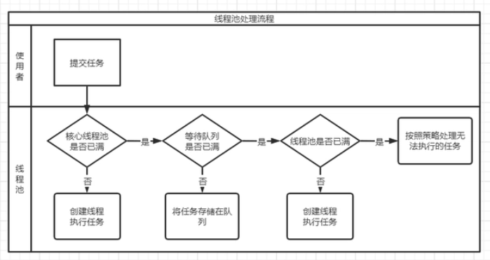

# 【Java开发笔记】线程池

线程池 `ThreadPoolExecutor` 的七大核心参数：

- 核心线程数 `corePoolSize`
- 最大线程数 `maxinumPoolSize`
- 超过核心线程数的闲余线程存活时间 `keepAliveTime`
- 存活时间单位 `unit:keepAliveTime`
- 任务队列（阻塞队列） `workQueue`
- 生成线程池中工作线程的线程工厂 `threadFactory`
- 拒绝策略 `handler`


## 1 线程池扩容流程概述



1. 当线程池创建完成后，**池内的线程数量为 0** ，这是因为采用了 **懒加载** 机制。
2. 当一个任务通过 `submit()` 或 `execute()` 方法提交到线程池后：
   - **如果当前池中线程数（包括闲置线程）小于 `corePoolSize`，则创建一个新线程执行任务**
   - **如果当前线程池中的线程数已经达到了 `corePoolSize`，则将任务放入等待队列**
   - **如果任务队列已满，则任务无法放入等待队列。此时如果线程池中线程数量小于 `maxPoolSize`，则创建一个临时线程执行任务，`临时线程数量 = 最大线程数 - 核心线程数`**
   - **如果当前池中线程总数已经等于 `maxPoolSize`，此时无法执行该任务，触发拒绝策略进行处理**
3. 当线程池中线程数量大于 `corePoolSize` 后，超过 `keepAliveTime` 时间的闲置线程会被回收掉，回收的是非核心线程（即临时线程），核心线程一般是不会被回收的。如果设置 `allowCoreThreadTimeout(True)`，则核心线程数也会被回收。

## 2 线程池的拒绝策略

### 2.1 什么时候会触发拒绝策略？

有两种情况：

1. 当我们调用 `shutdown` 等方法关闭线程池后，如果再向线程池内提交任务，则会遭到拒绝
2. 线程池没有空闲线程（即线程数量达到 `maxPoolSize` 并且都在执行任务），并且任务队列已满，则会遭到拒绝

### 2.2 有哪些拒绝策略？

#### AbortPolicy（默认）

> 直接抛出异常，中断程序执行

这种拒绝策略在拒绝任务时，会直接抛出一个类型为 `RejectedExecutionException` 的 `RuntimeException`，让你感知任务被拒绝了，于是便可根据业务逻辑选择重试或者放弃提交策略。

```java
		public static class AbortPolicy implements RejectedExecutionHandler {
        /**
         * Creates an {@code AbortPolicy}.
         */
        public AbortPolicy() { }

        /**
         * Always throws RejectedExecutionException.
         *
         * @param r the runnable task requested to be executed
         * @param e the executor attempting to execute this task
         * @throws RejectedExecutionException always
         */
        public void rejectedExecution(Runnable r, ThreadPoolExecutor e) {
            throw new RejectedExecutionException("Task " + r.toString() +
                                                 " rejected from " +
                                                 e.toString());
        }
    }
```

#### DiscardPolicy

> 直接丢弃，不抛异常

这种拒绝策略在拒绝任务时，直接丢弃，不会给任何通知，相对而言有一定风险。因为我们对任务丢弃是无感的，可能会造成数据丢失。

```java
		public static class DiscardPolicy implements RejectedExecutionHandler {
        /**
         * Creates a {@code DiscardPolicy}.
         */
        public DiscardPolicy() { }

        /**
         * Does nothing, which has the effect of discarding task r.
         *
         * @param r the runnable task requested to be executed
         * @param e the executor attempting to execute this task
         */
        public void rejectedExecution(Runnable r, ThreadPoolExecutor e) {
        }
    }
```

#### DiscardOldestPolicy

> 丢弃任务队列中最老的节点

丢弃 **任务队列** 中的头节点。通常是存活时间最长的任务，它也存在一定的数据丢失风险。

```java
		public static class DiscardOldestPolicy implements RejectedExecutionHandler {
        /**
         * Creates a {@code DiscardOldestPolicy} for the given executor.
         */
        public DiscardOldestPolicy() { }

        /**
         * Obtains and ignores the next task that the executor
         * would otherwise execute, if one is immediately available,
         * and then retries execution of task r, unless the executor
         * is shut down, in which case task r is instead discarded.
         *
         * @param r the runnable task requested to be executed
         * @param e the executor attempting to execute this task
         */
        public void rejectedExecution(Runnable r, ThreadPoolExecutor e) {
            if (!e.isShutdown()) {
                e.getQueue().poll();
                e.execute(r);
            }
        }
    }
```

#### CallerRunsPolicy（推荐）

> 当前线程处理不了，回调主线程，让主线程处理任务

当有新任务提交后，如果线程池没有被关闭且没有能力执行，则把这个任务交于提交任务的线程（主线程）执行。也就是谁提交任务，谁执行。主线程在处理任务时，可以为线程池腾出时间，如果此时有新的空闲线程，那么可继续协助主线程处理任务。

```java
		public static class CallerRunsPolicy implements RejectedExecutionHandler {
        /**
         * Creates a {@code CallerRunsPolicy}.
         */
        public CallerRunsPolicy() { }

        /**
         * Executes task r in the caller's thread, unless the executor
         * has been shut down, in which case the task is discarded.
         *
         * @param r the runnable task requested to be executed
         * @param e the executor attempting to execute this task
         */
        public void rejectedExecution(Runnable r, ThreadPoolExecutor e) {
            if (!e.isShutdown()) {
                r.run();
            }
        }
    }
```

#### 自定义拒绝策略

实现 `RejectedExecutionHandle` 接口来实现自己的拒绝策略。

## 3、Spring内置的线程池

我们实际开发中更多的是使用 SpringBoot 来开发，Spring 默认也是自带了一个线程池方便我们开发，它就是 `ThreadPoolTaskExecutor`，`ThreadPoolTaskExecutor` 是对 `ThreadPoolExecutor` 进行了封装处理。

```java
// 获取线程池中当前线程数
int poolSize = threadPoolTaskExecutor.getThreadPoolExecutor().getPoolSize();
System.out.println("当前线程数量" + poolSize);

// 当前压入队列的任务数
int size = threadPoolTaskExecutor.getThreadPoolExecutor().getQueue().size();
System.out.println("当前压入等待队列的线程数量" + size);

// 获取当前的活跃线程数（正在处理任务线程）
int activeCount = threadPoolTaskExecutor.getThreadPoolExecutor().getActiveCount();
System.out.println("当前活跃线程数" + activeCount);

// 获取当前完成的任务数
long completedTaskCount = threadPoolTaskExecutor.getThreadPoolExecutor().getCompletedTaskCount();
System.out.println("完成任务数" + completedTaskCount);

// 获取总任务数
long taskCount = threadPoolTaskExecutor.getThreadPoolExecutor().getTaskCount();
System.out.println("总任务数" + taskCount);
```

## 4、线程池参数设置原则

### 4.1 线程数量

设置多少个线程数量通常是根据应用的类型进行设计：

- **IO密集型**：`2n+1`，`n` 为 CPU 核数。

  在开发中较为常见，如 mysql 数据库的读写、文件的读写、网络通信等任务。这些任务不会特别消耗 CPU 资源，但 IO 操作比较耗时，会占用较多时间。

- **CPU密集型**：`n+1`，`n` 为 CPU 核数

  场景如解密、加密、压缩、计算等。

可以通过下面 api 查看当前服务器的 CPU 核数：

```java
int core = Runtime.getRuntime().availableProcessors();
```

### 4.2 无界队列

实际运行中，我们一般会设置线程池的阻塞队列长度，如果不设置，`ThreadPoolTaskExecutor` 用默认值：

```java
private int corePoolSize = 1;
private int maxPoolSize = Integer.MAX_VALUE;
private int keepAliveSeconds = 60;
private int queueCapacity = Integer.MAX_VALUE;
```

注意：**不能设置队列长度过大，否则可能会造成内存溢出（OOM）的错误！**

所以，**禁止使用默认的队列长度！！！**