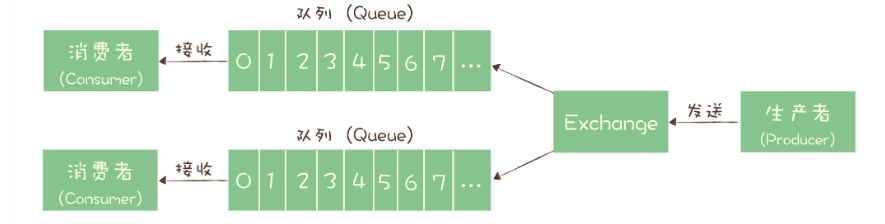

# 【技术笔记】消息队列

## 1 队列与主题

### 队列模型

队列模型是最早的消息队列结构。


缺点：**如果需要将一份消息数据分发给多个消费者，要求每个消费者都能收到全量的消息**，例如，对于一份订单数据，风控系统、分析系统、支付系统等都需要接收消息。这个时候，**单个队列就满足不了需求，一个可行的解决方式是，为每个消费者创建一个单独的队列，让生产者发送多份。**

### 发布订阅模型

在发布 - 订阅模型中，**消息的发送方称为发布者（Publisher），消息的接收方称为订阅者（Subscriber），服务端存放消息的容器称为主题（Topic）**。发布者将消息发送到主题中，订阅者在接收消息之前需要先“订阅主题”。“订阅”在这里既是一个动作，同时还可以认为是主题在消费时的一个逻辑副本，每份订阅中，订阅者都可以接收到主题的所有消息。


## 2 常见的消息模型

### RabbitMQ的消息模型

RabbitMQ 使用的是 **队列模型**。在 RabbitMQ 中，**Exchange 位于生产者和队列之间**，生产者并不关心将消息发送给哪个队列，而是将消息发送给 Exchange，由 Exchange 上配置的策略来决定将消息投递到哪些队列中。



同一份消息如果需要被多个消费者来消费，**需要配置 Exchange 将消息发送到多个队列**，每个队列中都存放一份完整的消息数据，可以为一个消费者提供消费服务。

### RocketMQ的消息模型

RocketMQ 使用的消息模型是标准的 **发布 - 订阅模型**。

> 几乎所有的消息队列产品都使用一种非常朴素的 **“请求 - 确认”机制，确保消息不会在传递过程中由于网络或服务器故障丢失（可靠性）**。

在生产端，**生产者先将消息发送给服务端，也就是 Broker，服务端在收到消息并将消息写入主题或者队列中后，会给生产者发送确认的响应** 。如果生产者没有收到服务端的确认或者收到失败的响应，则会重新发送消息；

在消费端，消费者在收到消息并完成自己的消费业务逻辑（比如，将数据保存到数据库中）后，也会给服务端发送消费成功的确认，**服务端只有收到消费确认后，才认为一条消息被成功消费，否则它会给消费者重新发送这条消息，直到收到对应的消费成功确认。**


**每个主题包含多个队列，通过多个队列来实现多实例并行生产和消费。**需要注意的是，RocketMQ 只在队列上保证消息的有序性，主题层面是无法保证消息的严格顺序的。

RocketMQ 中，订阅者的概念是通过 **消费组（Consumer Group）** 来体现的。每个消费组都消费主题中一份完整的消息，不同消费组之间消费进度彼此不受影响，也就是说，**一条消息被 Consumer Group1 消费过，也会再给 Consumer Group2 消费** 。

消费组中包含多个消费者，**同一个组内的消费者是竞争消费的关系**，每个消费者负责消费组内的一部分消息。如果一条消息被消费者 Consumer1 消费了，那同组的其他消费者就不会再收到这条消息。

> 同组内竞争，不同组可重复消费同一条消息。

在 Topic 的消费过程中，由于消息需要被不同的组进行多次消费，所以消费完的消息并不会立即被删除，这就需要 RocketMQ 为每个消费组在每个队列上维护一个 **消费位置（Consumer Offset）** ，这个位置之前的消息都被消费过，之后的消息都没有被消费过，每成功消费一条消息，消费位置就加一。这个消费位置是非常重要的概念，我们在使用消息队列的时候，**丢消息的原因大多是由于消费位置处理不当导致的** 。

### Kafka的消息模型

Kafka 的消息模型和 RocketMQ 是完全一样的。唯一的区别是，**在 Kafka 中，队列这个概念的名称不一样，Kafka 中对应的名称是“分区（Partition）”**，含义和功能是没有任何区别的。

## 3 消息的分布式事务

很多场景下，我们“发消息”这个过程，目的往往是通知另外一个系统或者模块去更新数据，**消息队列中的“事务”，主要解决的是消息生产者和消息消费者的数据一致性问题。**

举个例子：


用户下单后，订单系统会在订单库中插入一条记录，并发送一条消息给购物车系统，进行购物车的清空。

这里的事务关键点集中在订单系统，**创建订单和发送消息这两个步骤要么都操作成功，要么都操作失败**，不允许一个成功而另一个失败的情况出现。

在实际应用中，比较常见的分布式事务实现有 **2PC（Two-phase Commit，也叫二阶段提交）、TCC (Try-Confirm-Cancel)  和 事务消息 **。每一种实现都有其特定的使用场景，也有各自的问题，都不是完美的解决方案。

**事务消息适用的场景主要是那些需要异步更新数据，并且对数据实时性要求不太高的场景。** 比如我们在开始时提到的那个例子，在创建订单后，如果出现短暂的几秒，购物车里的商品没有被及时清空，也不是完全不可接受的，只要最终购物车的数据和订单数据保持一致就可以了。

### 事务消息


首先，**订单系统在消息队列上开启一个事务** 。然后订单系统给消息服务器发送一个 **“半消息”** ，这个半消息不是说消息内容不完整，它包含的内容就是完整的消息内容，**半消息和普通消息的唯一区别是，在事务提交之前，对于消费者来说，这个消息是不可见的** 。

半消息发送成功后，订单系统就可以执行本地事务了，在订单库中创建一条订单记录，并提交订单库的数据库事务。然后根据本地事务的执行结果决定提交或者回滚事务消息。如果订单创建成功，那就提交事务消息，购物车系统就可以消费到这条消息继续后续的流程。如果订单创建失败，那就回滚事务消息，购物车系统就不会收到这条消息。这样就基本实现了“要么都成功，要么都失败”的一致性要求。

如果你足够细心，可能已经发现了，这个实现过程中，有一个问题是没有解决的。**如果在第四步提交事务消息时失败了怎么办？** 对于这个问题，Kafka 和 RocketMQ 给出了 2 种不同的解决方案。

1. Kafka 的解决方案比较简单粗暴，直接抛出异常，让用户自行处理。我们可以在业务代码中反复重试提交，直到提交成功，或者删除之前创建的订单进行补偿。
2. 在 RocketMQ 中的事务实现中，增加了 **事务反查** 的机制来解决事务消息提交失败的问题。如果 Producer 也就是订单系统，在提交或者回滚事务消息时发生网络异常，RocketMQ 的 Broker 没有收到提交或者回滚的请求，**Broker 会定期去 Producer 上反查这个事务对应的本地事务的状态，然后根据反查结果决定提交或者回滚这个事务。** 为了支撑这个事务反查机制，我们的业务代码需要实现一个反查本地事务状态的接口，告知 RocketMQ 本地事务是成功还是失败。


## 4 如何保证消息不丢失？

整个消息从生产到消费的过程中，哪些地方可能会导致丢消息？应该如何避免消息丢失？


- **生产阶段**：在这个阶段，从消息在 Producer 创建出来，经过网络传输发送到 Broker 端。
- **存储阶段**：在这个阶段，消息在 Broker 端存储，如果是集群，消息会在这个阶段被复制到其他的副本上。
- **消费阶段**：在这个阶段，Consumer 从 Broker 上拉取消息，经过网络传输发送到 Consumer 上。

### 生产阶段

在生产阶段，消息队列通过最常用的 **请求 - 确认机制** ，来保证消息的可靠传递。

当你的代码调用发消息方法时，消息队列的客户端会把消息发送到 Broker，Broker 收到消息后，会给客户端返回一个确认响应，表明消息已经收到了。客户端收到响应后，完成了一次正常消息的发送。

**只要 Producer 收到了 Broker 的确认响应，就可以保证消息在生产阶段不会丢失** 。有些消息队列在长时间没收到发送确认响应后，会自动重试，如果重试再失败，就会以返回值或者异常的方式告知用户。

**你在编写发送消息代码时，需要注意正确处理返回值或者捕获异常，就可以保证这个阶段的消息不会丢失。**

同步发送时，只要注意捕获异常即可。

```JAVA
try {
    RecordMetadata metadata = producer.send(record).get();
    System.out.println(" 消息发送成功。");
} catch (Throwable e) {
    System.out.println(" 消息发送失败！");
    System.out.println(e);
}
```

异步发送时，则需要在 **回调方法里进行检查** 。这个地方是需要特别注意的，很多丢消息的原因就是，我们使用了异步发送，却没有在回调中检查发送结果。

```JAVA
producer.send(record, (metadata, exception) -> {
    if (metadata != null) {
        System.out.println(" 消息发送成功。");
    } else {
        System.out.println(" 消息发送失败！");
        System.out.println(exception);
    }
});
```

### 存储阶段

在存储阶段正常情况下，**只要 Broker 在正常运行，就不会出现丢失消息的问题**，但是如果 Broker 出现了故障，比如进程死掉了或者服务器宕机了，还是可能会丢失消息的。

**如果对消息的可靠性要求非常高，可以通过配置 Broker 参数来避免因为宕机丢消息。**

对于单个节点的 Broker，需要配置 Broker 参数，在收到消息后，**将消息写入磁盘后再给 Producer 返回确认响应，这样即使发生宕机，由于消息已经被写入磁盘，就不会丢失消息，恢复后还可以继续消费。** 例如，在 RocketMQ 中，需要将刷盘方式 flushDiskType 配置为 `SYNC_FLUSH` 同步刷盘。

如果是 Broker 是由多个节点组成的集群，**需要将 Broker 集群配置成：至少将消息发送到 2 个以上的节点，再给客户端回复发送确认响应。** 这样当某个 Broker 宕机时，其他的 Broker 可以替代宕机的 Broker，也不会发生消息丢失。

### 消费阶段

消费阶段采用和生产阶段类似的 **确认机制** 来保证消息的可靠传递，客户端从 Broker 拉取消息后，执行用户的消费业务逻辑，成功后，才会给 Broker 发送消费确认响应。如果 Broker 没有收到消费确认响应，下次拉消息的时候还会返回同一条消息，确保消息不会在网络传输过程中丢失，也不会因为客户端在执行消费逻辑中出错导致丢失。

你在编写消费代码时需要注意的是，**不要在收到消息后就立即发送消费确认，而是应该在执行完所有消费业务逻辑之后，再发送消费确认。** 

## 5 如何解决消息重复问题？

在消息传递过程中，如果出现传递失败的情况，发送方会执行重试，重试的过程中就有可能会产生重复的消息。对使用消息队列的业务系统来说，如果没有对重复消息进行处理，就有可能会导致系统的数据出现错误。

### 消息重复是必然存在的

在 MQTT 协议中，给出了三种传递消息时能够提供的服务质量标准，这三种服务质量从低到高依次是：

- **At most once**：至多一次。消息在传递时，最多会被送达一次。换一个说法就是，没什么消息可靠性保证，允许丢消息。一般都是一些对消息可靠性要求不太高的监控场景使用，比如每分钟上报一次机房温度数据，可以接受数据少量丢失。
- **At least once**：至少一次。消息在传递时，至少会被送达一次。也就是说，不允许丢消息，但是允许有少量重复消息出现。
- **Exactly once**：恰好一次。消息在传递时，只会被送达一次，不允许丢失也不允许重复，这个是最高的等级。

这个服务质量标准不仅适用于 MQTT，对所有的消息队列都是适用的。我们现在常用的绝大部分消息队列提供的服务质量都是 At least once，包括 RocketMQ、RabbitMQ 和 Kafka 都是这样。也就是说，**消息队列很难保证消息不重复。**

### 幂等性消费解决消息重复问题

既然消息队列无法保证消息不重复，就需要我们的消费代码能够接受“消息是可能会重复的”这一现状，然后，通过一些方法来消除重复消息对业务的影响。

一般解决重复消息的办法是，**在消费端，让我们消费消息的操作具备幂等性。**

> **幂等（Idempotence）** 本来是一个数学上的概念，它是这样定义的：
>
> 如果一个函数 $f(x)$ 满足：$f(f(x)) = f(x)$ ，则函数 $f(x)$ 满足幂等性。

这个概念被拓展到计算机领域，被用来描述一个操作、方法或者服务。一个幂等操作的特点是，**其任意多次执行所产生的影响均与一次执行的影响相同。** 

一个幂等的方法，使用同样的参数，对它进行多次调用和一次调用，对系统产生的影响是一样的。所以，对于幂等的方法，不用担心重复执行会对系统造成任何改变。

如果我们系统消费消息的业务逻辑具备幂等性，那就不用担心消息重复的问题了。因为同一条消息，消费一次和消费多次对系统的影响是完全一样的。也就可以认为，消费多次等于消费一次。

#### 利用数据库主键的唯一约束实现幂等

将账户 X 的余额加 100 元。在这个例子中，我们可以通过改造业务逻辑，让它具备幂等性。

首先，我们可以限定，**对于每个转账单每个账户只可以执行一次变更操作**，在分布式系统中，这个限制实现的方法非常多，最简单的是我们在数据库中建一张转账流水表，这个表有三个字段：转账单 ID、账户 ID 和变更金额，**然后给转账单 ID 和账户 ID 这两个字段联合起来创建一个唯一约束**，这样对于相同的转账单 ID 和账户 ID，表里至多只能存在一条记录。

这样，我们消费消息的逻辑可以变为： **“在转账流水表中增加一条转账记录，然后再根据转账记录，异步操作更新用户余额即可。”** 在转账流水表增加一条转账记录这个操作中，由于我们在这个表中预先定义了“账户 ID 转账单 ID”的唯一约束，对于同一个转账单同一个账户只能插入一条记录，后续重复的插入操作都会失败，这样就实现了一个幂等的操作。我们只要写一个 SQL，正确地实现它就可以了。

基于这个思路，不光是可以使用关系型数据库，只要是支持类似“INSERT IF NOT EXIST”语义的存储类系统都可以用于实现幂等，比如，你可以用 Redis 的 SETNX 命令来替代数据库中的唯一约束，来实现幂等消费。

#### 为更新的数据设置前置条件

给数据变更设置一个前置条件，如果满足条件就更新数据，否则拒绝更新数据，在更新数据的时候，同时变更前置条件中需要判断的数据。这样，重复执行这个操作时，由于第一次更新数据的时候已经变更了前置条件中需要判断的数据，不满足前置条件，则不会重复执行更新数据操作。

给你的数据增加一个 **版本号属性** ，每次更数据前，比较当前数据的版本号是否和消息中的版本号一致，如果不一致就拒绝更新数据，更新数据的同时将版本号 +1，一样可以实现幂等更新。

#### 记录并检查操作

如果上面提到的两种实现幂等方法都不能适用于你的场景，我们还有一种通用性最强，适用范围最广的实现幂等性方法：记录并检查操作，也称为“Token 机制或者 GUID（全局唯一 ID）机制”，实现的思路特别简单：**在执行数据更新操作之前，先检查一下是否执行过这个更新操作** 。

具体的实现方法是，在发送消息时，给每条消息指定一个全局唯一的 ID，消费时，先根据这个 ID 检查这条消息是否有被消费过，如果没有消费过，才更新数据，然后将消费状态置为已消费。