# 系统性能调优分析

## 一、系统性能分析方法论

对于后端工程师而言，系统性能调优主要关注 **RT、TPS、并发数**。

- 性能影响因素主要包括：**数据库读写、RPC、网络IO、逻辑计算复杂度、缓存**。
- 产品设计：产品逻辑、功能交互、动态效果、页面元素
- 基础网络：连接介质、计算终端、基础网络设施
- 代码质量与架构
- 移动端环境
- 硬件与云服务

## 二、压力测试

### 1 压力测试的概念

压力测试（Stress testing）是针对特定系统或是组件，为要确认其稳定性而特意进行的严格测试。**会让系统在超过正常使用条件下运作，然后再确认其结果**。

对系统不断施加压力，来预估系统**负载能力**的一种测试。

### 2 压力测试的目的

1. 当负载逐渐增加时，观察 **系统各项性能指标的变化情况** 是否有异常
2. 发现系统的 **性能短板**，进行针对性的性能优化
3. 判断系统在 **高并发情况下是否会报错**，进程是否会挂掉
4. 测试在系统某个方面达到瓶颈时，粗略估计系统性能上限

### 3 压力测试的关键指标

评判系统性能，主要考虑：**RT、TPS、资源利用率** 。

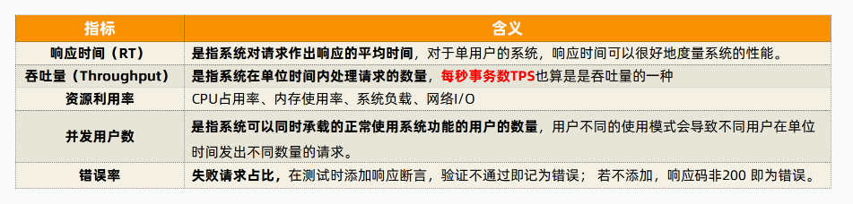

关注下图：

- **两个点：**最优用户并发数，最大并发用户数
- **三条线：**RT、Throughput、资源利用率
- **三个区：**轻负载、重负载，塌陷区
- **三种状态：**资源饱和，吞吐量下降，用户受影响

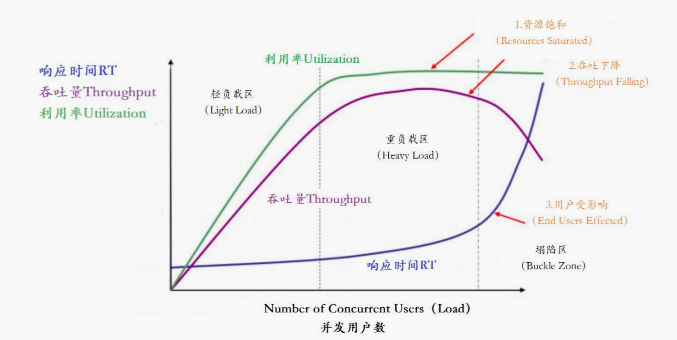

### 4 压力测试工具 JMeter


Apache JMeter 是 Apache 组织开发的基于 Java 的压力测试工具。用于对软件做压力测试，它最初被设计用于 Web 应用测试，但后来扩展到其他测试领域。 它可以用于测试静态和动态资源，例如静态文件、Java 小服务程序**、**CGI 脚本**、**Java 对象、数据库、FTP 服务器， 等等。

> 官网地址：https://jmeter.apache.org/
>
> 插件下载链接：https://jmeter-plugins.org/install/Install/

#### 4.1 压力测试步骤

**（1）新建测试计划**

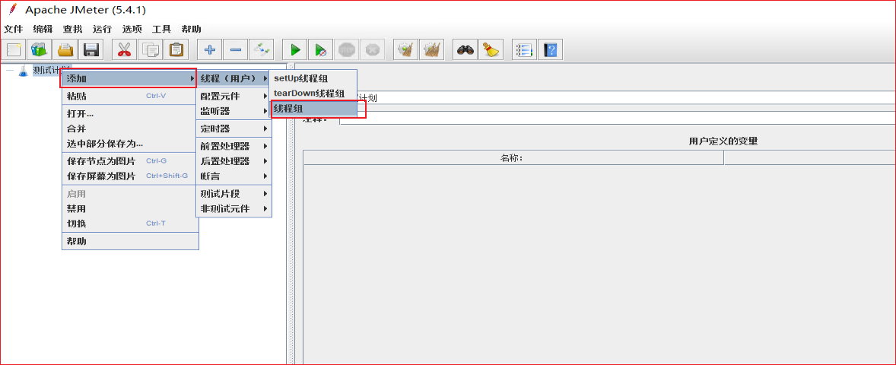

**（2）配置线程组**

具体包括：

- 线程数：20， 线程数量，这里设置了20个线程
- ramp-up：建立全部线程耗时。 如果 n=1，那就表示要在 1s 以内把 50 个线程全部启动起来。
- 循环次数：2000，表示把 20 thread 循环 2000 次，也就是说让每一个请求接口循环调用接口 2000 次

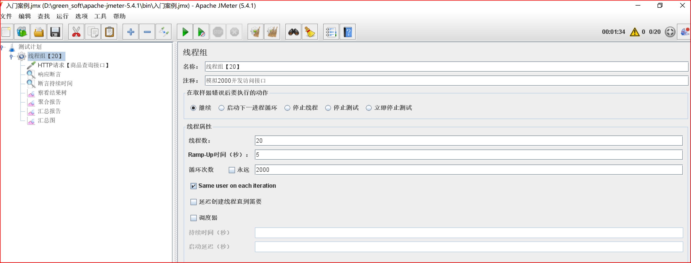

**（3）配置HTTP接口**

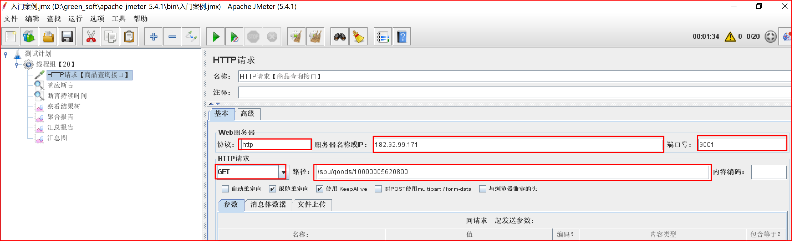

选择 `keepalive` 方式，表示使用了 **长连接**。使用长连接可以防止频繁的建立连接，关闭连接消耗性能。一般浏览器都支持 `keepalive` ，如果这里不勾选，这样我们的压测的部分性能消耗会发生在建立，关闭连接上，导致我们的压测数据不准确。

**（4）配置断言**

JMeter 断言常用有两种，一种是 **响应断言**，一种是 **响应时间断言**，如果响应内容不满足断言的配置，则认为这次的请求是失败的。

- 响应断言：判断 **响应内容** 是否包含指定的字符信息，用于判断 api 接口返回内容是否正确。
- 响应时间断言：判断 **响应时间**，是否超过预期的时间，用于判断 api 接口返回时间是否超过预期。

> 断言添加方式：右击测试计划的 http 请求，选择添加-->断言-->加 **响应断言** 和 **断言持续时间** 。 

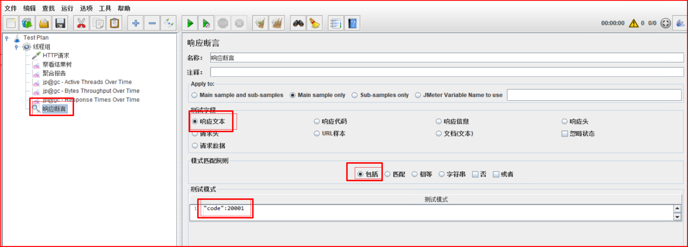

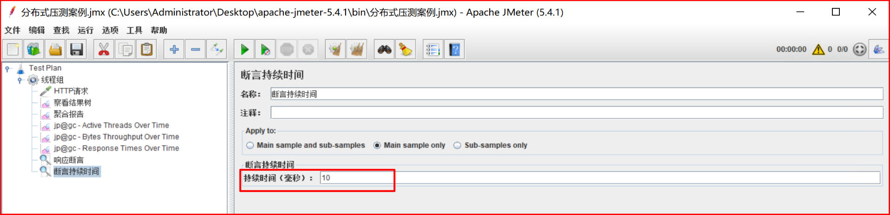

失败的例子：发起 http 请求，由于返回内容 code 值不为 20000，以及访问时间超过 10 毫秒，所以认为访问失败：

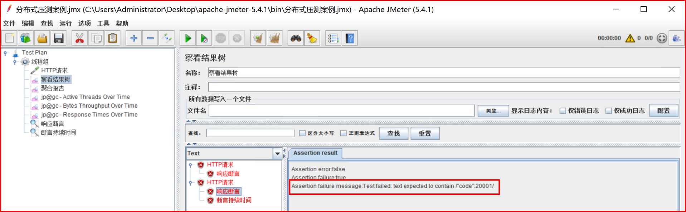

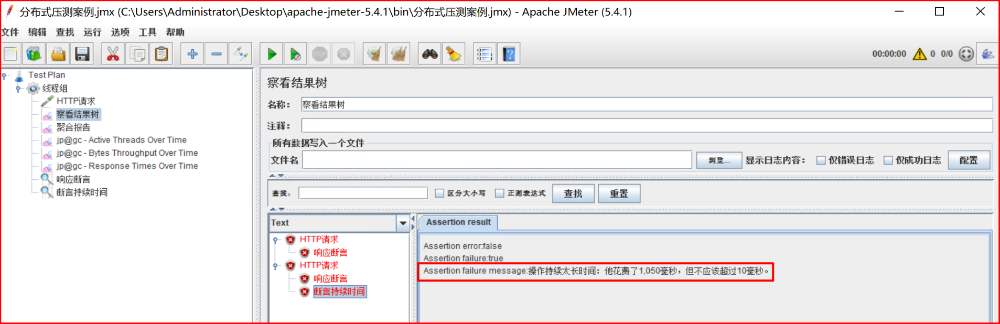

**（5）配置结果监听**

配置监听器：监听压测结果

1. **聚合报告：**查询结果信息聚合汇总，例如样本、平均值、通吐量、最大值、最小值...

2. **察看结果树：**记录每一次压测请求

3. 图像结果：分析了所有请求的平均值、终止、偏离值和通吐量之间的关系。

4. 汇总结果：汇总压测结果

5. 汇总图：将压测结果以图像形式展

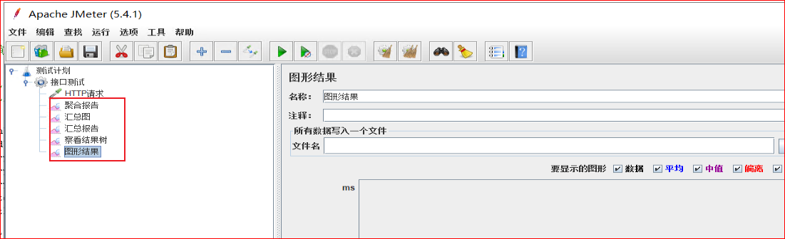

#### 4.2 压力测试结果分析

**（1）聚合报告**

- 样本（sample）: 发送请求的总样本数量
- 响应时间【单位ms】：
  - 平均值（average）：平均的响应时间
  - 中位数（median）: 中位数的响应时间，50%请求的响应时间
  - 90%百分位（90% Line）: 90%的请求的响应时间，意思就是说90%的请求是<=1765ms返回，另外10%的请求是大于等于1765ms返回的。
  - 95%百分位（95% Line）: 95%的请求的响应时间，95%的请求都落在1920ms之内返回的
  - 99%百分位（99% Line）: 99%的请求的响应时间
  - 最小值(min)：请求返回的最小时间，其中一个用时最少的请求
  - 最大值(max)：请求返回的最大时间，其中一个用时最大的请求
- 异常（error）: 出现错误的百分比，错误率=错误的请求的数量/请求的总数
- 吞吐量TPS（throughout）: 吞吐能力
- Received KB/sec----每秒从服务器端接收到的数据量
- Sent KB/sec----每秒从客户端发送的请求的数量

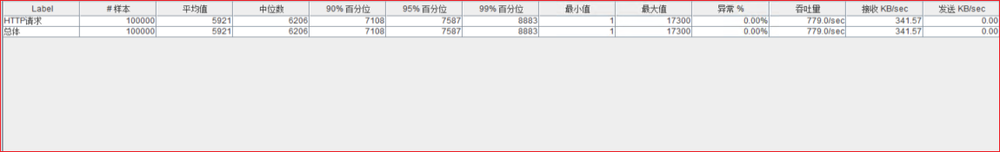

**（2）结果树**

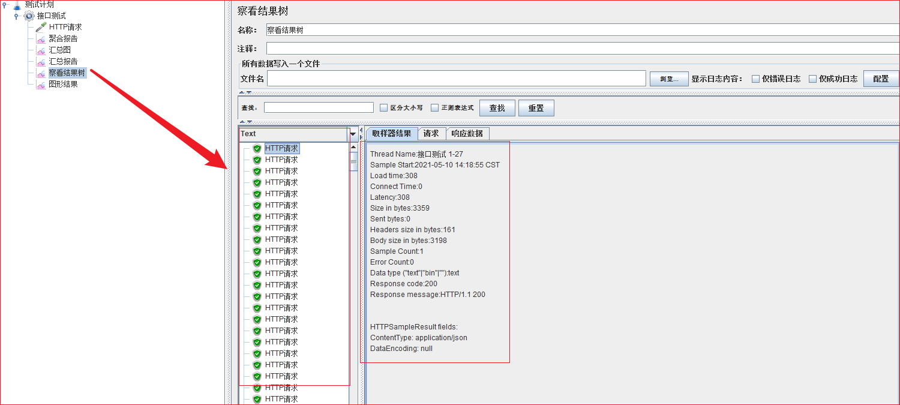

###  5 分布式压力测试

JMeter 模拟高并发场景，**单机受限内存、CPU、网络带宽**，会出现服务压力还没有上去，但是施压机先到达瓶颈！为了让 JMeter 可以施加更强大的压力，JMeter 提供分布式压测能力。


在JMeter Master节点配置 **线程数10**，**循环100次**。如果有 3 台 Salve 节点。那么每台Salve都会对被测服务发起 10x100 次请求。因此整个分布式压测集群产生的 **总样本量** 是：10 x 100 x 3 = **3000次** 。

## 三、服务容器优化

### 1 Tomcat 调优

**为什么要对 SpringBoot 嵌入式的 Web 服务器 Tomcat 进行调优？**

- 当接口响应时间比较长时，性能瓶颈主要卡在 Web 服务器中
- Tomcat 三大配置：maxThreads、acceptCount、maxConnections

**（1）maxThreads 最大线程数**

- 每一次 HTTP 请求到达 Web 服务，Tomcat 都会创建一个线程来处理该请求。
- 最大线程数决定了 Web 服务容器可以同时处理多少个请求，默认值是 200。
- RT均值很低，可以不用设置，RT均值很高，可以考虑加线程数。
- **最大线程数并不是越大越好**
  - 最大线程数只是TPS的影响因素之一，还不是最关键的哪个。
  - 增加线程是有成本的，不能无限制增大。线程过多不仅仅会带来 **线程上下文切换** 的成本，而且线程也需要消耗内存资源。
  - JVM默认Xss堆栈大小1M

**（2）acceptCount 最大等待数**

- 当调用 HTTP 请求数达到 Tomcat 的最大线程数时，还有新的请求进来，这时 Tomcat 会将该剩余请求放到等待队列中
- acceptCount 就是指 **队列能够接受的最大的等待连接数**
- 默认值是100，如果等待队列超了，新的请求会被拒绝（connection refused）

**（3）maxConnections 最大连接数**

- 最大连接数是指在同一时间内，Tomcat 能够接受的最大连接数。如果设置为-1，则表示不限制。默认值：
  - 对 BIO 模式，默认值是 Max Threads；如果使用定制的 Executor 执行器，哪默认值将是执行器中Max Threads的值。
  - **对于 NIO 模式，Max Connections 默认值是 10000**
- **Max Connections 和 accept-count 关系**：当连接数达到最大值 Max Connections 后系统会继续接收连接，但不会超过 acceptCount 限制

### 2 网络IO模型调优

众所周知 **系统文件读写性能（IO）** 是影响应用程序性能的关键因素之一。

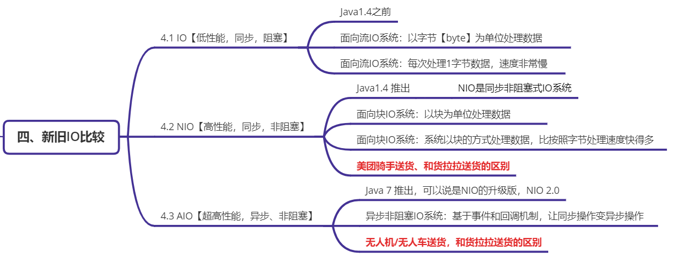

Java 的 **NIO（New IO）**是从 Java 1.4 版本开始引入的一套新的 IO API 用于替代标准的 Java IO API。NIO与原来的 IO 有同样的作用，但是使用的方式完全不同。

JDK1.7 之后 Java 对 NIO 再次进行了极大的改进，增强了对文件处理和文件系统特性的支持。我们称之为 **AIO**，也可以叫 NIO2。

```java
@Configuration 
public class TomcatConfig { 
  //自定义SpringBoot嵌入式Tomcat 
  @Bean 
  public TomcatServletWebServerFactory servletContainer() { 
    TomcatServletWebServerFactory tomcat = 
      		new TomcatServletWebServerFactory() {}; 
    tomcat.addAdditionalTomcatConnectors(http11Nio2Connector()); 
    return tomcat; 
  }
  
  //配置连接器nio2 
  public Connector http11Nio2Connector() { 
    Connector connector = 
      	new Connector("org.apache.coyote.http11.Http11Nio2Protocol"); 
    Http11Nio2Protocol nio2Protocol = 
      	(Http11Nio2Protocol) connector.getProtocolHandler(); 
    
    //等待队列最多允许1000个线程在队列中等待 
    nio2Protocol.setAcceptCount(1000); 
    // 设置最大线程数 
    nio2Protocol.setMaxThreads(1000); 
    // 设置最大连接数 
    nio2Protocol.setMaxConnections(20000); 
    //定制化keepalivetimeout,设置30秒内没有请求则服务端自动断开keepalive链接 
    nio2Protocol.setKeepAliveTimeout(30000); 
    //当客户端发送超过10000个请求则自动断开keepalive链接 
    nio2Protocol.setMaxKeepAliveRequests(10000); 
    // 请求方式 
    connector.setScheme("http"); 
    connector.setPort(9003); 
    //自定义的端口，与源端口9001 可以共用，知识改了连接器而已 
    connector.setRedirectPort(8443); 
    return connector; 
  } 
}
```

### 3 Web容器优化

Undertow 红帽公司开发的一款 **基于NIO的高性能Web嵌入式服务器** ，轻量级 Servlet 容器，比 Tomcat 更轻量级，没有可视化操作界面，没有其他诸如 JSP 模板引擎的功能，只专注于服务器部署，因此 Undertow 服务器性能略好于 Tomcat 服务器。

**SpringBoot 切换 Web 容器**：

- Spring-boot-starter-tomcat 排除 tomcat 依赖
- 导入 undertow 的 starter 依赖
- 配置 undertow

## 四、数据库调优

**为什么要进行MySQL数据库调优？**

- 提升网站整体通吐量，优化用户体验
- 后端性能优化性价比最高的一种方式

**什么影响数据库性能？**

- MySQL ：**表结构设计，效率低下的SQL语句**，超大表，大事务，数据库相关配置，数据库架构
- 服务器： OS、CPU、memory、network

**数据库调优到底调什么？**

- 优化SQL语句、数据库表结构
-  MySQL配置调优：最大连接数，连接超时，线程缓存，查询缓存，排序缓存，连接查询缓存等等
- DB服务器硬件优化：多核CPU、更大内存

## 五、OpenResty 调优

**OpenResty** 是一个基于 **Nginx 与 Lua 的高性能 Web** **平台** ，其内部集成了大量精良的 Lua  库、第三方模块以及大多数的依赖项。用于方便地搭建能够处理超高并发、扩展性极高的动态 Web 应用、Web 服务和动态网关。

OpenResty 的目标是让你的 Web 服务直接跑在 Nginx 服务内部，充分利用 Nginx 的非阻塞 I/O 模型，不仅仅对 HTTP 客户端请求,甚至于对远程后端诸如 MySQL、PostgreSQL、Memcached 以及 Redis 等都进行一致的高性能响应。

## 六、缓存调优

案例：页面上显示广告轮播图，动态查询广告接口信息

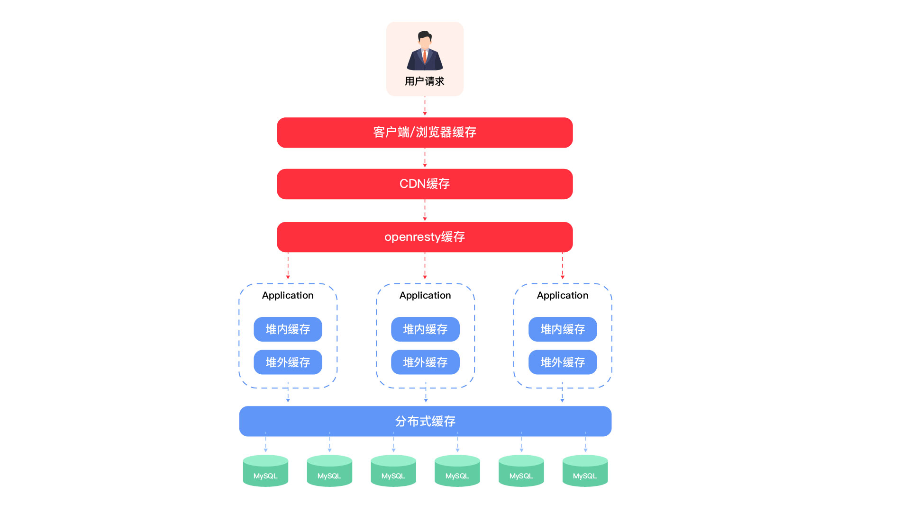

**实现方案：查询数据库**

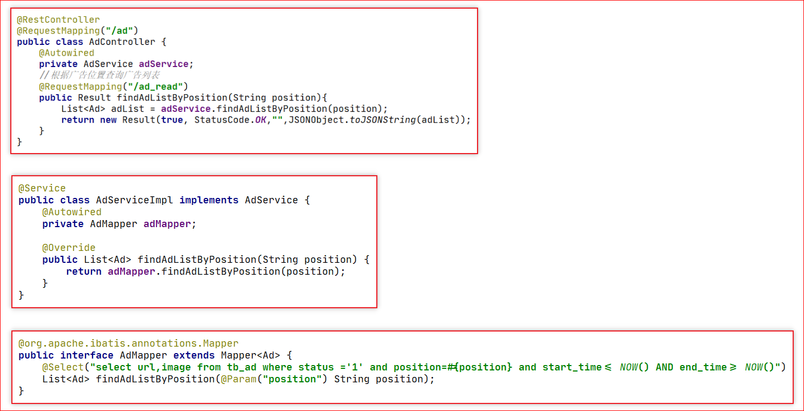

**优化方案：多级缓存**

- 编写 Lua 脚本实现 **缓存预热**（将 mysql 里的数据查询出来存入 redis ）

  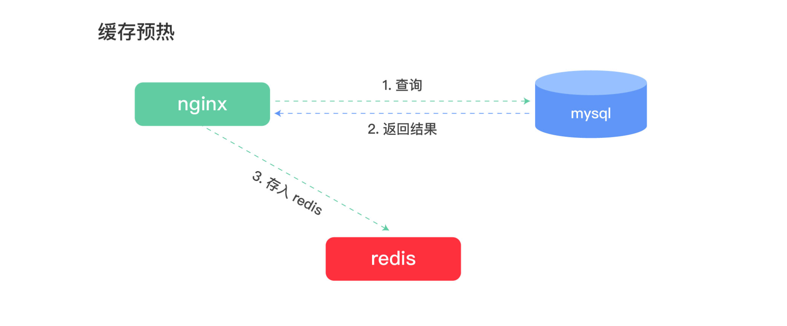

- 编写 Lua 脚本实现二级缓存读取

  

## 七、JVM 调优

**调优的最终目的都是为了应用程序使用最小的硬件消耗来承载更大的吞吐量。**

**JVM 调优主要是针对垃圾收集器的收集性能进行优化，减少 GC 的频率和 Full GC 的次数。**从而令运行在虚拟机上的应用，能够使用更少的内存，用更低的延迟，获得更大吞吐量，和减少应用的GC暂停时间！GC 暂停会在高并发场景下，P99 百分位的响应时间会产生影响。

### 1 什么时候进行 JVM 调优？

遇到以下情况，就需要考虑进行JVM调优：

1. 系统吞吐量与响应性能不高或下降

2. Heap内存（老年代）持续上涨达到设置的最大内存值

3. Full GC 次数频繁

4. GC 停顿时间过长，运行 P99  百分位响应时间；

5. 应用出现 OutOfMemory 等内存异常；

6. 应用中有使用本地缓存，且占用了大量的内存空间；

### 2 怎么进行 JVM 调优？

JVM 调优的核心是 **内存分配** + **垃圾收集** ！

- 合理分配堆内存
- GC 高效回收垃圾对象，释放内存空间


