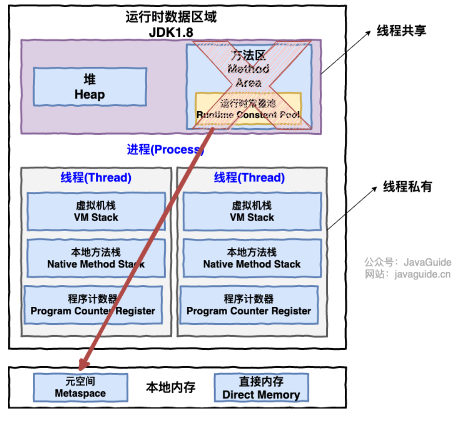
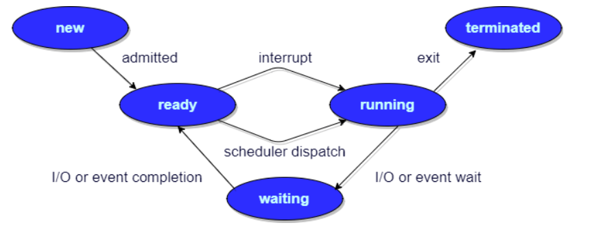

# 【八股】进程管理

## 1 进程、程序与线程概念

### 1.1 进程与程序的区别？

- 程序：通常为二进制程序，放置于存储介质中（如硬盘、光盘等），以 **物理文件** 的形式存在。
- 进程：程序触发后，执行者的权限与属性、程序代码与所需数据会被加载到内存中，操作系统给予这个内存中的单元一个标识符（PID）。可以说，**进程是一个正在运行的程序**。

### 1.2 进程与线程的区别？

线程是进程划分成的更小的 **运行单位**，一个进程在其执行的过程中可以产生多个线程。

多个线程共享进程的 **堆** 和 **方法区 (JDK1.8 之后的元空间)** 资源，但是每个线程有自己的 **程序计数器**、**虚拟机栈** 和 **本地方法栈**。

> 总的来说：
>
> - 线程和进程最大的不同在于 **基本上各进程是独立的，而各线程则不一定**，因为同一进程中的线程极有可能会相互影响。
> - 线程执行开销小，但不利于资源的管理和保护；而进程正相反。
> - 进程是 **资源分配** 的最小单位，线程是 **资源调度** 的最小单位。

## 2 进程具有哪些状态？

一般把进程大致分为 5 种状态：

- **创建状态(new)** ：进程正在被创建，尚未到就绪状态。
- **就绪状态(ready)** ：进程已处于准备运行状态，即进程获得了除了处理器之外的一切所需资源，一旦得到处理器资源(处理器分配的时间片)即可运行。
- **运行状态(running)** ：进程正在处理器上上运行(单核 CPU 下任意时刻只有一个进程处于运行状态)。
- **阻塞状态(waiting)** ：又称为等待状态，进程正在等待某一事件而暂停运行如等待某资源为可用或等待 IO 操作完成。即使处理器空闲，该进程也不能运行。
- **结束状态(terminated)** ：进程正在从系统中消失。可能是进程正常结束或其他原因中断退出运行。

## 3 进程之间有哪些常见的通信方式？

1. **管道/匿名管道(Pipes)** ：用于具有 **亲缘关系** 的父子进程间或者兄弟进程之间的通信。

   特点：**半双工**，只存在于 **内存** 的特殊文件

2. **有名管道(Named Pipes)** : 匿名管道由于没有名字，只能用于亲缘关系的进程间通信。为了克服这个缺点，提出了有名管道。有名管道严格遵循 **先进先出(first in first out)**。有名管道以 **磁盘文件** 的方式存在，可以实现本机任意两个进程通信。

3. **信号(Signal)** ：Linux系统中用于进程间互相通信或者操作的一种机制，信号可以在任何时候发给某一进程，而无需知道该进程的状态。**信号是软件层次上对中断机制的一种模拟**，是一种异步通信方式。

   > **Linux系统中常用信号：**
   >
   > - **SIGHUP：**用户从终端注销，所有已启动进程都将收到该进程。系统缺省状态下对该信号的处理是终止进程。
   > - **SIGINT：**程序终止信号。程序运行过程中，按`Ctrl+C`键将产生该信号。
   > - **SIGQUIT：**程序退出信号。程序运行过程中，按`Ctrl+\\`键将产生该信号。
   > - **SIGBUS 和 SIGSEGV：**进程访问非法地址。
   > - **SIGFPE：**运算中出现致命错误，如除零操作、数据溢出等。
   > - **SIGKILL：**用户终止进程执行信号。shell下执行`kill -9`发送该信号。

4. **消息队列(Message Queuing)** ：消息队列是消息的链表，具有特定的格式，存放在 **内核** 中并由消息队列标识符标识。

   管道和消息队列的通信数据都是 **先进先出** 的原则。与管道（无名管道：只存在于内存中的文件；命名管道：存在于实际的磁盘介质或者文件系统）不同的是 **消息队列存放在内核中，只有在内核重启（即，操作系统重启）或者显式地删除一个消息队列时，该消息队列才会被真正的删除。**

   消息队列可以实现消息的随机查询,消息不一定要以先进先出的次序读取,也可以按消息的类型读取。比 FIFO 更有优势。**消息队列克服了信号承载信息量少，管道只能承载无格式字 节流以及缓冲区大小受限等缺点。**

5. **信号量(Semaphores)** ：信号量是一个计数器，用于多进程对共享数据的访问，信号量的意图在于 **进程间同步**。这种通信方式主要用于 **解决与同步相关的问题并避免竞争条件**。

6. **共享内存(Shared memory)** ：使得 **多个进程可以访问同一块内存空间**，不同进程可以及时看到对方进程中对共享内存中数据的更新。这种方式需要依靠某种 **同步操作**，如互斥锁和信号量等，来达到进程之间的同步和互斥。可以说这是最有用的进程间通信方式。

   > 如：`mmap()` 系统调用通过共享内存实现零拷贝。`mmap()` 系统调用使得进程之间通过映射同一个普通文件实现共享内存。普通文件被映射到进程地址空间后，进程可以像访问普通内存一样对文件进行访问，不必再调用 `read()`，`write()`等操作。

7. **套接字(Sockets)** : 此方法主要用于在客户端和服务器之间通过网络进行通信。套接字是支持 TCP/IP 的网络通信的 **基本操作单元**，可以看做是不同主机之间的进程进行 **双向通信** 的端点，简单的说就是通信的两方的一种约定，用套接字中的相关函数来完成通信过程。

