# 【MySQL】InnoDB存储引擎

## 1 存储引擎的种类

常见的有三种：

|  存储引擎  | 说明                                                         |
| :--------: | ------------------------------------------------------------ |
| **InnoDB** | 5.5 版本后 MySQL 的 **默认数据库存储引擎，支持事务和行级锁** ，比 MyISAM 处理，速度稍慢 |
| **MyISAM** | 高速引擎，拥有较高的插入，查询速度，**但不支持事务**         |
| **Memory** | **内存存储引擎，拥有极高的插入，更新和查询效率** 。只在内存上保存数据意味着数据可能会丢失。 |

归纳为一句话：**除非需要用到某些 InnoDB 不具备的特性，并且没有其他办法可以替代，否则都应该选择 InnoDB 引擎。**

> 也就是说，大部分情况下都选择 InnoDB。

InnoDB 和 MyISA 存储引擎区别：

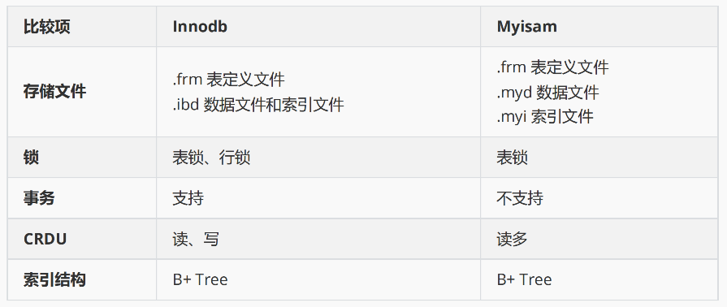

## 2 InnoDB架构

主要分为两部分：

- **内存结构**
  - Buffer Pool 缓冲池
  - Change Buffer 修改缓冲
  - Adaptive Hash Index 自适应哈希索引
  - Log Buffer 日志缓冲
- **磁盘结构**
  - 系统表空间（重要）
  - 独立表空间（重要）
  - 通用表空间
  - 临时表空间
  - ....

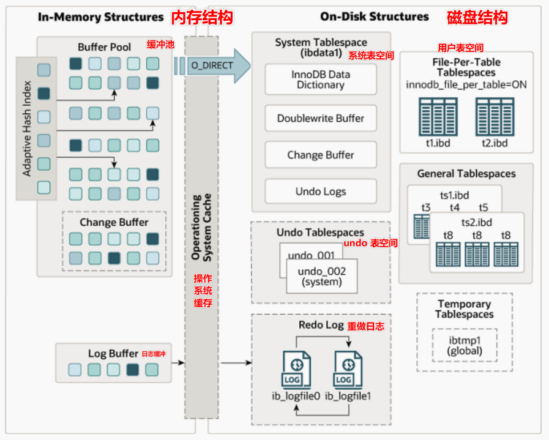

### 2.1 InnoDB内存结构

#### 缓冲池 Buffer Pool

- 缓冲池 Buffer Pool 用于加速数据的访问和修改。
- 默认大小 128 M
- 缓存数据到内存，最大限度地减少磁盘 IO，加速 **热点数据** 的读和写
- 使用 **LRU 算法（最近最久未使用）**淘汰非热点数据页
  - LRU：根据页数据的历史访问来淘汰数据，如果数据最近被访问过，那么将来访问的几率也更高，优先淘汰最近没有被访问到的数据

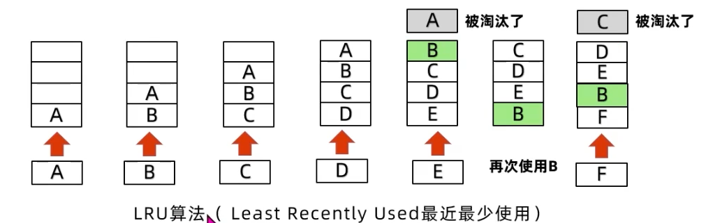

- Buffer Pool 中的数据以 **页** 为存储单位，数据结构是 **单链表**
- 对于 Buffer Pool 中数据的「查询」，InnoDB 直接读取返回；
- 对于 Buffer Pool 中数据的「修改」，**InnoDB 直接在 Buffer Pool 中修改，并将修改写入 `redo Log` 中，当数据页被 LRU 算法淘汰时写入磁盘，若持久化前系统崩溃，则在重启后使用 `redo Log` 进行恢复。**

> 补充：【缓存置换策略】
>
> - FIFO：先进先出
>   - 先进入缓存的优先被淘汰
>   - 简单的策略，但命中率低
> - **LRU：最近最久未使用**
>   - 每次访问数据都放在队头，从队尾淘汰数据
> - LFU：最近最少使用
>   - 利用额外的空间记录每个数据的使用频率，选出最低频率的数据淘汰
> - MRU：最近最常使用
>   - 优先移除最近最常使用的条目
>   - 擅长处理一个条目越久，越容易被访问的情况

#### 修改缓冲 Change Buffer

Change Buffer（在 MySQL 5.6 之前叫 insert buffer，简称 ibuf ）是 InnoDB 5.5 引入的一种优化策略。**Change Buffer 用于加速 非热点数据 中二级索引的写入操作。** 由于二级索引数据的不连续性，导致修改二级索引时需要进行频繁的磁盘 IO 消耗大量性能，Change Buffer 缓冲对二级索引的修改操作，同时将写操作录入 `redo log` 中，在缓冲到一定量或系统较空闲时进行 merge 操作将修改写入磁盘中。Change Buffer 在系统表空间中有相应的持久化区域。

> 二级索引：非主键的索引

- 用于加速 **非热点数据** 中 **二级索引的写入** 操作
- 修改缓冲对二级索引的修改操作会录入 **redo log** 中
- 在缓冲到一定量或系统比较空闲的时候，进行 merge 操作（写入磁盘）
- 修改缓冲在系统表空间中有相应的持久化区域
- 其物理结构为一棵名为 `ibuf` 的 B+ 树

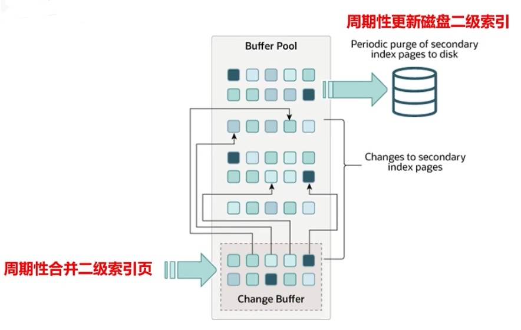

#### 自适应哈希索引 Adaptive Hash Index

自适应哈希索引（AHI），用于实现对 **热数据页** 的一次查询，**是建立在索引之上的索引**。

使用聚簇索引进行数据页定位的时候需要根据索引树的高度从根节点走到叶子节点，通常需要 3 到 4 次查询才能定位到数据。InnoDB 根据对索引使用情况的分析和索引字段的分析，通过 **自调优 Self-tuning** 的方式为索引页建立或者删除哈希索引。

- 作用：对频繁查询的数据页和索引页进一步提速
- AHI 大小为 Buffer Pool 的 1/64
- 如果 **二级索引** 命中 AHI：
  - 从 AHI 中获取索引页记录指针，再根据主键沿着聚簇索引查找数据
- 如果 **聚簇索引** 命中 AHI：
  - 直接返回目标数据页的记录指针，根据记录指针可以直接定位数据页

> 「聚簇索引」是 **物理有序** 的；「非聚簇索引」是 **逻辑有序，物理无序**。
>
> 在 mysql 中 **数据存储顺序就是聚簇索引的顺序**，所以一个表只有一个聚簇索引，其他索引都是非聚簇的。

#### 日志缓冲 Log Buffer

**InnoDB** **使用** **Log Buffer** **来缓冲日志文件的写入操作。**

**内存写入** 加上 **日志文件顺序** 写的特点，使得 InnoDB 日志写入性能极高。

对于任何修改操作，都将录入诸如 `redo log` 与 `undo log` 这样的日志文件中，因此日志文件的写入操作非常频繁，却又十分零散。这些文件都存储在磁盘中，因此日志记录将引发大量的磁盘 IO。

Log Buffer 将分散的写入操作放在内存中，通过 **定期批量写入磁盘** 的方式提高日志写入效率和减少磁盘 IO。

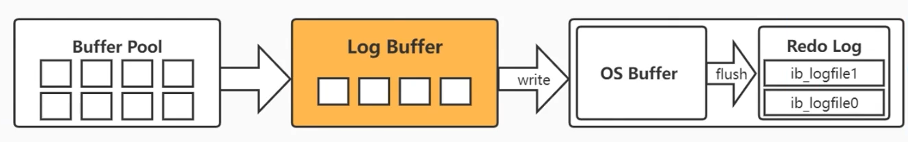

> 注意：这种将分散操作 改为 批量操作的优化方式将增加数据丢失的风险！

### 2.2 InnoDB磁盘结构

在磁盘中，InnoDB 存储引擎将 **数据、索引、表结构和其他缓存信息等** 存放的空间称为 **表空间（Tablespace）**，它是 **物理存储中的最高层**，由 `段Segment、区Extent、页Page、行Row` 组成。

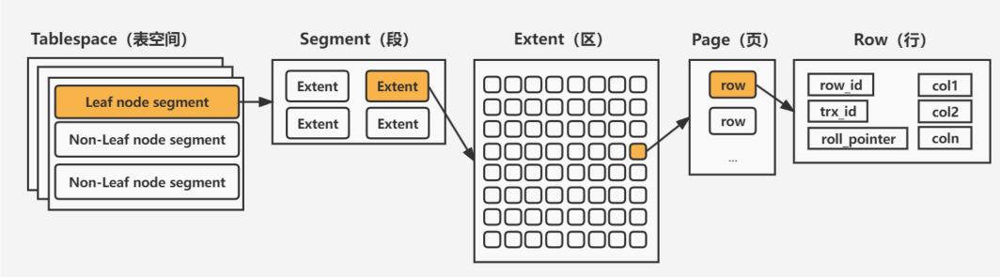

目前的表空间类别包括：

- **系统表空间（System Tablespace）**，关闭独立表空间，所有表数据和索引都会存入系统表空间
- **独立表空间（File-per-table Tablespace）**，开启独立表空间，每张表的数据都会存储到一个独立表空间
- 通用表空间（General Tablespace）
- 回滚表空间（Undo Tablespace）
- 临时表空间（The Temporary Tablespace）

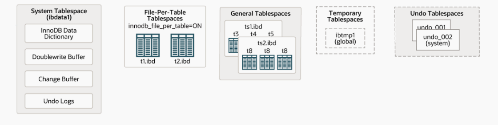

#### 系统表空间

系统表空间是 InnoDB **数据字典、双写缓冲、修改缓冲** 和 **回滚日志** 的存储位置。

如果关闭独立表空间，它也将存储所有的表数据和索引。

它默认下是一个初始大小 **12MB**，名为 `ibdata1` 的文件，系统表空间所对应的文件由 `innodb_data_file_path` 定义。

- **数据字典**：数据字典是由各种 **表对象** 的元数据信息（表结构、索引、列信息等）组成的 **内部表**
- **双写缓冲（Doublewrite Buffer）**：双写缓冲用于 **保证写入磁盘时页数据的完整性** ，防止发生部分写失效问题
- **修改缓冲（Change Buffer）**： 内存中 Change Buffer 对应的持久化区域
- **回滚日志（Undo Log）**：实现事务进行回滚 操作时对数据的恢复。是实现 **多版本并发控制（MVCC）** 重要组成

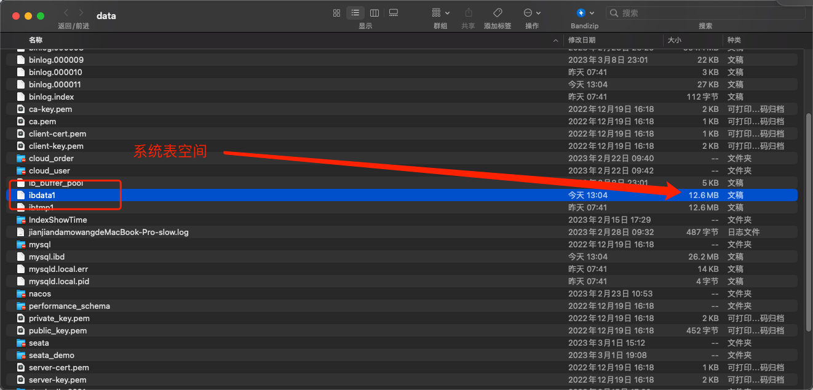

#### 独立表空间

> 在 MySQL 5.7 后，默认开启独立表空间。

**独立表空间用于存放 每个表的数据、索引和插入缓冲** **Bitmap** **页。**

其他类型的信息，如：回滚信息、插入缓冲索引页、系统事务信息、二次写缓冲等 **仍存放于系统表空间** 内。因此即使用了独立表空间，系统表空间也会不断增长。 

开启独立表空间（File-per-table TableSpace）（ `innodb_file_per_table=ON` ）之后：

- **InnoDB 会为每个数据库单独创建子文件夹**
- 数据库文件夹内为每个数据表单独建立一个表空间文件 `table.ibd`
- 同时创建一个 `table.frm` 文件用于保存表结构信息

每个独立表空间的初始大小是 **96KB** 。

在每个文件夹内：

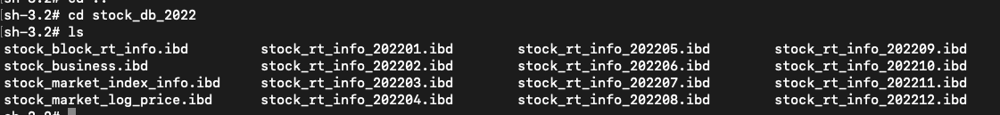

> 因为我是 mysql8，因此没有 `.frm` 文件。

#### 通用表空间

通用表空间（General Tablespace）是一个由 `CREATE TABLESPACE` 命令创建的共享表空间，创建时必须指定该表空间名称和 ibd 文件位置，ibd 文件可以放置于任何 MySQL 有权限的地方。该表空间内可以容纳多张数据表，同时在创建时可以指定该表空间所使用的默认引擎。

**通用表空间存在的目的是为了在系统表空间与独立表空间之间作出平衡**。系统表空间与独立表空间中的表可以向通用表空间移动，反之亦可，但系统表空间中的表无法直接与独立表空间中的表相互转化。（桥梁作用）

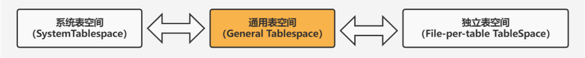

#### 回滚表空间

Undo TableSpace 用于存放一个或多个 undo log 文件。

**默认** **undo log** 存储在系统表空间中，**MySql 5.6** **以后支持自定义** **Undo log** **表空间并存储所有** **undo log**。一旦用户定义了 Undo Tablespace，则系统表空间中的 Undo log 区域将失效。对于 Undo Tablespace 的启用必须在 MySQL 初始化前设置，Undo Tablespace 默认大小为 10MB。Undo Tablespace 中的 Undo log 表可以进行 truncate 操作。

#### 临时表空间

MySQL 5.7 之前临时表存储在系统表空间中，这样会导致 ibdata 在使用临时表的场景下疯狂增长。**5.7 版本之后** **InnoDB** **引擎从系统表空间中抽离出临时表空间（Temporary Tablespace），用于独立保存临时表数据及其回滚信息**。该表空间文件路径由 innodb_temp_data_file_path 指定，但必须继承 innodb_data_home_dir 。

### 2.3 磁盘文件的存储结构

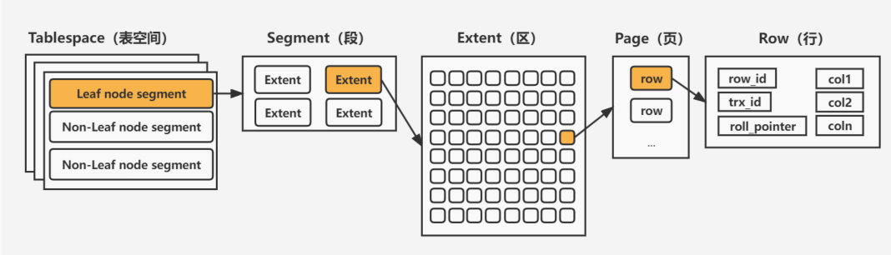

表空间由 **段、区、页、行** 组成。

#### 段（Segment）

**表空间由各个段（Segment）组成，创建的段类型分为「数据段、索引段、回滚段」等**。由于 InnoDB 采用聚簇索引与 B+ 树的结构存储数据，所以事实上数据页和二级索引页仅仅只是 B+ 树的叶子节点，因此数据段称为 Leaf node segment，**索引段其实指的是** **B+** **树的非叶子节点，称为** **Non-Leaf node segment**。一个段会包含多个区，至少会有一个区，段扩展的最小单位是区。

- **数据段** 称为 `Leaf node segment`
- **索引段** 称为 `Non-Leaf node segment`

#### 区（Extent）

区（Extend）是由连续的页组成的空间，大小固定为 **1MB** ，由于默认页大小为 **16K** ，因此一个区默认存储 **64** 个连续的页。

如果页大小调整为 4K，则 256 个连续页组成一个区。**为了保证页的连续性，InnoDB** **存储引擎会一次从磁盘申请** **4 ~ 5** **个区**。

- 区是由连续的页组成的空间，大小固定为 1MB
- 默认页大小为 16K，所以默认一个区有 64 个页
- 为了保证区的连续性，一般会从磁盘申请 4-5 个区

#### 页（Page）

页（Page）是 **InnoDB** **的基本存储单位**，每个页大小默认为 16K，从 InnoDB1.2.x 版本开始，可通过设置 `innodb_page_size` 修改为 `4K、8K、16K` 。InnoDB 首次加载后便无法更改。

- 页是 InnoDB 的基本存储单位，页默认大小是 16K（可 `innodb_page_size` 进行修改），InnoDB 首次加载后便无法更改
- **操作系统「读写磁盘最小单位」是 页，4K**，正正好好是 InnoDB 默认的 1/4
- 

> Linux 管理磁盘的最小单位也是页，是操作系统读写磁盘的最小单位。
>
> **Linux 中页大小一般是 4K，正好是磁盘扇区的 8 倍，也是 InnoDB 页的 1/4**。所以 InnoDB 从磁盘中读取一个数据页时，操作系统会分 4 次从磁盘文件中读取数据到内存。写入也是一样的，需要分 4 次从内存写入到磁盘中。
>
> 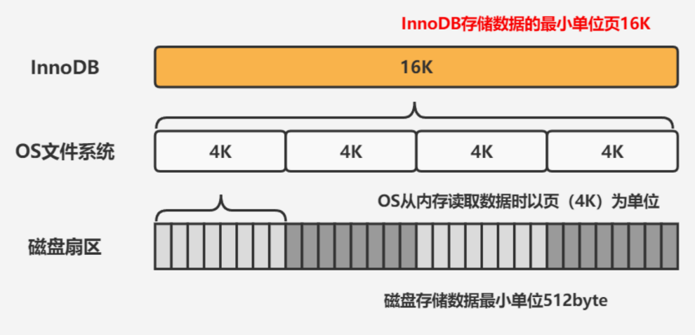

#### 行（Row）

InnoDB 的数据是以行为单位存储的，1个页中包含多个行。在 MySQL5.7 中，InnoDB 提供了 4 种行格式：Compact、Redundant、Dynamic 和 Compressed行格式，`Dynamic` 为 MySQL5.7 默认的行格式。

### 2.4 脏页落盘

#### 什么是脏页？

对数据的 **修改操作** ，首先修改 **内存结构** 中的缓冲区的页，缓冲区的页与磁盘中页的数据不一致，因此称缓冲区中的页为 **脏页** 。 

#### 脏页如何进入到磁盘？

脏页从缓冲区刷新到磁盘，并不是每次更新后就触发， 而是通过 **CheckPoint 机制** 刷新磁盘！

#### InnoDB 数据落盘流程

在数据库中进行**「读取操作」**，将磁盘中读到的页放在缓冲区中，下次再读取相同的页时，首先判断该页是否在缓冲区中。若在缓冲区中，称该页在缓冲区中命中，直接读取该页；否则读取磁盘上的页。

在数据库中进行**「修改操作」**，首先修改在缓冲区中的页，然后再以一定频率刷新到磁盘上。页从缓冲区刷新到磁盘的操作并不是在每次页发生更新时都出发，而是通过一种称为 **CheckPoint** 机制刷新回磁盘。

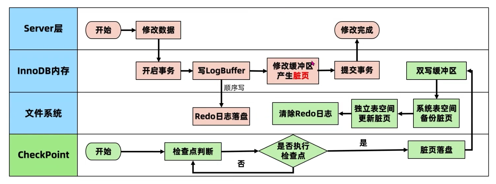

> 内存数据落盘要考虑的核心问题：**高性能地写入数据，同时保证数据的绝对安全性！**
>
> - **如何保证写入性能？**
>
>   把写入操作放在内存中，通过定期批量写入磁盘的方式提高写入效率，减少磁盘IO
>
> - **如何持久化？**
>
>   - 通过 **CheckPoint 机制** 进行脏页落盘
>   - **日志先行**，所有操作之前，先写 Redo Log 日志
>
> - **数据安全性怎么保证？**
>
>   - 记录操作日志：**Force Log at Commit 机制** 和 **Write Ahead Log（WAL）机制**
>   - CheckPoint 机制
>   - Double Write 机制

#### 为什么不是每次更新都直接写入磁盘？

如果每次页的变化都写入磁盘，**一个页落盘必然伴随着 4 次 IO，性能开销极大**，而且伴随着写入操作的次数增加，性能开销指数级增长。

当然，数据也不能在内存中保存太长时间，**时间越久安全性风险越高！**

> 重新回顾一下，Mysql 中页的大小是 16K，而 Linux 中页大小为 4K，所以至少 4 次 IO。

InnoDB 采用 **Write Ahead Log 策略** 和 **Force Log at Commit 机制** 实现事务的持久性：

- **Write Ahead Log 策略** ：日志先行，数据变更写入磁盘之前，必须将内存中的日志缓存写入磁盘
- **Force Log at Commit 机制** ：当事务提交时，所有事务产生的日志都必须刷到磁盘

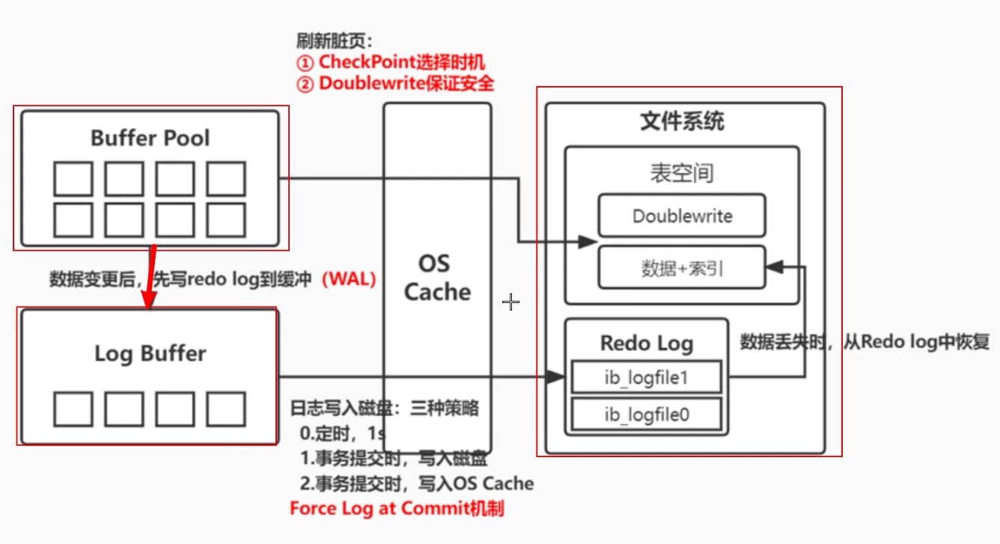

#### 如何保证日志安全地进入磁盘？

为了确保日志写入磁盘，将 redo log 日志写入 Log Buffer 后调用  `fsync` 函数，将缓存日志文件从 OS Cache 中写入磁盘。Mysql 提供了三种策略：

- **定时策略（0）：每秒写入，与事务无关**

  - 最多丢失 1s 的事务操作

  - 写入效率最高，安全性最低

- **事务提交时，写入磁盘（默认策略，1）**
  - 不会丢失任何数据
  - 写入效率最低，安全性最高
- **事务提交时，写入 OS Cache（2）**
  - 数据安全性依赖于操作系统，最多丢失 1s 的事务操作
  - 写入效率居中，安全性居中

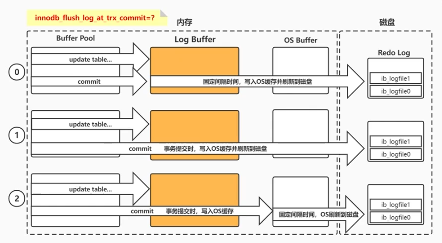

#### CheckPoint 机制

**CheckPoint 机制是将缓冲中的脏页数据刷到磁盘上的机制**，决定了脏页落盘的时机、条件和脏页的选择等。

CheckPoint 的类型不只一种：

- **sharp checkpoint**：关闭数据库时，将脏页全部刷新到磁盘中
- **fuzzy checkpoint**：默认方式，在运行时选择不同时机进行脏页落盘，只刷新部分脏页
  - **Master Thread CheckPoint**：固定频率刷新部分脏页数据到磁盘，异步操作，不会阻塞用户线程
  - **FLUSH_LRU_LIST CheckPoint**：缓冲池淘汰非热点 Page，如果该 Page 是脏页，则会执行 CheckPoint
  - **Dirty Page Too Much CheckPoint**：脏页占比太多，强行刷盘，阈值 `75%` 

CheckPoint 的作用：

- **脏页落盘**：避免数据更改直接操作磁盘
- **缩短数据库的恢复时间**：数据库宕机时，不需要重做所有的 redo 日志，大大缩短了恢复时间
- **缓冲池不够用时，将脏页刷新到磁盘**：Buffer Pool 不够用时，溢出页落盘，LRU 淘汰非热点数据
- **redo 日志不可用时，刷新脏页**：日志文件可以循环使用，不会无限增长

#### Double Write 机制

**脏页大小 16K，如果只写了 8K 系统就发生故障了**，会怎么样？

这个问题被称为 **部分写（写失效）问题** ，是 redo log 无法解决的！为了解决这个问题，所以才需要双写（Double Write 机制）。

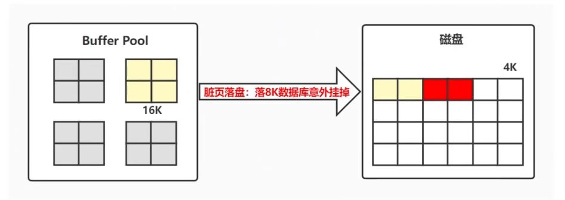

Double Write 其实就是写了两次，在修改记录日志 redo log 之前，先做个副本留个“备胎”。

> **redo log 无法解决写失效问题，因为它记录的是对页的修改记录，而不是页的数据本身。**

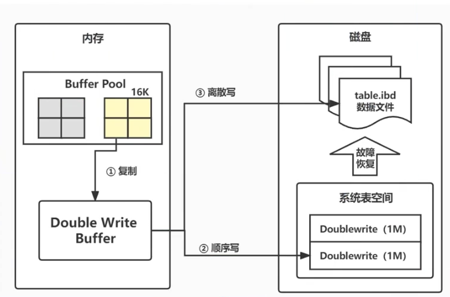

Double Write Buffer 主要分为两部分：

- **内存中**，大小为 `2MB`
- **磁盘的系统表空间中**，大小为 `2MB` ，2 个区，128 个页

**Double Write 崩溃恢复过程**：

- 首先找到系统表空间中的 Double Write 区域对应的页副本数据
- 然后将其复制到独立表空间
- 最后应用 redo log 日志

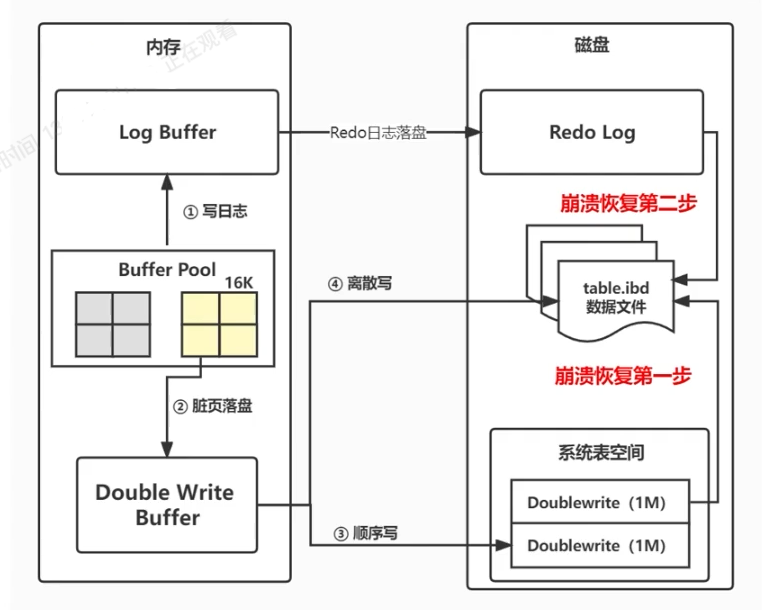

