# 【MySQL】事务

## 1 基本介绍

### 1.1 什么是事务？

事务指的是逻辑上的一组操作，这组操作的组成单元 **要么全部成功，要么全部失败** 。

- 事务本质上是一个**「并发编程」**问题
- 事务由存储引擎实现，**MySQL 中只有 InnoDB 支持事务**

MySQL 是一个服务器／客户端架构的软件，对于同一个服务器来说，可以有若干个客户端与之连接，每个客户端与服务器连接上之后，就可以称之为一个**「会话（ Session ）」** 。我们可以同时在不同的会话里输入各种语句，这些语句可以作为事务的一部分进行处理。不同的会话可以同时发送请求，也就是说 **服务器可能同时在处理多个事务，这样子就会导致「不同」的事务可能同时访问到「相同」的记录** 。

### 1.2 事务的四大特性

数据库事务具有 ACID 四大特性。ACID 是以下4个词的缩写：

- **原子性（Atomicity）：**  原子性是指事务是一个不可分割的工作单位，事务中的操作要么都发生，要么都不发生。
- **一致性（Consistency）：**  事务前后数据的完整性必须保持一致。
- **隔离性（Isolation）：** 多个用户并发访问数据库时，一个用户的事务不能被其它用户的事务所干扰，多个并发事务之间数据要相互隔离。**隔离性由隔离级别保障！**
- **持久性（Durability）：**  一个事务一旦被提交，它对数据库中数据的改变就是永久性的，接下来即使数据库发生故障也不应该对其有任何影响。

### 1.3 事务并发问题

主要有三个问题：

- **脏读** ：一个事务读到了另一个事务 **未提交** 的数据。
- **不可重复读** ：一个事务读到了另一个事务 **已经 Update** 的数据，引发事务中的多次查询结果不一致
- **幻读** ：一个事务读到另一个事务 **已经 Insert** 的数据，导致事务多次查询的结果不一致

### 1.4 事务的隔离级别

隔离级别的类别：

- **读未提交（Read Uncommitted）** ：一个事务读到另一个事务没有提交的数据
  - 存在三个问题：脏读、幻读、不可重复读
- **读已提交（read Committed）** ：一个事务读到另一个事务已经提交的数据
  - 存在两个问题：不可重复读、幻读
  - 解决一个问题：脏读
- **可重复读（Repeatable Read）** ：在一个事务中读到的数据始终保持一致，无论另一个事务是否提交
  - 存在一个问题：幻读
  - 解决两个问题：脏读、不可重复读
  
- **串行化（serializable）** ：同时只能执行一个事务，相当于 **事务中的单线程**
  - 解决三个问题：脏读、幻读、不可重复读

安全与性能对比：

- 安全性：` serializable > repeatable read > read committed > read uncommitted`
- 性能 ：` serializable < repeatable read < read committed < read uncommitted`

常见数据库的默认隔离级别：

- Mysql：Repeatable Read
- Orcale：read Committed

## 2 一条插入Insert语句执行流程

```sql
CREATE TABLE `tab_user` (
  `id` int(11) NOT NULL, 
  `name` varchar(100) DEFAULT NULL, 
  `age` int(11) NOT NULL, 
  `address` varchar(255) DEFAULT NULL, 
  PRIMARY KEY (`id`) 
) ENGINE=InnoDB;
```

插入语句：

```sql
Insert into tab_user(id,name,age,address) values (1, '刘备', 10, 蜀国);
```

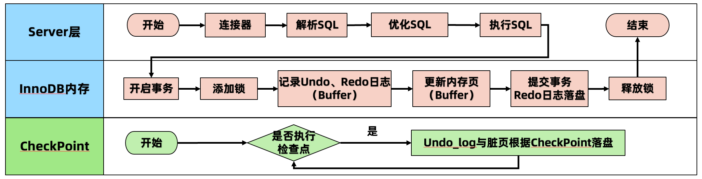

### 2.1 丢失更新问题

**「两个事务」**针对**「同一数据」**进行**「修改操作」**时会丢失更新，这个现象称之为**「丢失更新」**问题。

> 举个栗子：管理者查询所有用户的存款总额，假设除了用户01和用户02之外，其他用户的存款都为0，用户01、02各有存款1000，所以所有用户的存款总额为2000。但是在查询过程中，用户01会向用户02进行转账操作。

转账和查询总额操作的时序图如下：

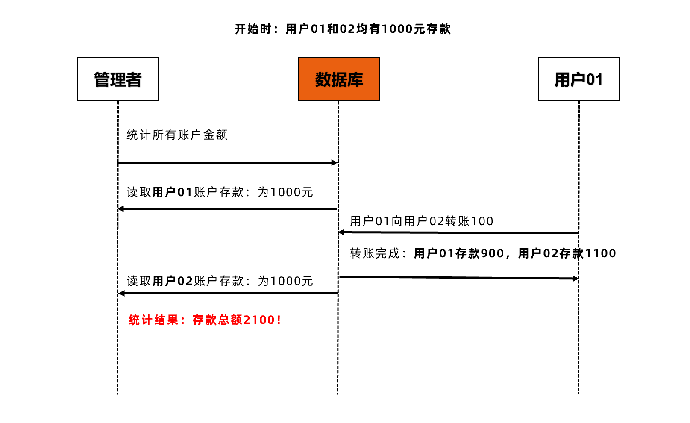

### 2.2 解决方法一：基于锁的并发控制

> LBCC：行锁

使用 **基于锁的并发控制 LBCC（Lock Based Concurrency Control）**可以解决上述问题。

查询总额事务会对 **读取的「行」加锁，等到操作结束后再释放「所有行」上的锁** 。因为用户 A 的存款被锁，导致转账操作被阻塞，直到查询总额事务提交并将所有锁都释放。

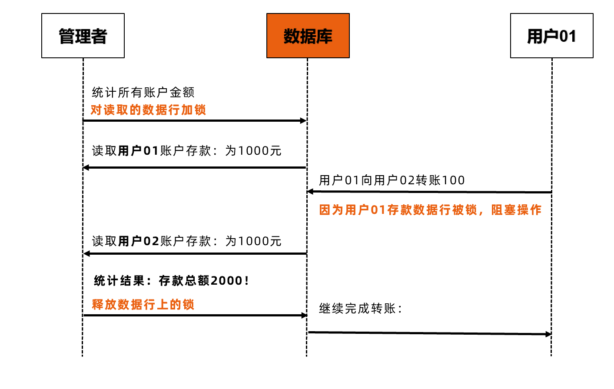

这种方案比较简单粗暴，**就是一个事务去读取一条数据的时候，就上锁，不允许其他事务来操作**。

假如当前事务只是加 **读锁**，那么其他事务就不能有 **写锁**，也就是不能修改数据；而假如当前事务需要加 **写锁**，那么其他事务就不能持有任何锁。总而言之，能加锁成功，就确保了除了当前事务之外，其他事务不会对当前数据产生影响，所以自然而然的，当前事务读取到的数据就只能是 **最新** 的，而不会是 **快照** 数据。

致命问题：性能差！

### 2.3 解决方法二：基于版本的并发控制

> MVCC：读不加锁、读写不冲突

使用 **多版本的并发控制 MVCC（Multi Version Concurrency Control）机制** 也可以解决这个问题。

查询总额事务先读取了用户 A 的账户存款，然后转账事务会修改用户 A 和用户 B 账户存款，查询总额事务读取用户 B 存款时不会读取转账事务修改后的数据，而是 **读取本事务开始时的副本数据「快照数据」**。

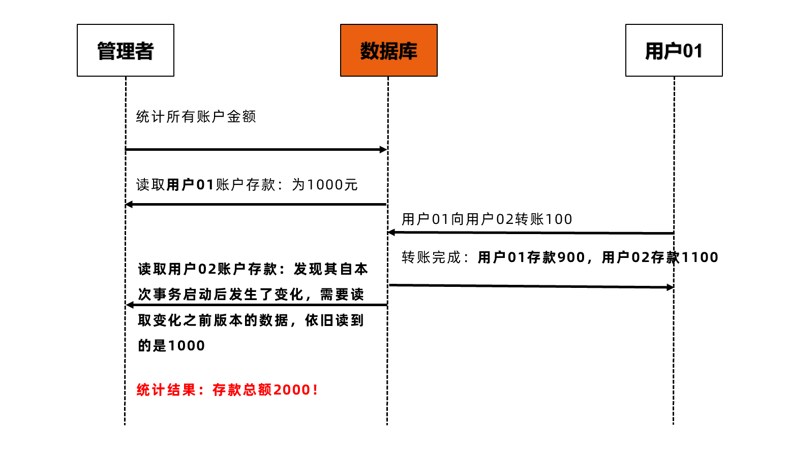

**MVCC 使得普通的 Select 请求不加锁，读写不冲突，显著提升了数据库的并发处理能力。**

伴随着 MVCC，存在着两个问题：

1. 数据存在什么地方？
   - `Undo Log`

2. 怎么判断数据是历史的？
   - ReadView

## 3 MVCC 的实现原理

首先来看一下 MVCC 的定义：

> **Multiversion concurrency control (MVCC)** is a concurrency control method commonly used by database management systems to provide concurrent access to the database and in programming languages to implement transactional memory.

**MVCC 全称叫多版本并发控制，是 RDBMS 常用的一种并发控制方法，用来对数据库数据进行并发访问，实现事务。** 

核心思想是 **读不加锁，读写不冲突** 。在读多写少的 OLTP 应用中，读写不冲突非常重要，极大的增加了系统的并发性能，这也是为什么几乎所有的RDBMS，都支持MVCC的原因。

**MVCC** **实现原理关键在于「数据快照」，「不同的事务」访问「不同版本」的数据快照，从而实现事务下对数据的隔离级别。** 虽然说具有多个版本的数据快照，但这并不意味着必须拷贝数据，保存多份数据文件（这样会浪费存储空间），InnoDB 通过事务的 Undo 日志巧妙地实现了多版本的数据快照。

MVCC 的实现依赖于 **Undo 日志** 与 **Read View** 。

InnoDB 下的表有 **默认字段** 和 **可见字段** ，默认字段是实现 MVCC 的关键，默认字段是隐藏的列。默认字段最关键的两个列，**一个保存了行的事务ID，一个保存了行的回滚指针** 。每开始新的事务，都会 **自动递增** 产生一个新的事务 id。事务开始后，生成当前事务影响行的 ReadView。当查询时，需要用当前查询的事务 id 与 ReadView 确定要查询的数据版本。

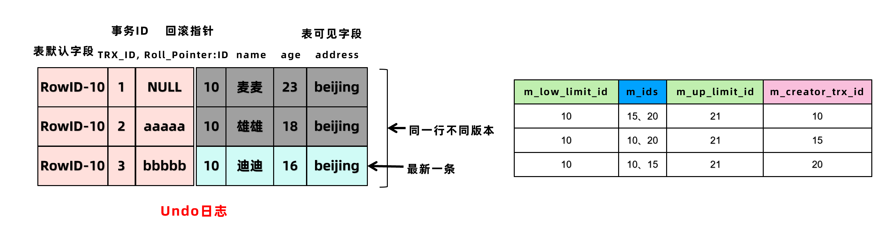

### 3.1 Undo 日志

Redo 日志记录了事务的行为，可以很好地通过其对页进行“重做”操作。但是事务有时还需要进行回滚操作，这时就需要 undo。 **因此在对数据库进行修改时，InnoDB 存储引擎不但会产生 Redo，还会产生一定量的 Undo** 。这样如果用户执行的事务或语句由于某种原因失败了，又或者用户用一条 Rollback 语句请求回滚，就可以利用这些 undo 信息将数据回滚到修改之前的样子。在多事务读取数据时，有了 Undo 日志可以做到读不加锁，读写不冲突。

Undo 存放在数据库内部的一个特殊段（segment）中，这个段称为 **Undo 段（undo segment）**。Undo 段位于 **系统表空间** 内，也可以设置为 Undo 表空间。

Undo 日志保存了记录修改前的快照。所以，对于更新和删除操作，**InnoDB 并不是真正的删除原来的记录**，而是设置记录的 `delete mark` 为 1。因此为了解决数据 Page 和 Undo 日志膨胀问题，则需要回收机制进行清理 Undo 日志。

根据行为的不同 Undo 日志分为两种：

-  `Insert Undo Log` 
- `Update Undo Log` 

#### Insert Undo Log：在 Insert 操作中产生的 Undo 日志

Insert 操作的记录只对事务本身可见，对于其它事务此记录是不可见的，所以 **Insert Undo Log 可以在事务提交后直接删除** 而不需要进行回收操作。

```sql
# 事务1： 
Insert into tab_user(id,name,age,address) values (10,'麦麦',23,'beijing')
```

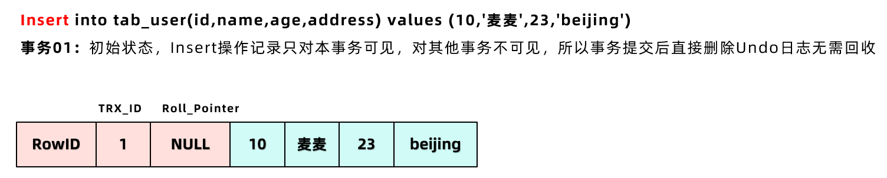

#### Update Undo Log ：是 Update 或 Delete 操作中产生的 Undo 日志

Update 操作会对已经存在的行记录产生影响，为了实现 MVCC 多版本并发控制机制，因此 **Update Undo 日志不能在事务提交时就删除，而是在事务提交时将日志放入指定区域，等待 Purge 线程进行最后的删除操作** 。 

如下图所示（第一次修改）：

```sql
# 事务2： 
update tab_user set name='雄雄',age=18 where id=10; 
# 当事务2使用Update语句修改该行数据时，会首先使用写锁锁定目标行，将该行当前的值复制到Undo 中，然后再真正地修改当前行的值，最后填写事务ID，使用回滚指针指向Undo中修改前的行。
```

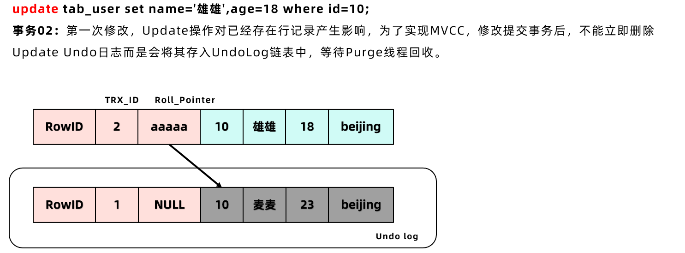

当事务 3 进行修改与事务 2 的处理过程类似，如下图所示（第二次修改）：

```sql
# 事务3： 
update tab_user set name='迪迪',age=16 where id=10;
```

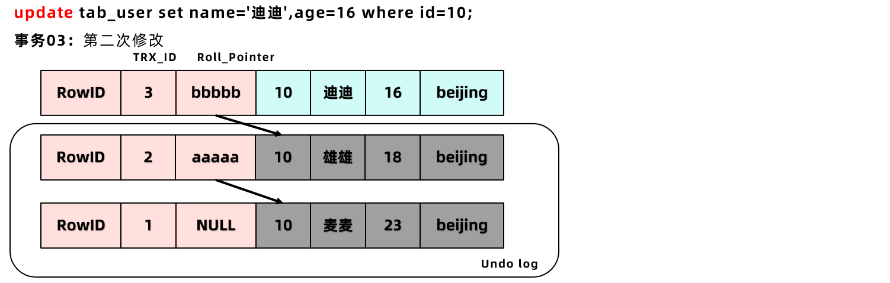

### 3.2 ReadView

**MVCC** 的核心问题就是：判断一下版本链中的哪个版本是当前事务可见的！

#### 什么是 ReadView？

ReadView 是张 **存储事务 id 的表**，主要包含当前系统中有哪些活跃的读写事务，把它们的事务 id 放到一个列表中。结合 Undo 日志的默认字段**「事务trx_id」**来控制那个版本的 Undo 日志可被其他事务看见。

四个列：

- **m_ids**：表示在生成 ReadView 时，当前系统中 **活跃的读写事务 id 列表**
- **m_low_limit_id** ：事务 id 下限，表示当前系统中活跃的读写事务中最小的事务 id，m_ids 事务列表中的最小事务 id
- **m_up_limit_id** ：事务 id 上限，表示生成 ReadView 时，系统中应该分配给下一个事务的 id 值 
- **m_creator_trx_id**：表示生成该 ReadView 的事务的事务 id

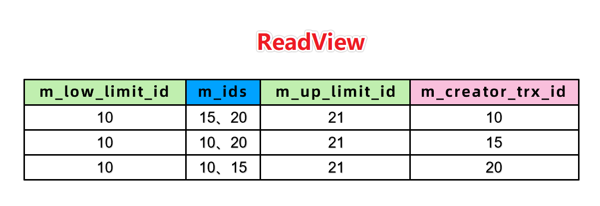

#### ReadView怎么产生，什么时候产生？

- 开启事务之后，在第一次 查询 (select) 时，生成 ReadView
- RC 和 RR 隔离级别的差异本质是因为 MVCC 中 ReadView 的生成时机不同

#### 如何判断可见性？

开启事务执行第一次查询时，首先生成 ReadView，然后 **依据 Undo 日志和 ReadView 判断可见性**，按照下边步骤判断记录的版本链的某个版本是否可见：

- 如果被访问版本的 trx_id 属性值，小于 ReadView 中的 **事务下限** id，表明生成该版本的事务在生成 ReadView 前已经提交，所以该版本 **可以** 被当前事务访问
- 如果被访问版本的 trx_id 属性值，等于 ReadView 中的 m_creator_trx_id ，**可以** 被访问
- 如果被访问版本的 trx_id 属性值，大于等于 ReadView 中的 **事务上限** id，在生成 ReadView 后才产生的数据，所以该版本 **不可以** 被当前事务访问
- 如果被访问版本的 trx_id 属性值，在 **事务下限** id 和 **事务上限** id之间，那就需要判断是不是在 m_ids 列表中
  - 如果在，说明创建 ReadView 时生成该版本的事务还是活跃的，该版本 **不可以** 被访问
  - 如果不在，说明创建 ReadView 时生成该版本的事务已经被提交，该版本 **可以** 被访问

循环判断 Undo log 中的版本链某一的版本是否对当前事务可见，如果循环到最后一个版本也不可见的话，那么就意味着该条记录对该事务不可见，查询结果就不包含该记录。

### 3.3 案例

#### （1）读已提交RC隔离级别下的可见性分析

**每次读取数据前都生成一个 ReadView**，默认 tab_user 表中只有一条数据，数据内容是刘备。

| 时间 | 事务01【db_trx_id=100】 | 事务02【db_trx_id=200】 | 事务03【db_trx_id=300】      |
| ---- | ----------------------- | ----------------------- | ---------------------------- |
| T1   | 开启事务                | 开启事务                | 开启事务                     |
| T2   | 更新为关羽              | ...                     | ...                          |
| T3   | 更新为张飞              | ...                     | ...                          |
| T4   |                         | 更新为赵云              |                              |
| T5   |                         | 更新为诸葛亮            |                              |
| T6   |                         |                         | SELECT01，id=1，name为刘备   |
| T7   | 提交事务01              |                         |                              |
| T8   |                         |                         | SELECT02，id=1，name为张飞   |
| T9   |                         | 提交事务02              |                              |
| T10  |                         |                         | SELECT03，id=1，name为诸葛亮 |

T3 时刻，表 tab_user 中 id 为 1 的记录得到的版本链表如下所示：

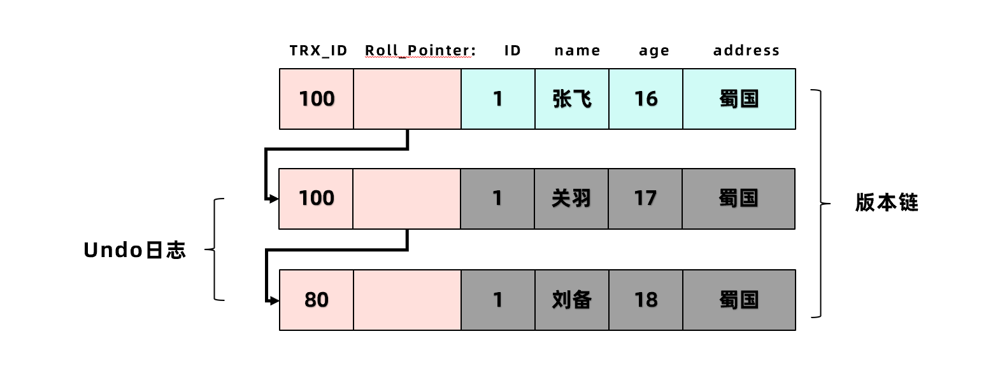

这个 `SELECT01` 的执行过程如下：

- 在执行 SELECT 语句时会先生成一个 ReadView ， m_ids 列表的内容就是 `[100, 200]`  。
- 然后从版本链中挑选可见的记录，从图中可以看出：
  - 最新版本的列 c 的内容是 '张飞' ，**该版本的 trx_id 值为 100 ，在 m_ids 列表内，所以不符合可见性要求**，跳下一个版本。
  - 下一个版本的列 c 的内容是 '关羽' ，**该版本的 trx_id 值也为 100 ，也在 m_ids 列表内，所以也不符合要求**，跳下一个版本。
  - 下一个版本的列 c 的内容是 '刘备' ，该版本的 trx_id 值为 80 ，小于 m_ids 列表中最小的事务id 100 ，**此版符合要求**
- 最后返回给用户的版本就是这条列 c 为 '刘备' 的记录。

T5 时刻，表 tab_user 中 id 为 1 的记录的版本链就长这样：

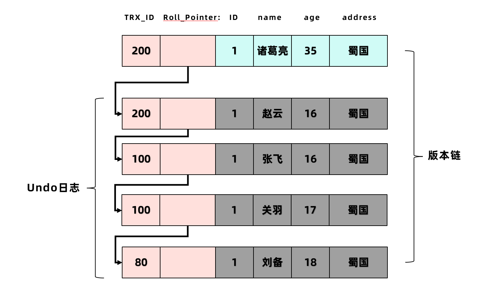

这个 `SELECT02` 的执行过程如下：

- 在执行 SELECT 语句时会先生成一个 ReadView ， ReadView 的 m_ids 列表的内容就是 `[200]`
  - 事务 id 为 100 的那个事务已经提交了，所以生成快照时的活跃事务 id 列表中就没有它了
- 然后从版本链中挑选可见的记录，从图中可以看出：
  - 最新版本的列 c 的内容是 '诸葛亮' ，**该版本的 trx_id 值为 200 ，在 m_ids 列表内，不符合可见性要求**，跳下一个版本
  - 下一个版本的列 c 的内容是 '赵云' ，**该版本的 trx_id 值为 200 ，也在 m_ids 列表内，不符合要求**，跳下一个版本
  - 下一个版本的列 c 的内容是 '张飞' ，该版本的 trx_id 值为 100 ，比 m_ids 列表中最小的事务id 200 还要小，**此版符合要求**
- 最后返回给用户的版本就是这条列 c 为 '张飞' 的记录。

以此类推，如果之后事务 id 为 200 的记录也提交了，再此在使用 RC 隔离级别的事务中查询表 t 中 id 值 为 1 的记录时，得到的结果就是 '诸葛亮' 了。

> 所以可以看出，**使用 RC 隔离级别的事务，在每次查询前都会生成新的 ReadView**，这会导致 **不可重复读** 问题。
>
> - 第一次读到刘备，第二次读到张飞。

#### （2）可重复读 RR 隔离级别下的可见性分析

在事务开始后第一次读取数据时生成一个 ReadView。**对于使用** RR **隔离级别的事务来说，只会在第一次执行查询语句时生成一个** ReadView **，之后的查询就不会重复生成了。**

T3 时刻，表 t 中 id 为 1 的记录得到的版本链表如下所示：


这个 SELECT1 的执行过程如下：

- 在执行 SELECT 语句时会先生成一个 ReadView ， ReadView 的 m_ids 列表的内容就是 `[100, 200] ` 。
- 然后从版本链中挑选可见的记录，从图中可以看出：
  - 最新版本的列 c 的内容是 '张飞' ，该版本的 trx_id 值为 100 ，在 m_ids 列表内，不符合可见性要求，跳下一个版本。
  - 下一个版本的列 c 的内容是 '关羽' ，该版本的 trx_id 值也为 100 ，也在 m_ids 列表内，不符合要求，跳下一个版本。
  - 下一个版本的列 c 的内容是 '刘备' ，该版本的 trx_id 值为 80 ，小于 m_ids 列表中最小的事务id 100 ，**版本符合要求**
- 最后返回给用户的版本就是这条列 c 为 '刘备' 的记录。 

T5 时刻，表 t 中 id 为 1 的记录的版本链就长这样：


这个 SELECT02 的执行过程如下：

- **因为之前已经生成过 ReadView 了，所以此时直接复用之前的 ReadView** ，之前的 ReadView 中的 m_ids 列表就是 `[100, 200]`。
- 然后从版本链中挑选可见的记录，从图中可以看出：
  - 最新版本的列 c 的内容是 '诸葛亮' ，该版本的 trx_id 值为 200 ，在 m_ids 列表内，不符合可见性要求，跳下一个版本
  - 下一个版本的列 c 的内容是 '赵云' ，该版本的 trx_id 值为 200 ，也在 m_ids 列表内，不符合要求，跳下一个版本
  - 下一个版本的列 c 的内容是 '张飞' ，该版本的 trx_id 值为 100 ，也在 m_ids 列表内，不符合要求，跳下一个版本
  - 下一个版本的列 c 的内容是 '关羽' ，该版本的 trx_id 值为 100 ，也在 m_ids 列表内，不符合要求，跳下一个版本
  - 下一个版本的列 c 的内容是 '刘备' ，该版本的 trx_id 值为 80 ， 80 小于 m_ids 列表中最小的事务id 100 ，**版本符合要求**
- 最后返回给用户的版本就是这条列 c 为 '刘备' 的记录。

也就是说两次 SELECT 查询得到的结果是重复的，记录的列 c 值都是 '刘备' ，这就是 **可重复读** 的含义。

如果我们之后再把事务id为 200 的记录提交了，之后再到刚才使用 `REPEATABLE READ` 隔离级别的事务中继续查找这个id为 1 的记录，得到的结果还是 '刘备' 。

>注意：**MVCC 只在 RR 和 RC 两个隔离级别下工作。RU 和串行化隔离级别不需要 MVCC，为什么？**
>
>- 因为 `RU` 总是读取最新的数据行，**本身就没有隔离性，也不解决并发潜在问题**，因此不需要！
>- 而 `SERIALIZABLE` 则 **会对所有读取的行都加锁，相当于串行执行，线程之间绝对隔离**，也不需要。

### 3.4 MVCC下的读操作

在 MVCC 并发控制中，读操作可以分成两类：**快照读** **(Snapshot Read)** 与 **当前读 (Current Read)**

- **快照读**：读取的是 **版本链** 中的快照数据，默认的读都是快照读
- **当前读**：读取的永远是最新的数据，保证其他事务不会再并发修改这条记录

#### 快照读

**快照读** 也就是一致性非锁定读(Consistent Nonlocking Read) 是指 InnoDB 存储引擎通过多版本控制 (MVCC) 读取当前数据库中行数据的方式。如果读取的行正在执行 DELETE 或 UPDATE 操作，这时读取操作不会因此去等待行上锁的释放。相反地，InnoDB 会去读取行的一个最新可见快照。**ReadView 的读取操作就是快照读**。

**快照读：**简单的 select 操作，属于快照读，不加锁。

```sql
select * from table where ?;
```

#### 当前读

**当前读：**特殊的读操作，插入/更新/删除操作，属于当前读，需要加锁

```sql
select * from table where ? lock in share mode; # 加读锁 
select * from table where ? for update;# 加写锁 
insert into table values (…);# 加写锁 
update table set ? where ?;# 加写锁 
delete from table where ?;# 加写锁 
# 所有以上的语句，都属于当前读，读取记录的最新版本。并且，读取之后，还需要保证其他并发事务不能修改当前记录，对读取记录加锁。 
# 其中，除了第一条语句，对读取记录加读锁外，其他的操作都加的是写锁。
```

#### 一个CRUD的CUD操作的具体流程

```sql
update table set ? where ?;
```

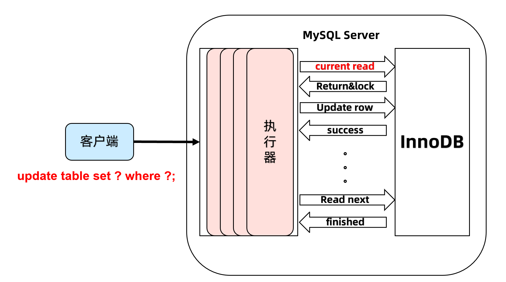

从图中可以看到：

当 Update SQL 被发给 MySQL 后，

- 首先，MySQL Server 会根据 where 条件，读取第一条满足条件的记录，然后 InnoDB 引擎会将第一条记录返回，并加锁 (current read)。
- 待MySQL Server收到这条加锁的记录之后，会再发起一个 Update 请求，更新这条记录。
- 一条记录操作完成，再读取下一条记录，直至没有满足条件的记录为止。因此，Update 操作内部，就包含了一个当前读。

同理，Delete 操作也一样。Insert 操作会稍微有些不同，简单来说，就是 Insert 操作可能会触发 Unique Key 的冲突检查，也会进行一个当前读。

## 4 总结

- MVCC 旨在使用 RC、RR 隔离级别下，使不同事务的 `读-写` 、 `写-读` 操作并发执行，提升系统性能
- MVCC 核心思想是 **读不加锁，读写不冲突**
- RC、RR 这两个隔离级别的一个很大不同就是 **生成 ReadView 的时机不同**
  - RC 在每一次进行普通 SELECT 操作前都会生成一个 ReadView
  - RR 在第一次进行普通 SELECT 操作前生成一个 ReadView ，之后的查询操作都重复这个 ReadView 

