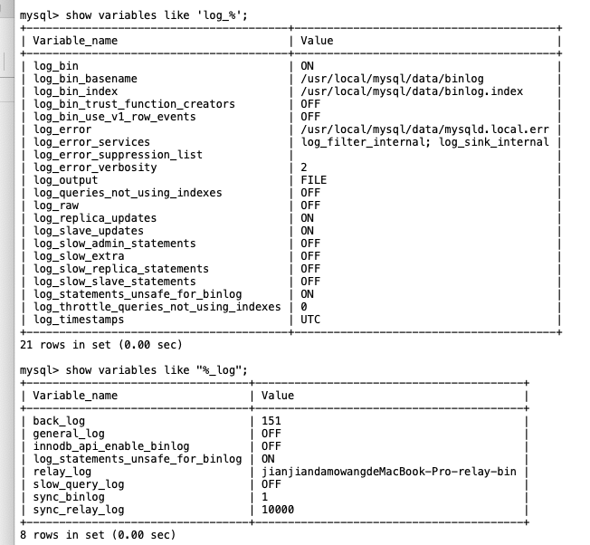
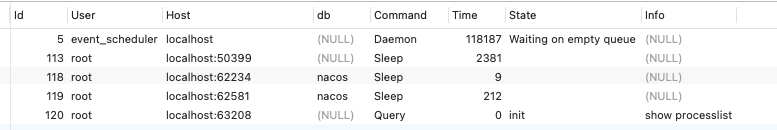

# 【MySQL】基本架构与执行过程


## 1 日志

MySQL 是通过文件系统对数据索引后进行存储的，MySQL 从物理结构上可以分为 **日志文件** 和 **数据及索引文件** 。MySQL 在 Linux 中的数据索引文件和日志文件通常放在 `/var/lib/mysql` 目录下。MySQL 通过日志记录了数据库操作信息和错误信息。

可以通过命令查看当前数据库中的日志使用信息：

```mysql
show variables like 'log_%';

show variables like "%_log";
```

可以看到：



常见的日志：

- 慢查询日志
- 错误日志
- 普通日志
- 二进制日志
- 事务重做日志
- ....

### 错误日志 error log

默认开启，错误日志记录了运行过程中 **遇到的所有严重的错误信息**，以及 MySQL **每次启动和关闭的详细信息**。

错误日志所记录的信息是可以通过 **log_error** 和 **log_warnings 配置** 来定义的。从 5.5.7 以后无法关闭错误日志。

- log_error：指定错误日志存储位置
- log-warnings：是否将警告信息输出到错误日志中。

### 二进制日志 bin log

默认关闭，需要通过以下配置进行开启。**binlog 记录了数据库所有的 ddl 语句和 dml 语句，但不包括 select 语句内容** ，语句以事件的形式保存，描述了数据的变更顺序，binlog 还包括了每个更新语句的执行时间信息。

如果是 DDL 语句，则直接记录到 binlog 日志，而 DML 语句，必须通过事务提交才能记录到 binlog 日志中。

binlog 主要用于实现 mysql **主从复制、数据备份、数据恢复** 。


> 数据定义语言：简称 **DDL(Data Definition Language)**
>
> - 作用：用来定义数据库对象：数据库，表，列等
> - 关键字：`create，alter，drop` 等
>
> 数据操作语言：简称 **DML(Data Manipulation Language)**
>
> - 作用：用来对数据库中表的记录进行更新
> - 关键字：`insert，delete，update` 等
>
> 数据查询语言：简称 **DQL(Data Query Language)**
>
> - 作用：用来查询数据库中表的记录
> - 关键字：`select，from，where` 等
>
> 数据控制语言：简称 **DCL(Data Control Language)**
>
> - 作用：用来定义数据库的访问权限和安全级别，及创建用户
> - 关键字：`grant, deny, revoke` 等

### 通用查询日志 general query log

**默认关闭，** 由于通用查询日志会记录用户的所有操作，其中还包含增删查改等信息，在并发操作大的环境下会产生大量的信息从而导致不必要的磁盘 IO，会影响 mysql 的性能的。

如果不是为了调试数据库，不建议开启查询日志。

### 慢查询日志 slow query log

**默认关闭，** 通过以下设置开启。记录执行时间超过 **long_query_time** 秒的所有查询，便于收集查询时间比较长的 SQL 语句。

查看阈值:

```sql
show global status like '%Slow_queries%';
show variables like '%slow_query%';
show variables like 'long_query_time%';
```

## 2 数据文件

MySQL 的数据及索引文件存储在哪？

```sql
show variables like '%datadir%';
```


#### 情况一：ibdata 文件

使用 **「系统表空间」** 存储表「数据和索引」信息，**所有表共同使用一个或者多个 ibdata 文件** 。

#### 情况二：InnoDB 存储引擎的数据文件

- **.frm** 文件：主要存放与表相关的数据信息，主要包括 **表结构的定义信息**
- **.ibd** 文件：使用**「独享表空间」**存储表 **数据和索引** 信息，一张表对应一个 `ibd` 文件。


> mysql 8 中，没有 `.frm` 文件了，取而代之的是 `.sdi` ！

#### 情况二：MyISAM 存储引擎的数据文件

- **.frm** 文件：主要存放与表相关的数据信息，主要包括表结构的定义信息

- **.myd** 文件：主要用来存储表数据信息
- **.myi** 文件：主要用来存储表数据文件中 **任何索引的数据树**

> 可见，不管是聚簇索引引擎还是非聚簇索引引擎，都需要一个文件 `.frm` 来存储表结构信息。

## 3 一条查询SQL语句的完整执行流程

分析SQL语句如下：

```sql
select c_id,first_name,last_name from customer where c_id=14;
```

大体来说，MySQL 可以分为 **Server** 层 和 **存储引擎层** 两部分：

1. Server层
   - 包括：**连接器、查询缓存、分析器、优化器、执行器** 等 
   - 涵盖 MySQL 的大多数核心服务功能
   - 所有的 **内置函数（如日期、时间、数学和加密函数等）**，所有 **跨存储引擎的功能** 都在这一层实现

2. 存储引擎层

   - 负责数据的存储和提取

   - 可插拔式存储引擎：InnoDB、MyISAM、Memory 等

   - 最常用存储引擎是 InnoDB

   - 从 MySQL 5.5 版本开始，默认是 InnoDB


### 第一步：连接到数据库

首先会连接到这个数据库上，这时候接待你的就是 **连接器** 。

```sql
-- 连接命令 
mysql -h127.0.0.1 -P3306 -uroot -p
```

连接完成后，如果你没有后续的动作，这个连接就处于 **空闲状态** 。客户端如果太长时间没动静，连接器就会自动将它断开。这个时间是由参数 wait_timeout 控制的默认值是 8 小时。

```sql
mysql> show processlist; 
# 其中的 Command 列显示为“Sleep”的这一行，就表示现在系统里面有一个空闲连接。
```



### 第二步：查缓存

MySQL 拿到一个查询请求后，会先到查询缓存看看，之前是不是执行过这条语句。

**之前执行过的语句及其结果可能会以 key-value 对的形式，被直接缓存在内存中**。key 是查询的语句 hash 之后的值，value 是查询的结果。

- 如果你的查询语句在缓存中，会被直接返回给客户端。
- 如果语句不在查询缓存中，就会继续后面的执行阶段。执行完成后，执行结果会被存入查询缓存中。

如果查询命中缓存，MySQL 不需要执行后面的复杂操作就可以直接返回结果，效率会很高！但是 **不建议使用** MySQL 的内置缓存功能！

#### 查询缓存

查询缓存 **默认是关闭** 的状态。

```sql
# 1）查看是否开启缓存 
mysql> show variables like 'query_cache_type'; 

# 2）查看缓存的命中次数 
mysql> show status like 'qcache_hits';

# 3）开启缓存 
在/etc/my.cnf文件中修改“query_cache_type”参数 
值为`0或OFF`会禁止使用缓存。 
值为`1或ON`将启用缓存，但以`SELECT SQL_NO_CACHE`开头的语句除外。 
值为`2或DEMAND`时，只缓存以`SELECT SQL_CACHE`开头的语句。
```

修改配置文件 `my.cnf` ，在文件中增加如下内容开启缓存：

```
query_cache_type=2
```

查询SQL：

```sql
mysql> select * from city where city_id = 1;
```


#### 清空查询缓存

可以使用下面三个SQL来清理查询缓存：

```sql
FLUSH QUERY CACHE; # 清理查询缓存内存碎片。 
RESET QUERY CACHE; # 从查询缓存中移出所有查询。 
FLUSH TABLES; # 关闭所有打开的表，同时该操作将会清空查询缓存中的内容。
```

#### 为什么不建议使用内置缓存？

因为查询缓存往往弊大于利：

- **成本高：** 查询缓存的失效非常频繁，**只要有对一个表的更新，这个表上所有的查询缓存都会被清空** 。因此很可能你费劲地把结果存起来，还没使用呢，就被一个更新全清空了。
- **命中率不高：** 对于更新压力大的数据库来说，查询缓存的命中率会非常低。除非你的业务就是有一张 **静态表**，很长时间才会更新一次。比如，一个系统配置表，那这张表上的查询才适合使用查询缓存。
- **功能并不如专业的缓存工具更好：** redis、memcache、ehcache...

好在 MySQL 也提供了这种 **按需使用** 的方式。你可以将参数 query_cache_type 设置成 DEMAND，这样对于默认的 SQL 语句都不使用查询缓存。而对于你确定要使用查询缓存的语句，可以用 `SQL_CACHE` 显式指定，像下面这个语句一样：

```sql
mysql> select sql_cache * from city where city_id = 1;
```

> 注意：MySQL 8.0 版本直接将查询缓存的整块功能删掉了！

### 第三步：分析器

如果查询缓存没有命中，接下来就需要进入正式的查询阶段了。

客户端程序发送过来的请求，实际上只是一个字符串而已，所以 MySQL 服务器程序首先需要对这个字符串做分析，判断请求的语法是否正确，然后从字符串中将要查询的表、列和各种查询条件都提取出来，本质上是对一个 SQL 语句编译的过程，涉及 **词法解析**、**语法分析**、**预处理器** 等。

- **词法分析：** 词法分析就是把一个完整的 SQL 语句分割成一个个的字符串
- **语法分析：** 语法分析器根据词法分析的结果做语法检查，判断你输入的SQL 语句是否满足 MySQL 语法。
- **预处理器：** 预处理器则会进一步去检查解析树是否合法，比如表名是否存在，语句中表的列是否存在等等，在这一步 MySQL 会检验用户是否有表的操作权限。

#### 词法分析

比如：这条简单的 SQL 语句，会被分割成 10 个字符串：

```sql
# 分隔前 
select c_id,first_name,last_name from customer where c_id=14; 
# 分隔后 
select，c_id,first_name,last_name，from，customer，where，c_id，=，14
```

MySQL 同时需要识别出这个 SQL 语句中的字符串 **分别是什么，代表什么**。 

- 把 "select" 这个关键字识别出来，这是一个查询语句
- 把 “customer” 识别成 “表名 customer”
- 把 “c_id“ 识别成 “列 c_id”

#### 语法分析

如果语法正确就会根据 MySQL语法规则与SQL 语句生成一个数据结构，这个数据结构我们把它叫做 **解析树** 。

> `You have an error in your SQL syntax` ”错误提醒就是在这个位置出现的。如 拼错关键词 等。

解析树例子：


#### 预处理器

预处理器则会进一步去检查 **解析树** 是否合法，比如 **表名是否存在，语句中表的列是否存在** 等等。

在这一步 MySQL 会检验用户是否有表的操作权限。预处理之后会得到一个新的解析树，然后调用对应执行模块。

### 第四步：优化器

**优化器顾名思义就是对查询进行优化。作用是根据解析树生成「不同的」执行计划，然后选择最优的「执行计划」。**

MySQL 里面使用的是 **基于成本模型** 的优化器，哪种 **执行计划 Explain** 执行时成本最小就用哪种。而且它是 `io_cost` 和 `cpu_cost` 的开销总和，它通常也是我们评价一个查询的执行效率的一个常用指标。

查看上次查询成本开销，默认值是 0：

```sql
show status like 'Last_query_cost';
```

优化器可以做哪些优化呢？

- 当有多个索引可用的时候，**决定使用哪个索引** 
- 在一个语句有多表关联（join）的时候，**决定各个表的连接顺序，以哪个表为基准表**

**举个栗子：**

比如 hello 数据库中表 customer 上执行下面的语句，这个语句用到了两个索引 last_name 和 address_id：

```sql
# hello数据库中表customer 
explain select * from customer where last_name='刘皇叔' and address_id=11;
```

既可以使用last_name索引查询，然后过滤列address_id；也可以使用address_id索引查询，然后过滤列last_name。

两种执行计划的结果是一样的，但是执行效率会有所不同，**而优化器的作用就是决定选择使用哪一个方案**。

使用explain工具可以查看优化器的执行计划：


> 注意：优化器最多就是辅助，作用很有限，我们的 SQL 语句不能依赖于 MySQL 的优化器去调优！如果 SQL 语句垃圾，则没有可优化的空间。优化 SQL 的根本在于掌握 MySQL 分析与调优知识。

### 第五步：执行器

#### 1）判断执行权限

开始执行的时候，要先判断一下你对这个表 customer 有没有执行查询的权限，如果没有，就会返回没有权限的错误。

#### 2）调用存储引擎接口查询

如果有权限，就使用指定的存储引擎打开表开始查询。 **执行器会根据表的引擎定义，去使用这个引擎提供的查询接口提取数据。**

- **c_id 是 主键** 执行流程：
  - 调用 InnoDB 引擎接口，从主键索引中检索 c_id=14 的记录
  - 主键索引「等值查询」只会查询出一条记录，直接将该记录返回客户端
  - 至此，这个语句就执行完成了
  - 不够详细，还可增加内存结构等
- **c_id 不是 主键** 执行流程：全表扫描
  - 调用 InnoDB 引擎接口取这个表的第一行，判断 c_id 值是不是 14，如果不是则跳过，如果是则将这行缓存在结果集中
  - 调用引擎接口取“下一行”，重复相同的判断逻辑，直到取到这个表的最后一行
  - 执行器将上述遍历过程中所有满足条件的行组成的结果集返回给客户端
  - 至此，这个语句就执行完成了

举个例子：

比如：我们新建一个用户 mysql_user，只有表 actor 的查询权限，没有表 customer 的查询权限。

```sql
CREATE USER `mysql_user`@`localhost` IDENTIFIED BY '123456@heroA'; 
GRANT Select ON TABLE `hello`.`test` TO `mysql_user`@`localhost`;
```

使用这个用户 mysql_user 连接 mysql，执行下面的查询语句，就会返回 **没有权限的错误** 。

```sql
mysql -umysql_user -p123456@heroA 
mysql> select * from customer where c_id=14;
```


#### 存储引擎查看与设置

在MySQL中可以使用不同的存储引擎：

```sql
# 查看支持的存储引擎 
> show engines;
```


> **只有 InnoDB 引擎支持事务、行锁、外键！！！**

在选择引擎时尽可能使用 InnoDB 引擎。

- MyISAM：早期版本默认的引擎。

- Memory：所有的数据都是保存在内存中。

```sql
# 使用其他引擎，在mysql中默认使用InnoDB引擎，一个数据库中不同的表可以使用不同的引擎。 
create table t_myisam(a int primary key, b int) engine=myisam;
```