# 【MySQL】索引

一条 Select 语句的执行：

```SQL
select * from tab_user WHERE id=1
```

- 判断是否是索引
  - 是：往下
  - 不是：走全表查询
- 判断是否是主键
  - 是：走聚簇索引
  - 不是：走回表查询

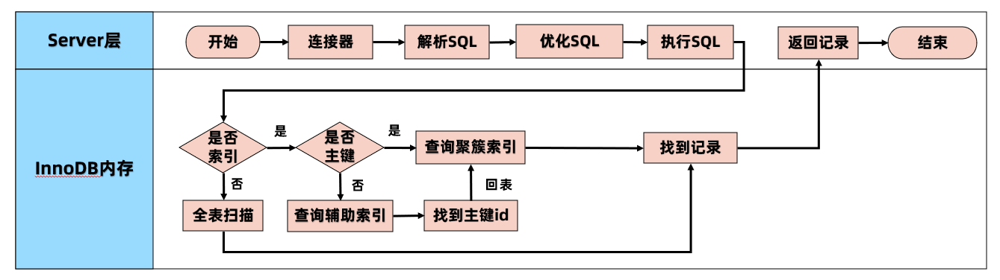

优势：

- **可以提高数据检索的效率，降低数据库的IO成本**，类似于书的目录。
- 通过 **索引列对数据进行排序**，降低数据排序的成本，降低了 CPU 的消耗。
    - 被索引的列会自动进行排序，包括【单列索引】和【组合索引】，只是组合索引的排序要复杂一些。
    - 如果按照索引列的顺序进行排序，对应order by语句来说，效率就会提高很多。

劣势：

- **索引会占据磁盘空间**。
- **索引虽然会提高查询效率，但是会降低更新表的效率**。比如每次对表进行增删改操作，MySQL不仅要保存数据，还要维护索引文件。

## 索引的使用

按照索引列的数量分类：

- **单列索引**：索引中只有一个列。
- **组合索引**：使用 2 个以上的字段创建的索引。

### 单列索引

1. 主键索引：索引列中的值必须是唯一的不允许有空值。

```SQL
 ALTER TABLE table_name ADD PRIMARY KEY (column_name);
```

2. 普通索引：MySQL 中基本索引类型，没有什么限制，允许在定义索引的列中插入重复值和空值。

```SQL
ALTER TABLE table_name ADD INDEX index_name (column_name);
```

3. 唯一索引：索引列中的值必须是唯一的，但是允许为空值。

```SQL
CREATE UNIQUE INDEX index_name ON table(column_name);
```
4. 全文索引：**只能在文本类型 CHAR，VARCHAR，TEXT 类型字段上创建全文索引** 。字段长度比较大时，如果创建普通索引，在进行 like 模糊查询时效率比较低，这时可以创建全文索引。MyISAM 和 InnoDB 中都可以使用全文索引。
   - 全文索引一般很少使用，数据量比较少或者并发度低的时候可以用。但是数据量大或者并发度高的时候一般是用专业的工具 Lucene，ES，Solr。

5. 前缀索引：在文本类型如 CHAR，VARCHAR，TEXT 类列上创建索引时，可以指定索引列的长度，但是数值类型不能指定。

```SQL
ALTER TABLE table_name ADD INDEX index_name (column1(length));
```

### 组合索引

组合索引的使用，需要遵循 **最左前缀原则（最左匹配原则）**。

一般情况下，**建议使用组合索引代替单列索引**（主键索引除外）。

```SQL
ALTER TABLE table_name ADD INDEX index_name (column1,column2);
```

### 删除索引

```SQL
DROP INDEX index_name ON table
```

### 查看索引

```SQL
SHOW INDEX FROM table_name
```

## 索引的数据结构

### 哈希表

使用 Hash 表存储表数据 Key 可以存储索引列，Value 可以存储行记录或者行磁盘地址。Hash 表在等值查询时效率很高，时间复杂度为 $O(1)$ 。

- 但是 **不支持范围快速查找** ，范围查找时还是只能通过扫描全表方式。
- 数据结构比较稀疏，**不适合做聚合**，不适合做范围等查找。

使用场景：

- 对查询并发要求很高，**K/V 内存数据库，缓存**

### 二叉查找树

二叉树特点：每个节点最多有 2 个分叉，左子树和右子树数据顺序左小右大。

二叉树的 **检索复杂度** 和 **树高** 相关：**理想状态** 下效率可以达到 $O(logn)$ 。

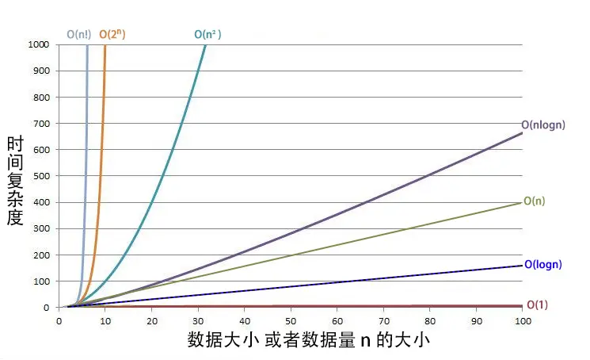

> 是不是任何列使用二叉树效率都会提升呢？并不会！

极端情况下，二叉查找树会构建成为单向链表 = 查找全表扫描。对磁盘不友好。一旦变成了全表扫描，磁盘 IO 将是极其沉重。

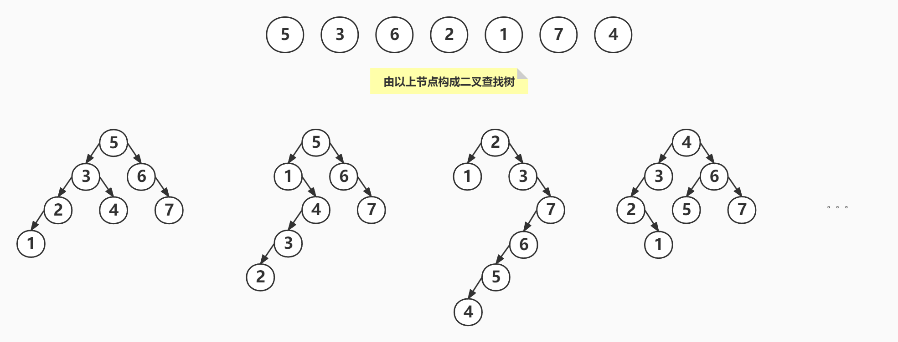

### 红黑树

平衡二叉树是采用二分法思维，平衡二叉查找树除了具备二叉树的特点，最主要的特征是树的左右两个子树的层级 **最多相差 1** 。在插入删除数据时通过 **左旋** / **右旋** 操作保持二叉树的平衡，不会出现左子树很高、右子树很矮的情况。

使用平衡二叉查找树查询的性能接近于二分查找法，时间复杂度是 $O(log_2N)$ 。

> unique key 为什么不用红黑树，反正只存一个主键？

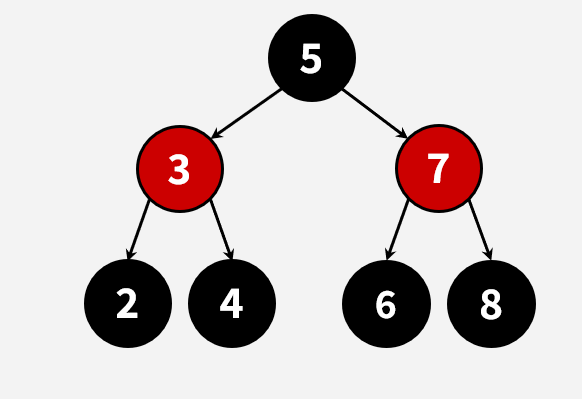

**平衡二叉树存在的问题**

1. 时间复杂度和树高相关：树有多高就需要检索多少次，每个节点的读取，都对应一次磁盘 IO 操作（瓶颈）
    - **磁盘每次寻道时间为 10ms** ，在表数据量大时，对响应时间要求高的场景下，查询性能就会出现瓶颈。
    - 举例：1 百万的数据量，$log_2N$  约等于 20 次磁盘IO，时间 20*10=0.2s
2. 平衡二叉树 **不支持范围查询** 快速查找，范围查询时需要从根节点多次遍历，查询效率极差。
3. 数据量大的情况下，索引存储空间占用巨大

举个栗子：

- 10亿行数据，时间复杂度O(logn)，最多不超过 **30次** 查到数据
- 最简单索引构成：`<ID，行号，指针>`
- 假如 key 为 bigint=8 字节，每个节点有两个指针，每个指针为 4 个字节，一个节点占用的空间 16 个字节（8+4*2=16）。
- 索引大小：`10亿x16(bigint)=15GB`

**为什么磁盘 IO 操作就慢？** 

从磁盘读取数据时，系统会将逻辑地址发给磁盘，磁盘将逻辑地址转换为物理地址（哪个磁道，哪个扇区）。 磁头进行机械运动，先找到相应磁道，再找该磁道的对应扇区，**扇区（512 byte）是磁盘的 最小存储单元**。

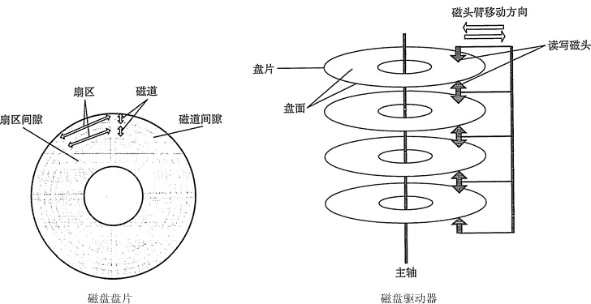

- 随机读写时，磁头需要不停的移动，时间都浪费在了磁头寻址上。 而在实际的磁盘存储里，是很少顺序存储的，因为这样的维护成本会很高。
- 性能差异：机械硬盘的连续读写性能很好，但随机读写性能很差。
    - 顺序访问：**内存访问速度 ** 是硬盘访问速度的6~7倍
    - 随机访问：**内存访问速度** 就要比硬盘访问速度快上 **10万倍以上** 

### B 树：改进二叉树，为多叉树

想要减少耗时的 IO 操作，就要尽量降低树的高度。每个节点存储多个元素，在 **每个节点尽可能多的存储数据** 。每个节点可以存储 1000 个索引（16k / 16 = 1000），这样就将二叉树改造成了**多叉树**，通过增加树的叉树，将树从高瘦变为矮胖。

主要特点：

1. B 树的节点中存储着多个元素，每个节点内有多个分叉。
2. 节点中的元素包含键值和数据，节点中的键值从大到小排列。也就是说，**在所有的节点都储存数据** 。
3. **父节点当中的元素不会出现在子节点中。** 
4. **所有的叶子结点都位于同一层，叶节点具有相同的深度，叶节点之间没有指针连接。 ** 

以下面的B树为例，我们的键值为表主键，具备唯一性。

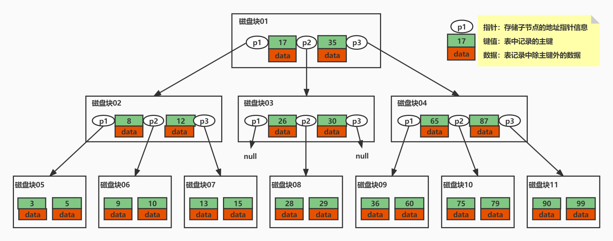

**B 树如何查询数据** ：假如我们查询值等于 15 的数据。查询路径磁盘块1->磁盘块2->磁盘块7。

**优点：**

- 磁盘 IO 次数会大大减少。
- 比较是在内存中进行的，比较的耗时可以忽略不计。
- B 树的高度相比于平衡二叉树会大幅缩小，所以使用 B 树构建索引可以很好的提升查询的效率。

**缺点：**

- **B 树不支持范围查询的快速查找** ： 如果我们想要查找 15 和 26 之间的数据，查找到 15 之后，需要回到根节点重新遍历查找，需要从根节点进行多次遍历，查询效率有待提高。 
- **空间占用较大** ： 如果 data 存储的是行记录，行的大小随着列数的增多，所占空间会变大。**一个页中可存储的数据量就会变少，树相应就会变高，磁盘 IO 次数就会变大**。 

### B+ 树：改进 B 树，非叶子节点不存储数据

在B树基础上，MySQL 在 B 树的基础上继续改造，使用 B+ 树构建索引。B+ 树和 B 树最主要的区别在于 **非叶子节点是否存储数据** 的问题

- B 树：非叶子节点和叶子节点都会存储数据。
- B+ 树：只有 **叶子节点才会存储数据** ， **非叶子节点只存储键值 **。叶子节点之间使用双向指针连接，最底层的叶子节点形成了一个 **双向有序链表** 。

B+ 树的最底层叶子节点包含所有索引项。具备中路返回特性。

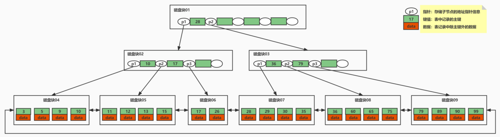

**等值查询** ：假如我们查询值等于 15 的数据。查询路径磁盘块1->磁盘块2->磁盘块5。

**范围查询** ：假如我们想要查找 15 和 26 之间的数据。

- 查找路径是磁盘块1->磁盘块2->磁盘块5。
  - 首先查找值等于 15 的数据，将值等于 15 的数据缓存到结果集（三次磁盘 IO）。
  - 查找到 15 之后，底层的叶子节点是一个有序列表，我们从磁盘块5，键值 15 开始向后遍历筛选所有符合筛选条件的数据。
  - 第四次磁盘 IO：根据磁盘5后继指针到磁盘中寻址定位到磁盘块6，将磁盘6加载到内存中，在内存中从头遍历比较，15<17<26，15<26<=26，将 data 缓存到结果集。


**优点：**

- 继承了 B 树的优点（多叉树的优点）
- 保证等值和范围查询的快速查找
- MySQL 的索引就采用了 B+ 树的数据结构。

> **为什么说一般情况下，B+ 树是 1-3 层？** 
>
> 数据页大小默认为 16k，假设索引字段是 bigint 8字节，加上数据之间的指针大小如果说是 6 字节，那么一个数据页就可以存储 `16 x 1024=16384` 。
> `16384 / 14=1170.285714` 个数据，第二层就有，`1170 x 1170=1368900` 。假如只有三层，主键索引叶子节点存储数据，一条数据为 1k（包含数据之间的连接指针），那么第三层，每个数据页存16条数据，三层就能存，`1170 x 1170 x 16=21902400` 条数据。

## 存储引擎的索引实现

### MyISAM索引

MyISAM 的数据文件和索引文件是分开存储的。MyISAM 使用 B+ 树构建索引树时，**叶子节点中存储的键值为索引列的值，数据为索引所在行的磁盘地址** 。

```SQL
CREATE TABLE `t_user_myisam` (
  `id` int(11) NOT NULL AUTO_INCREMENT,
  `username` varchar(20) DEFAULT NULL,
  `age` int(11) DEFAULT NULL,
  PRIMARY KEY (`id`) USING BTREE,
  KEY `idx_age` (`age`) USING BTREE
) ENGINE=MyISAM AUTO_INCREMENT=1 DEFAULT CHARSET=utf8;

insert into t_user_myisam values(15,'Nick',5);
insert into t_user_myisam values(18,'Zero',22);
insert into t_user_myisam values(20,'Tom',34);
insert into t_user_myisam values(30,'Nick',55);
insert into t_user_myisam values(49,'Mary',22);
insert into t_user_myisam values(50,'James',77);
insert into t_user_myisam values(56,'John',89);
insert into t_user_myisam values(77,'Lily',100);
```

#### 主键索引

表 `t_user_myisam` 的索引存储在索引文件`t_user_myisam.MYI`中，数据文件存储在数据文件 `t_user_myisam.MYD` 中。

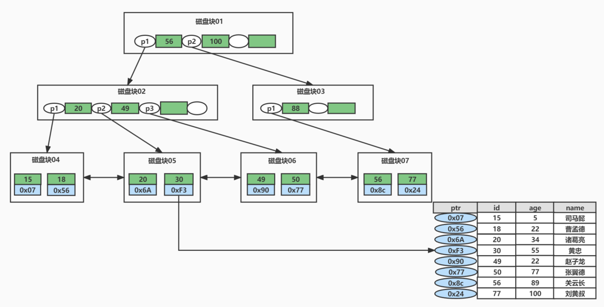

>等值查询例子：
>
>```SQL
>select * from t_user_myisam where id=30;
>```
>
>- 先在主键树中从根节点开始检索，将根节点加载到内存，比较30<56，走左路。（1次磁盘IO）
>- 将左子树节点加载到内存中，比较20<30<49，向下检索。（1次磁盘IO）
>- 检索到叶节点，将节点加载到内存中遍历，比较20<30，30=30。查找到值等于30的索引项。（1次磁盘IO）
>- 从索引项中获取磁盘地址，然后到数据文件 `t_user_myisam.MYD` 中获取对应整行记录。（1次磁盘IO）
>- 将记录返给客户端。
>- 因此共发生了 **四次磁盘 IO 操作** 。

#### 辅助索引（二级索引）

**在 MyISAM 中，辅助索引和主键索引的结构是一样的**，没有任何区别，**叶子节点的数据存储的都是行记录的磁盘地址** 。只是主键索引的键值是唯一的，而辅助索引的键值可以重复。

查询数据时，由于辅助索引的键值不唯一，可能存在多个拥有相同的记录，所以即使是等值查询，也需要按照范围查询的方式在辅助索引树中检索数据。

### InnoDB索引

每个 InnoDB 表都有一个 **聚簇索引** ，也叫聚集索引。聚簇索引使用 B+ 树构建，**叶子节点存储的数据是整行记录** 。一般情况下，聚簇索引等同于主键索引，当一个表没有创建主键索引时，InnoDB 会自动创建一个 ROWID 字段来构建聚簇索引。

除聚簇索引之外的所有索引都称为 **辅助索引**。在 InnoDB 中，**辅助索引中的叶子节点存储的数据都是该行的主键值** 。 在检索时，**InnoDB 使用此主键值在聚簇索引中搜索行记录（回表）**。

**InnoDB 创建索引的具体规则如下：**

1. 在表上定义主键 PRIMARY KEY，InnoDB 将主键索引用作聚簇索引。
2. 如果表没有定义主键，InnoDB 会选择 **第一个不为 NULL 的唯一索引** 列用作聚簇索引。
3. 如果以上两个都没有，InnoDB 会使用一个 **6  字节长整型的隐式字段 ROWID 字段** 构建聚簇索引。该 ROWID 字段会在插入新行时自动递增。

#### 主键索引

主键索引的叶子节点会存储 **数据行** ，辅助索引只会存储主键值。

**InnoDB 要求表必须有一个主键索引** 。

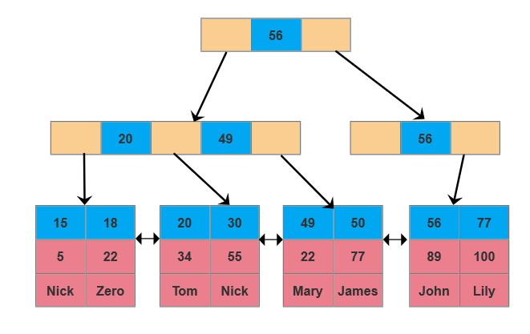

#### 辅助索引

除聚簇索引之外的所有索引都称为辅助索引，**InnoDB 的辅助索引只会存储主键值而非磁盘地址** 。

使用辅助索引需要检索两遍索引（回表操作）：
- 首先检索辅助索引获得主键
- 然后使用主键到主索引中检索获得记录

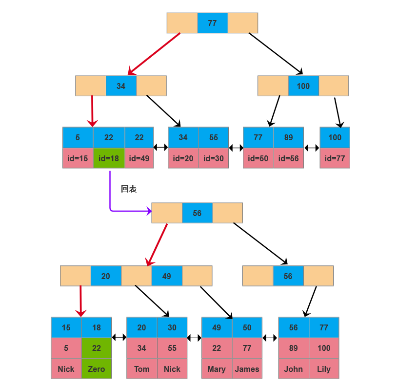

> 所以，回表的情况只会发生在 InnoDB 的非主键索引（辅助索引或二级索引）的查询中。

#### 组合索引

```SQL
select * from  t_multiple_index where a=13 and b=16 and c=4;
```

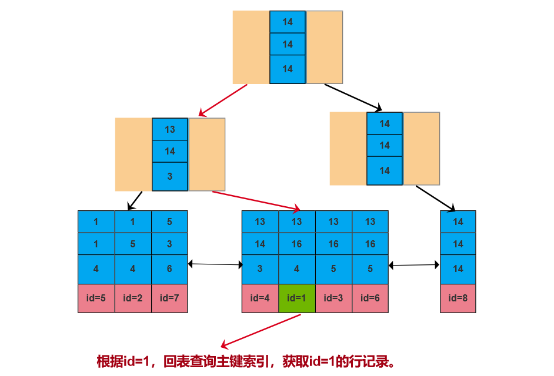

1. 先在索引树中从根节点开始检索，将根节点加载到内存，**先比较a列**，a=14，14>13，走左路。（1次磁盘IO）
2. 将左子树节点加载到内存中，**先比较a列**，a=13，比较b列b=16，14<16，走右路，向下检索。（1次磁盘IO）
3. 达到叶节点，将节点加载到内存中从前往后遍历比较。（1次磁盘IO）
    - 第一项（13,14,3,id=4）：**先比较a列**，a=13，比较b列b=14，b!=16不符合要求，丢弃。
    - 第二项（13,14,4,id=1）：一样的比较方式，a=13，b=16，c=4 满足筛选条件。取出索引data值即主键id=1，再去主键索引树中检索id=1的数据放入结果集中。（回表：3次磁盘IO）
    - 第三项（13,14,5,id=3）：a=13，b=16，c!=4 不符合要求，丢弃。查询结束。
4. 最后得到1条符合筛选条件，将查询结果集返给客户端。

> 最左匹配原则：**使用组合索引查询时，mysql会一直向右匹配直至遇到范围查询（ >、<、between、like）就停止匹配。**
>
> - 最左前缀匹配原则和联合索引的 **索引存储结构和检索方式 **是有关系的。
> - 在组合索引树中，最底层的叶子节点按照第一列 a 列从左到右递增排列，但是 b 列和 c 列是无序的， b 列只有在 a 列值相等的情况下小范围内递增有序，而 c 列只能在 a，b 两列相等的情况下小范围内递增有序。
> - 所以当我们使用 where  a=13 and b=16 and c=4 去查询数据的时候，B+树会先比较 a 列来确定下一步应该搜索的方向，往左还是往右。如果 a 列相同再比较 b 列。
> - **但是如果查询条件没有 a 列，B+ 树就不知道第一步应该从哪个节点查起！**
> - 创建的 `idx_abc(a,b,c)` 索引，相当于创建了 `(a)、（a,b）（a,b,c）` 三个索引。
>
> 一颗索引树等价与三颗索引树，从另一方面来说，组合索引也为我们节省了磁盘空间。所以在业务中尽量选用组合索引，能使用组合索引就不要使用单列索引。

组合索引创建原则：

1. 频繁出现在 where 条件中的列，建议创建组合索引。
2. 频繁出现在 order by 和 group by 语句中的列，建议按照 **顺序** 去创建组合索引。
    - `order by a,b`   需要组合索引列顺序 `(a,b)`。如果索引的顺序是 `(b,a)` ，是用不到索引的。
3. 常出现在 Select 语句中的列，也建议创建组合索引（与覆盖索引有关系）。

#### 覆盖索引

根据在辅助索引树查询数据时，首先通过辅助索引找到主键值，然后需要再根据主键值到主键索引中找到主键对应的数据。这个过程称为 **回表** 。

使用辅助索引查询比基于主键索引的查询多检索了一棵索引树。**那是不是所有使用辅助索引的查询都需要回表查询呢？** 

表 `t_multiple_index` ，组合索引 `idx_abc(a,b,c)` 的叶子节点中包含 `(a,b,c,id)` 四列的值，对于以下查询语句

```sql
select a from  t_multiple_index where a=13 and b=16;
select a,b from  t_multiple_index where a=13 and b=16;
select a,b,c from  t_multiple_index where a=13 and b=16;
select a,b,c,id from  t_multiple_index where a=13 and b=16;
```

**什么是覆盖索引？**

Select 中列数据 **如果可以直接在辅助索引树上全部获取**，也就是说索引树已经“覆盖”了我们的查询需求，这时 MySQL 就不会白费力气的回表查询，这中现象就是 **覆盖索引** 。

## 索引创建的原则

### 哪些情况需要构建索引？

1. 频繁出现在 where 条件字段，order 排序，group by 分组字段
2. Select 频繁查询的列，考虑是否需要创建联合索引（覆盖索引，不回表）
3. 多表 join 关联查询，on 字段两边的字段都要创建索引

### 索引优化

1. **表记录很少不需创建索引 ：** 索引是要有存储的开销 索引是要有存储的开销
2. **一个表的索引个数不能过多：** 
  - 空间：浪费空间。每个索引都是一个索引树，占据大量的磁盘空间。
  - 时间：更新（插入/Delete/Update）变慢。需要更新所有的索引树。太多的索引也会增加优化器的选择时间。
  - 所以索引虽然能够提高查询效率，**索引并不是越多越好**，应该只为需要的列创建索引。
3. **频繁更新的字段不建议作为索引：**  频繁更新的字段引发频繁的页分裂和页合并，性能消耗比较高。 频繁更新的字段引发频繁的页分裂和页合并，性能消耗比较高。
4. **区分度低的字段，不建议建索引：** 
  比如性别，男，女；比如状态。区分度太低时，会导致扫描行数过多，再加上回表查询的消耗。如果使用索引，比全表扫描的性能还要差。这些字段一般会用在组合索引中。姓名，手机号就非常适合建索引。
5. **在 InnoDB 存储引擎中，主键索引建议使用自增的长整型，避免使用很长的字段：** 
  主键索引树一个页节点是 16K，主键字段越长，一个页可存储的数据量就会越少，比较臃肿，查询时尤其是区间查询时磁盘 IO 次数会增多。辅助索引树上叶子节点存储的数据是主键值，主键值越长，一个页可存储的数据量就会越少，查询时磁盘 IO 次数会增多，查询效率会降低。
6. **不建议用无序的值作为索引：** 例如身份证、UUID。更新数据时会发生频繁的页分裂，页内数据不紧凑，浪费磁盘空间。 例如身份证、UUID。更新数据时会发生频繁的页分裂，页内数据不紧凑，浪费磁盘空间。
7. **尽量创建组合索引，而不是单列索引：**
  - 1 个组合索引等同于多个索引效果，节省空间。
  - 可以使用覆盖索引
  - **创建原则：组合索引应该把频繁用到的列、区分度高的值放在前面。频繁使用代表索引的利用率高，区分度高代表筛选粒度大，这样做可最大限度利用索引价值，缩小筛选范围** 。