# 【MySQL】锁

以一条 update 为例：

```SQL
update tab_user set name='曹操' where id = 1;
```

执行流程：

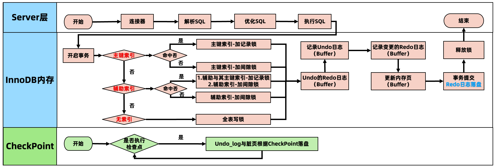

## 基本介绍

在实际的数据库系统中，每时每刻都在发生锁定，当某个用户在 **修改** 一部分数据时，MySQL 会通过锁定防止其他用户读取同一数据。

在处理并发读或者写时，通过实现一个由两种类型的锁组成的锁系统来解决问题。两种锁通常被称为 **共享锁(shared lock)** 和 **排他锁(exclusive lock)** ，也叫 **读锁(read lock)** 和 **写锁(write lock)** 。

读锁是共享的，是互相不阻塞的。多个客户端在同一时刻可以同时读取同一个资源，而不互相干扰。写锁则是排他的，也就是说一个写锁会阻塞其他的写锁和读锁，这是出于安全策略的考虑，只有这样才能确保在给定的时间里，只有一个用户能执行写入，并防止其他用户读取正在写入的同一资源。

### 按照粒度划分

MySQL 的锁按照粒度可划分为：

- **全局锁** ：锁整 Database，由 MySQL 的 SQL layer 层实现
- **表级锁** ：锁某 Table，由 MySQL 的 SQL layer 层实现
- **行级锁** ：锁某 Row 的索引，也可锁定行索引之间的间隙，由存储引擎实现（InnoDB）
  - 记录锁：锁定索引中的一条记录
  - 间隙锁：仅仅锁住一个索引区间
  - 临键锁：记录锁和间隙锁的组合，**解决幻读问题**
  - 插入意向锁：在 insert 时候添加对记录 id 的锁
  - 意向锁：存储引擎级别的 ”表级锁“

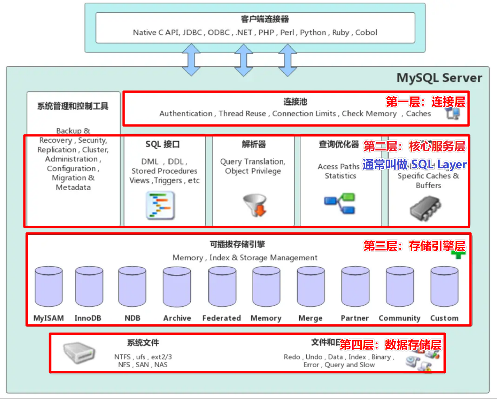

### 按功能划分

- **共享锁 Shared Locks（S 锁，也叫读锁）：**  
    - 加了读锁的记录，允许其他事务再加读锁
    - 加锁方式：`select … lock in share mode`
- **排他锁 Exclusive Locks（X 锁，也叫写锁）：** 
    - 加了写锁的记录，不允许其他事务再加读锁或者写锁
    - 加锁方式：`select … for update`

## 全局锁

**全局锁是对整个数据库实例加锁，加锁后整个实例就处于只读状态** ，后续的DML的写语句，DDL语句，已经更新操作的事务提交语句都将被阻塞。

典型的使用场景： **全库的逻辑备份** ，对所有的表进行锁定，从而获取一致性视图，保证数据的完整性。

加全局锁的命令为：

```SQL
flush tables with read lock;
```

释放全局锁的命令为：

```SQL
unlock tables;
```

或者断开加锁 session 的连接，自动释放全局锁。

> 说到全局锁用于备份这个事情，还是很危险的。因为如果在主库上加全局锁，则整个数据库将不能写入，备份期间影响业务运行，如果在从库上加全局锁，则会导致不能执行主库同步过来的操作，造成主从延迟。

对于 InnoDB 这种支持事务的引擎，使用 `mysqldump` 备份时可以使用 `--single-transaction` 参数，利用 MVCC 提供一致性视图，而不使用全局锁，不会影响业务的正常运行。

而对于有 MyISAM 这种不支持事务的表，就只能通过全局锁获得一致性视图，对应的 `mysqldump` 参数为 `-lock-all-tables `。 

举个栗子：

```sql
# 提交请求锁定所有数据库中的所有表，以保证数据的一致性，全局读锁【LBCC】
mysqldump -uroot -p --host=localhost --all-databases --lock-all-tables > /root/db.sql
# 一致性视图【MVCC】
mysqldump -uroot -p --host=localhost --all-databases --single-transaction > /root/db.sql
```

## 表级锁

MySQL 的表级锁有四种：

- **表读锁（Table Read Lock）** ：阻塞对当前表的写，不阻塞读
- **表写锁（Table Write Lock）** ：阻塞对当前表的读和写
- **元数据锁（meta data lock，MDL）** ：不需要显式指定，在访问表时会被自动加上，保证读写的正确性
- **自增锁（AUTO-INC Locks）** ：AUTO-INC 是一种特殊的表级锁，自增列事务性插入操作时产生

### 表读锁、写锁

#### 1）表锁相关命令

MySQL 实现的表级锁定的争用状态变量：

```sql
# 查看表锁定状态
mysql> show status like 'table%'; 
```

- table_locks_immediate：产生表级锁定的次数；
- table_locks_waited：出现表级锁定争用而发生等待的次数；

表锁有两种表现形式：

- 表读锁（Table Read Lock）
- 表写锁（Table Write Lock）

手动增加表锁：

```SQL
lock table 表名称 read(write),表名称2 read(write)，其他;
# 举例：
lock table t read; #为表t加读锁
lock table t write; #为表t加写锁
```

查看表锁情况：

```SQL
show open tables;
```

删除表锁：

```SQL
unlock tables;
```

### 元数据锁

#### 1）元数据锁介绍

元数据锁不需要显式指定，在访问一个表的时候会被自动加上，锁的作用是保证读写的正确性。

可以想象一下：如果一个查询正在遍历一个表中的数据，而执行期间另一个线程对这个 **表结构** 做变更，删了一列，那么查询线程拿到的结果跟表结构对不上，肯定是不行的。

因此，**在  MySQL 5.5 版本中引入了元数据锁** ，当对一个表做增删改查操作的时候，**加元数据读锁**；当要对表做结构变更操作的时候，**加元数据写锁**。

- **读锁是共享的，是互相不阻塞的**：因此你可以有多个线程同时对一张表加读锁，保证数据在读取的过程中不会被其他线程修改。
- **写锁则是排他的：**  也就是说一个写锁会阻塞其他的写锁和读锁，用来保证变更表结构操作的安全性。因此，如果有两个线程要同时给一个表加字段，其中一个要等另一个执行完才能开始执行。 也就是说一个写锁会阻塞其他的写锁和读锁，用来保证变更表结构操作的安全性。因此，如果有两个线程要同时给一个表加字段，其中一个要等另一个执行完才能开始执行。

#### 2）元数据锁演示

| 时间 | session01                              | session02                                   |
| ---- | -------------------------------------- | ------------------------------------------- |
| T1   | 开启事务：begin                        |                                             |
| T2   | 加元数据读锁：`select * from mylock;`  | 修改表结构：`alter table mylock add f int;` |
| T3   | 提交/回滚事务：`commit/rollback`释放锁 |                                             |
| T4   |                                        | 获取锁，修改完成                            |


```sql
-- Session01
# 开启事务：
begin;
# 加元数据读锁：
select * from mylock;
# 提交/回滚事务：
commit;
# 释放锁


-- Session02
# 修改表结构：
alter table mylock add f int;
# 获取锁，修改完成
```

### 自增锁（AUTO-INC Locks）

AUTO-INC 锁是一种特殊的表级锁，发生涉及 AUTO_INCREMENT 列的事务性插入操作时产生。

## 行级锁

MySQL的 **行级锁** ，是由 **存储引擎** 来实现的，主要讲解 **InnoDB** 的行级锁。**InnoDB 行锁** 是通过给索引上的 **索引项加锁来实现的** 。

因此 InnoDB 这种行锁实现特点：**只有通过索引条件检索的数据，InnoDB 才使用行级锁，否则，InnoDB 将使用表锁！** 

- InnoDB 的行级锁，按照 **锁定范围 **来说，分为四种：
    - 记录锁（Record Locks）：锁定索引中一条记录。
    - 间隙锁（Gap Locks）：要么锁住索引记录中间的值，要么锁住第一个索引记录前面的值或者最后一个索引记录后面的值。
    - 临键锁（Next-Key Locks）：是索引记录上的记录锁和在索引记录之前的间隙锁的组合（间隙锁 + 记录锁）。
    - 插入意向锁(Insert Intention Locks)：做insert操作时添加的对记录id的锁。
- InnoDB 的行级锁，按照 **功能** 来说，分为两种：
    - 读锁：允许一个事务去读一行，阻止其他事务更新目标行数据。同时阻止其他事务加写锁，但不阻止其他事务加读锁。
    - 写锁：允许获得排他锁的事务更新数据，阻止其他事务获取或修改数据。同时阻止其他事务加读锁和写锁。

### 如何加行级锁？

- **对于 UPDATE、DELETE 和 INSERT 语句，InnoDB 会自动给涉及数据集加写锁 ** 
- **对于普通 SELECT 语句，InnoDB 不会加任何锁**
- 事务可以通过以下语句手动给记录集加共享锁或排他锁。

```sql
CREATE TABLE `t1_simple`  (
  `id` int(11) NOT NULL,
  `pubtime` int(11) NULL DEFAULT NULL,
  PRIMARY KEY (`id`) USING BTREE,
  INDEX `idx_pu`(`pubtime`) USING BTREE
) ENGINE = InnoDB;

INSERT INTO `t1_simple` VALUES (1, 10);
INSERT INTO `t1_simple` VALUES (4, 3);
INSERT INTO `t1_simple` VALUES (6, 100);
INSERT INTO `t1_simple` VALUES (8, 5);
INSERT INTO `t1_simple` VALUES (10, 1);
INSERT INTO `t1_simple` VALUES (100, 20);
```

**添加读锁：**

```SQL
select * from t1_simple where id = 4 lock in share mode;
```

**添加写锁：**

```SQL
select * from t1_simple where id = 4 for update;
```

### 行级锁类别

#### （1）记录锁

**记录锁（Record Locks）仅仅锁住索引记录的一行，在单条索引记录上加锁** 。记录锁锁住的永远是索引，而非记录本身，即使该表上没有任何显示索引，那么 innodb 会在后台创建一个隐藏的聚簇索引索引，那么锁住的就是这个隐藏的聚簇索引索引。举个栗子：

```sql
-- 加记录读锁
select * from t1_simple where id = 1 lock in share mode;
-- 加记录写锁
select * from t1_simple where id = 1 for update;

-- 新增，修改，删除加记录写锁
insert into t1_simple values (1, 22);
update t1_simple set pubtime=33 where id = 1;
delete from t1_simple where id = 1;
```

#### （2）间隙锁

**间隙锁（Gap Locks）仅仅锁住一个索引区间（开区间，不包括双端端点）** 。

- 在索引记录之间的间隙中加锁，或者是在某一条索引记录之前或者之后加锁，并不包括该索引记录本身。

- **间隙锁可用于防止幻读**，保证 **索引间隙不会被插入数据** 。
- 在可重复读（REPEATABLE READ）这个隔离级别下生效。

**主键 id 索引的行锁区间划分图：**

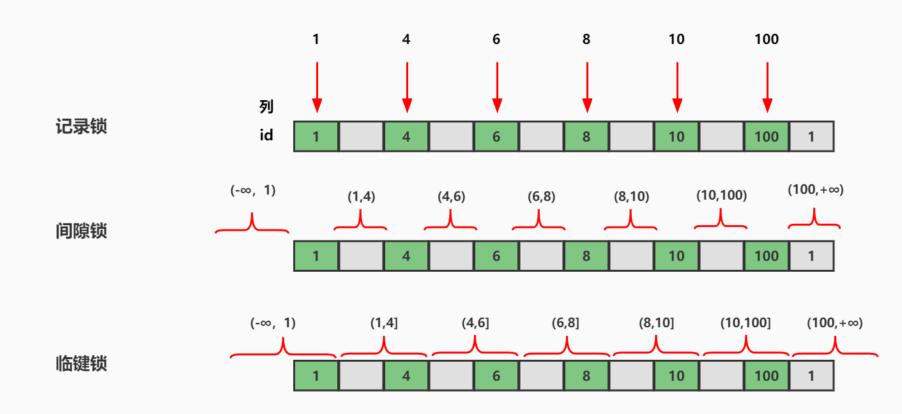

session1 执行：

```sql
begin;
sel ect * from t1_simple where id > 4 for update; -- 加间隙锁
-- 临键锁区间 (4,100+)
commit;
```

session2 执行：

```sql
begin;
insert into t1_simple values (7,100); -- 阻塞
insert into t1_simple values (3,100); -- 成功
commit;
```

#### （3）临键锁

临键锁（Next-Key Locks）相当于记录锁 + 间隙锁【**左开右闭区间**】，例如 `(5,8]`

- 默认情况下，innodb 使用 **临键锁** 来锁定记录，但在不同的场景中会退化
- 当查询的索引含有唯一属性的时候，**临键锁 **会进行优化，将其降级为 **记录锁** ，即仅锁住索引本身，不是范围。

**普通索引 index(pubtime) 行锁的区间划分图：**

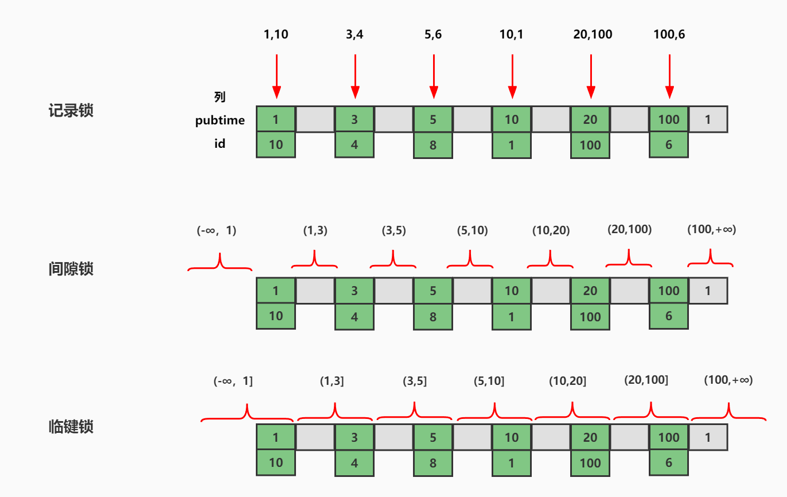

| 场景                                          | 退化成的锁类型 |
| --------------------------------------------- | -------------- |
| 使用 Unique index 精确匹配【=】，且记录存在   | 记录锁         |
| 使用 Unique index 精确匹配【=】，且记录不存在 | 间隙锁         |
| 使用 Unique index 范围匹配【< 和 >】          | 临键锁         |
| 非 Unique index                               | 临键锁         |


当前数据库中的记录信息：

```sql
mysql> select * from t1_simple;
```

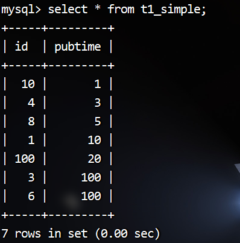

session1 执行：

```sql
begin;
-- 20 是存在的，但是为非唯一性，所以默认使用临键锁
select * from t1_simple where pubtime = 20 for update;
-- 临键锁区间(10,20],(20,100]
commit;
```

session2 执行：

```sql
begin;
insert into t1_simple values (16, 19); -- 阻塞
select * from t1_simple where pubtime = 20 for update; -- 阻塞
insert into t1_simple values (16, 50); -- 阻塞
insert into t1_simple values (16, 101); -- 成功
commit;
```

#### （4）插入意向锁

间隙锁可以帮我们在一定程度上解决幻读问题，但是间隙锁就是最佳的解决思路吗，还有没有优化空间？

```sql
insert into t1_simple values (60, 200); -- 阻塞
insert into t1_simple values (70, 300); -- 阻塞
```

按照之前学习的关于 间隙锁 的知识分析，此时间隙锁的范围是 (11,99)，意思是这个范围的 id 都不可以插入。如果是这样的话数据插入效率太低，**锁范围比较大**，很容易发生锁冲突怎么办？

插入意向锁就是用来解决这个问题的！

**什么是插入意向锁？**

插入意向锁（Insert Intention Locks）是一种在 INSERT 操作之前设置的一种特殊的间隙锁。

- 插入意向锁表示了一种插入意图，即 **当多个不同的事务，同时往同一个索引的同一个间隙中插入数据的时候，它们互相之间无需等待，即不会阻塞** 。
- 插入意向锁不会阻止插入意向锁，但是插入意向锁会阻止其他 **间隙写锁（排他锁）** 、**记录锁** 。

举个栗子：有两个事务分别尝试插入值为 60 和 70 的记录，每个事务使用插入意向锁锁定 11 和 99 之间的间隙，但是这两个事务不会相互阻塞，因为行是不冲突的！这就是插入意向锁。

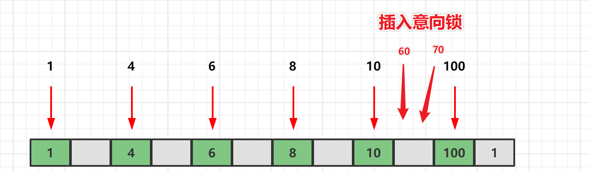

session1 执行：

```sql
begin;
insert into t1_simple values (60, 200); 
-- 插入意向锁区间(10,100)
commit;
begin;
select * from t1_simple where id > 10 for update;
-- 临键锁（区间）写锁区间(10,100+)
commit;
```

session2 执行：

```sql
begin;
insert into t1_simple values (70, 300); -- 没有发生阻塞
-- 插入意向锁区间(10,100)
commit;
-- 说明两个插入意向锁之间是兼容的，可以共存!
begin;
insert into t1_simple values (90, 300); -- 被阻塞，阻塞的原因在于，插入意向锁和其他写锁之间是互斥的！
commit;
```

趁着阻塞，在新会话中，通过 `show engine innodb status\G` 指令，可以看到加锁日志信息，重点看 TRANSACTION：

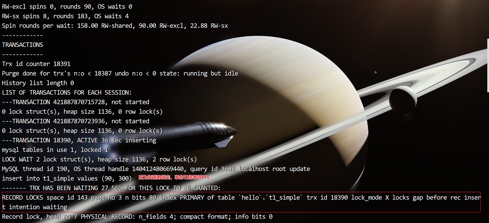

在输出的内容中，红色框选中的地方，清楚的表明了插入意向锁（insert intention）的存在。

### 加锁规则

**主键索引**

- 等值条件，命中，加记录锁
- 等值条件，未命中，加间隙锁
- 范围条件，命中，包含where条件的临键区间，加临键锁
- 范围条件，没有命中，加间隙锁

**辅助索引**

- 等值条件，命中，命中记录的辅助索引项 + 主键索引项加记录锁，辅助索引项两侧加间隙锁
- 等值条件，未命中，加间隙锁
- 范围条件，命中，包含 where 条件的临键区间加临键锁。命中记录的 id 索引项加记录锁
- 范围条件，没有命中，加间隙锁

### 意向锁

#### 什么是意向锁？

相当于存储引擎级别的表锁

InnoDB 也实现了表级锁，也就是意向锁【Intention Locks】。意向锁是MySQL内部使用的，不需要用户干预。**意向锁和行锁可以共存** ，意向锁的主要作用是为了 **全表更新数据时的提升性能** 。否则在全表更新数据时，需要先检索该范是否某些记录上面有行锁。那么将是一件非常繁琐且耗时操作。

**举个栗子：**

事务 A 修改 user 表的记录 r，会给记录 r 上一把行级的 **写锁**，同时会给 user 表上一把 **意向写锁（IX）**，这时事务 B 要给 user 表上一个表级的 **写锁** 就会被阻塞。**意向锁** 通过这种方式实现了行锁和表锁共存，且满足事务隔离性的要求。

当我们需要加一个写锁时，需要根据意向锁去判断表中有没有数据行被锁定；

- 如果行锁，则需要遍历每一行数据去确认；
- 如果表锁，则只需要判断一次即可知道有没数据行被锁定，提升性能。

#### 2）作用

- 表明：“某个事务正在某些行持有了锁、或该事务准备去持有锁”
- 意向锁的存在是为了协调行锁和表锁的关系，支持多粒度（表锁与行锁）的锁并存

#### 3）意向锁和读锁、写锁的兼容关系

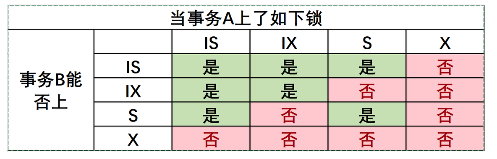

- 意向锁相互兼容：因为IX、IS只是表明申请更低层次级别元素（比如 page、记录）的X、S操作。
- 表级S锁和X、IX锁不兼容：因为上了表级S锁后，不允许其他事务再加X锁。
- 表级X锁和 IS、IX、S、X不兼容：因为上了表级X锁后，会修改数据。

> 注意：上了行级写锁后，行级写锁不会因为有别的事务上了意向写锁而堵塞，一个MySQL是允许多个行级写锁同时存在的，只要他们不是针对相同的数据行。

## 行级锁分析实战

从最简单的例子说起，下面两条简单的 SQL，他们加的什么锁？

```SQL
-- SQL1：
select * from t1 where id = 10;
-- SQL2：
delete from t1 where id = 10;
```

针对这个问题，该怎么回答？

能想象到的一个答案是：

- SQL1：不加锁。因为 MySQL 是使用多版本并发控制的，读不加锁。
- SQL2：对id = 10的记录加写锁 (走主键索引)

这个答案对吗？说不上来。即可能是正确的，也有可能是错误的，已知条件不足，这个问题没有答案。必须还要知道以下的一些前提，前提不同，能给出的答案也就不同。要回答这个问题，还缺少哪些前提条件？

- **前提一** ：id列是不是主键？
- **前提二** ：当前系统的隔离级别是什么？
- **前提三** ： id列如果不是主键，那么id列上有索引吗？ 
- **前提四** ： id列上如果有二级索引，那么这个索引是唯一索引吗？
- **前提五** ：两个SQL的执行计划是什么？索引扫描？全表扫描？

> 注：下面的这些组合，需要做一个前提假设，也就是有索引时，执行计划一定会选择使用索引进行过滤 (索引扫描)。但实际情况会复杂很多，真正的执行计划，还是需要根据MySQL输出的为准！！！

### 读已提交（RC）隔离级别

> 注：在前面八种组合下，也就是RC，RR隔离级别下SQL1：**Select 操作均不加锁，采用的是快照读** ，因此在下面的讨论中就忽略了，**主要讨论 SQL2：delete 操作的加锁** 。

#### 组合一：id是主键，RC隔离级别

给定 SQL：`delete from t1 where id = 10;` 

只需要将主键上 id = 10 的记录加上写锁即可。如下图所示：

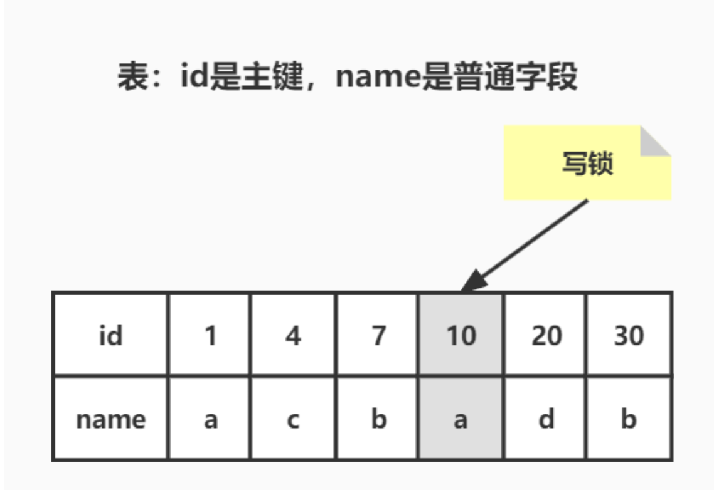

#### 组合二：id是唯一索引，RC隔离级别

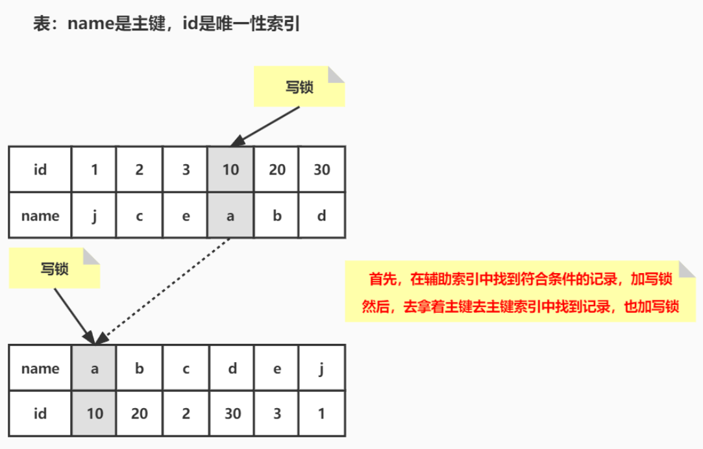

此组合中，id 是 unique 索引，而主键是 name 列。此时，加锁的情况由于组合一有所不同。由于 id 是 unique 索引，因此 delete 语句会选择走 id 列的索引进行 where 条件的过滤，在找到 id=10 的记录后，首先会将 unique 索引上的 id=10 索引记录加上 **写锁** ，同时，会根据读取到的 name 列，回主键索引（聚簇索引），然后将聚簇索引上的 name = ‘d’ 对应的主键索引项加 **写锁** 。

> **为什么聚簇索引上的记录也要加锁？**
>
> 试想一下，如果并发的一个 SQL，是通过主键索引来更新：
>
> ```SQL
> update t1 set id = 100 where name = ‘a’; 
> ```
>
> 此时，如果 delete 语句没有将主键索引上的记录加锁，那么并发的 update 就会感知不到 delete 语句的存在，**违背了同一记录上的更新 / 删除需要串行执行的约束** 。

**结论**：若 id 列是 unique 列，其上有 unique 索引。那么SQL需要加 **两个写锁**，一个对应于 id unique 索引上的id = 10的记录，另一把锁对应于聚簇索引上的【name=’d’,id=10】的记录。

#### 组合三：id非唯一索引，RC隔离级别

相对于组合一、二，组合三又发生了变化，隔离级别仍旧是 RC 不变，但是 id 列上的约束又降低了，id 列不再唯一，只有一个普通的索引。假设 `delete from t1 where id = 10;`  语句，仍旧选择id列上的索引进行过滤where条件，那么此时会持有哪些锁？

同样见下图：

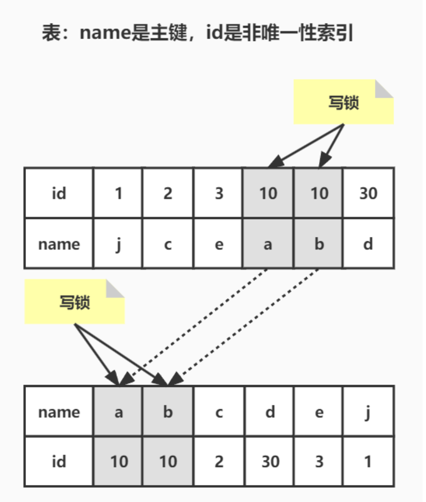

根据此图，可以看到，首先，id 列索引上，满足 id = 10 查询条件的记录，均已加锁。同时，这些记录对应的主键索引上的记录也都加上了锁。与组合二唯一的区别在于，组合二最多只有一个满足等值查询的记录，而组合三会将所有满足查询条件的记录都加锁。

**结论**：若 id 列上有非唯一索引，**那么对应的所有满足 SQL 查询条件的记录，都会被加锁。同时，这些记录在主键索引上的记录，也会被加锁** 。

#### 组合四：id无索引，RC隔离级别

相对于前面三个组合，这是一个比较特殊的情况。id列上没有索引，`where id = 10;` 这个过滤条件，没法通过索引进行过滤，那么只能走全表扫描做过滤。

对应于这个组合，SQL 会加什么锁？或者是换句话说，全表扫描时，会加什么锁？

请看下图：

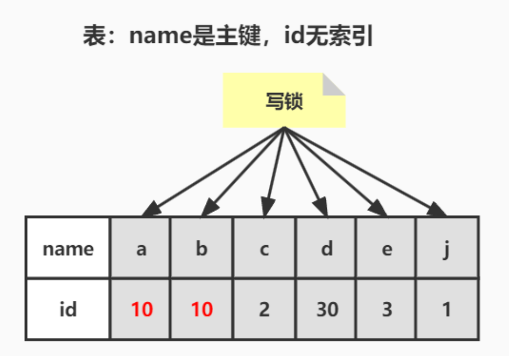

**由于 id 列上没有索引，因此只能走聚簇索引，进行全部扫描**。 从图中可以看到，满足删除条件的记录有两条，但是，聚簇索引上所有的记录，都被加上了**写锁**。无论记录是否满足条件，全部被加上 **写锁** 。既不是加表锁，也不是在满足条件的记录上加行锁。

**结论**：若 id 列上没有索引，SQL会走聚簇索引的全扫描进行过滤，由于过滤是由 MySQL Server 层面进行的。**因此每条记录，无论是否满足条件，都会被加上写锁**。但是，为了效率考量，MySQL 做了优化，对于不满足条件的记录，会在判断后放锁，最终持有的，是满足条件的记录上的锁，但是不满足条件的记录上的加锁/放锁动作不会省略。

### 可重复读（RR）隔离级别

#### 组合五：id 是主键，RR隔离级别

跟组合一一样。

#### 组合六：id 是唯一索引，RR隔离级别

跟组合二一样

#### 组合七：id 是非唯一性索引，RR合理级别

RR 不允许幻读的发生！

相对于组合三最大的区别在于，组合七中多了一个 **间隙锁**。其实这个多出来的间隙锁，就是 RR 隔离级别，相对于 RC 隔离级别，不会出现幻读的关键。

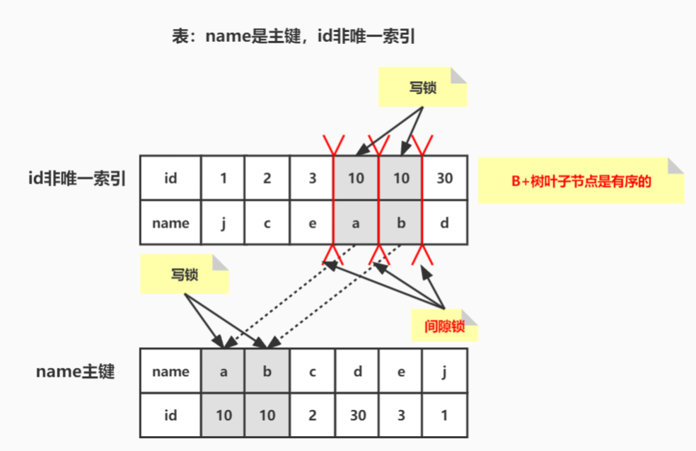

RR隔离级别下，id 列上有一个非唯一索引，对应 `SQL：delete from t1 where id = 10; ` 

- 首先，通过 id 索引定位到第一条满足查询条件的记录，加记录上的写锁，加 GAP 上的间隙锁
- 然后加主键聚簇索引上的记录 **写锁**，然后返回
- 然后读取下一条，重复进行
- 直至进行到第一条不满足条件的记录，此时，不需要加记录 **写锁** ，但是仍旧需要加间隙锁
- 最后返回结束

#### 组合八：id 无索引，RR隔离级别

组合八，RR隔离级别下的最后一种情况，**id列上没有索引**。此时SQL：`delete from t1 where id = 10;` 没有其他的路径可以选择，只能进行全表扫描。最终的加锁情况，如下图所示：

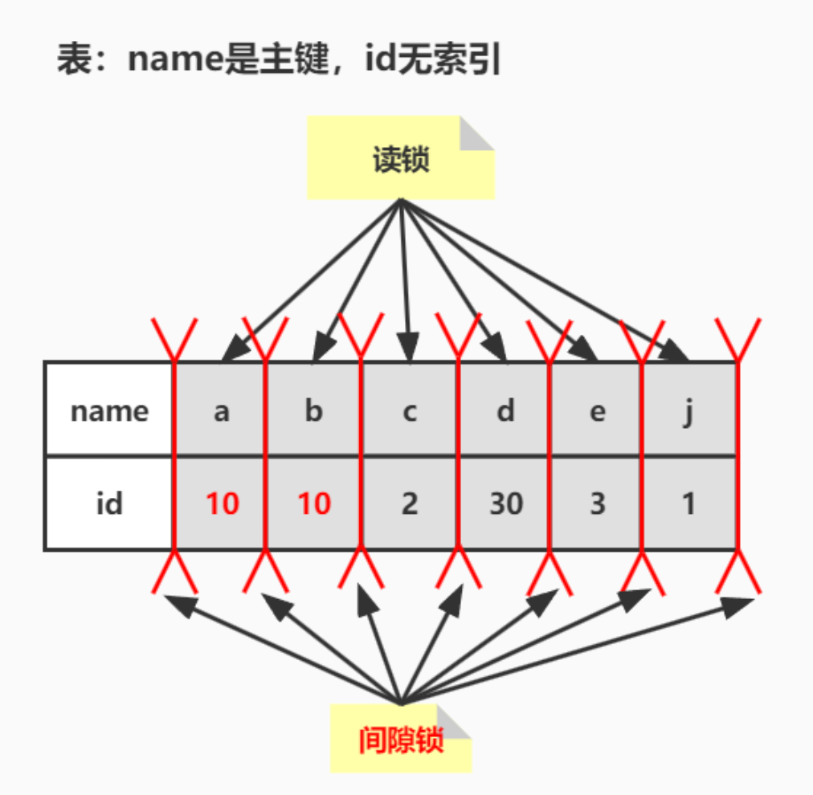

如图，这是一个很恐怖的现象。首先，聚簇索引上的所有记录，都被加上了 **写锁** 。其次，聚簇索引每条记录间的间隙，**也同时被加上了间隙锁**。这个示例表，只有6条记录，一共需要6个记录锁，7个间隙锁。试想，如果表上有1000万条记录呢？

在这种情况下，这个表上，除了不加锁的快照读，**其他任何加锁的并发 SQL，均不能执行，不能更新，不能删除，不能插入，全表被锁死**。

当然，跟组合四类似，这个情况下，MySQL也做了一些优化，就是所谓的semi-consistent read。semi-consistent read开启的情况下，对于不满足查询条件的记录，MySQL会提前放锁。针对上面的这个用例，就是除了记录[d,10]，[g,10]之外，所有的记录锁都会被释放，同时不加间隙锁。

**结论** ： 在 RR 隔离级别下，如果进行全表扫描的当前读，那么会锁上表中的所有记录，同时会锁上聚簇索引内的所有间隙，**杜绝所有的并发 更新/删除/插入 操作**。当然，也可以通过触发semi-consistent read，来缓解加锁开销与并发影响，但是semi-consistent read本身也会带来其他问题，不建议使用。

### 串行化

对于 SQL2 来说，Serializable 隔离级别与 RR 隔离级别组合八情况完全一致，因此不做介绍。

```SQL
delete from t1 where id = 10
```

Serializable 隔离级别，影响的是SQL1 这条SQL：

```SQL
select * from t1 where id = 10
```

**在 RC，RR 隔离级别下，都是快照读，不加锁**。但是在 Serializable 隔离级别，SQL1 会加读锁，也就是说快照读不复存在，**MVCC 并发控制降级为 LBCC** 。

**结论：** 在 MySQL/InnoDB 中，所谓的读不加锁，并不适用于所有的情况，而是隔离级别相关的。Serializable隔离级别，读不加锁就不再成立，所有的读操作，都是当前读。

