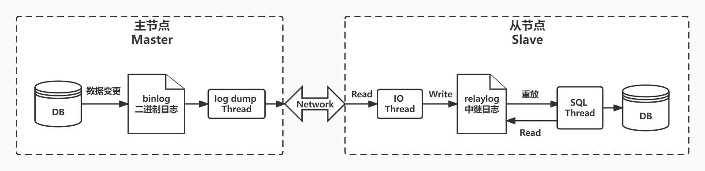
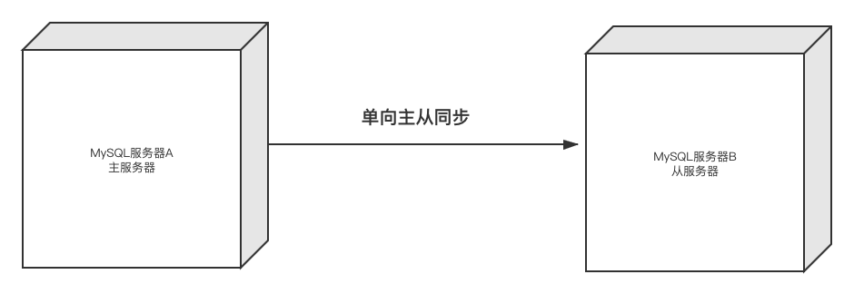
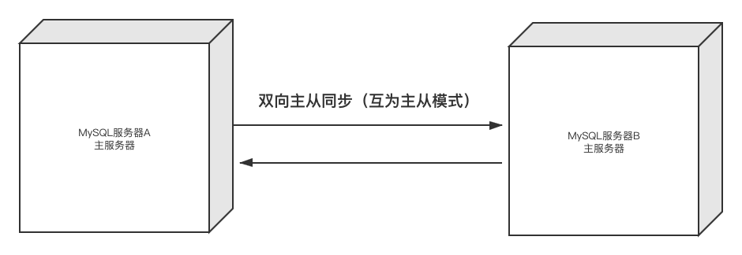
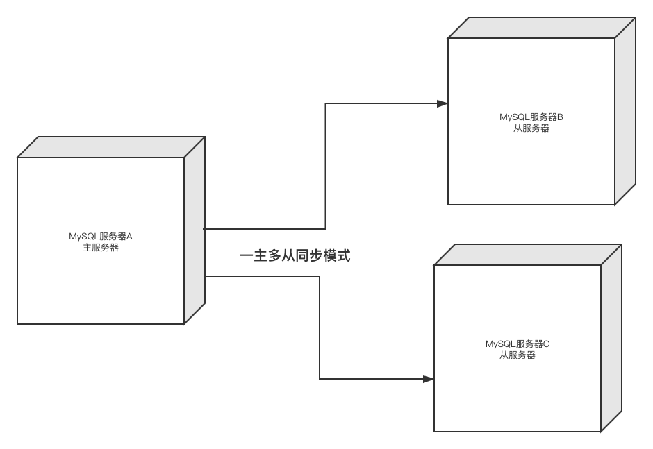
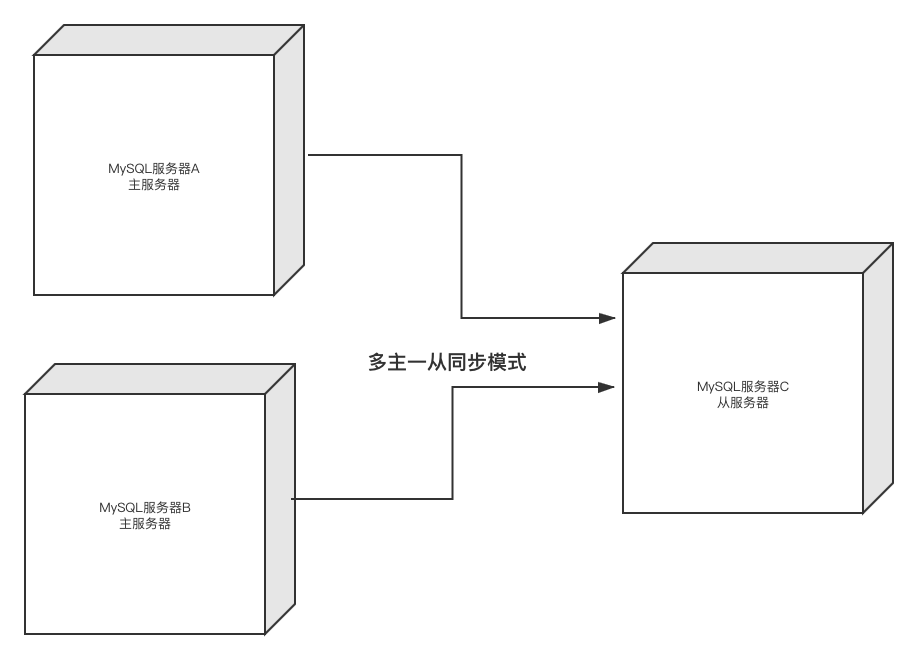
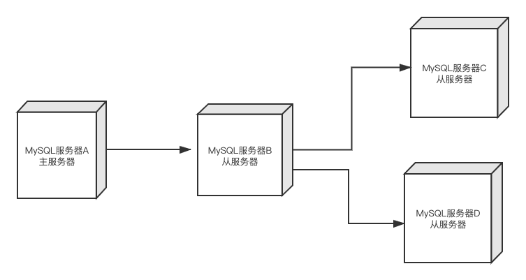
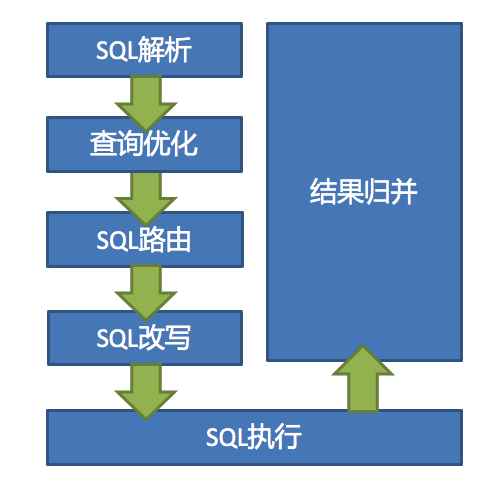

# 【MySQL】高可用：主从复制

## 主从复制作用

通过搭建 MySQL 主从集群，可以缓解 MySQL 的数据存储以及访问的压力。

1. **数据安全** （主备）：给主服务增加一个数据备份。基于这个目的，可以搭建主从架构，或者也可以基于主从架构搭建互主的架构。
2. **读写分离** （主从）：对于大部分的 Java 业务系统来说，都是读多写少的，读请求远远高于写请求。这时，当主服务的访问压力过大时，可以将数据读请求转为由从服务来分担，主服务只负责数据写入的请求，这样大大缓解数据库的访问压力。
3. **故障转移-高可用** ：当 MySQL 主服务宕机后，可以由一台从服务切换成为主服务，继续提供数据读写功能。对于高可用架构，主从数据的同步也只是实现故障转移的一个前提条件，要实现 MySQL 主从切换，还需要依靠一些其他的中间件来实现。比如 MMM、MHA、MGR。

在一般项目中，如果数据库的访问压力没有那么大，那读写分离不一定是必须要做的，但是，主从架构和高可用架构则是必须要搭建的。

## 主从复制原理



MySQL 服务的主从架构都是通过 `binlog` 日志文件来进行的。

**具体流程如下：**

1. 在主服务上打开 **binlog** 记录每一步的数据库操作
2. 然后，从服务上会有一个 **IO 线程** ，负责跟主服务建立一个 TCP 连接，请求主服务将 binlog 传输过来
3. 这时，主库上会有一个 **IO dump 线程** ，负责通过这个 TCP 连接把 binlog 日志传输给从库的IO线程
4. 主服务器 MySQL 服务将所有的写操作记录在 binlog 日志中，并生成 log dump 线程，将 binlog 日志传给从服务器 MySQL 服务的 I/O 线程。
5. 接着从服务的 IO 线程会把读取到的 binlog 日志数据写入自己的 **中继日志 relay** 日志文件中。
6. 然后从服务上 **另外一个 SQL 线程** 会读取 relay 日志里的内容，进行操作重演，达到还原数据的目的。

> - **binlog** ： 二进制日志，将数据改变记录到二进制（binary）日志中，可用于本机数据恢复和主从同步。
> - **relaylog** ：中继日志，Slave 节点会把中继日志中的事件信息一条一条的在本地执行一次，实现主从同步这个过程也叫数据重放。

**注意：**

1. 主从复制是异步的逻辑的 SQL 语句级的复制
2. 复制时，主库有一个 I/O 线程，从库有两个线程，即 I/O 和 SQL 线程
3. 实现主从复制的必要条件是主库要开启记录 `binlog` 的功能
4. 作为复制的所有 MySQL 节点的 `server-id ` 都不能相同
5. binlog 文件只记录对数据内容有更改的 SQL 语句，不记录任何查询语句
6. 双方MySQL必须版本一致，至少需要主服务的版本低于从服务
7. 两节点间的时间需要同步

## 主从复制形式

#### 1）一主一从（备份）



#### 2）主主复制



#### 3）一主多从



#### 4）多主一从

> 5.7后开始支持



#### 5）联级复制



## Sharding JDBC 工具

Apache ShardingSphere 是一款 **分布式的数据库生态系统** ，可以将 **任意数据库** 转换为 **分布式数据库** ，并通过数据分片、弹性伸缩、加密等能力对原有数据库进行增强。

由`Sharding-JDBC、Sharding-Proxy 和 Sharding-Sidecar`这 3 款相互独立，却又能够混合部署配合使用的产品组成。

### 核心概念

- **逻辑表** ：水平拆分的数据库（表）的相同逻辑和数据结构表的总称。
- **真实表** ： 在分片的数据库中真实存在的物理表。
- **数据节点** ： 数据分片的最小单元。由数据源名称和数据表组成。
- **绑定表** ： 指分片规则一致的主表和子表。
    - 例如：`t_order`表和`t_order_item`表，均按照`order_id`分片，则此两张表互为绑定表关系。绑定表之间的多表关联查询不会出现笛卡尔积关联，关联查询效率将大大提升。
- **广播表** ：指所有的分片数据源中都存在的表，表结构和表中的数据在每个数据库中均完全一致。适用于数据量不大且需要与海量数据的表进行关联查询的场景，例如：字典表。



数据分片主要流程是完全一致的。

 核心由`SQL解析 => 执行器优化 => SQL路由 => SQL改写 => SQL执行 => 结果归并`的流程组成

### 实现读写分离

```sql
CREATE TABLE `t_user` (
  `id` int(11) NOT NULL AUTO_INCREMENT,
  `name` varchar(10) DEFAULT NULL,
  `age` int(11) DEFAULT NULL,
  `address` varchar(20) DEFAULT NULL,
  PRIMARY KEY (`id`) USING BTREE
) ENGINE=InnoDB AUTO_INCREMENT=3 DEFAULT CHARSET=utf8;
```

#### 基于Spring Boot

```properties
spring.shardingsphere.datasource.names=master,slave0,slave1
# 配置主库
spring.shardingsphere.datasource.master.type=com.zaxxer.hikari.HikariDataSource
spring.shardingsphere.datasource.master.driverClassName=com.mysql.cj.jdbc.Driver
spring.shardingsphere.datasource.master.jdbc-url=jdbc:mysql://123.57.135.5:3306/hello?serverTimezone=Asia/Shanghai&useUnicode=true&characterEncoding=utf-8
spring.shardingsphere.datasource.master.username=root
spring.shardingsphere.datasource.master.password=hero@202207
# 配置第一个从库
spring.shardingsphere.datasource.slave0.type=com.zaxxer.hikari.HikariDataSource
spring.shardingsphere.datasource.slave0.driverClassName=com.mysql.cj.jdbc.Driver
spring.shardingsphere.datasource.slave0.jdbc-url=jdbc:mysql://47.95.211.46:3306/hello?serverTimezone=Asia/Shanghai&useUnicode=true&characterEncoding=utf-8
spring.shardingsphere.datasource.slave0.username=root
spring.shardingsphere.datasource.slave0.password=hero@202207
# 配置第二个从库
spring.shardingsphere.datasource.slave1.type=com.zaxxer.hikari.HikariDataSource
spring.shardingsphere.datasource.slave1.driverClassName=com.mysql.cj.jdbc.Driver
spring.shardingsphere.datasource.slave1.jdbc-url=jdbc:mysql://123.57.135.5:3306/hello?serverTimezone=Asia/Shanghai&useUnicode=true&characterEncoding=utf-8
spring.shardingsphere.datasource.slave1.username=root
spring.shardingsphere.datasource.slave1.password=hero@202207

spring.shardingsphere.masterslave.name=ms
spring.shardingsphere.masterslave.master-data-source-name=master
spring.shardingsphere.masterslave.slave-data-source-names=slave0,slave1

# spring.shardingsphere.props.sql.show=true
```

#### 不使用Spring

```java
public class MasterSlaveDataSource {
    private static DataSource dataSource;

    public static DataSource getInstance() {
        if (dataSource != null) {
            return dataSource;
        }
        try {
            return create();
        } catch (SQLException throwables) {
            throwables.printStackTrace();
        }
        return null;
    }

    private static DataSource create() throws SQLException {
        // 配置真实数据源
        Map<String, DataSource> dataSourceMap = new HashMap<>();

        // 配置第 1 个数据源
        DruidDataSource masterDataSource = new DruidDataSource();
        masterDataSource.setDriverClassName("com.mysql.cj.jdbc.Driver");
        masterDataSource.setUrl("jdbc:mysql://123.57.135.5:3306/hello?serverTimezone=Asia/Shanghai&useUnicode=true&characterEncoding=utf-8");
        masterDataSource.setUsername("root");
        masterDataSource.setPassword("root");
        dataSourceMap.put("master", masterDataSource);

        // 配置第一个从库
        DruidDataSource slaveDataSource1 = new DruidDataSource();
        slaveDataSource1.setDriverClassName("com.mysql.cj.jdbc.Driver");
        slaveDataSource1.setUrl("jdbc:mysql://47.95.211.46:3306/hello?serverTimezone=Asia/Shanghai&useUnicode=true&characterEncoding=utf-8");
        slaveDataSource1.setUsername("root");
        slaveDataSource1.setPassword("root");
        dataSourceMap.put("slave01", slaveDataSource1);
        // 配置第二个从库
        DruidDataSource slaveDataSource2 = new DruidDataSource();
        slaveDataSource2.setDriverClassName("com.mysql.cj.jdbc.Driver");
        slaveDataSource2.setUrl("jdbc:mysql://123.57.135.5:3306/hello?serverTimezone=Asia/Shanghai&useUnicode=true&characterEncoding=utf-8");
        slaveDataSource2.setUsername("root");
        slaveDataSource2.setPassword("root");
        dataSourceMap.put("slave02", slaveDataSource2);

        // 配置读写分离规则
        MasterSlaveRuleConfiguration masterSlaveRuleConfig = new MasterSlaveRuleConfiguration("masterSlaveDataSource", "master", Arrays.asList("slave01", "slave02"));

        // 获取数据源对象
        dataSource = MasterSlaveDataSourceFactory.createDataSource(dataSourceMap, masterSlaveRuleConfig , new Properties());
        //返回数据源
        return dataSource;
    }
}
```

### 实现分库分表

```SQL
create database ds0;
use ds0;
CREATE TABLE `t_order0` (
  `order_id` int(11) NOT NULL,
  `user_id` int(11) NOT NULL,
  `info` varchar(100) DEFAULT NULL,
  PRIMARY KEY (`order_id`)
) ENGINE=InnoDB DEFAULT CHARSET=utf8;

CREATE TABLE `t_order1` (
  `order_id` int(11) NOT NULL,
  `user_id` int(11) NOT NULL,
  `info` varchar(100) DEFAULT NULL,
  PRIMARY KEY (`order_id`)
) ENGINE=InnoDB DEFAULT CHARSET=utf8;
```

#### 基于Spring Boot

```yaml
spring.shardingsphere.datasource.names: ds0,ds1

# 配置数据源ds0
spring.shardingsphere.datasource.ds0.type: com.zaxxer.hikari.HikariDataSource
spring.shardingsphere.datasource.ds0.driverClassName: com.mysql.jdbc.Driver
spring.shardingsphere.datasource.ds0.jdbc-url: jdbc:mysql://123.57.135.5:3306/ds0?serverTimezone=Asia/Shanghai&useUnicode=true&characterEncoding=utf-8
spring.shardingsphere.datasource.ds0.username: root
spring.shardingsphere.datasource.ds0.password: hero@202207

# 配置数据源ds1
spring.shardingsphere.datasource.ds1.type: com.zaxxer.hikari.HikariDataSource
spring.shardingsphere.datasource.ds1.driverClassName: com.mysql.jdbc.Driver
spring.shardingsphere.datasource.ds1.jdbc-url: jdbc:mysql://47.95.211.46:3306/ds1?serverTimezone=Asia/Shanghai&useUnicode=true&characterEncoding=utf-8
spring.shardingsphere.datasource.ds1.username: root
spring.shardingsphere.datasource.ds1.password: hero@202207

# 配置分库策略
spring.shardingsphere.sharding.default-database-strategy.inline.sharding-column: user_id
spring.shardingsphere.sharding.default-database-strategy.inline.algorithm-expression: ds$->{user_id % 2}

# 配置分表策略
spring.shardingsphere.sharding.tables.t_order.actual-data-nodes: ds$->{0..1}.t_order$->{0..1}
spring.shardingsphere.sharding.tables.t_order.table-strategy.inline.sharding-column: order_id
spring.shardingsphere.sharding.tables.t_order.table-strategy.inline.algorithm-expression: t_order$->{order_id % 2}
```

#### 不使用Spring

```java
public class ShardingDataSource {
    private static DataSource dataSource;

    public static DataSource getInstance() {
        if (dataSource != null) {
            return dataSource;
        }
        try {
            return create();
        } catch (SQLException throwables) {
            throwables.printStackTrace();
        }
        return null;
    }

    private static DataSource create() throws SQLException {
        // 配置真实数据源
        Map<String, DataSource> dataSourceMap = new HashMap<>();

        // 配置第一个数据源
        DruidDataSource dataSource1 = new DruidDataSource();
        dataSource1.setDriverClassName("com.mysql.cj.jdbc.Driver");
        dataSource1.setUrl("jdbc:mysql://123.57.135.5:3306/ds0?serverTimezone=Asia/Shanghai&useUnicode=true&characterEncoding=utf-8");
        dataSource1.setUsername("root");
        dataSource1.setPassword("hero@202207");
        dataSourceMap.put("ds0", dataSource1);

        // 配置第二个数据源
        DruidDataSource dataSource2 = new DruidDataSource();
        dataSource2.setDriverClassName("com.mysql.cj.jdbc.Driver");
        dataSource2.setUrl("jdbc:mysql://47.95.211.46:3306/ds1?serverTimezone=Asia/Shanghai&useUnicode=true&characterEncoding=utf-8");
        dataSource2.setUsername("root");
        dataSource2.setPassword("hero@202207");
        dataSourceMap.put("ds1", dataSource2);

        // 配置Order表规则
        TableRuleConfiguration orderTableRuleConfig = new TableRuleConfiguration("t_order","ds${0..1}.t_order${0..1}");

        // 配置分库 + 分表策略
        // user_id % 2等于0，则进入ds0库，如果等于1则进入ds1库
        orderTableRuleConfig.setDatabaseShardingStrategyConfig(new InlineShardingStrategyConfiguration("user_id", "ds${user_id % 2}"));
        // order_id % 2等于0，则进入t_order0表，如果等于1则进入t_order1表
        orderTableRuleConfig.setTableShardingStrategyConfig(new InlineShardingStrategyConfiguration("order_id", "t_order${order_id % 2}"));

        // 配置分片规则
        ShardingRuleConfiguration shardingRuleConfig = new ShardingRuleConfiguration();
        shardingRuleConfig.getTableRuleConfigs().add(orderTableRuleConfig);

        // 创建数据源
        DataSource dataSource = ShardingDataSourceFactory.createDataSource(dataSourceMap, shardingRuleConfig, new Properties());
        return dataSource;
    }
}
```