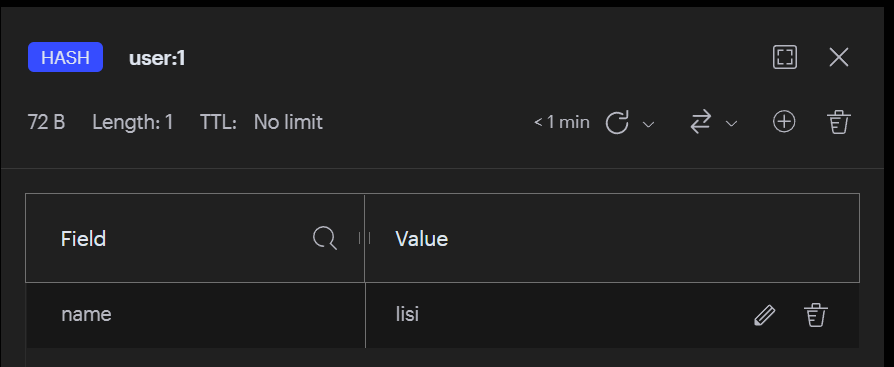

# 【Redis】基本使用

## 通用命令

#### 1）切换数据库

Redis 服务器在单机状态下在启动时将会创建 16 个数据库，分别用数字编号 0-15 ，数据库名不可更改。

```powershell
127.0.0.1:6379> select 5
OK
```

客户端提示符末尾的[5]表示客户端现在使用 5 号数据库。注意：redis-cli 在使用默认的 0 号数据库时不会打印出数据库号码。

#### 2）key匹配

查找所有符合给定模式pattern（正则表达式）的 key 。

**注意：生产环境慎用keys ，因为这个命令的时间复杂度是 $O(n)$  。**

| 匹配符  | 作用                       | 例子                                                         |
| ------- | -------------------------- | ------------------------------------------------------------ |
| `*`     | 匹配领个或任意多个任意字符 | `user:\* `可以匹配任何以user:为前缀的字符串，比如：user:ip、user:123:profile以及user:本身。<br>`*z`可以匹配任何以字母z结尾的字符串，比如：jazz、quartz以及z本身 |
| `?`     | 匹配任意的单个字符         | `user:i?`可以匹配任何以`user:i`为前缀，后跟单个字符的字符串，比如：`user:ip`、`user:id`等，但不能匹配`user:ime` |
| `[]`    | 匹配给定字符串中的单个字符 | `user:i\[abc]`可以匹配user:ia、user:ib、user:ic，但不能匹配user:id 、user:ime等。 |
| `[?-?]` | 匹配给定范围中的单个字符   | user:i[a-d]可以匹配user:ia、user:ib、user:ic、user:id，但不能匹配除此以外的其他字符串，比如user:ip 、user:ime等 |

```powershell
127.0.0.1:6379> set user:1 "hero"
OK
127.0.0.1:6379> set user:2 "liubei"
OK
127.0.0.1:6379> keys user:*
1) "user:2"
2) "user:1"
127.0.0.1:6379> keys *
1) "user:2"
2) "user:1"
```

#### 3）删除键值对

```powershell
127.0.0.1:6379> del user:1
(integer) 1
```

#### 4）判断key是否存在

```powershell
127.0.0.1:6379> exists user:2
(integer) 1
```

#### 5）查看key的数据类型

```powershell
127.0.0.1:6379> type user:2
string
```

#### 6）设置key的生存时间

```powershell
127.0.0.1:6379> expire user:2 3
(integer) 1
127.0.0.1:6379> get user:2
(nil)
```

#### 7）查看key剩余存活时间

- 返回值如果是 -1，则表示 key 存在并且没有设置过期时间（永久有效）
- **返回值如果是 -2，则表示 key 不存在或者已过期**

```powershell
127.0.0.1:6379> set user:1 "hero" ex 10
OK
127.0.0.1:6379> ttl user:1
(integer) 4
127.0.0.1:6379> ttl user:1
(integer) -2
```

#### 8）删除当前数据库所有数据

```powershell
127.0.0.1:6379> flushdb
OK
```

#### 9）**删除所有数据库的所有数据**

```powershell
127.0.0.1:6379> flushall
OK
```

## String命令

String 的常见命令有：

- SET：添加或者修改已经存在的一个String类型的键值对
- GET:  根据key获取String类型的value
- MSET：批量添加多个String类型的键值对
- MGET：根据多个key获取多个String类型的value
- INCR：让一个整型的key自增1
- INCRBY：让一个整型的key自增并指定步长，例如：incrby num 2 让num值自增2
- INCRBYFLOAT：让一个浮点类型的数字自增并指定步长
- SETNX：添加一个String类型的键值对，前提是这个key不存在，否则不执行
- SETEX：添加一个String类型的键值对，并且指定有效期

#### 1）赋值

```powershell
SET key value  [EX  seconds]  [PX  milliseconds]  [NX|XX]
```

set命令有几个选项：

- EX  seconds：为键设置过期时间，单位为 **秒**  。
- PX  milliseconds：为键设置过期时间，单位为 **毫秒**  。
- NX：只有当键不存在时，才可设置成功，**用于添加** 。
- XX：只有当键存在时，才可设置成功，**用于更新** 。

设置name为"hero"：

```powershell
127.0.0.1:6379> SET name "hero"
OK
```

设置过期时间为5秒：

```powershell
127.0.0.1:6379> SET name "hero" EX 5
OK
```

设置过期时间为500毫秒：

```powershell
127.0.0.1:6379> SET name "hero" PX 500
OK
```

当键不存在时才能设置成功：

```powershell
127.0.0.1:6379> SET name "hero" NX
OK
127.0.0.1:6379> SET name "liubei" NX
(nil)
```

当键存在时才能设置成功：

```powershell
127.0.0.1:6379> SET name "liubei" XX
OK
```

#### 2）取值

命令：`GET key`

当键不存在时返回 nil (空)。

```powershell
127.0.0.1:6379> GET name
"yangmi"
```

```powershell
127.0.0.1:6379> GET address
(nil)
```

#### 3）删除

命令：`DEL key [key ...]`

```powershell
127.0.0.1:6379> DEL name
(integer) 1
```

#### 4）计数

##### ① 自增

命令：`INCR key`

INCR 命令用于对值做自增操作，返回结果分为三种情况：

- 值不是整数，返回错误。
- 值是整数，**返回自增后的结果** 。
- **键不存在，按照值为 0 自增，返回结果为 1** 。

```powershell
127.0.0.1:6379> incr age
(integer) 1
127.0.0.1:6379> incr age
(integer) 2
```

##### ② 增加指定的整数

命令：`INCRBY key increment`

```powershell
127.0.0.1:6379> incrby age 5
(integer) 7
```

##### ③ 自减

命令：`DECR key`

```powershell
127.0.0.1:6379> decr age
(integer) 6
```

#### 5）批量设置值

命令：`MSET key value [key value ...]`

```powershell
127.0.0.1:6379> mset name "hero" age 30 address beijing
OK
```

#### 6）批量获取值

命令：`MGET key [key ...]`

```powershell
127.0.0.1:6379> mget name age address
1) "hero"
2) "30"
3) "beijing"
```

## Hash命令

**hash的常见命令:**

- HSET key field value：添加或者修改hash类型key的field的值
- HGET key field: 获取一个hash类型key的field的值
- HMSET：批量添加多个hash类型key的field的值
- HMGET：批量获取多个hash类型key的field的值
- HGETALL：获取一个hash类型的key中的所有的field和value
- HKEYS：获取一个hash类型的key中的所有的field
- HVALS：获取一个hash类型的key中的所有的value
- HINCRBY：让一个hash类型key的字段值自增并指定步长
- HSETNX:添加一个hash类型的key的field值，前提是这个field不存在，否则不执行

**应用场景：**  存储用户信息。

#### 1）设置值

HSET key field value

```powershell
127.0.0.1:6379> hset user:1 name lisi
(integer) 1
```



#### 2）获取值

```powershell
127.0.0.1:6379> hget user:1 name
"lisi"
```

#### 3）删除field

```powershell
127.0.0.1:6379> hdel user:1 name
(integer) 1
```

#### 4）批量设置field-value

```powershell
127.0.0.1:6379> hmset user:1 name "lisi" age "12" city "beijing"
OK
```

#### 5）获取所有的field-value

```powershell
127.0.0.1:6379> hgetall user:1
1) "name"
2) "lisi"
3) "age"
4) "12"
5) "city"
6) "beijing"
```

#### 6）获取所有field

```powershell
127.0.0.1:6379> hkeys user:1
1) "name"
2) "age"
3) "city"
```

#### 7）获取所有value

```bash
127.0.0.1:6379> hvals user:1
1) "lisi"
2) "12"
3) "beijing"
```

#### 8）获取field-value个数

```bash
127.0.0.1:6379> hlen user:1
(integer) 3
```

## List命令

List的常见命令有:

- LPUSH key element ...：向列表左侧插入一个或多个元素
- LPOP key：移除并返回列表左侧的第一个元素，没有则返回nil
- RPUSH key element ...：向列表右侧插入一个或多个元素
- RPOP key：移除并返回列表右侧的第一个元素
- LRANGE key star end：返回一段角标范围内的所有元素。
- BLPOP和BRPOP：与LPOP和RPOP类似，只不过在没有元素时等待指定时间，而不是直接返回nil


#### 1）添加：

##### 从左边插入数据

命令：`LPUSH key value [value ...]`

从左边依次插入“one"、"two"、"three"、"four"四个元素的图解过程：

当然也可以一次性插入多个元素

```powershell
127.0.0.1:6379> lpush numbers "one"
(integer) 1
127.0.0.1:6379> lpush numbers "two"
(integer) 2
127.0.0.1:6379> lpush numbers "three"
(integer) 3
127.0.0.1:6379> lpush numbers "four"
(integer) 4
```

```powershell
127.0.0.1:6379> lpush numbers "one" "two" "three" "four"
(integer) 4
```

##### 从右边插入数据

命令：`RPUSH key value [value ...]`

从又边依次插入“one"、"two"、"three"、"four"四个元素的图解过程：

当然也可以一次性插入多个元素

```powershell
127.0.0.1:6379> rpush numbers "one" 
(integer) 1
127.0.0.1:6379> rpush numbers "two"
(integer) 2
127.0.0.1:6379> rpush numbers "three"
(integer) 3
127.0.0.1:6379> rpush numbers "four"
(integer) 4
```

```powershell
127.0.0.1:6379> rpush numbers "one" "two" "three" "four"
(integer) 4
```

##### 在某个元素的前后插入元素

命令：`LINSERT key BEFORE|AFTER pivot value`

linsert numbers after "two" "six" 命令图解：

```powershell
127.0.0.1:6379> linsert numbers after "two" "six"
(integer) 5
```


#### 2）查找：

##### 获取指定范围内的元素列表

命令：`LRANGE key start stop`

注意：lrange中的stop选项包含了自身。例如想获取列表的第2个到第4个元素，-1为列表中最后一个元素，所以查看所有元素命令为

```powershell
127.0.0.1:6379> lrange numbers 1 3
1) "two"
2) "six"
3) "three"
```

```powershell
127.0.0.1:6379> lrange numbers 0 -1
1) "one"
2) "two"
3) "six"
4) "three"
5) "four"
```

##### 获取列表长度

命令：`LLEN key`

```powershell
127.0.0.1:6379> llen numbers
(integer) 5
```

#### 3）删除：

##### 从列表左侧弹出元素

命令：`LPOP key`

假设现有列表 numbers 有 “one"、"two"、"three"、"four" 四个元素，依次从左侧弹出

```powershell
127.0.0.1:6379> lpop numbers
"one"
127.0.0.1:6379> lpop numbers
"two"
127.0.0.1:6379> lpop numbers
"three"
127.0.0.1:6379> lpop numbers
"four"
127.0.0.1:6379> lpop numbers
(nil)
```

##### 从列表右侧弹出

命令：`RPOP key`

假设现有列表 numbers 有 “one"、"two"、"three"、"four" 四个元素，依次从左侧弹出

```powershell
127.0.0.1:6379> rpop numbers
"four"
127.0.0.1:6379> rpop numbers
"three"
127.0.0.1:6379> rpop numbers
"two"
127.0.0.1:6379> rpop numbers
"one"
127.0.0.1:6379> rpop numbers
(nil)
```

#### 4）修改：

###### 修改指定索引下标的元素

命令：`LSET key index value`

```powershell
127.0.0.1:6379> lset numbers 0 "six"
OK
```

## Set命令

Set 的常见命令有：

- SADD key member ...：向set中添加一个或多个元素
- SREM key member ...：移除set中的指定元素
- SCARD key：返回set中元素的个数
- SISMEMBER key member：判断一个元素是否存在于set中
- SMEMBERS：获取set中的所有元素
- SINTER key1 key2 ...：求key1与key2的交集
- SDIFF key1 key2 ...：求key1与key2的差集
- SUNION key1 key2 ..：求key1和key2的并集

#### 1）集合内操作

##### 添加元素

命令：`SADD key member [member ...]`

```powershell
127.0.0.1:6379> sadd user:1 "java" "go" "vue" "python"
(integer) 4
```

##### 获取所有元素

命令：`SMEMBERS key`

注意顺序，和插入的并不一致，因为 set 是无序的

```powershell
127.0.0.1:6379> smembers user:1
1) "python"
2) "vue"
3) "java"
4) "go"
```

##### 删除元素

命令：`SREM key member [member ...]`

```powershell
127.0.0.1:6379> srem user:1 "vue"
(integer) 1
```

注意：没有直接修改元素的命令，如要修改需要先移除元素后添加元素，这是set的底层数据结构决定的。

#### 2）集合间操作

现在有两个集合：

```powershell
127.0.0.1:6379> sadd user:1 "java" "go" "vue" "python"
127.0.0.1:6379> sadd user:2 "java" "react" "vue" "js"
```

##### 求交集

命令：`SINTER key [key ...]`

```powershell
127.0.0.1:6379> sinter user:1 user:2
1) "vue"
2) "java"
```

##### 求并集

命令：`SUNION key [key ...]`

```powershell
127.0.0.1:6379> sunion user:1 user:2
1) "vue"
2) "java"
3) "react"
4) "go"
5) "python"
6) "js"
```

##### 求差集

命令：`SDIFF key [key ...]`

```powershell
127.0.0.1:6379> sdiff user:1 user:2
1) "python"
2) "go"
```

## ZSet命令

**应用场景：**  排行榜，比如歌曲排行榜、下载排行榜、购买排行榜等。

**SortedSet的常见命令有：**

- ZADD key score member：添加一个或多个元素到sorted set ，如果已经存在则更新其score值
- ZREM key member：删除sorted set中的一个指定元素
- ZSCORE key member：获取sorted set中的指定元素的score值
- ZRANK key member：获取sorted set 中的指定元素的排名
- ZCARD key：获取sorted set中的元素个数
- ZCOUNT key min max：统计score值在给定范围内的所有元素的个数
- ZINCRBY key increment member：让sorted set中的指定元素自增，步长为指定的increment值
- ZRANGE key min max：按照score排序后，获取指定排名范围内的元素
- ZRANGEBYSCORE key min max：按照score排序后，获取指定score范围内的元素
- ZDIFF、ZINTER、ZUNION：求差集、交集、并集

#### 1）添加元素

命令：`ZADD key [NX|XX] [CH] [INCR] score member [score member ...]`

选项：

- NX：member必须不存在，才可以设置成功，用于添加。
- XX：member必须存在，才可以设置成功，用于更新。
- CH：返回此次操作后，有序集合元素和分数发生变化的个数。
- INCR：对score 做增加，相当于后面介绍的ZINCRBY

```powershell
127.0.0.1:6379> zadd country:ranking 1 "America" 2 "China" 3 "Russia" 4 "Japan" 5 "Germany"
(integer) 5
```

#### 2）返回索引范围的成员

命令：

- `ZRANGE key start stop [WITHSCORES]`
- `ZREVRANGE key start stop [WITHSCORES]`
    - **ZRANGE ** 是 **从低到高** 返回，**ZREVRANGE** 则相反，是 **从高到低** 返回。有序集合是按照分值排名的
    - **WITHSCORES**：同时返回成员的分数。
    - 参数**start**和**stop**都是基于零的索引，即`0`是第一个元素，`1`是第二个元素，以此类推。 它们也可以是负数，表示从有序集合的末尾的偏移量，其中`-1`是有序集合的最后一个元素，`-2`是倒数第二个元素，等等。

`start`和`stop`都是全包含的区间，因此例如`ZRANGE country:ranking 0 1`将会返回有序集合的第一个和第二个元素。
如果是ZRANGE country:ranking 0 -1 将返回所有元素。

```powershell
127.0.0.1:6379> zrange country:ranking 0 1 withscores
1) "America"
2) "1"
3) "China"
4) "2"
```

```powershell
127.0.0.1:6379> zrange country:ranking 0 -1 withscores
 1) "America"
 2) "1"
 3) "China"
 4) "2"
 5) "Russia"
 6) "3"
 7) "Japan"
 8) "4"
 9) "Germany"
10) "5"
```

#### 3）增加成员的分数

命令：`ZINCRBY key increment member`

```powershell
127.0.0.1:6379> zincrby country:ranking 1 "Japan"
"5"
127.0.0.1:6379> zrange country:ranking 0 -1 withscores
 1) "America"
 2) "1"
 3) "China"
 4) "2"
 5) "Russia"
 6) "3"
 7) "Germany"
 8) "5"
 9) "Japan"
10) "5"
```

#### 4）删除元素

命令：`ZREM key member [member ...]`

```powershell
127.0.0.1:6379> zrem country:ranking "Germany"
(integer) 1
```


