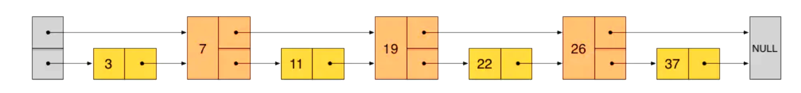

# 【Redis】基本数据结构

## 1 SDS (Simple Dynamic String)

Redis 没有使用 C 语言传统的字符串表示方式（以 ’\0’ 结尾的字符数组），而是自己实现了SDS 的抽象类型， Redis 默认使用 SDS 作为字符串的表示。

### 定义

`attribute((packed))` ：告诉编译器，不要因为内存对齐而在结构体中填充字节，以保证内存的紧凑，这样 sds - 1 就可以得到 flags 字段，进而能够得到其头部类型。如果填充了字节，则就不能得到 flags 字段。

```C
/* Note: sdshdr5 is never used, we just access the flags byte directly.
 * However is here to document the layout of type 5 SDS strings. */
struct __attribute__ ((__packed__)) sdshdr5 {
    unsigned char flags; /* 3 lsb of type, and 5 msb of string length */
    char buf[];
};
struct __attribute__ ((__packed__)) sdshdr8 {
    uint8_t len; 			// 已经使用的字节数
    uint8_t alloc; 			// 实际可以存储的字节最大长度，不包括SDS头部和结尾的空字符
    unsigned char flags; 	// flags中的低3个bit决定使用哪种结构存储字符串，高5bit未使用
    char buf[]; 			// 柔性数组，用来保存实际的字符串
};
struct __attribute__ ((__packed__)) sdshdr16 {
    uint16_t len; /* used */
    uint16_t alloc; /* excluding the header and null terminator */
    unsigned char flags; /* 3 lsb of type, 5 unused bits */
    char buf[];
};
struct __attribute__ ((__packed__)) sdshdr32 {
    uint32_t len; /* used */
    uint32_t alloc; /* excluding the header and null terminator */
    unsigned char flags; /* 3 lsb of type, 5 unused bits */
    char buf[];
};
struct __attribute__ ((__packed__)) sdshdr64 {
    uint64_t len; /* used */
    uint64_t alloc; /* excluding the header and null terminator */
    unsigned char flags; /* 3 lsb of type, 5 unused bits */
    char buf[];
};
```

### 优点

1. **空间预分配** ：当 SDS 的 API 对一个 SDS 进行修改，并且需要对 SDS 进行空间扩展的时候，程序不仅会为 SDS 分配修改所必须要的空间，还会为 SDS 分配额外的未使用空间。**通过空间预分配策略，Redis 可以减少连续执行字符串增长操作所需的内存重分配次数。** 
2. **惰性空间释放** ：用来优化 SDS 字符串缩短操作：当SDS的API对一个 SDS 进行缩短时，程序并不立即回收多出来的字节，而是通过 alloc 和 len 的差值，将这些字节数量保存起来，等待将来使用。
3. **二进制安全** ：SDS 的 API 都会以二进制的方式来处理 SDS 存放在 buf 数组里的数据，Redis 使用这个数组保存的是一系列二进制数据，而不是保存字符。**SDS 使用 len 属性的值判断字符串是否结束，而不是空字符，即 SDS 是二进制安全的。** 

## 2 IntSet

IntSet 是 **有序的整数集合** ，底层实现是数组，有序是通过二分搜索找到插入位置。它是 Set 的底层实现之一，**当一个集合只包含整数值元素，并且这个集合的元素数量不多时，Redis 就会使用 IntSet 作为 Set  的底层实现** 。

```c
typedef struct intset {  	//结构体大小为8
    uint32_t encoding;  	//编码方式
    uint32_t length;  		//数组长度
    int8_t contents[];  	//数组下表从0开始
} intset;

/* Note that these encodings are ordered, so:
 * INTSET_ENC_INT16 < INTSET_ENC_INT32 < INTSET_ENC_INT64. */
#define INTSET_ENC_INT16 (sizeof(int16_t))
#define INTSET_ENC_INT32 (sizeof(int32_t))
#define INTSET_ENC_INT64 (sizeof(int64_t))
```

### 升级

编码由小到大：`int16_t ----> int32_t ----> int64_t`

当新增的元素类型比原集合元素类型的长度要大时，需要对整数集合进行升级，才能将新元素放入整数集合中，具体步骤：

1) 根据新元素类型，扩展整数集合底层数组的大小，并为新元素分配空间
2) 将底层数组现有的 **所有元素** 都转成与新元素相同类型的元素，并将转换后的元素放到正确的位置，放置过程中，**维持整个元素顺序都是有序的**
3) 将新元素添加到整数集合中，保证有序

### 降级

整数集合不支持降级操作，一旦对数组进行了升级，编码就会一直保持升级后的状态。

## 3 Dict

Redis 是 `k-v ` 型数据库，整个数据库都是用 dict 来存储的，对 Redis 数据库进行增删改查操作，实际上就是对字典中的数据进行增删改查操作。Redis 的键值对存储就是用 dict 实现的，散列（Hash）的底层实现之一也是字典。

Redis 字典 dict，也是采用哈希表，**本质就是数组+链表** 。

```c
/*
 * 字典
 * 每个字典使用两个哈希表，用于实现渐进式 rehash
 */
typedef struct dict {
    // 特定于类型的处理函数
    dictType *type;
    // 类型处理函数的私有数据
    void *privdata;
    // 哈希表（2 个）
    dictht ht[2];
    // 记录 rehash 进度的标志，值为 -1 表示 rehash 未进行
    int rehashidx;
    // 当前正在运作的安全迭代器数量
    int iterators;
} dict;


typedef struct dictht {
    dictEntry **table;		// 发生冲突就拉出一个dictEntry链表
    unsigned long size;		// 标识table长度
    unsigned long sizemask;	// 用于将哈希值映射到table的位置索引
    unsigned long used;		// 记录dict中现有的数据个数
} dictht;

typedef struct dictEntry {	 // 一个 Hash Slot 拉出来的链表节点
    void *key;
    union {
        void *val;
        uint64_t u64;
        int64_t s64;
        double d;
    } v; //数据地址
    struct dictEntry *next;	//下一项的指针
} dictEntry;
```

### rehash 重哈希过程

不管是扩容还是收缩，必定会常见新的哈希表，导致哈希表的 size 和 sizemask 变化，而 key 的查询与 sizemask 有关。因此 **必须对哈希表的每一个 key 重新计算索引，插入新的哈希表，这个过程称为 rehash。** 

1. 计算新 hash 表的 realsize，即第一个大于等于 `dict.ht[0].used` 的 $2^n$ 
2. 按照新的 realsize 申请内存空间，创建 `dictht`，并赋值给 `dict.ht[1]`
3. 设置 `rehashidx=0`，表示开始 rehash
4. 将 `dict.ht[0]` 中的每一个 `dictEntry` 都 rehash 到 `dict.ht[1]` （以链表为单位搬）
5. 将 `dict.ht[1]` 赋值给 `dict.ht[0]`，给 `dict.ht[1]` 初始化为空哈希表
6. 设置 `rehashidx=0`，表示开始 rehash结束

## 4  ZipList

ZipList 是⼀种特殊的 **双端链表** ，由⼀系列特殊编码的连续内存块组成。可以在任意⼀端进⾏压⼊/弹出操作，并且该操作的时间复杂度为 $O(1)$ 。

```c
/* 创建一个空的 ziplist. */
unsigned char *ziplistNew(void) {
    unsigned int bytes = ZIPLIST_HEADER_SIZE+ZIPLIST_END_SIZE;
    unsigned char *zl = zmalloc(bytes);
    ZIPLIST_BYTES(zl) = intrev32ifbe(bytes);
    ZIPLIST_TAIL_OFFSET(zl) = intrev32ifbe(ZIPLIST_HEADER_SIZE);
    ZIPLIST_LENGTH(zl) = 0;
    zl[bytes-1] = ZIP_END;
    return zl;
}
```


- **zlbytes**：32 位无符号整型，记录 ziplist 整个结构体的占用空间大小。当然了也包括 zlbytes 本身。这个结构有个很大的用处，就是当需要修改 ziplist 时候不需要遍历即可知道其本身的大小。 这个 SDS 中记录字符串的长度有相似之处，这些好的设计往往在平时的开发中可以采纳一下。
- **zltail**：32 位无符号整型，记录整个 ziplist 中最后一个 entry 的偏移量。所以在尾部进行 POP 操作时候不需要先遍历一次。
- **zllen**：16 位无符号整型, 记录 entry 的数量， 所以只能表示 2^16。但是 Redis 作了特殊的处理：当实体数超过 $2^{16}$  ，该值被固定为 $2^{16} - 1$ 。 所以这种时候要知道所有实体的数量就必须要遍历整个结构了。
- **entry**：真正存数据的结构。
- **zlend**：8 位无符号整型，固定为 255 (0xFF)，为 ziplist 的结束标识。

### 特点

1. Ziplist 为了节省内存，采用了紧凑的连续存储。所以在修改操作下并不能像一般的链表那么容易，需要重新分配新的内存，然后复制到新的空间。
2. Ziplist 是一个双向链表，可以在时间复杂度为 $O(1)$ 从下头部、尾部进行 pop 或 push。
3. 新增或更新元素可能会出现 **连锁更新现象** 。
4. 不能保存过多的元素，否则查询效率就会降低。

## 5 SkipList

skiplist，顾名思义，首先它是一个list。实际上，它是在有序链表的基础上发展起来的。


假如我们每隔一个节点，增加一个新指针，指向下下个节点，如下图所示。这样新增加的指针又组成了一个新的链表，但是节点数只有原来的一半。

当我们想查找某个数据的时候可以现在新链表上进行查找，当碰到比要查找的数据大的节点时，再到原来的链表上进行查找。



利用上面的思路，我们可以在新链表的基础每隔一个节点再生成一个新的链表。


skiplist 就是按照这种思想设计出来的，当然你可以每隔 3，4 等向上抽一层节点。但是这样做会有一个问题，如果你严格保持上下两层的节点数为 1：2，那么当新增一个节点，后续的节点都要进行调整，会让时间复杂度退化到 $O(n)$ ，删除数据也有同样的问题。

skiplist 为了避免这种问题的产生，并不要求上下两层的链表个数有着严格的对应关系，而用 **随机函数得到每个节点的层数**。比如一个节点随机出的层数为3，那么把他插入到第一层到第三层这3层链表中。为了方便理解，下图演示了一个 skiplist 的生成过程

**Redis 中 skiplist 和经典的 skiplist 相比，有如下的不同：**

- 分数允许重复，当多个元素的分数相同时，需要根据内容按照字典序排序。
- 第一层链表不是一个单向链表，而是一个 **双向链表**，方便以倒序的方式获取一个范围内的元素。可以很方便的计算出每个元素的排名。

