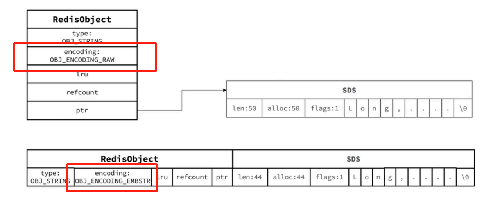
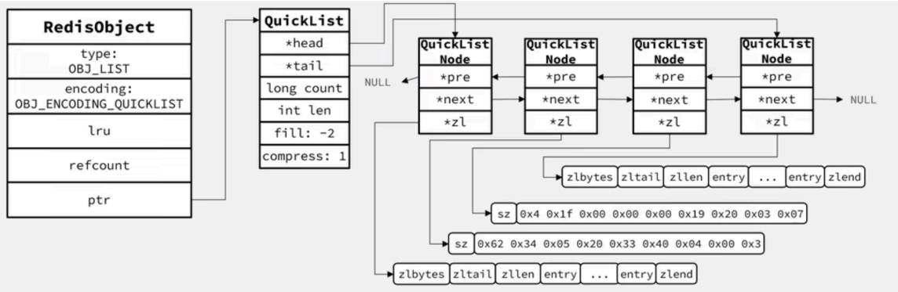
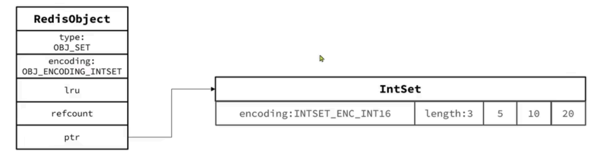
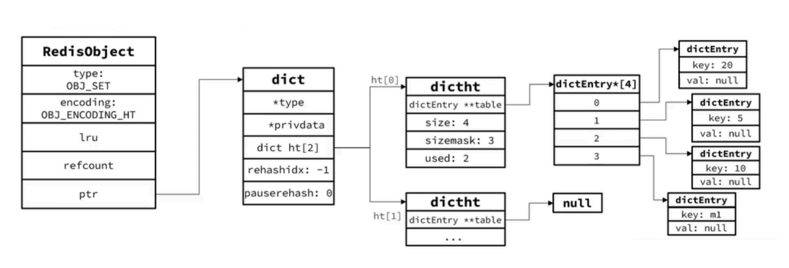
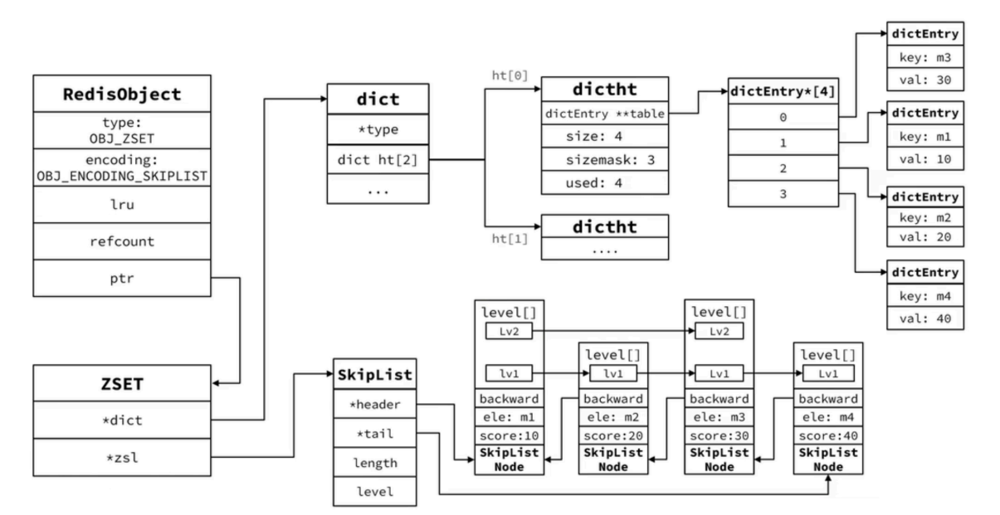
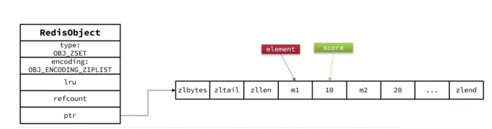
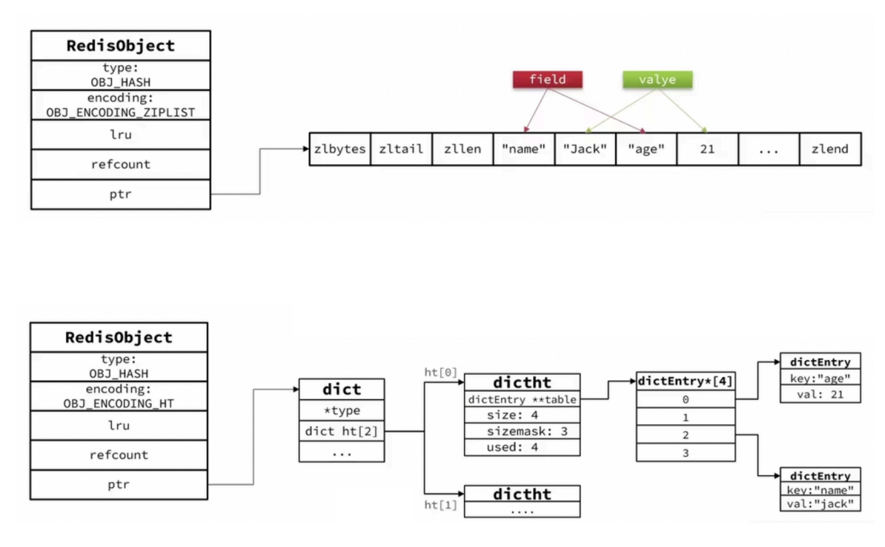

# 【Redis】对象

## 1 RedisObject

通常我们了解的数据结构有字符串、双端链表、字典、压缩列表、整数集合等，但是Redis为了加快读写速度，并没有直接使用这些数据结构，而是在此基础上又包装了一层称之为 `RedisObject` 。

```C
typedef struct redisObject {
    // 类型
    unsigned type:4;
    // 编码
    unsigned encoding:4;
    // 对象最后一次被访问的时间
    unsigned lru:REDIS_LRU_BITS; /* lru time (relative to server.lruclock) */
    // 引用计数
    int refcount;
    // 指向实际值的指针
    void *ptr;
} robj;
```

`RedisObject` 有五种对象：字符串对象、列表对象、哈希对象、集合对象和有序集合对象。

## 2 String（字符串）

基本编码⽅式是 RAW，基于简单动态字符串（SDS）实现，存储上限为 512M。

如果存储的 SDS ⻓度⼩于 44 字节，则会采⽤ EMBSTR 编码，此时 Object Head 与 SDS 是 **⼀段连续空间** 。申请内存时只需要调⽤⼀次内存分配函数，效率更⾼。

如果存储的字符串是整数值，并且⼤⼩在 LONG_MAX 范围内，则会采⽤ INT 编码：直接将数据保存在 RedisObject 的 ptr 指针位置（刚好8字节），不再需要 SDS 了。



## 2 List（列表）

Redis 采⽤ **QuickList** 实现 List 。



## 4 Set（集合）

Set 是 Redis 中的集合，不⼀定确保元素有序，可以满⾜元素唯⼀、查询效率要求极⾼。 

为了查询效率和唯⼀性，set 采⽤ HT 编码（Dict）。Dict 中的 key ⽤来存储元素，value 统⼀为 null。当存储的所有数据都是整数，并且元素数量不超过 `set-max-intset-entries` 时， Set 会采⽤ lntSet 编码，以节省内存。





## 5 ZSet



当元素数量不多时，HT 和 SkipList 的优势不明显，⽽且更耗内存。因此 zset 还会采⽤ ZipList 结构来节省内存，不过需要同时满⾜两个条件：

-  元素数量⼩于 zset-max-ziplist-entries，默认值 128 
- 每个元素都⼩于 zset-max-ziplist-value 字节，默认值 6

Ziplist 本身没有排序功能，⽽且没有键值对的概念，因此需要由 zset 通过编码实现： 

- Ziplist 是连续内存，因此 score 和 element 是紧挨在⼀起的两个 entry，element 在前，score在后
- score 越⼩越接近队⾸，score 越⼤越接近队尾，按照 score 值升序排列



## 6 Hash

Hash 底层采⽤的编码与 Zset 也基本⼀致，只需要把排序有关的 SkipList 去掉即 可：

- **Hash 结构默认采⽤ ZipList 编码，⽤以节省内存**。Ziplist 中相邻的两个 entry 分别保存 field 和 value 
- 当数据量较⼤时，Hash 结构会转为 HT 编码，也就是 Dict，触发条件有两个：
  - ZipList 中的元素数量超过了 hash-max-ziplist-entries（默认512）
  - ZipList 中的任意 entry ⼤⼩超过了 hash-max-ziplist-value（默认64字节）




