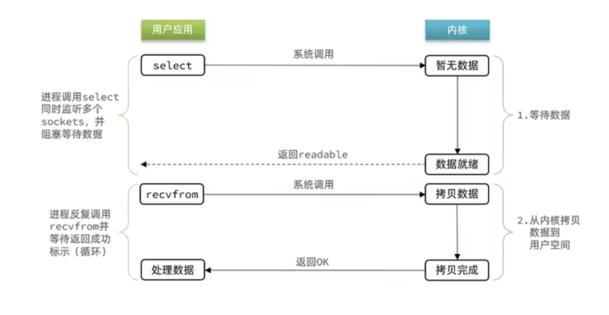

# 【Redis】网络模型

## 1 前置知识

### 用户空间与内核空间

为了避免⽤户应⽤导致冲突甚⾄内核崩溃，⽤户应⽤与内核是分离的。

进程的寻址空间会划分为 **内核空间** 与 **⽤户空间** ：

- ⽤户空间只能执⾏受限的命令（Ring3），⽽且不能直接调⽤系统资源，必须通过内核提供的接⼝来访问
- 内核空间可以执⾏特权命令（Ring0)，调⽤⼀切系统资源


我们构建的程序将运行在用户空间，用户空间无法操作内核空间，也就意味着用户空间的程序不能直接访问由内核管理的 I/O，比如：硬盘、网卡等。

为此，操作系统向外提供 API，其由各种类型的 **系统调用（System Call）**组成，以提供安全的访问控制。

**所以应用程序要想访问内核管理的 I/O，必须通过调用内核提供的系统调用（system call）进行间接访问。**

所以，对于一个应用程序，他发起 IO 实际上分为两步：

- IO 调用阶段：应用程序进程向内核发起系统调用
- IO执行阶段：内核执行IO操作并返回
  - 准备数据阶段：内核等待I/O设备准备好数据
  - 拷贝数据阶段：将数据从 **内核缓冲区** 拷贝到 **用户空间缓冲区**


### 同步阻塞IO模型（BIO）

在阻塞式 I/O 模型中，应用程序在从 IO 系统调用开始，一直到到系统调用返回，这段时间是阻塞的。返回成功后，应用进程开始处理用户空间的缓存数据。


**BIO 的优点**：程序简单，在阻塞等待数据期间，用户线程挂起。用户线程基本不会占用 CPU 资源。

**BIO 的缺点**：一般情况下，会为每个连接配套一条独立的线程，或者说一条线程维护一个连接成功的IO流的读写。在并发量小的情况下，这个没有什么问题。但是，当在高并发的场景下，需要大量的线程来维护大量的网络连接，内存、线程切换开销会非常巨大。因此，基本上，**BIO 模型在高并发场景下是不可用的**。

### 同步非阻塞IO模型（NBIO）

在 Linux 系统下，可以通过设置 socket 使其变为非阻塞。NBIO 模型中应用程序在一旦开始 IO 系统调用，会出现以下两种情况：

- 在内核缓冲区没有数据的情况下，系统调用会立即返回，返回一个调用失败的信息。
- 在内核缓冲区有数据的情况下，是阻塞的，直到数据从内核缓冲复制到用户进程缓冲。复制完成后，系统调用返回成功，应用进程开始处理用户空间的缓存数据。


NBIO 的特点：应用程序的线程需要不断的进行 I/O 系统调用，**轮询数据是否已经准备好**，如果没有准备好，继续轮询，直到完成系统调用为止。

NBIO 的优点：每次发起的 IO 系统调用，在内核的等待数据过程中可以立即返回。用户线程不会阻塞，实时性较好。

NBIO 的缺点：需要不断的重复发起 IO 系统调用，这种不断的轮询，将会不断地询问内核，这将占用大量的 CPU 时间，系统资源利用率较低。

### IO多路复用 （I/O multiplexing）

IO 多路复用模型，就是通过一种 **新的系统调用，一个进程可以监视多个文件描述符**，一旦某个描述符就绪（一般是内核缓冲区可读/可写），内核 kernel 能够通知程序进行相应的IO系统调用。

目前支持 IO 多路复用的系统调用，有 **select，epoll** 等等。

- **select** 系统调用，是目前几乎在所有的操作系统上都有支持，具有良好跨平台特性。
- **epoll** 是在 linux 2.6 内核中提出的，是 select 系统调用的 Linux 增强版本。

IO 多路复用模型的 **基本原理就是 select / epoll 系统调用**，单个线程不断的轮询 select / epoll 系统调用所负责的成百上千的 socket 连接，当某个或者某些 socket 网络连接有数据到达了，就返回这些可以读写的连接。因此，好处也就显而易见了——通过一次 select / epoll 系统调用，就查询到到可以读写的一个甚至是成百上千的网络连接。



多路复用 IO 的优点：用 select / epoll 的优势在于，**它可以同时处理成千上万个连接（connection）**。与一条线程维护一个连接相比，I/O 多路复用技术的最大优势是：**系统不必创建线程，也不必维护这些线程，从而大大减小了系统的开销。** 

**Java 的 NIO（new IO）技术，使用的就是 IO 多路复用模型** 。在 Linux 系统上，使用的是 epoll 系统调用。

多路复用 IO 的缺点：本质上，select/epoll 系统调用，**属于同步IO，也是阻塞IO** 。都需要在读写事件就绪后，自己负责进行读写，也就是说这个 **读写过程是阻塞的** 。

epoll 的实现：

```C
struct eventpoll {
struct rb_root rbr；//红⿊树，记录要监听的FD
struct list_head rdlist;// 链表，记录就绪的FD
}；
    
//1.会在内核创建eventpoll结构体，返回对应的句柄epfd
int epoll_create(int size)；
    
//2.将⼀个FD添加到epoll的红⿊树中，并设置ep_poll_callback
// callback触发时，就把对应的FD加⼊到rdlist这个就绪列表中
int epoll_ctl(
int epfd, // epoll实例的句柄
int op, //要执⾏的操作，包括：ADD、 MOD、 DEL
int fd，//要监听的FD
struct epoll_event *event // 要监听的事件类型：读、写、异常等
)；
    
//3.循环检查rdlist列表是否为空，不为空则返回就绪的FD的数量
int epoll_wait(
int epfd,
struct epoll_event *events, //event数组，⽤于接收就绪的FD
int maxevents, // events数组的最⼤⻓度
int timeout //超时时间，-1不超时；0不阻塞；⼤于0为阻塞时间)
```


### 异步IO模型（Anchronous I/O）

AIO 的基本流程是：**用户线程通过系统调用，告知 kernel 内核启动某个 IO 操作，用户线程返回。kernel 内核在整个 IO 操作（包括数据准备、数据复制）完成后，通知用户程序，用户执行后续的业务操作。**

Kernel 的 **数据准备** 是将数据从网络物理设备（网卡）读取到内核缓冲区；Kernel 的 **数据复制** 是将数据从内核缓冲区拷贝到用户程序空间的缓冲区。


异步 IO 模型的特点：在内核 kernel 的等待数据和复制数据的两个阶段，用户线程都不是 block（阻塞）的。用户线程需要接受 kernel 的 IO 操作完成的事件，或者说注册 IO 操作完成的回调函数，到操作系统的内核。所以说，异步 IO 有的时候，也叫做信号驱动 IO 。

异步 IO 模型缺点：**需要完成事件的注册与传递** ，需要底层操作系统提供大量的支持，做大量的工作。

### 总结

IO 操作是同步还是异步，关键看数据在内核空间与⽤户空间的拷⻉过程（数据读写的 IO 操作），也就是阶段 2 是同步还是异步。


## 2 Redis 是单线程还是多线程？

如果仅仅聊 Redis 的 **核⼼业务部分（命令处理）** ，答案是 **单线程** 。

如果是聊整个 Redis，那么答案就是 **多线程 **。

## 3  为什么 Redis 要选择单线程？

1. Redis 是纯内存操作，执⾏速度⾮常快，**它的性能瓶颈是⽹络延迟⽽不是执⾏速度** ，因此多线程并不会带来巨⼤的性能提升
2. 多线程会导致过多的上下⽂切换，带来不必要的开销
3. 引⼊多线程会⾯临线程安全问题，必然要引⼊线程锁这样的安全⼿段，实现复杂度增⾼，性能也会打折扣

