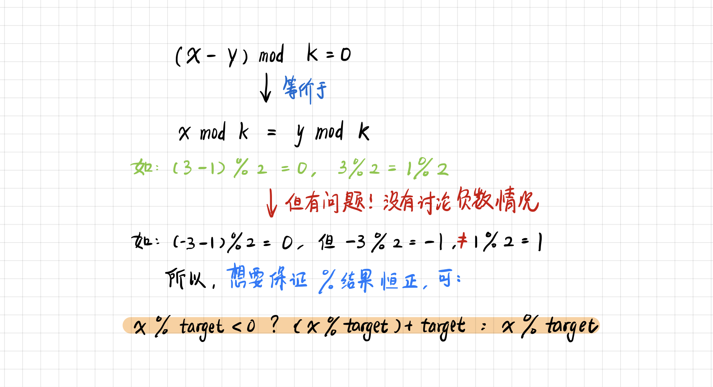

# 【算法】前缀和+HashMap

## 1 基本介绍

### 前缀和

通过「前缀和」能够帮助我们快速求解出数组中连续子数组的和。

通常创建前缀和的代码：

```java
int n = nums.length;
int[] presum = new int[n + 1];
for (int i = 0; i < n; ++i) {
	presum[i + 1] = presum[i] + nums[i];
}
```

### 哈希表

哈希表：key-value 结构，空间换时间的思想，通过对历史状态记录，减少时间的开销。

### 注意

「注意一」这种题目需要注意的是，想清楚「哈希表」中的 value 到底需要记录的是啥：

- **记录元素下标**：便于我们查找上次出现的位置，从而求出长度
- **记录元素个数**：便于我们统计有多少种结果

「注意二」这类题目中很多涉及运算类的技巧，如：

- 要求的是『子数组和为target』，也就是求前缀和等于目标值（`ps[j]-ps[i]=target`），我们只需遍历前缀和，查找 `ps[j]-target` （也就是 `ps[i]`）在哈希表中的出现次数

- 要求的是『子数组和为target的倍数』，也就是求前缀和满足 `(ps[j] - ps[i]) % target = 0` 的个数。我们只需遍历前缀和数组，但这里的查找的目标需要讨论：

  - 如果 `(ps[j] % target) < 0`，想要保证 map 中的 key 均为正数，则查找的目标转化为 `(ps[j] % target) + target`
  - 否则，查找的目标直接就是 `ps[j] % target`

  

## 2 题目

| 题目                                                         | 注释                                                         | 类型   |
| ------------------------------------------------------------ | ------------------------------------------------------------ | ------ |
| [560.和为 K 的子数组](https://leetcode.cn/problems/subarray-sum-equals-k/) | 目标：`ps[j]-ps[i] = target`，使用哈希表记录 `ps[i]` 的出现次数 | 求数量 |
| [974.和可被 K 整除的子数组](https://leetcode.cn/problems/subarray-sums-divisible-by-k/) | 目标：`(ps[j]-ps[i]) % k = 0`，使用哈希表记录 `ps[i]%k` 的出现次数 | 求数量 |
| [523.连续的子数组和](https://leetcode.cn/problems/continuous-subarray-sum/) | 目标：`(ps[j]-ps[i]) % k = 0`，并且需要满足 `j-i>=2`         | 求数量 |


