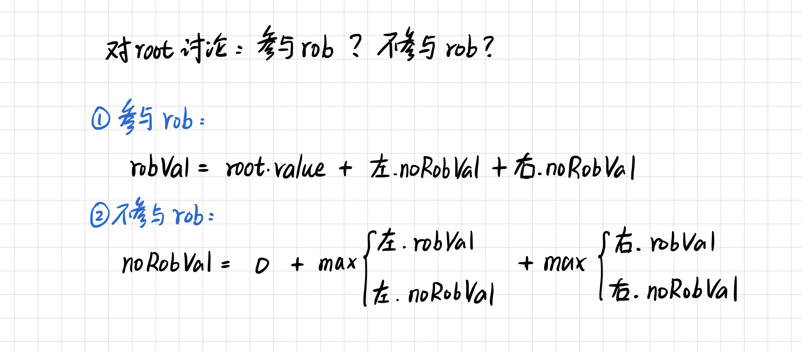
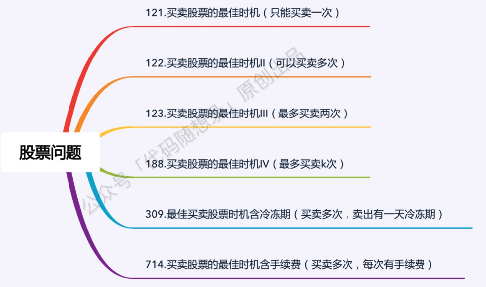

# 【算法】经典DP问题

## 1 打家劫舍类

| 题目                                                         | 类型   | 注释                                           |
| ------------------------------------------------------------ | ------ | ---------------------------------------------- |
| [198.打家劫舍](https://leetcode.cn/problems/house-robber/description/) | 普通dp | 当前要么偷，要么不偷                           |
| [213.打家劫舍 II](https://leetcode.cn/problems/house-robber-ii/) | 普通dp | 所有房屋围成一圈，情况分为讨论是否包含首尾元素 |
| [337.打家劫舍 III](https://leetcode.cn/problems/house-robber-iii/) | 树形dp | 讨论当前树节点是否参与打劫                     |

前两题可以直接看代码随想录的求解，比较简单。

第三题还是使用左神的树形dp思路求解：[题解](https://leetcode.cn/problems/house-robber-iii/solutions/1437752/by-batman-ww-jv9u/?q=%E5%B7%A6&orderBy=most_relevant)

> 树形dp套路使用前提：如果题目求解目标是S规则（求打劫收到的最大收益），则求解流程可以定成 **以每一个节点为头节点的子树在S规则下的每一个答案** （左、右节点来或不来的最大收益，即左、右节点的左右节点来或不来的最大收益），**并且答案一定在其中** 。
>

## 2 股票问题类

| 题目                                                         | 解析                      | 注释                                            |
| ------------------------------------------------------------ | ------------------------- | ----------------------------------------------- |
| [21.买卖股票的最佳时机](https://leetcode.cn/problems/best-time-to-buy-and-sell-stock/description/) | dp / 贪心，只「买卖一次」 | dp方法，每一天分两状态求解                      |
| [122.买卖股票的最佳时机 II](https://leetcode.cn/problems/best-time-to-buy-and-sell-stock-ii/) | dp / 贪心，可「买卖多次」 | dp方法，每一天分两状态求解                      |
| [123.买卖股票的最佳时机 III](https://leetcode.cn/problems/best-time-to-buy-and-sell-stock-iii/) | dp，只「买卖两次」        | dp方法，按照「买卖*第(1, 2)次」分为四种状态讨论 |
| [188.买卖股票的最佳时机 IV](https://leetcode.cn/problems/best-time-to-buy-and-sell-stock-iv/) | dp，最多「买卖k次」       | dp方法，按照「买卖*第k次」分为2K种状态讨论      |
| [309.最佳买卖股票时机含冷冻期](https://leetcode.cn/problems/best-time-to-buy-and-sell-stock-with-cooldown/) | dp                        | 花里胡哨，多了一个状态而已                      |
| [714.买卖股票的最佳时机含手续费](https://leetcode.cn/problems/best-time-to-buy-and-sell-stock-with-transaction-fee/description/) | dp                        | 花里胡哨，多了一个手续费而已                    |

