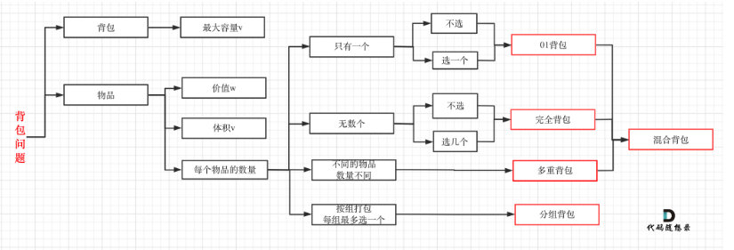

# 【算法】背包问题



## 0-1 背包问题

有 `n` 件物品和一个最多能背重量为 `w` 的背包。第 `i` 件物品的重量是 `weight[i]`，得到的价值是 `value[i]` 。**每件物品只能用一次**，求解将哪些物品装入背包里物品价值总和最大。

每一件物品其实只有两个状态，取或者不取，所以可以使用回溯法搜索出所有的情况，那么时间复杂度就是 $O(2^n)$ ，这里的 n 表示物品数量。

**所以暴力的解法是指数级别的时间复杂度。进而才需要动态规划的解法来进行优化！**

### 练习题目

[416.分割等和子集](https://leetcode.cn/problems/partition-equal-subset-sum/description/?orderBy=hot)


### 二维动规

#### 1）DP数组的含义

一般地，我们定义：`dp[i][j]` 表示前 `i` 件物品（即 `[0,i]` ）任取放入一个容量为 `j` 的背包可以获得的最大价值。

#### 2）递推公式

当前的状态，是针对 **当前的物品，放 或者 不放**。 

状态转移过程可表示为：

- 不选择第 `i` 件物品：问题转化为了前 `i−1` 件物品放入容量为 `j` 的背包中所获得的价值：`dp[i][j]=dp[i−1][j]`
- 选择第 `i` 件物品：第 `i` 件物品占据容量 `wi`，前 `i−1` 件物品放入剩下的容量为 `j−wi` 的背包中，问题也就转化为了前 `i−1` 件物品放入容量为 `j−wi` 的背包中所获得的价值 `dp[i−1][j−wi]` 加上要放入的第 `i` 件物品的价值 `vi`：`dp[i][j]=dp[i−1][j−wi]+vi`，注意，能放入第 `i` 件物品的前提为：`wi ≤ j`。

两种情况取较大者：
$$
d p[i][j]=\max \left\{d p[i-1][j], \quad d p[i-1]\left[j-w_i\right]+v_i\right\}
$$

#### 3）DP数组初始化

哪些元素应该初始化和如何初始化都是需要根据题意进行判断的。

首先从 `dp[i][j]` 的定义出发，如果背包容量 j 为 0 的话，即 `dp[i][0]`，无论是选取哪些物品，背包价值总和一定为 0。


状态转移方程 `dp[i][j] = max(dp[i - 1][j], dp[i - 1][j - weight[i]] + value[i]);` 可以看出 i 是由 i-1 推导出来，那么 i 为 0 的时候就一定要初始化。

`dp[0][j]` ，即：i 为 0，存放编号 0 的物品的时候，各个容量的背包所能存放的最大价值。

#### 4）确定遍历顺序

那么问题来了，**先遍历 物品还是先遍历背包重量呢？其实都可以！！ 但是先遍历物品更好理解**。

```java
// weight数组的大小 就是物品个数
for(int i = 1; i < weight.size(); i++) { // 遍历物品
    for(int j = 0; j <= bagweight; j++) { // 遍历背包容量
        if (j < weight[i]) dp[i][j] = dp[i - 1][j]; 
        else dp[i][j] = max(dp[i - 1][j], dp[i - 1][j - weight[i]] + value[i]);

    }
}
```

### 一维动规：滚动数组

在使用二维数组的时候，递推公式：`dp[i][j] = max(dp[i - 1][j], dp[i - 1][j - weight[i]] + value[i]);`

**其实可以发现如果把 dp[i - 1] 那一层拷贝到 dp[i] 上，表达式完全可以是：`dp[i][j] = max(dp[i][j], dp[i][j - weight[i]] + value[i]);`**

**与其把 dp[i - 1] 这一层拷贝到 dp[i] 上，不如只用一个一维数组了**，只用 dp[j]（一维数组，也可以理解是一个滚动数组）。

#### 1）DP数组的含义

`dp[j]`：容量为 `j` 的背包所背的最大价值。

#### 2）递推公式

此时 dp[j] 有两个选择：

- 一个是取自己 `dp[j]`：相当于 二维dp数组中的 `dp[i-1][j]`，即不放物品i
- 一个是取 `dp[j - weight[i]] + value[i]`：放物品`i`

```java
dp[j] = Math.max(dp[j], dp[j - weight[i]] + value[i]);
```

#### 3）DP数组初始化

`dp[j]` 表示：容量为 j 的背包，所背的物品价值可以最大为 `dp[j]` 。

那么 `dp[0]` 就应该是 0，因为背包容量为 0 所背的物品的最大价值就是 0。

#### 4）确定遍历顺序

代码如下：

```java
for(int i = 0; i < weight.size(); i++) { // 遍历物品
    for(int j = bagWeight; j >= weight[i]; j--) { // 倒叙遍历背包容量
        dp[j] = max(dp[j], dp[j - weight[i]] + value[i]);

    }
}
```

**这里大家发现和二维dp的写法中，遍历背包的顺序是不一样的！**

**二维dp遍历的时候，背包容量是从小到大，而一维dp遍历的时候，背包是从大到小。**

为什么呢？

- **倒序遍历是为了保证物品 i 只被放入一次！**但如果一旦正序遍历了，那么物品 0 就会被重复加入多次！

**再来看看两个嵌套 for 循环的顺序，代码中是先遍历物品嵌套遍历背包容量，那可不可以先遍历背包容量嵌套遍历物品呢？**

- 不可以！
- 因为一维 dp 的写法，背包容量一定是要倒序遍历（原因上面已经讲了），如果遍历背包容量放在上一层，那么每个dp[j]就只会放入一个物品，即：背包里只放入了一个物品。

倒序遍历的原因是，本质上还是一个对二维数组的遍历，并且右下角的值依赖上一层左上角的值，因此 **需要保证左边的值仍然是上一层的，从右向左覆盖。**


