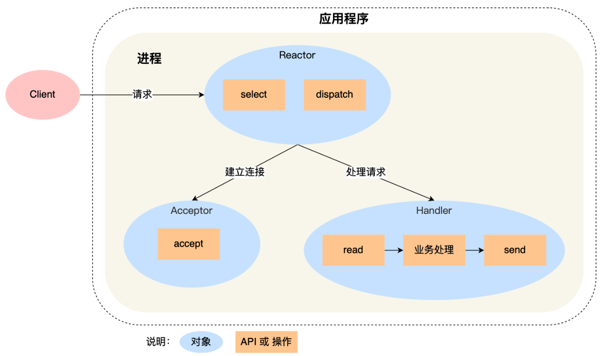
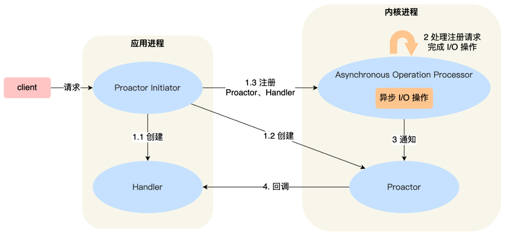
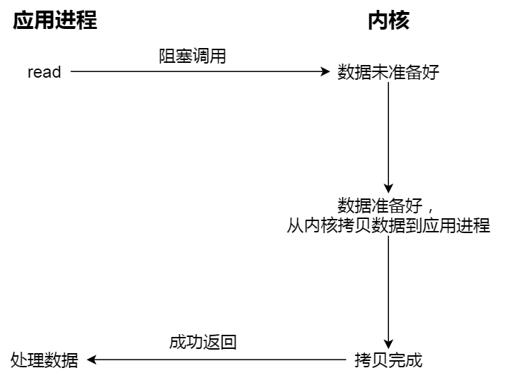
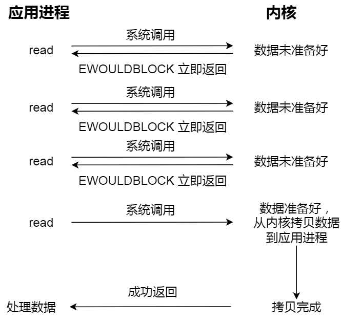
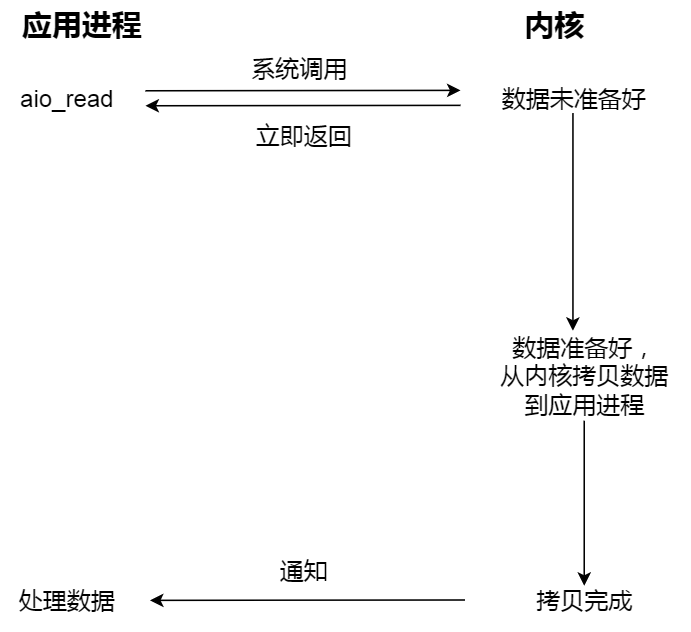

# 【网络编程】BIO、NIO与AIO


## 1 BIO

**BIO** 有的称之为 **basic（基本）IO**，有的称之为 **block（阻塞）IO**。

在 JDK1.4 之前，我们建立网络连接的时候只能采用 BIO，处理数据是以 **字节** 为单位。需要先在服务端启动一个 ServerSocket，然后在客户端启动 Socket 来对服务端进行通信，默认情况下服务端需要对每个请求建立一个线程等待请求，而客户端发送请求后，先咨询服务端是否有线程响应，如果没有则会一直等待或者遭到拒绝；如果有的话，客户端线程会等待请求结束后才继续执行，这就是 **阻塞式 IO** 。


**同步阻塞 I/O 模式，数据的读取和写入必须阻塞在一个线程内等待其完成** 。在活动连接数不是特别高（小于单机 1000）的情况下，这种模型是比较不错的，可以让每一个连接专注于自己的 I/O 并且编程模型简单，也不用过多考虑系统的过载、限流等问题。线程池本身就是一个天然的漏斗，可以缓冲一些系统处理不了的连接或请求。但是，当面对十万甚至百万级连接的时候，传统的 BIO 模型是无能为力的。因此，我们需要一种更高效的 I/O 处理模型来应对更高的并发量。

## 2 NIO

`java.nio` 全称 `Java Non-Blocking IO` ，是指 JDK 提供的新 API。 

从 JDK1.4 开始，Java 提供了一系列改进的输入/输出的新特性，被统称为 **NIO（即 New IO）**。新增了许多用于处理输入输出的类，这些类都被放在 `java.nio` 包及子包下，并且对原 `java.io` 包中的很多类进行改写，新增了满足 NIO 的功能。

NIO 和 BIO 有着相同的目的和作用，但是它们的实现方式完全不同：

- **效率不同：BIO 以字节为单位处理数据，而 NIO 以块为单位处理数据**，块 IO 的效率比流 IO 高很多。
- **是否阻塞：NIO 是非阻塞式的**，这一点跟 BIO 也很不相同，使用它可以提供非阻塞式的高伸缩性网络。
- **数据流向：**BIO 单向、NIO 双向


NIO 主要有三大核心部分：

- **Channel** 通道
- **Buffer** 缓冲区
- **Selector** 选择器（多路复用）

### 2.1 文件IO


**Buffer（缓冲区）：**是一个缓冲容器（底层是数组）内置了一些机制能够跟踪和记录缓冲区的状态变化。

**Channel（通道）：**提供从文件、网络读取数据的通道， 读取或写入数据都必须经由 Buffer。

#### Buffer


在 NIO 中，Buffer 是一个顶层父类，它是一个抽象类，常用的 Buffer 子类有：

- ByteBuffer，存储字节数据到缓冲区
- ShortBuffer，存储短整型数据到缓冲区
- CharBuffer，存储字符数据到缓冲区
- IntBuffer，存储整数数据到缓冲区
- LongBuffer，存储长整型数据到缓冲区
- DoubleBuffer，存储小数到缓冲区
- FloatBuffer，存储小数到缓冲区

对于 Java 中的基本数据类型， 都有一个 Buffer 类型与之相对应，**最常用的自然是 ByteBuffer 类（字节缓冲）**，该类的主要方法如下所示：

- `public abstract ByteBuffer put(byte[] b);`  存储字节数据到缓冲区
- `public abstract byte[] get();`  从缓冲区获得字节数据
- `public final byte[] array();`  把缓冲区数据转换成字节数组
- `public static ByteBuffer allocate(int capacity);`  设置缓冲区的初始容量
- `public static ByteBuffer wrap(byte[] array);`  把一个现成数组放到缓冲区中使用
- `public final Buffer flip();`  翻转缓冲区，重置位置到初始位置（缓冲区有一个指针从头开始读取数据，读到缓冲区尾部时，可以使用这个方法，将指针重新定位到头）

#### Channel

类似于 BIO 中的 stream，例如 FileInputStream 对象，用来建立到目标（文件，网络套接字，硬件设备等）的一个连接，但是需要注意：**BIO 中的 stream 是单向的**，例如 FileInputStream 对象只能进行读取数据的操作，而  **NIO 中的通道（Channel）是双向的， 既可以用来进行读操作，也可以用来进行写操作**。


**常用的** **Channel** **类有：**FileChannel、DatagramChannel、ServerSocketChannel 和 SocketChannel。

- `FileChannel` 用于 **文件** 的数据读写
- `DatagramChannel` 用于 **UDP** 的数据读写
- `ServerSocketChannel` 和 `SocketChannel` 用于 **TCP** 的数据读写

FileChannel 类，该类主要用来对本地文件进行 IO 操作，主要方法如下所示：

- `public int read(ByteBuffer dst)`  ，从通道读取数据并放到缓冲区中
- `public int write(ByteBuffer src) ` ，把缓冲区的数据写到通道中
- `public long transferFrom(ReadableByteChannel src, long position, long count)` ，从 **目标通道** 中复制数据到当前通道
- `public long transferTo(long position, long count, WritableByteChannel target)` ，把数据从当前通道复制给 **目标通道**

#### 案例一：本地文件写操作

NIO 中的通道是 **从输出流对象里通过 `getChannel` 方法获取到的，该通道是双向的，既可以读，又可以写** 。在往通道里写数据之前，必须通过 `put` 方法把数据存到 `ByteBuffer` 中，然后通过通道的 `write` 方法写数据。**在** **write 之前，需要调用  flip 方法翻转缓冲区** ，把内部重置到初始位置，这样在接下来写数据时才能把所有数据写到通道里。

```java
/**
 * 使用 NIO 往本地文件中写数据
 */
public void test1() throws Exception {
    // 1、创建输出流
    FileOutputStream fileOutputStream = new FileOutputStream("./basic.txt");
    // 2、获取流的一个 channel
    FileChannel channel = fileOutputStream.getChannel();
    // 3、创建一个字节缓冲区
    ByteBuffer byteBuffer = ByteBuffer.allocate(1024);
    // 4、输入的数据
    String s = "Hello NIO";
    byteBuffer.put(s.getBytes());
    // 5、翻转缓冲区
    byteBuffer.flip();
    // 6、把缓冲区写入通道中
    channel.write(byteBuffer);
    // 7、关闭流
    fileOutputStream.close();
}
```

> **为什么需要 `flip()` ?** 
>
> `flip()` 方法的作用：翻转缓冲区，在缓冲区里有一个指针从头（pos）写到尾（lim）。默认的 pos 是缓冲区内元素 size，lim 是缓冲区大小。**当从缓冲区向通道去写时，是从 pos 位置去写，写到 lim**，这样就得不到数据。所以要将 `pos = lim，pos = 0` 再写。


#### 案例二：本地文件读操作

```java
/**
 * 使用 NIO 从本地文件中读数据
 */
public void test2() throws Exception {
    // 1、创建输入流
    FileInputStream fileInputStream = new FileInputStream("basic.txt");
    // 2、得到一个 channel
    FileChannel channel = fileInputStream.getChannel();
    // 3、准备一个 buffer
    ByteBuffer buffer = ByteBuffer.allocate(1024);
    // 4、从 channel 中读字节数组
    channel.read(buffer);
    String s = new String(buffer.array());
    System.out.println(s);
    // 5、关闭流
    fileInputStream.close();
}
```

#### 案例三：文件复制

```java
/**
 * 使用 NIO 进行文件复制
 * @throws Exception
 */
@Test
public void test3() throws Exception {
    // 1、创建两个流
    FileInputStream fileInputStream = new FileInputStream("basic.txt");
    FileOutputStream fileOutputStream = new FileOutputStream("new_basic.txt");

    // 2、得到他们的 channel
    FileChannel sourceC = fileInputStream.getChannel();
    FileChannel targetC = fileOutputStream.getChannel();

    // 3、复制
    targetC.transferFrom(sourceC, 0, sourceC.size());

    // 4、关闭
    fileInputStream.close();
    fileOutputStream.close();
}
```

### 2.2 网络IO

Java NIO 中的网络通道是 **非阻塞** **IO** **的实现** ， **基于事件驱动** ，非常适用于服务器需要 **维持大量连接，但是数据交换量不大** 的情况，例如：Web服务器、RPC、即时通信。

在 Java 中编写 Socket 服务器，通常有以下几种模式：

- 一个客户端连接用一个线程（阻塞式 IO）
  - 优点：程序编写简单。
  - 缺点：如果连接非常多，分配的线程也会非常多，服务器可能会因为资源耗尽而崩溃。
- 把每个客户端连接交给一个拥有固定数量线程的连接池
  - 优点：程序编写相对简单， 可以处理大量的连接。
  - 缺点：线程的开销非常大，连接如果非常多，排队现象会比较严重。
- **使用 Java 的 NIO，用非阻塞的 IO 方式处理** 
  - **优点：这种模式可以用 一个线程 ，处理大量的客户端连接**
  - 缺点：代码复杂度较高，不易理解

#### Selector

**能够检测多个注册的通道上是否有事件发生（读、写、连接）**。如果有事件发生，便获取事件然后针对每个事件进行相应的处理。这样就可以 **只用一个单线程** 去管理多个通道，也就是管理多个连接。这样使得只有在连接真正有读写事件发生时，才会调用函数来进行读写，就大大地减少了系统开销，并且不必为每个连接都创建一个线程，不用去维护多个线程，并且避免了多线程之间的上下文切换导致的开销。


该类的常用方法如下所示：

- `public static Selector open()` ，得到一个选择器对象
- `public int select(long timeout)` ，监控所有注册的通道，当其中有 IO 操作可以进行时，将对应的SelectionKey 加入到内部集合中并返回，参数用来设置超时时间
- `public Set selectedKeys()` ，从内部集合中得到所有的 SelectionKey

**SelectionKey** 代表了 Selector 和网络通道的 **注册关系** ：

- `int OP_ACCEPT` ：有新的网络连接可以 accept，值为 16
- `int OP_CONNECT` ：代表连接已经建立，值为 8
- `int OP_READ` 和 `int OP_WRITE` ：代表了读、写操作，值为 1 和 4

该类的常用方法如下所示：

- `public abstract Selector selector()` ，得到与之关联的 Selector 对象
- `public abstract SelectableChannel channel()` ，得到与之关联的通道
- `public final Object attachment()` ，得到与之关联的共享数据
- `public abstract SelectionKey interestOps(int ops)` ，设置或改变监听事件
- `public final boolean isAcceptable()` ，是否可以 accept
- `public final boolean isReadable()` ，是否可以读
- `public final boolean isWritable()` ，是否可以写

#### ServerSocketChannel

ServerSocketChannel 用来在 **服务器端** 监听 **新的客户端 Socket 连接** 。

常用方法如下所示：

- `public static ServerSocketChannel open()` ，得到一个 ServerSocketChannel 通道
- `public final ServerSocketChannel bind(SocketAddress local)` ，设置服务器端端口号
- `public final SelectableChannel configureBlocking(boolean block)` ，设置阻塞或非阻塞模式， 取值 false 表示采用非阻塞模式
- `public SocketChannel accept()` ，接受一个连接，返回代表这个连接的通道对象
- `public final SelectionKey register(Selector sel, int ops)` ，注册一个选择器并设置监听事件

#### SocketChannel

网络 IO 通道，具体负责进行读写操作。NIO 总是把缓冲区的数据写入通道，或者把通道里的数据读到缓冲区。

常用方法如下所示：

- `public static SocketChannel open()` ，得到一个 SocketChannel 通道
- `public final SelectableChannel configureBlocking(boolean block)` ，设置阻塞或非阻塞模式， 取值 false 表示采用非阻塞模式
- `public boolean connect(SocketAddress remote)` ，连接服务器
- `public boolean finishConnect()` ，如果上面的方法连接失败，接下来就要通过该方法完成连接操作
- `public int write(ByteBuffer src)` ，往通道里写数据
- `public int read(ByteBuffer dst)` ，从通道里读数据
- `public final SelectionKey register(Selector sel, int ops, Object att)` ，注册一个选择器并设置监听事件，最后一个参数可以设置共享数据
- `public final void close()` ，关闭通道


服务器端有一个选择器对象，服务器的 ServerSocketChannel 对象也要注册给 selector，它的 accept 方法负责接收客户端的连接请求。有一个客户端连接过来，服务端就会建立一个通道 SocketChannel 。**Selector 会监控所有注册的通道 SocketChannel ，检查这些通道中是否有事件发生【连接、断开、读、写等事件】，如果某个通道有事件发生则做相应的处理** 。

### 2.3 案例：实现多人网络聊天室V1.0

见代码 `java/chat` 目录下。

## 3 AIO

JDK 7 引入了 Asynchronous IO，即 AIO，叫做异步不阻塞的 IO，也可以叫做NIO2。在进行 IO 编程中，常用到两种模式：Reactor 模式 和 Proactor模 式。

- NIO 采用 Reactor 模式，**当有事件触发时，服务器端得到通知，进行相应的处理**。

  

  - Reactor 对象的作用是监听和分发事件；
  - Acceptor 对象的作用是获取连接；
  - Handler 对象的作用是处理业务；

- AIO 采用 Proactor 模式，引入 **异步通道** 的概念， 简化了程序编写，一个有效的请求才启动一个线程，它的**特点是先由操作系统完成后，才通知服务端程序启动线程去处理** ，一般适用于连接数较多且连接时间较长的应用。

  

  Proactor 模式的工作流程：

  - Proactor Initiator 负责创建 Proactor 和 Handler 对象，并将 Proactor 和 Handler 都通过
    Asynchronous Operation Processor 注册到内核；
  - Asynchronous Operation Processor 负责处理注册请求，并处理 I/O 操作；
  - Asynchronous Operation Processor 完成 I/O 操作后通知 Proactor；
  - Proactor 根据不同的事件类型回调不同的 Handler 进行业务处理；
  - Handler 完成业务处理

## 补：阻塞、非阻塞、同步、异步 I/O

**阻塞 IO** ：当用户程序执行 `read` ，线程会被阻塞，一直等到内核数据准备好，并把数据从内核缓冲区拷贝到应用程序的缓冲区中，当拷贝过程完成，`read` 才会返回。



**非阻塞 IO** ：非阻塞的 `read` 请求在数据未准备好的情况下 **立即返回** ，可以继续往下执行，此时应用程序不断轮询内核，直到数据准备好，内核将数据拷贝到应用程序缓冲区，`read` 调用才可以获取到结果。



**这里最后一次 `read` 调用，获取数据的过程，是一个 同步 的过程，是需要等待的过程。这里的同步指的是内核态的数据拷贝到用户程序的缓存区这个过程** 。

**异步 I/O** 是「内核数据准备好」和「数据从内核态拷贝到用户态」这 **两个过程都不用等待**。

发起 `aio_read` （异步 I/O） 之后，就立即返回，**内核自动将数据从内核空间拷贝到用户空间** ，这个拷贝过程同样是异步的，内核自动完成的，和前面的同步操作不一样，**应用程序并不需要主动发起拷贝动作** 。



