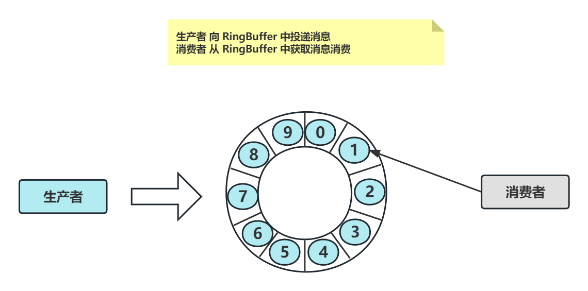
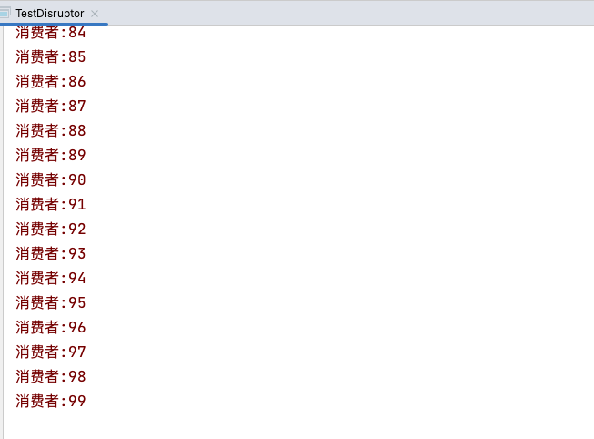
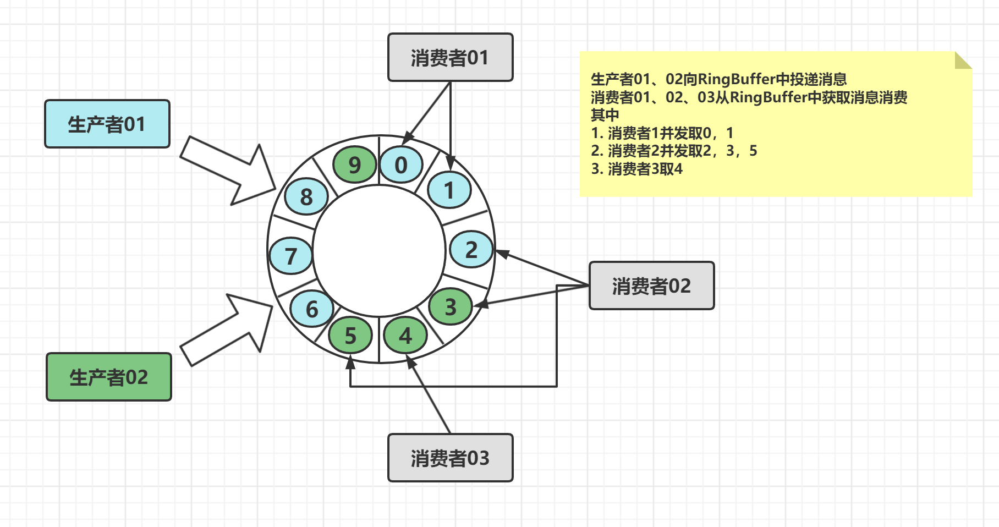
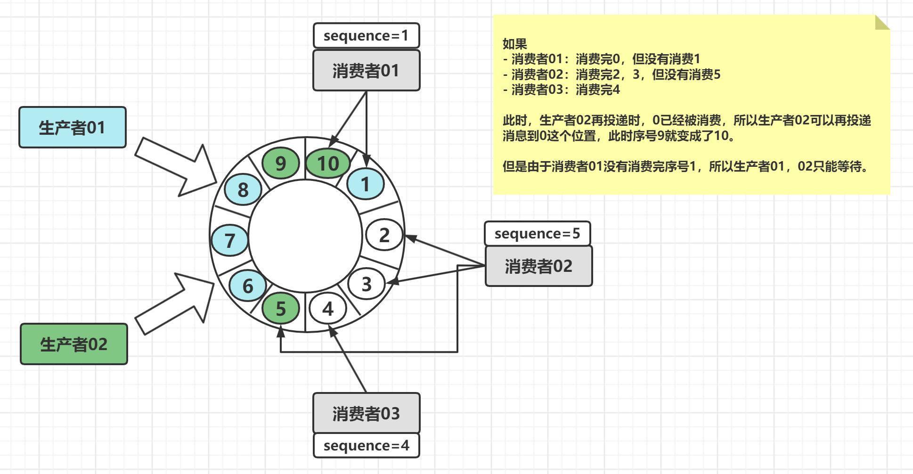
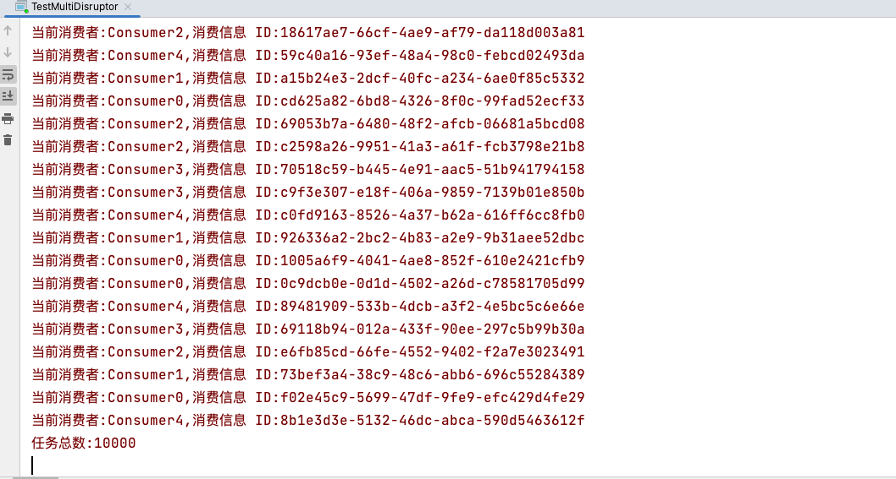

# 【网络编程】Disruptor

LMAX 是英国外汇交易公司，目标是成为世界上最快的交易平台。为了实现这一点，这家公司的技术团队使用 Java 平台实现 **非常低的延迟和高吞吐量** 的交易系统。经过一系列性能测试表明，**使用队列在系统的各个阶段之间传递数据会导致延迟，当然吞吐量也就很难上的去** ，因此他们技术团队专注于优化这个领域，所以 Disruptor 诞生了。

Disruptor 是一个通用解决方案，用于解决并发编程中的难题（低延迟与高吞吐量）。其本质还是一个 **队列（环形）** ，与其他队列类似，也是基于生产者消费者模式设计，只不过这个队列很特别是一个环形队列。这个队列能够在无锁的条件下进行并行消费，也可以根据消费者之间的依赖关系进行先后次序消费。

**说的简单点：**生产者向 RingBuffer 中写入元素，消费从 RingBuffer 中消费元素。基于 Disruptor 开发的系统单线程能支撑每秒 600 万订单。

**它与并发编程中的阻塞队列有什么不同？**

- **低延时高通吐**
- 快，它实在是太快了



**通用步骤：**

1. 创建工厂类，用于生产 Event 对象

2. 创建Consumer 监听类，用于监听，并处理 Event

3. 创建 Disruptor 对象，并初始化一系列参数：工厂类、RingBuffer 大小、线程池、单生产者或多生产者、Event等待策略
4. 编写 Producer 组件，向 Disruptor 容器中去投递 Event

## 1 核心API

### 1.1 Disruptor

它是一个辅助类，持有 **RingBuffer** 、消费者线程池 Executor、消费者仓库 ConsumerRepository 等引用。

### 1.2 RingBuffer 环形缓存器

RingBuffer 基于 **数组** 的实现，数据结构是个首尾相接的环，用做在不同上下文（线程）间传递数据的 buffer。RingBuffer 拥有一个 **Sequencer 序号器** ，这个序号器指向数组中下一个可用元素。

### 1.3 Sequencer 序号器

Sequencer 序号器是 Disruptor 核心。此接口有两个实现类：

- SingleProducerSequencer 单生产者
- MultiProducerSequencer 多生产者

### 1.4 Sequence 序号

Sequencer 序号器中有 Sequence 序号，通过 **顺序递增的序号来编号和管理进行交换的 Event** 。

Event 的处理过程总是沿着序号逐个递增处理。

**一个 Sequence 用于跟踪标识某个特定的事件处理者的处理进度** 。Producer 和 Consumer 都有自己的Sequence，用来判断 Consumer 和 Producer 之间平衡，防止生产快，消费慢或生产慢，消费快等情况（上下游速度不一致问题），相当于标识进度了。

- 解决上下游消费速度不一致问题
- 异步提速
- 削峰填谷

### 1.5 WaitStrategy 等待策略

等待策略 **决定一个 Consumer 将如何等待 Producer 将 Event 置入 RingBuffer**。

主要策略有：

- **BlockingWaitStrategy：阻塞等待策略** ，最低效的策略，但其对 CPU 的消耗最小并且在各种不同部署环境中能提供更加一致的性能表现。
- **SleepingWaitStrategy：休眠等待策略** ，性能表现跟 BlockingWaitStrategy 差不多，对 CPU 的消耗也类似，但其对生产者线程的影响最小，适合用于异步日志类似的场景。
- **YieldingWaitStrategy：产生等待策略，** 性能最好，适合用于低延迟的系统，在要求极高性能且事件处理线程数小于CPU逻辑核心数的场景中，推荐使用。是 **无锁并行** 。

### 1.6 Event

从 Producer 到 Consumer 过程中所处理的数据单元。

### 1.7 EventHandler

由用户实现，并且代表 Disruptor 中的一个 **消费者的接口** ，消费者逻辑都需要写在这里。

## 2 案例一：单生产者单消费者

目标：演示 Disruptor 高性能队列的基本用法，创建循环 100 个订单消息并消费之。

步骤：

1. 创建 OrderEventFactory 来产生 OrderEvent 实例对象

2. 创建 Consumer 处理者 OrderEventHandler，当 Producer 投递一条条数据时此 Handler 进行处理

3. 编写核心类 Main 创建 disruptor 对象，让其与 Consumer 处理者 OrderEventHandler 绑定，启动 disruptor

4. 通过 disruptor 对象获取到ringBuffer容器。

5. 创建生产者 OrderEventProducer，将消息放到 RingBuffer 容器

6. 循环100 次，通过 sendData() 投递消息。sendData() 方法的最后将消息发布出去，只有发布出去，消费者才能收到

### 2.1 订单事件类

定义一个订单类，包含订单的价格。

```java
/**
 * OrderEvent
 * @description 订单事件
 * @author SongJian
 * @date 2023/6/8 19:06
 * @version
 */
public class OrderEvent {
    /**
     * 订单价格
     */
    private long value;

    public long getValue() {
        return value;
    }

    public void setValue(long value) {
        this.value = value;
    }
}
```

### 2.2 订单工厂类

该类需要 `EventFactory` 接口。

```java
/**
 * OrderEventFactory
 * @description 订单工厂类，用于创建Event的实例（OrderEvent)
 * @author SongJian
 * @date 2023/6/8 19:08
 * @version
 */
public class OrderEventFactory implements EventFactory<OrderEvent> {

    public OrderEvent newInstance() {
        return new OrderEvent();
    }
}
```

### 2.3 订单生产者

```java
/**
 * OrderEventProducer
 * @description 订单生产者
 * @author SongJian
 * @date 2023/6/8 19:13
 * @version
 */
public class OrderEventProducer {
    /**
     * 环形队列
     */
    private RingBuffer<OrderEvent> ringBuffer;

    public OrderEventProducer(RingBuffer<OrderEvent> ringBuffer) {
        this.ringBuffer = ringBuffer;
    }

    /**
     * 生产者投递数据
     */
    public void sendData(ByteBuffer data) {
        // 1、在生产者发送消息时，首先要从 ringBuffer 中找到一个可用的序号
        long sequence = ringBuffer.next();
        try {
            // 2、根据这个序号找到具体的 OrderEvent 元素
            // 此时获取到的对象是一个还未被赋值的对象
            OrderEvent event = ringBuffer.get(sequence);
            event.setValue(data.get(0));
        } catch (Exception e) {
            e.printStackTrace();
        } finally {
            // 4、提交发布操作
            ringBuffer.publish(sequence);
        }
    }
}
```

### 2.4 Event监听及处理

```java
/**
 * OrderEventHandler
 * @description 消费者
 * @author SongJian
 * @date 2023/6/8 19:20
 * @version
 */
public class OrderEventHandler implements EventHandler<OrderEvent> {

    public void onEvent(OrderEvent orderEvent, long l, boolean b) throws Exception {
        //取出订单对象的价格。
        System.err.println("消费者:"+ orderEvent.getValue());
    }
}
```

### 2.5 测试类

定义测试类，创建 Disruptor 对象，并初始化一系列参数：工厂类、RingBuffer 大小、线程池、单生产者或多生产者、Event 等待策略。

```java
/**
 * TestDisruptor
 * @description 测试
 * @author SongJian
 * @date 2023/6/8 19:21
 * @version
 */
public class TestDisruptor {
    public static void main(String[] args) {
        // 准备工作
        OrderEventFactory orderEventFactory = new OrderEventFactory();
        int ringBufferSize = 8;
        // 获取CPU处理器数量
        int nThreads = Runtime.getRuntime().availableProcessors();
        // 创建线程池
        ExecutorService executorService = Executors.newFixedThreadPool(nThreads);

        // 1、实例化 disruptor 对象
        // 对象工厂，环形队列大小，消费线程池，生产者模式，等待策略
        Disruptor<OrderEvent> disruptor = new Disruptor<OrderEvent>(orderEventFactory,
                        ringBufferSize,
                        executorService,
                        ProducerType.SINGLE,
                        new BlockingWaitStrategy());

        // 2、添加消费者监听（也就是消费者如何区消费）
        disruptor.handleEventsWith(new OrderEventHandler());

        // 3、启动
        disruptor.start();

        // 4、收到容器后通过生产者去生产消息
        RingBuffer<OrderEvent> ringBuffer = disruptor.getRingBuffer();

        // 生产者
        OrderEventProducer orderEventProducer = new OrderEventProducer(ringBuffer);

        // 先初始化 ByteBuffer 长度为 8 Byte
        ByteBuffer buf = ByteBuffer.allocate(8);
        // 生产
        for (long i = 0; i < 100; ++i) {
            buf.putLong(0, i);
            orderEventProducer.sendData(buf);
        }

        disruptor.shutdown();
        executorService.shutdown();
    }
}
```

### 2.7 结果



## 3 案例二：多生产者多消费者

时刻一：



时刻二：



### 3.1 订单事件

```java
/**
 * OrderEvent
 * @description
 * @author SongJian
 * @date 2023/6/8 19:50
 * @version
 */
public class Order {

    private String id;
    private String name;
    private double price;

    public Order(){ }

    // getter setter
}
```

### 3.2 消费者

```java
/**
 * ConsumerHandler
 * @description 消费者
 * @author SongJian
 * @date 2023/6/8 19:52
 * @version
 */
public class ConsumerHandler implements WorkHandler<Order> {
    // 每个消费者有自己的id
    private String comsumerId;

    // 计数统计，多个消费者，所有的消费者总共消费了多个消息。
    private static AtomicInteger count = new AtomicInteger(0);

    private Random random = new Random();

    public ConsumerHandler (String comsumerId){
        this.comsumerId = comsumerId;
    }

    // 当生产者发布一个sequence，ringbuffer 中一个序号，里面生产者生产出来的消息，生产者最后 publish 发布序号
    // 消费者会监听，如果监听到，就会ringbuffer去取出这个序号，取到里面消息
    public void onEvent(Order order) throws Exception {
        //模拟消费者处理消息的耗时，设定1-4毫秒之间
        TimeUnit.MILLISECONDS.sleep(1*random.nextInt(5));
        //count计数器增加+1，表示消费了一个消息
        System.err.println("当前消费者:"+ this.comsumerId + ",消费信息 ID:" + order.getId());
        count.incrementAndGet();
    }

    /**
     * 总共消费次数
     * @return
     */
    public int getCount() {
        return count.get();
    }
}
```

### 3.3 生产者

```java
/**
 * Producer
 * @description 生产者
 * @author SongJian
 * @date 2023/6/8 19:58
 * @version
 */
public class Producer {
    private RingBuffer<Order> ringBuffer;

    /**
     * 为生产者绑定ringbuffer
     * @param ringBuffer
     */
    public Producer(RingBuffer<Order> ringBuffer){
        this.ringBuffer = ringBuffer;
    }

    /**
     * 发送数据
     * @param uuid
     */
    public void sendData (String uuid) {
        //1.获取到可用sequence
        long sequence = ringBuffer.next();
        try{
            Order order = ringBuffer.get(sequence);
            order.setId(uuid);
        } finally {
            ringBuffer.publish(sequence);
        }
    }
}
```

### 3.4 测试类

```java
/**
 * TestMultiDisruptor
 * @description
 * @author SongJian
 * @date 2023/6/8 20:01
 * @version
 */
public class TestMultiDisruptor {
    public static void main(String[] args) throws InterruptedException {
        RingBuffer<Order> ringBuffer = RingBuffer.create(
                ProducerType.MULTI, // 多生产者
                new EventFactory<Order>() { // 订单工厂
                    public Order newInstance() {
                        return new Order();
                    }
                },
                1024 * 1024,    // bufferSize
                new YieldingWaitStrategy()  // 等待策略
        );

        // 2、创建 ringbuffer 屏障
        SequenceBarrier sequenceBarrier = ringBuffer.newBarrier();

        // 3、创建多个消费者数组
        ConsumerHandler[] consumers = new ConsumerHandler[10];

        for (int i = 0; i < consumers.length; ++i) {
            consumers[i] = new ConsumerHandler("Consumer" + i);
        }

        // 4、构建多消费者工作池
        WorkerPool<Order> orderWorkerPool = new WorkerPool<Order>(
                ringBuffer,
                sequenceBarrier,
                new EventExceptionHandler(),
                consumers
        );

        // 5、设置多个消费者的 seq 序号器，用于单独统计消费者的消费进度
        ringBuffer.addGatingSequences(orderWorkerPool.getWorkerSequences());

        // 6、启动workpool
        orderWorkerPool.start(Executors.newFixedThreadPool(5));

        // 要生产 100 个生产者，每个生产者发送100条数据，投递10000
        final CountDownLatch latch = new CountDownLatch(1);
 
        for (int i = 0; i < 100; ++i) {
            final Producer producer = new Producer(ringBuffer);

            new Thread(new Runnable() {
                public void run() {
                    try {
                        latch.await();
                    } catch (Exception e) {
                        e.printStackTrace();
                    }

                    // 每个生产者生产100 条数据
                    for (int j = 0; j < 100; ++j) {
                         producer.sendData(UUID.randomUUID().toString());
                    }
                }
            }).start();
        }

        // 把所有线程都创建玩
        TimeUnit.SECONDS.sleep(2);
        // 唤醒
        latch.countDown();
        // 休眠10s，让生产者将100循环走完
        TimeUnit.SECONDS.sleep(10);
        System.err.println("任务总数:" + consumers[0].getCount());
    }


    static class EventExceptionHandler implements ExceptionHandler<Order> {

        public void handleEventException(Throwable throwable, long l, Order order) {

        }

        public void handleOnStartException(Throwable throwable) {

        }

        public void handleOnShutdownException(Throwable throwable) {

        }
    }
}
```

### 3.5 结果




