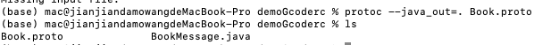

# 【网络编程】Netty

**Netty 是一个被广泛使用的，基于 NIO 的 Java 网络应用编程框架**，Netty 框架可以帮助开发者快速、简单的实现客户端和服务端的网络应用程序。“快速”和“简单”并不用产生维护性或性能上的问题。Netty 利用 Java 语言的 NIO 网络编程的能力，并隐藏其背后的复杂性，从而提供一个易用的 API，基于这些 API，我们可以快速编写出一个客户端/服务器网络应用程序。

Netty 成长于用户社区，像大型公司 Facebook 和 Instagram 以及流行的开源项目（Apache Cassandra、Apache Storm、Elasticsearch、Dubbo等等），都利用其强大的对于网络抽象的核心代码实现网络通信。

**特点：**

- API简单易用：支持阻塞和非阻塞式的 socket
- 基于事件模型：可扩展性和灵活性更强
- 高度定制化的线程模型：支持单线程和多线程
- 高通吐、低延迟、资源占用率低
- 完整支持SSL和TLS
- 学习难度低

**应用场景：**

- 互联网行业：分布式系统远程过程调用，高性能的 RPC 框架
- 游戏行业：大型网络游戏高性能通信
- 大数据：Hadoop的高性能通信和序列化组件 Avro 的 RPC 框架

## 1 线程模型

### 1.1 单线程模型

这个线程模型就是前面介绍的 NIO 的线程模型。


服务端用 **一个线程** 通过 **多路复用** 搞定 **所有的 IO 操作（包括连接，读、写等）**，编码简单，清晰明了，但是如果客户端连接数量较多，将无法支撑。

### 1.2 线程池模型

服务端用 **一个线程** 专门处理客户端 **连接请求** ，用一个 **线程池负责 IO 操作** 。在绝大多数场景下，该模型都能满足网络编程需求。


### 1.3 Netty线程模型


Netty 抽象出两组线程池：**BossGroup** 、 **WorkerGroup**

- BossGroup 专门负责接收客户端连接
- WorkerGroup 专门负责网络读写操作
- BossGroup 和 WorkerGroup 类型都是 **NioEventLoopGroup**，相当于一个 **事件循环组** 

**NioEventLoopGroup** 可以有多个线程，即含有多个 **NioEventLoop** 。

**NioEventLoop** 表示一个不断循环的执行处理任务的 **线程** ：

- 每个 NioEventLoop 中包含有一个 Selector，一个 taskQueue
  - **Selector 上可以注册监听多个 NioChannel ，也就是监听 Socket 网络通信**
  - **每个 NioChannel 只会绑定在唯一的 NioEventLoop 上**
  - **每个 NioChannel 都绑定有一个自己的 ChannelPipeline**
- NioEventLoop 内部采用串行化（Pipeline）设计：**责任链模式**
  - 消息读取 ==> 解码 ==> 处理（handlers） ==> 编码 ==> 发送，始终由 IO 线程 NioEventLoop 负责

#### 一个Client连接的执行过程

- Boss 的 NioEventLoop 循环执行步骤：
  - 轮询 accept 事件
  - 处理 accept 事件：
    - 与 client 建立连接，生成 NioSocketChannel ，并将其注册到某个worker 的 NIOEventLoop 的 selector
  - 处理任务队列的任务 ， 即 runTasks
- Worker 的 NioEventLoop 循环执行步骤：
  - 轮询 read、write 事件
  - 在对应 NioSocketChannel 中，处理业务相关操作（ChannelHandler） 
  - 处理任务队列的任务，即 runTasks
- 每个 Worker 的 NioEventLoop 处理业务时会使用管道 Pipeline。Pipeline 中包含了 Channel ，通过管道可以获取到对应 Channel，Channel 中维护了很多的 Handler 处理器

## 2 核心API

### 2.1 ServerBootstrap与Bootstrap

**ServerBootstrap** 是 Netty 中的 **服务端启动助手** ，通过它可以完成服务端的各种配置。

**Bootstrap** 是 Netty 中的 **客户端启动助手** ，通过它可以完成客户端的各种配置。

**常用方法：**

- **服务端 ServerBootstrap**：
  - ServerBootstrap **group** (parentGroup , childGroup)， 该方法用于设置两个EventLoopGroup，连接线程组和工作线程组
  - public B **channel** (Class<? extends C> channelClass)，该方法用来 **设置服务端或客户端通道的实现类型** 
  - public B **option** (ChannelOption option, T value)，用来给 **ServerChannel** 添加配置
  - public ServerBootstrap **childOption** (ChannelOption childOption, T value)，用来给 **接收通道** 添加配置
  - public ServerBootstrap **childHandler** (ChannelHandler childHandler)，该方法用来设置业务处理类（自定义handler）
  - public ChannelFuture **bind** (int inetPort) ，该方法用于 **设置占用端口号**
- **客户端 Bootstrap** ：
  - public B **group **(EventLoopGroup group) ，该方法用来设置客户端的 EventLoopGroup
  - public B **channel** (Class<? extends C> channelClass)，该方法用来**设置服务端或客户端通道的实现类型**
  - public ChannelFuture **connect**(String inetHost, int inetPort) ，该方法用来**配置连接服务端地址信息**，host:port

### 2.2  EventLoopGroup（Boss\WorkerGroup）

在 Netty 服务端编程中，一般需要提供两个 **EventLoopGroup**：

- BossEventLoopGroup 专门负责接收客户端连接
- WorkerEventLoopGroup 专门负责网络读写操作

Netty 为了更好的利用多核 CPU 资源，一般会有多个 EventLoop 同时工作，每个 EventLoop 维护着一个 Selector 实例。

EventLoopGroup 提供 **next** 接口，可以从组里面 **按照一定规则获取其中一个 EventLoop** 来处理任务。

**EventLoopGroup 本质是一组 EventLoop，池化管理的思想** 。

通常一个服务端口即一个 ServerSocketChannel 对应一个 Selector 和一个 EventLoop 线程，BossEventLoop 负责接收客户端的连接并将  SocketChannel 交给 WorkerEventLoopGroup 来进行 IO 处理。


- BossEventLoopGroup 通常是单线程的 EventLoop，EventLoop 维护着一个注册了 ServerSocketChannel 的 Selector 实例
- Boss 的 EventLoop 不断轮询 Selector 将连接事件分离出来，通常是 OP_ACCEPT 事件， 然后将接收到的 SocketChannel 交给 WorkerEventLoopGroup
- WorkerEventLoopGroup 会由 next 选择其中一个 EventLoop 来将这个 SocketChannel 注册到其维护的 Selector 并对其后续的事件进行处理。

**常用方法：**

- public NioEventLoopGroup()，构造方法
- public Future<?> **shutdownGracefully** ()，断开连接，关闭线程

### 2.3 ChannelHandler及其实现类

ChannelHandler 接口定义了许多 **事件处理的方法** ，我们通过 **重写** 这些方法实现业务功能。


我们经常需要 **自定义一个 Handler 类去继承 ChannelInboundHandlerAdapter** ，然后通过重写相应方法实现业务逻辑，我们接下来看看一般都需要重写哪些方法：

- **channelActive** (ChannelHandlerContext ctx)，**通道就绪事件**
- **channelRead** (ChannelHandlerContext ctx, Object msg)，**通道读取数据事件**
- **channelReadComplete** (ChannelHandlerContext ctx) ，**数据读取完毕事件**
- **exceptionCaught** (ChannelHandlerContext ctx, Throwable cause)，**通道发生异常事件**

### 2.4 ChannelPipeline

ChannelPipeline 是一个 **Handler** **的集合**，它负责 **处理和拦截 inbound 或者 outbound 的事件和操作** ，相当于一个贯穿 Netty 的链（**责任链模式**）。


上图绿线的线串起来的就是 Pipeline，它包含 3 个处理不同业务的 ChannelHandler，依次通过这三个 ChannelHandler 。因为这 3 个 ChannelHandler 不知道彼此。所以要用 ChannelHandlerContext 上下文来说明，ChannelHandlerContext 包含 ChannelHandler、Channel、pipeline 的信息。

- ChannelPipeline **addFirst** (ChannelHandler... handlers)，把业务处理类（handler）添加到 Pipeline 链中的 **第一个位置**
- ChannelPipeline **addLast**(ChannelHandler... handlers)，把业务处理类（handler）添加到 Pipeline 链中的 **最后一个位置**

### 2.5 ChannelHandlerContext

ChannelHandlerContext 是 **事件处理器上下文对象， Pipeline链中的实际处理节点** 。 每个处理节点 ChannelHandlerContext 中包含一个具体的事件处理器 ChannelHandler ， 同时 ChannelHandlerContext 中也绑定了对应的 Pipeline 和 Channel 的信息，方便对 ChannelHandler 进行调用。

**常用方法：**

- ChannelFuture **close**()，关闭通道
- ChannelOutboundInvoker **flush**()，刷新
- ChannelFuture **writeAndFlush**(Object msg) ，将数据写到 ChannelPipeline 中当前 ChannelHandler 的下一个 ChannelHandler 开始处理（**出栈** 交给下一个handler将继续处理）。

### 2.6 ChannelOption

Netty 在创建 Channel 实例后，一般都需要设置 ChannelOption 参数。ChannelOption 是 Socket 的标准化参数而非 Netty 的独创。

**常配参数：**

- ChannelOption.**SO_BACKLOG**：用来 **初始化服务器可连接队列大小** ，对应 TCP/IP 协议 listen 函数中的 backlog 参数。服务端处理客户端连接请求是顺序处理的，所以同一时间只能处理一个客户端连接。如果请求连接过多，服务端将不能及时处理，多余连接放在队列中等待，backlog 参数指定了等待队列大小。
- ChannelOption.**SO_KEEPALIVE** ，**连接是否一直保持**（是否长连接）。

### 2.7 ChannelFuture

ChannelFuture 表示 **Channel 中异步 IO 操作的未来结果**，在 Netty 中异步 IO 操作都是直接返回，调用者并不能立刻获得结果，但是可以通过 ChannelFuture 来获取 IO 操作的处理状态。Netty 异步非阻塞处理事件，如果事件很费时，会通过 Future 异步处理，不会阻塞。

**常用方法：**

- Channel **channel** ()，返回当前正在进行 IO 操作的通道
- ChannelFuture **sync** ()，等待异步操作执行完毕

### 2.8 Unpooled类

Unpooled 是 Netty 提供的一个 **专门用来操作缓冲区的工具类**

**常用方法：**

- ByteBuf copiedBuffer (CharSequence string, Charset charset)，通过给定的数据和字符编码返回一个 ByteBuf 对象（类似于 NIO 中的 ByteBuffer 对象）

## 3 案例1：客户端与服务端通信

使用 Netty 开发一个网络应用程序，实现服务端和客户端之间的数据通信：

- 客户端给服务端发送一个暗号：天王盖地虎
- 服务端给客户端回应一个暗号：宝塔镇河妖


**实现步骤：**

1. 导入依赖坐标

2. 编写Netty服务端程序：配置线程组，配置自定义业务处理类，绑定端口号，然后启动Server，等待Client连接

3. 编写服务端-业务处理类Handler：继承 ChannelInboundHandlerAdapter，并分别重写了三个方法
   - 读取事件
   - 读取完成事件
   - 异常捕获事件

4. 编写客户端程序：配置了线程组，配置了自定义的业务处理类，然后启动Client，连接Server。 

5. 编写客户端-业务处理类：继承 ChannelInboundHandlerAdapter ，并分别重写了2个方法通道就绪事件读取事件

### 3.1 导入依赖

```xml
<dependency>
  <groupId>io.netty</groupId>
  <artifactId>netty-all</artifactId>
  <version>4.1.8.Final</version>
</dependency>
```

### 3.2 服务端应用

```java
public class NettyServer {
    public static void main(String[] args) throws InterruptedException {
        // bossGroup：接收客户端连接
        NioEventLoopGroup bossGroup = new NioEventLoopGroup();
        // workerGroup：处理网络业务操作
        NioEventLoopGroup workerGroup = new NioEventLoopGroup();
        // 启动助手，设置启动参数
        ServerBootstrap serverBootstrap = new ServerBootstrap();

        // 设置两个线程组
        serverBootstrap.group(bossGroup, workerGroup)
                // 使用 NioServerSocketChannel 作为服务器端channel实现
                .channel(NioServerSocketChannel.class)
                // 设置线程队列中等待连接的个数
                .option(ChannelOption.SO_BACKLOG, 128)
                // 设置长连接
                .childOption(ChannelOption.SO_KEEPALIVE, true)
                // 创建一个channel初始化对象，往Pipline链中添加自定义的 Handler 类
                .childHandler(new ChannelInitializer<SocketChannel>() {
                    @Override
                    protected void initChannel(SocketChannel socketChannel) throws Exception {
                        socketChannel.pipeline().addLast(new NettyServerHandler());
                    }
                });
        System.out.println("-----服务端 启动中 init port:9999-------");
        ChannelFuture cf = serverBootstrap.bind(9999).sync();
        System.out.println("------------服务端 启动成功-------------");

        // 关闭通道
        cf.channel().closeFuture().sync();
        bossGroup.shutdownGracefully();
        workerGroup.shutdownGracefully();
    }
}
```

### 3.3 服务端-业务处理类 Handler

```java
public class NettyServerHandler extends ChannelInboundHandlerAdapter {

    /**
     * 读取事件
     * @param ctx
     * @param msg 用户发过来的数据
     * @throws Exception
     */
    @Override
    public void channelRead(ChannelHandlerContext ctx, Object msg) throws Exception {
        // 从缓冲区接收数据
        ByteBuf byteBuf = (ByteBuf) msg;
        // 编码、解码
        System.out.println("client msg: "+ ((ByteBuf) msg).toString(CharsetUtil.UTF_8));
    }

    /**
     * 读取数据完毕事件
     * 读取完客户端数据后回复客户端
     * @param ctx
     * @throws Exception
     */
    @Override
    public void channelReadComplete(ChannelHandlerContext ctx) throws Exception {
        ByteBuf byteBuf = Unpooled.copiedBuffer("宝塔镇河妖", CharsetUtil.UTF_8);
        ctx.writeAndFlush(byteBuf);
    }

    /**
     * 异常发生事件
     * @param ctx
     * @param cause
     * @throws Exception
     */
    @Override
    public void exceptionCaught(ChannelHandlerContext ctx, Throwable cause) throws Exception {
        // 异常时关闭 ctx
        ctx.close();
    }
}
```

### 3.4 客户端应用

```java
public class NettyClient {
    public static void main(String[] args) throws InterruptedException {
        NioEventLoopGroup group = new NioEventLoopGroup();
        Bootstrap bootstrap = new Bootstrap();
        // 设置线程组
        bootstrap.group(group)
                // 设置客户端的 channel 实现类
                .channel(NioSocketChannel.class)
                // 创建一个 channel 初始化对象
                .handler(new ChannelInitializer<SocketChannel>() {
                    @Override
                    protected void initChannel(SocketChannel socketChannel) throws Exception {
                        // 往 pipline 链中添加自定义 handler
                        socketChannel.pipeline().addLast(new NettyClientHandler());
                    }
                });
        System.out.println("-------客户端 准备就绪 发射 msg---------");
        ChannelFuture cf = bootstrap.connect("127.0.0.1", 9999).sync();
        // 关闭连接
        cf.channel().closeFuture().sync();
    }
}
```

### 3.5 客户端-业务处理类

```java
public class NettyClientHandler extends ChannelInboundHandlerAdapter {
    /**
     * 通道就绪事件
     * @param ctx
     * @throws Exception
     */
    @Override
    public void channelActive(ChannelHandlerContext ctx) throws Exception {

        ByteBuf byteBuf = Unpooled.copiedBuffer("天王盖地虎", CharsetUtil.UTF_8);
        ctx.writeAndFlush(byteBuf);
    }

    /**
     * 读取数据事件
     * @param ctx
     * @param msg
     * @throws Exception
     */
    @Override
    public void channelRead(ChannelHandlerContext ctx, Object msg) throws Exception {
        ByteBuf byteBuf = (ByteBuf) msg;
        System.out.println("server msg: " + byteBuf.toString(CharsetUtil.UTF_8));
    }
}
```


## 4 编码和解码

> 为什么要编解码呢？因为计算机数据传输的是二进制的字节数据
>
> - 解码：字节数据 --> 字符串（字符数据）
> - 编码 ：字符串（字符数据）--> 字节数据

我们在编写网络应用程序的时候需要注意 codec (编解码器)，因为数据在网络中传输的都是二进制字节码数据，而我们拿到的目标数据往往不是字节码数据。因此在发送数据时就需要编码，接收数据时就需要解码。

codec 的组成部分有两个：**decoder（解码器）**和 **encoder（编码器）**。

- **encoder** 负责把业务数据转换成字节码数据
- **decoder** 负责把字节码数据转换成业务数据

其实  **Java 的序列化技术** 就可以作为 codec 去使用，但是它的硬伤太多：

1. **无法跨语言**，这应该是 Java 序列化最致命的问题了

2. **序列化后的体积太大**，是二进制编码的 5 倍多（带宽有限）

3. **序列化性能太低**

Netty 自身提供了一些编解码器，如下：

- **StringEncoder** 对字符串数据进行编码
- **ObjectEncoder** 对 Java 对象进行编码

Netty 本身自带的 ObjectDecoder 和 ObjectEncoder 可以 **用来实现 POJO 对象或各种业务对象的编码和解码**，但其内部使用的仍是 **Java 序列化技术**，所以在某些场景下不适用。对于 POJO 对象或各种业务对象要实现编码和解码，我们需要更高效更强的技术。

### 4.1  Google Protocol Buffers

Protobuf 是 Google 发布的开源项目，全称 Google Protocol Buffers，特点如下：

- **支持跨平台、多语言（支持目前大多数语言，例如 C++、C#、Java、python 等）高性能，高可靠性**
- 使用 protobuf 编译器能自动生成代码，Protobuf 是将类的定义使用 `.proto` 文件进行描述，然后通过 protoc.exe 编译器根据 `.proto` 自动生成 `.java` 文件
- 在使用 Netty 开发时，**经常会结合 Protobuf 作为 codec（编解码器）去使用**，具体用法如下所示。

#### （1）导入依赖

```xml
<dependency>
  <groupId>com.google.protobuf</groupId>
  <artifactId>protobuf-java</artifactId>
  <version>3.6.1</version>
</dependency>
```

#### （2）生成实体类

假设我们要处理的数据是图书信息，那就需要为此编写 `Book.proto` 文件：

```protobuf
syntax = "proto3";
  option java_outer_classname = "BookMessage";
  message Book{
    int32 id = 1;
    string name = 2;
  }
```

通过 `protoc.exe` 根据描述文件，生成一个 `BookMessage.java` 类：

```
protoc --java_out=. Book.proto
```



#### （3）编写客户端及其业务类

```java
public class NettyClient {
    public static void main(String[] args) throws InterruptedException {
        NioEventLoopGroup group = new NioEventLoopGroup();
        Bootstrap bootstrap = new Bootstrap();
        bootstrap.group(group)
                .channel(NioSocketChannel.class)
                .handler(new ChannelInitializer<SocketChannel>() {
                    @Override
                    protected void initChannel(SocketChannel socketChannel) throws Exception {
                        // 添加一个编码器、解码器
                        socketChannel.pipeline().addLast("encoder", new ProtobufEncoder());
                        socketChannel.pipeline().addLast(new NettyEncoderDecoderClientHandler());
                    }
                });
        System.out.println("-------客户端 准备就绪 发射 msg---------");
        ChannelFuture cf = bootstrap.connect("127.0.0.1", 9999).sync();
        // 关闭连接
        cf.channel().closeFuture().sync();
    }
}
```

上述代码在编写客户端程序时，要向 Pipeline 链中添加 **ProtobufEncoder** 编码器对象。

业务类：

```java
public class NettyEncoderDecoderClientHandler extends ChannelInboundHandlerAdapter {
    @Override
    public void channelActive(ChannelHandlerContext ctx) throws Exception {
        // 构造者模式
        BookMessage.Book book = BookMessage.Book.newBuilder().setId(1).setName("天王盖地虎").build();
        ctx.writeAndFlush(book);
    }
}
```

上述代码在往服务端发送图书（POJO）时就可以使用生成的 BookMessage 类搞定，非常方便

#### （4）编写服务端及其业务类

```java
public class NettyServer {
    public static void main(String[] args) throws InterruptedException {
        NioEventLoopGroup bossGroup = new NioEventLoopGroup();
        NioEventLoopGroup workerGroup = new NioEventLoopGroup();
        ServerBootstrap serverBootstrap = new ServerBootstrap();

        serverBootstrap.group(bossGroup, workerGroup)
                .channel(NioServerSocketChannel.class)
                .option(ChannelOption.SO_BACKLOG, 128)
                .childOption(ChannelOption.SO_KEEPALIVE, true)
                // 创建一个channel初始化对象，往Pipline链中添加自定义的 Handler 类
                .childHandler(new ChannelInitializer<SocketChannel>() {
                    @Override
                    protected void initChannel(SocketChannel socketChannel) throws Exception {
                        socketChannel.pipeline().addLast("decoder", new ProtobufDecoder(BookMessage.Book.getDefaultInstance()));
                        socketChannel.pipeline().addLast(new NettyEncoderDecoderServerHandler());
                    }
                });
        System.out.println("-----服务端 启动中 init port:9999-------");
        ChannelFuture cf = serverBootstrap.bind(9999).sync();
        System.out.println("------------服务端 启动成功-------------");

        // 关闭通道
        cf.channel().closeFuture().sync();
        bossGroup.shutdownGracefully();
        workerGroup.shutdownGracefully();
    }
}
```

上述代码在编写服务端程序时，要向 Pipeline 链中添加 **ProtobufDecoder** 解码器对象。

业务类：

```java
public class NettyEncoderDecoderServerHandler extends ChannelInboundHandlerAdapter {
    @Override
    public void channelRead(ChannelHandlerContext ctx, Object msg) throws Exception {
        BookMessage.Book book = (BookMessage.Book) msg;
        System.out.println(book.getName());
    }
}
```

上述代码在服务端接收数据时，直接就可以把数据转换成 POJO 使用，很方便。