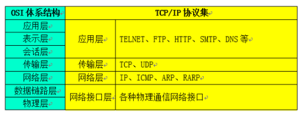
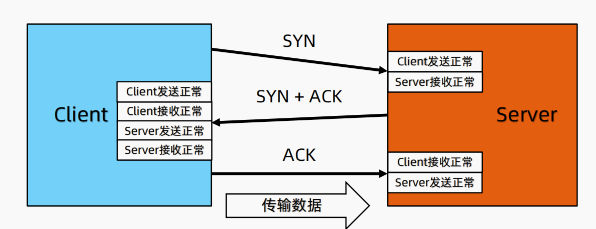
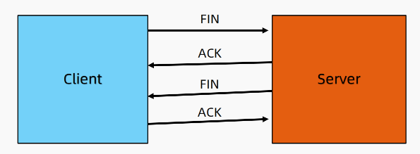
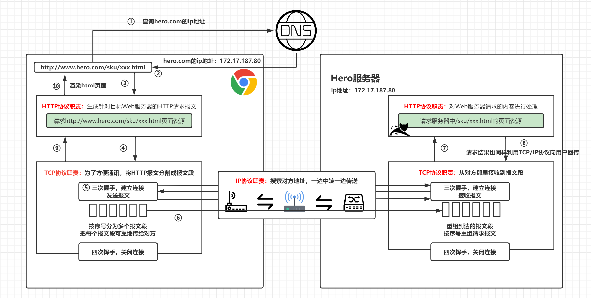
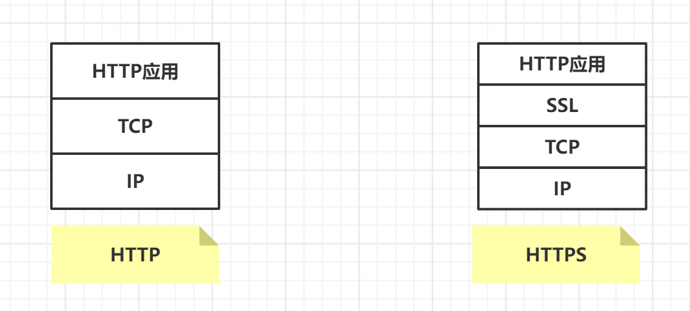
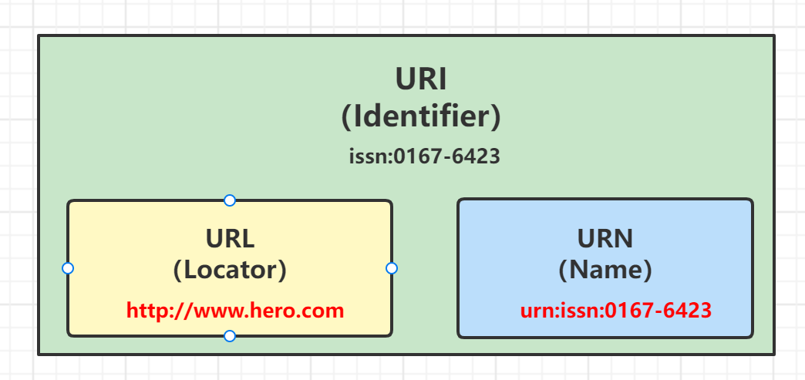
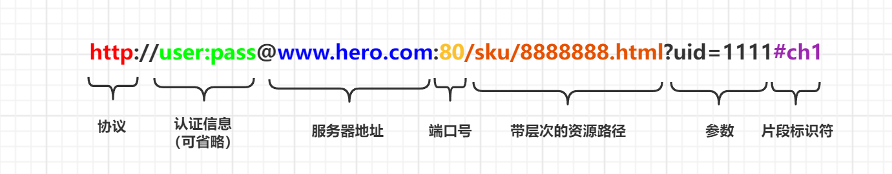

# 【网络编程】基本知识

## 1 网络通信协议

通俗地说，网络协议就是网络之间沟通、交流的桥梁，只有相同网络协议的计算机才能进行信息的沟通与交流。这就好比人与人之间交流所使用的各种语言一样，只有使用相同语言才能正常、顺利地进行交流。从专业角度定义，网络协议是计算机在网络中实现通信时必须遵守的约定，也就是通信协议。**主要是对信息传输的速率、传输代码、代码结构、传输控制步骤、出错控制等作出规定并制定出标准**。

网络通信协议是一种网络通用语言，为连接不同操作系统和不同硬件体系结构的互联网络提供通信支持，是一种网络通用语言。

常见的网络通信协议有：**TCP/IP** 协议、IPX/SPX 协议、NetBEUI 协议等。

**TCP/IP** 协议：互联网相关联的协议集合起来总称为 **TCP/IP** 。传输控制协议 / 因特网互联协议（Transmission Control Protocol / Internet Protocol）是 Internet 最基本、最广泛的一套协议。它定义了计算机如何连入因特网，以及数据如何在它们之间传输的标准。它的内部包含一系列的用于处理数据通信的协议，并采用了 4 层的分层模型，每一层都呼叫它的下一层所提供的协议来完成自己的需求。

**计算机网络：**计算机网络是通信技术与计算机技术相结合的产物。计算机网络是按照网络协议，将地球上分散的、独立的计算机相互连接的集合。连接介质可以是电缆、双绞线、光纤、微波、载波或通信卫星。计算机网络具有共享硬件、软件和数据资源的功能，具有对共享数据资源集中处理及管理和维护的能力。

- 计算机网络通常被分为：**局域网 (LAN)、城域网 (MAN)、广域网 (WAN)**

## 2 TCP 与 UDP 协议

通信的协议还是比较复杂的，`java.net` 包中包含的类和接口，它们提供低层次的通信细节。我们可以直接使用这些类和接口，来专注于网络程序开发，而不用考虑通信的细节。

`java.net` 包中提供了两种常见的网络协议的支持：

- **TCP **，**传输控制协议（Transmission Control Protocol）**。TCP 协议是 **面向连接** 的通信协议，即传输数据之前，在发送端和接收端建立 **逻辑连接**，然后再传输数据，它提供了两台计算机之间可靠无差错的数据传输。建立一次连接完成三次握手后，客户端和服务器就可以开始进行数据传输了。传输完成之后，通过四次挥手关闭连接。由于这种面向连接的特性，TCP 协议可以保证传输数据的安全，所以应用十分广泛，例如 **下载文件、浏览网页** 等。
- **UDP**，**用户数据报送协议（User Datagram Protocol）**。UDP 协议是一个 **面向无连接** 的协议。传输数据时，不需要建立连接，不管对方端服务是否启动，直接将数据、数据源和目的地都封装在数据包中，直接发送。每个数据包的大小限制在 64k 以内。它是 **不可靠协议，因为无连接，所以传输速度快，但是容易丢失数据** 。日常应用中，例如视频会议、直播...等。

### 2.1 TCP 的三次握手

三次握手：TCP 协议中，在发送数据的准备阶段，客户端与服务器之间的三次交互，以保证连接的可靠。

- 客户端–发送带有 SYN 标志的数据包 - **1次握手** - 服务端
- 服务端–发送带有 SYN/ACK 标志的数据包 – **2次握⼿ **– 客户端
- 客户端–发送带有带有 ACK 标志的数据包 – **3次握⼿** – 服务端

#### 为什么要三次握手？

三次握手的目的是建立可靠的通信信道，说到通讯，简单来说就是数据的发送与接收，而三次握手最主要的目的就是 **双方确认自己与对方的发送与接收是正常的**。 

- 第一次握手：Client 什么都不需要确认，**Server 确认对方发送正常，自己接收正常**
- 第二次握手：**Client 确认自己发送、接收正常，对方发送、接收正常**
- 第三次握手：**Server 确认自己发送正常，对方接收正常**

### 2.2 TCP 的四次挥手

断开⼀个 TCP 连接则需要“四次挥手”：

- 客户端-发送⼀个 FIN，用来关闭客户端到服务器的数据传送
- 服务器-收到这个 FIN，它发回一个 ACK，确认序号为收到的序号加 1。和 SYN ⼀样，⼀个 FIN 将占用⼀个序号
- 服务器-关闭与客户端的连接，发送⼀个 FIN 给客户端
- 客户端-发回 ACK 报文确认，并将确认序号设置为收到序号加 1

#### 为什么要四次挥手？

任何一方都可以在数据传送结束后发出连接释放的通知，待对方确认后进入 **半关闭状态** 。当另一方也没有数据再发送的时候，则发出连接释放通知，对方确认后就 **完全关闭了 TCP 连接** 。

## 3 输入 URL 到显示网页经历了哪些过程，会用到哪些协议？

具体工程如下：

- 浏览器查找域名对应 IP 地址
  - DNS查找过程：浏览器缓存 ==> 主机 HOST ==> 路由器缓存 ==> DNS 缓存 ==> 根域名解析服务器
-  浏览器向 Web 服务器发送一个 HTTP 请求报文，Cookies 会随着请求发送给服务器
-  服务器处理请求：获取参数和 Cookies，处理请求生成一个 html 响应体
- 服务器返回响应 HTML
- 浏览器渲染 HTML

使用到的协议：

- DNS 协议：获取对应域名的 ip 地址
- HTTP 协议（应用层）：使用 HTTP 协议访问网页，建立可靠连接与传输数据需要依靠 TCP 协议与 IP 协议
- TCP 协议（传输层）：与服务器建立 TCP 连接，并传输数据
- IP 协议（网络层）：建立 TCP 协议之后，发送数据在网络层依靠 IP 协议

## 4 HTTP1.0 与 HTTP1.1 的区别是什么？

1. **长连接**

   **在 HTTP/1.0 中，默认使用的是短连接**，也就是说 **每次请求都要重新建立一次连接** 。HTTP 是基于 TCP/IP 协议的，每一次建立或者断开连接都需要三次握手四次挥手的开销，如果每次请求都要这样的话，开销会比较大。因此最好能维持一个长连接，可以用个长连接来发多个请求。

   **HTTP/1.1起，默认使用长连接**，默认开启 `Connection：keep-alive` 。HTTP/1.1 的持续连接有非流水线方式和流水线（pipelining）方式：

   - 流水线方式：客户在收到 HTTP 的响应报文之前就能接着发送新的请求报文，其实就是并行发送请求
   - 非流水线方式：客户在收到前一人响应后才能发送下一个请求，其实就是串行发送请求

2. **错误状态响应码**：在 HTTP1.1 中新增了 24 个错误状态响应码

3.  **缓存处理**：在 HTTP1.0 中缓存判断标准单一，HTTP1.1 则引入了更多的缓存控制策略

4. **带宽优化及网络连接的使用**：HTTP1. 0不支持断点续传功能，存在一些浪费带宽的现象。HTTP1.1加入了断点续传的支持，允许只请求资源的某个部分，充分利用带宽和连接，避免浪费带宽

## 5 HTTP 与 HTTPS 的区别是什么？

1. **端口**
   - HTTP 的 URL 由 `http:/` 起始且默认使用端口 **80** 
   - HTTPS 的 URL 由 `https://` 起始且默认使用端口 **443**

2. **安全性和资源消耗**

   HTTP 协议运行在 TCP 之上，所有传输的内容都是明文，客户端和服务器端都无法验证对方的身份。**HTTPS 是运行在 SSL/TLS 之上的 HTTP 协议，SSL/TLS 运行在 TCP 之上**。所有传输的内容都经过加密，加密采用对称加密，但对称加密的密钥用服务器方的证书进行了非对称加密。所以说，HTTP 的安全性没有 HTTPS 高，但是 HTTPS 比 HTTP 消耗更多的服务器资源。

   - **HTTPS = HTTP + 加密 + 认证 + 完整性保护**
   - HTTPS 是身披 SSL（Secure Socket Layer）外壳的 HTTP。通常，HTTP 协议直接与 TCP 协议通信，当使用了 SSL 之后，就演变为 HTTP 先于 SSL 通信，然后再由 SSL 与 TCP 通信
   - **对称加密：**密钥只有一个，加密解密为同一个密码，且加解密速度快，典型的对称加密算法有DES、AES等
   - **非对称加密：**密钥成对出现，且根据公钥（public key）无法推知私钥，根据私钥也无法推知公钥，加密解密使用不同密钥。公钥加密需要私钥解密，私钥加密需要公钥解密，相对对称加密速度较慢，典型的非对称加密算法有 RSA、DSA 等

## 6 URL 与 URI 的区别

- **URI（Uniform Resource Identifier）统一资源标志符**，资源抽象的定义，不管用什么方法表示，只要能定位一个资源，就叫 URI。
- **URL（Uniform Resource Locator）统一资源定位符**，是一种具体的URI，在用地址定位。
- **URN（Uniform Resource Name）统一资源名称**，也是一种具体的URI，在用名称定位。

绝对 URL 地址的构成如下图：

- **协议：**使用 http: 或 https: 等协议方案名获取访问资源时要指定协议类型。不区分字母大小写，最后附一个冒号（:）
- **登陆信息（认证）：**指定用户名和密码作为从服务器端获取资源时必要的登录信息（身份认证），可省略
- **服务器地址：**必须指定访问的服务器地址。地址可以是域名，可以是 IPv4 地址 192.168.1.1 或 172.17.187.80，也可以 IPv6 地址 [0:0:0:0:0:0:0:1] 用方括号括起来
- **端口号：**指定服务器端口号，也可省略，若用户省略则使用默认端口号 80
- **带层次的文件路径：**指定服务器上的文件路径来定位特指的资源
- **查询参数：**针对已指定的文件路径内的资源，可以使用查询字符串传入任意参数，可省略
- **片段标识符：**使用片段标识符通常可标记出已获取资源中的子资源，也就是文档内的某位置，可省略

Ssß
