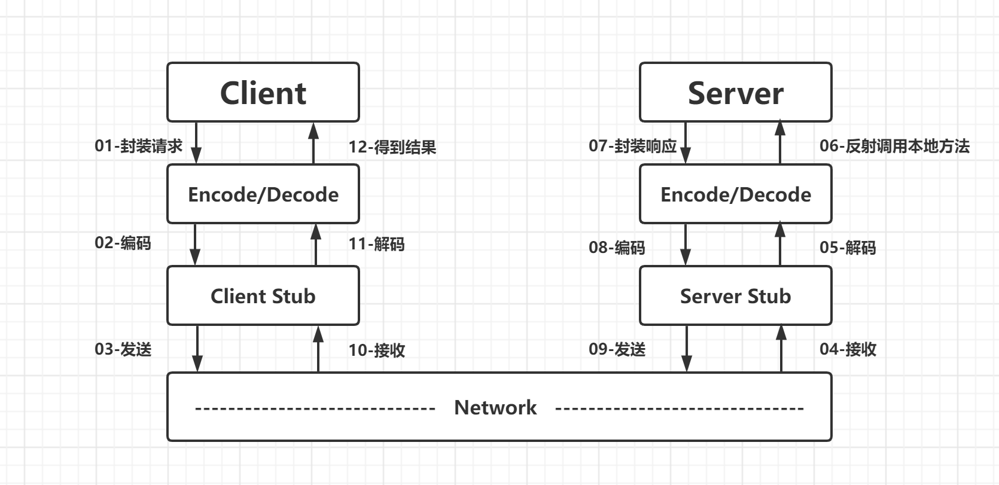
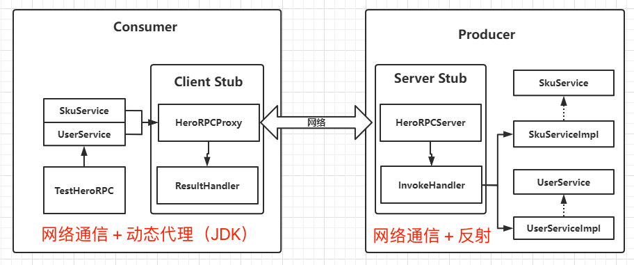
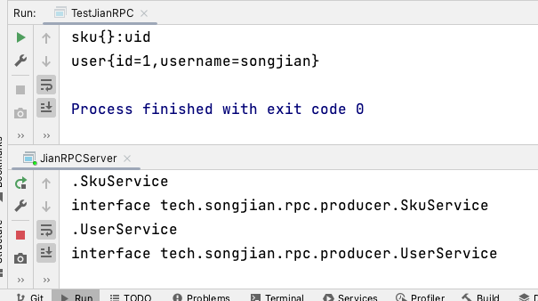

# 【网络编程】手写RPC框架

## 1 RPC原理

**RPC（Remote Procedure Call)，即远程过程调用** ，它是一种通过网络从远程计算机程序上请求服务，而不需要了解底层网络实现的技术。常见的 RPC 框架有：阿里的 Dubbo， Spring 旗下的 Spring CloudFeign，Google 出品的 gRPC 等。



1. **服务消费方（client）以本地调用方式调用服务**

2. client stub（可以用nio，netty实现） 接收到调用后，负责将方法、参数等封装成能够进行网络传输的消息体

3. client stub 将消息进行编码并发送到服务端

4. server stub 收到消息后进行解码

5. server stub 根据解码结果调用 **提供者**

6. 本地服务执行并将结果返回给 server stub

7. server stub 将返回导入结果进行编码并发送至**消费方**

8. client stub 接收到消息并进行解码

9. **服务消费方（client）得到结果**

RPC 的目标就是将 2-8 这些步骤都封装起来，用户无需关心这些细节，**可以像调用本地方法一样即可完成远程服务调用** 。

## 2 框架设计



- 服务的调用方：两个接口【服务提供方决定】+ 一个包含 main 方法的测试类
- Client Stub: 一个客户端代理类 + 一个客户端业务处理类
  - JianRPCProxy：服务接口代理，负责发送请求
  - ResultHandler：客户端读取调用执行的结果

- 服务的提供方：两个接口 + 两个实现类
- Server Stub: 一个网络处理服务器 + 一个服务器业务处理类
  - JianRPCServer：服务提供者
  - InvokeHandler：反射调用具体方法

## 3 代码实现

### 3.1 封装接口信息

消费者需要明确地提供出需要的 **接口类型、接口方法、请求参数类型和请求参数值** ，以便服务提供者通过反射调用具体接口方法。

```java
public class ClassInfo implements Serializable {

    private static final long serialVersionUID = 1L;

    private String className;  //类名
    private String methodName;//方法名
    private Class<?>[] types; //参数类型
    private Object[] objects;//参数列表

    public String getClassName() {
        return className;
    }

    public void setClassName(String className) {
        this.className = className;
    }

    public String getMethodName() {
        return methodName;
    }

    public void setMethodName(String methodName) {
        this.methodName = methodName;
    }

    public Class<?>[] getTypes() {
        return types;
    }

    public void setTypes(Class<?>[] types) {
        this.types = types;
    }

    public Object[] getObjects() {
        return objects;
    }

    public void setObjects(Object[] objects) {
        this.objects = objects;
    }
}
```

### 3.2 客户端代理类

客户端代理，是服务的请求方，也就是消费者。

```java
/**
 * JianRPCProxy
 * @description 服务代理对象
 * @author SongJian
 * @date 2023/6/8 15:22
 * @version
 */
public class JianRPCProxy {

    /**
     * 根据接口，创建代理对象
     * @param target
     * @return
     */
    public static Object create(Class target) {
        // 获取目标对象的类加载
        ClassLoader classLoader = target.getClassLoader();
        Class[] interfaces = {target};

        InvocationHandler invocationHandler = new InvocationHandler() {
            // 所有代理对象的方法的执行都会进来
            @Override
            public Object invoke(Object proxy, Method method, Object[] args) throws Throwable {
                // 封装一个 ClassInfo
                ClassInfo classInfo = new ClassInfo();
                classInfo.setClassName(target.getName());
                classInfo.setMethodName(method.getName());
                classInfo.setObjects(args);
                classInfo.setTypes(method.getParameterTypes());

                // 利用 Netty 发送数据
                NioEventLoopGroup group = new NioEventLoopGroup();
                ResultHandler resultHandler = new ResultHandler();
                try {
                    Bootstrap bootstrap = new Bootstrap();
                    bootstrap.group(group)
                            .channel(NioSocketChannel.class)
                            .handler(new ChannelInitializer<SocketChannel>() {
                                @Override
                                protected void initChannel(SocketChannel socketChannel) throws Exception {
                                    ChannelPipeline pipeline = socketChannel.pipeline();
                                    pipeline.addLast("encoder", new ObjectEncoder());
                                    pipeline.addLast("decoder", new ObjectDecoder(Integer.MAX_VALUE, ClassResolvers.cacheDisabled(null)));
                                    pipeline.addLast("handler", resultHandler);
                                }
                            });
                    ChannelFuture future = bootstrap.connect("127.0.0.1", 9999).sync();
                    future.channel().writeAndFlush(classInfo).sync();
                    future.channel().closeFuture().sync();
                } finally {
                    group.shutdownGracefully();
                }
                return resultHandler.getResponse();
            }
        };
        // 创建一个代理对象并返回
        return Proxy.newProxyInstance(classLoader, interfaces, invocationHandler);
    }
}
```

创建服务的代理对象。

### 3.3 客户端业务处理类

```java
public class ResultHandler extends ChannelInboundHandlerAdapter {

    private Object response;
    public Object getResponse() {
        return response;
    }

    @Override //读取服务器端返回的数据(远程调用的结果)
    public void channelRead(ChannelHandlerContext ctx, Object msg) throws Exception {
        response = msg;
        ctx.close();
    }
}
```

### 3.4 服务端网络服务类

```java
/**
 * JianRPCServer
 * @description
 * @author SongJian
 * @date 2023/6/8 15:54
 * @version
 */
public class JianRPCServer {

    private int port = 9999;


    public JianRPCServer (int port) {
        this.port = port;
    }

    public void start() {
        NioEventLoopGroup boss = new NioEventLoopGroup();
        NioEventLoopGroup worker = new NioEventLoopGroup();
        try {
            ServerBootstrap serverBootstrap = new ServerBootstrap();
            serverBootstrap.group(boss, worker)
                    .channel(NioServerSocketChannel.class)
                    .option(ChannelOption.SO_BACKLOG, 128)
                    .childOption(ChannelOption.SO_KEEPALIVE, true)
                    .localAddress(port)
                    .childHandler(new ChannelInitializer<SocketChannel>() {
                        @Override
                        protected void initChannel(SocketChannel socketChannel) throws Exception {
                            ChannelPipeline pipeline = socketChannel.pipeline();
                            pipeline.addLast("encoder", new ObjectEncoder());
                            pipeline.addLast("decoder", new ObjectDecoder(Integer.MAX_VALUE, ClassResolvers.cacheDisabled(null)));
                            // 服务端业务类
                            pipeline.addLast(new InvokeHandler());
                        }
                    });
            ChannelFuture future = serverBootstrap.bind(port).sync();
            System.out.println("--------------- JianRPC Server 启动成功-------------------");
            future.channel().closeFuture().sync();
        } catch (InterruptedException e) {
            boss.shutdownGracefully();
            worker.shutdownGracefully();
        } finally {
            boss.shutdownGracefully();
            worker.shutdownGracefully();
        }
    }

    public static void main(String[] args) throws Exception {
        new JianRPCServer(9999).start();
    }
}
```

### 3.5 服务端业务类

核心是通过反射调用对应服务的具体实现，并将结果发送回去。

```java
// 服务器端业务处理类
public class InvokeHandler extends ChannelInboundHandlerAdapter {
    /**
     * 得到某接口下某个实现类的名字
     * @param classInfo
     * @return
     * @throws Exception
     */
    private String getImplClassName(ClassInfo classInfo) throws Exception{
        // 服务方接口和实现类所在的包路径
        String interfacePath = "tech.songjian.rpc.producer";
        int lastDot = classInfo.getClassName().lastIndexOf(".");
        // 接口名称
        String interfaceName = classInfo.getClassName().substring(lastDot);
        System.out.println(interfaceName);
        // 接口字节码对象
        Class superClass = Class.forName(interfacePath + interfaceName);
        System.out.println(superClass);
        // 反射得到某接口下的所有实现类
        Reflections reflections = new Reflections(interfacePath);
        Set<Class> ImplClassSet = reflections.getSubTypesOf(superClass);
        if(ImplClassSet.size() == 0){
            System.out.println("未找到实现类");
            return null;
        } else if(ImplClassSet.size() > 1){
            System.out.println("找到多个实现类，未明确使用哪一个");
            return null;
        } else {
            // 把集合转换为数组
            Class[] classes = ImplClassSet.toArray(new Class[0]);
            // 得到实现类的全限定名
            return classes[0].getName();
        }
    }

    /**
     * 读取客户端发来的数据并通过反射调用实现类的方法
     * @param ctx
     * @param msg
     * @throws Exception
     */
    @Override
    public void channelRead(ChannelHandlerContext ctx, Object msg) throws Exception {
        ClassInfo classInfo = (ClassInfo) msg;
        Object clazz = Class.forName(getImplClassName(classInfo)).newInstance();
        Method method = clazz.getClass().getMethod(classInfo.getMethodName(), classInfo.getTypes());
        // 通过反射调用实现类的方法
        Object result = method.invoke(clazz, classInfo.getObjects());
        ctx.writeAndFlush(result);
    }
}
```

## 4 结果




