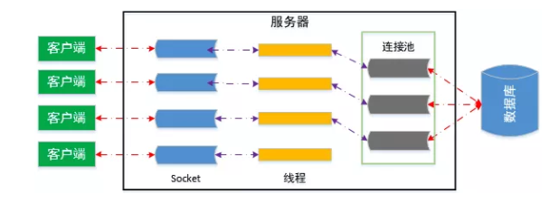

# 【设计模式】享元模式

## 0 简介

当需要**「复用数量有限的同一类对象」**时，就使用享元模式。

享元模式的主要思想是 **共享细粒度对象** ，也就是说如果系统中存在多个相同的对象，那么只需共享一份就可以了，不必每个都去实例化每一个对象，这样来精简内存资源，提升性能和效率。

## 1 常见体现

### 1.1 包装类

在 JDK 中 `Boolean，Byte，Short，Integer，Long，Character` 等包装类提供了 `valueOf` 方法。

例如 Integer 的 valueOf 会缓存 `-128~127` 之间的 Long 对象，**在这个范围之间会重用对象**，大于这个范围才会新建 Long 对象：

```java
/**
 * This method will always cache values in the range -128 to 127,
 * inclusive, and may cache other values outside of this range.
 *
 * @param  i an {@code int} value.
 * @return an {@code Integer} instance representing {@code i}.
 * @since  1.5
 */
public static Integer valueOf(int i) {
  	// 享元模式体现
  	// 如果在 IntegerCache.low 和 IntegerCache.high 之间的值，会直接从 Cache 中读取
    if (i >= IntegerCache.low && i <= IntegerCache.high)
        return IntegerCache.cache[i + (-IntegerCache.low)];
  	// 否则才创建新对象
    return new Integer(i);
}
```

> 注意：
>
> - Byte, Short, Long, Integer 缓存的范围都是 `-128 ~ 127`
> - Character 缓存的范围是 `0 ~ 127`
> - Boolean 缓存了 `TRUE` 和 `FALSE`

```java
// Integer 的缓存类
private static class IntegerCache {
    static final int low = -128;
    static final int high;
    static final Integer cache[];

    static {
        // high value may be configured by property
        int h = 127;
        String integerCacheHighPropValue =
            sun.misc.VM.getSavedProperty("java.lang.Integer.IntegerCache.high");
        if (integerCacheHighPropValue != null) {
            try {
                int i = parseInt(integerCacheHighPropValue);
                i = Math.max(i, 127);
                // Maximum array size is Integer.MAX_VALUE
                h = Math.min(i, Integer.MAX_VALUE - (-low) -1);
            } catch( NumberFormatException nfe) {
                // If the property cannot be parsed into an int, ignore it.
            }
        }
        high = h;

        cache = new Integer[(high - low) + 1];
        int j = low;
        for(int k = 0; k < cache.length; k++)
            cache[k] = new Integer(j++);

        // range [-128, 127] must be interned (JLS7 5.1.7)
        assert IntegerCache.high >= 127;
    }

    private IntegerCache() {}
}
```

### 1.2 String常量池

详见JVM相关。

### 1.3 各种池化技术

池化技术包括：线程池、数据库连接池等。

> Spring中的数据库连接池：`Durid`、`HikariCP` 等

以数据库连接池为例：

它在程序初始化时创建一定数量的「数据库连接对象」并将其保存在一块内存区中。它允许应用程序重复使用一个现有的数据库连接，当需要执行 SQL 时，**我们是直接从连接池中获取一个连接，而不是重新建立一个数据库连接**。当 SQL 执行完，也并不是将数据库连接真的关掉，而是将其归还到数据库连接池中。

我们可以通过配置连接池的参数来控制连接池中的初始连接数、最小连接、最大连接、最大空闲时间等参数，来保证访问数据库的数量在一定可控制的范围类，防止系统崩溃，同时保证用户良好的体验。数据库连接池示意图如下所示：



因此使用数据库连接池的核心作用，就是避免数据库连接频繁创建和销毁，节省系统开销。因为数据库连接是有限且代价昂贵，创建和释放数据库连接都非常耗时，频繁地进行这样的操作将占用大量的性能开销，进而导致网站的响应速度下降，甚至引起服务器崩溃。