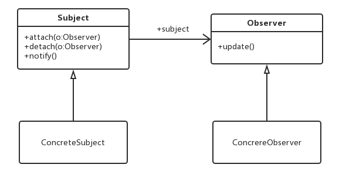

# 【设计模式】观察者模式

## 1 基本介绍

**观察者模式**，又被称为 **发布-订阅（Publish/Subscribe）** 模式，属于行为型模式的一种，它定义了一种 **一对多的依赖关系，让多个观察者对象同时监听某一个主题对象**。这个主题对象在状态变化时，会通知所有的观察者对象，使他们能够自动更新自己。



在观察者模式中有如下角色：

- `Subject` ：抽象主题（抽象被观察者），抽象主题角色把所有观察者对象保存在一个集合里，每个主题都可以有任意数量的观察者，抽象主题提供一个接口，可以增加和删除观察者对象。
- `ConcreteSubject` ：具体主题（具体被观察者），该角色将有关状态存入具体观察者对象，在具体主题的内部状态发生改变时，给所有注册过的观察者发送通知。
- `Observer` ：抽象观察者，是观察者者的抽象类，它定义了一个更新接口，使得在得到主题更改通知时更新自己。
- `ConcrereObserver` ：具体观察者，实现抽象观察者定义的更新接口，以便在得到主题更改通知时更新自身的状态。

### 优点

- 松耦合，让耦合的双方都依赖于抽象，从而使得各自的变换都不会影响另一边的变换。
- 支持简单的广播通信，自动通知所有已订阅的对象。

## 2 Spring中的观察者模式

Spring 基于观察者模式，实现了自身的事件机制，由三部分组成：

- 事件 `ApplicationEvent`：通过 **继承** 它，实现自定义事件。另外，通过它的 `source` 属性可以获取事件**源**，`timestamp` 属性可以获得发生时间。
- 事件 **发布者** `ApplicationEventPublisher`：通过它，可以进行事件的发布。
- 事件 **监听器** `ApplicationListener`：通过 **实现** 它，进行指定类型的事件的监听。

### 自定义事件

定义用户注册事件 `UserRegisterEvent` ：

```java
public class UserRegisterEvent extends ApplicationEvent {
    /**
     * 用户名
     */
    private String username;

    public UserRegisterEvent(Object source) {
        super(source);
    }

    public UserRegisterEvent(Object source, String username) {
        super(source);
        this.username = username;
    }

    public String getUsername() {
        return username;
}
```

### 自定义用户服务类

创建 UserService 类，用户 Service。代码如下：

```java
@Service
public class UserService implements ApplicationEventPublisherAware {
   	// 实现 ApplicationEventPublisherAware 接口，
   	// 从而将 ApplicationEventPublisher 注入到其中
 
    private Logger logger = LoggerFactory.getLogger(getClass());
 		
  	// 定义事件发布者
    private ApplicationEventPublisher applicationEventPublisher;
 
    @Override
    public void setApplicationEventPublisher(ApplicationEventPublisher applicationEventPublisher) {
      	// 设置事件发布者
        this.applicationEventPublisher = applicationEventPublisher;
    }
 
    public void register(String username) {
        // ... 执行注册逻辑
        logger.info("[register][执行用户({}) 的注册逻辑]", username);
 
        // 在执行完注册逻辑后，调用 ApplicationEventPublisher 的 publishEvent
      	// 发布自定义的「UserRegisterEvent」事件。
        applicationEventPublisher.publishEvent(new UserRegisterEvent(this, username));
    }
}
```

### 自定义事件监听者No.1

创建 EmailService 类，邮箱 Service。代码如下：

```java
@Service
public class EmailService implements ApplicationListener<UserRegisterEvent> {
 		// 邮箱监听者，实现 ApplicationListener 接口，通过 E 泛型设置感兴趣的事件
  	// 这里是监听了 UserRegisterEvent 事件
    private Logger logger = LoggerFactory.getLogger(getClass());
 
    @Override
    @Async
  	// 设置 @Async 注解，声明异步执行。毕竟实际场景下，发送邮件可能比较慢，又是非关键逻辑。
    public void onApplicationEvent(UserRegisterEvent event) {
      	// 实现 onApplicationEvent(E event) 方法
      	// 针对监听的 UserRegisterEvent 事件，进行自定义处理。
        logger.info("[onApplicationEvent][给用户({}) 发送邮件]", event.getUsername());
    }
 
}
```

### 自定义事件监听者No.2

创建 CouponService 类，优惠劵 Service。代码如下：

```java
@Service
public class CouponService {
    private Logger logger = LoggerFactory.getLogger(getClass());
    @EventListener
  	// 在方法上，添加 @EventListener 注解，
  	// 并设置监听的事件为 UserRegisterEvent。这是另一种使用方式！
    public void addCoupon(UserRegisterEvent event) {
        logger.info("[addCoupon][给用户({}) 发放优惠劵]", event.getUsername());
    }
}
```

### DemoController

创建 DemoController 类，提供 `/demo/register` 注册接口。代码如下：

```java
@RestController
@RequestMapping("/demo")
public class DemoController {
 
    @Autowired
    private UserService userService;
 
    @GetMapping("/register")
    public String register(String username) {
        userService.register(username);
        return "success";
    }
}
```

① 执行 DemoApplication 类，启动项目。

② 调用 http://127.0.0.1:8080/demo/register?username=yudaoyuanma 接口，进行注册。IDEA 控制台打印日志如下：

```
# UserService 发布 UserRegisterEvent 事件
2020-04-06 13:09:39.145  INFO 18615 --- [nio-8080-exec-1] c.i.s.l.eventdemo.service.UserService    : [register][执行用户(yudaoyuanma) 的注册逻辑]
# CouponService 监听处理该事件
2020-04-06 13:09:39.147  INFO 18615 --- [nio-8080-exec-1] c.i.s.l.eventdemo.service.CouponService  : [addCoupon][给用户(yudaoyuanma) 发放优惠劵]
# EmailService 监听处理该事件
2020-04-06 13:09:39.154  INFO 18615 --- [         task-1] c.i.s.l.eventdemo.service.EmailService   : [onApplicationEvent][给用户(yudaoyuanma) 发送邮件]
```

Spring 框架中的观察者模式可以用于许多场景，例如：

1. 当某个业务逻辑完成时，可以发布一个事件来通知其他组件。
2. 当数据发生更改时，可以发布一个事件来通知其他组件更新其状态。
3. 当系统发生故障时，可以发布一个事件来通知相关的组件执行相应的处理逻辑。

## 3 Nacos配置热部署

Nacos 实现配置的动态刷新，主要是靠客户端的 **长轮询** 去请求服务端获取更新的配置，在通过 Spring 的`ApplicationContext.publishEvent()` 发布事件的方式去刷新容器。

其实主要是靠 Nacos—config 包下的 `NacosContextRefresher`、`NacosConfigManager`这两个核心。

`NacosContextRefresher` 主要是做桥梁的作用，通过 `ApplicationContext` 获取上下文信息，通过 `ApplicationListener` 来通知事件的发布更新 Spring 容器。

`NacosConfigManager` 作为配置的启动，创建长轮询的定时任务，定时执行任务获取更新的配置。


